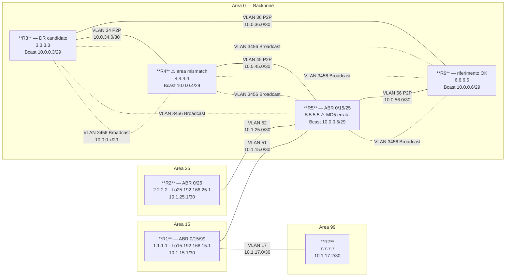

# Workbook Studenti — MOD-01: OSPFv2 Fondamenta

> **Piattaforme supportate:** GNS3 · ContainerLab (vrnetlab/IOU) · EVE-NG
> Le configurazioni iniziali sono integrate nel workbook — caricamento via paste manuale.

**Area:** AREA 1 — OSPF | **Ore:** 2h | **Codici syllabus:** 3.2.a · 3.2.b
**Prerequisiti:** Nessuno (modulo introduttivo)

---

## 1. TOPOLOGIA

### Diagramma logico



**Ruoli OSPF:**
- **R5** — ABR: Area 0 / Area 15 / Area 25
- **R1** — router Area 15; ABR Area 15 / Area 99 (task virtual-link, MOD-02)
- **R3** — DR election su Core Broadcast (VLAN 3456)
- **R7** — router Area 99 (collegato via VLAN 17 a R1)

### Tabella di indirizzamento completa

| Router | Interfaccia    | VLAN | IPv4              | Area OSPF | Tipo link     |
|--------|----------------|------|-------------------|-----------|---------------|
| R1     | e0/0.51        | 51   | 10.1.15.1/30      | Area 15   | P2P           |
| R1     | Lo15           | —    | 192.168.15.1/24   | Area 15   | Loopback      |
| R1     | e0/0.17        | 17   | 10.1.17.1/30      | Area 99   | P2P           |
| R2     | e0/0.52        | 52   | 10.1.25.1/30      | Area 25   | P2P           |
| R2     | Lo25           | —    | 192.168.25.1/24   | Area 25   | Loopback      |
| R3     | e0/0.3456      | 3456 | 10.0.0.3/29       | Area 0    | Broadcast     |
| R3     | e0/0.34        | 34   | 10.0.34.1/30      | Area 0    | P2P Ring      |
| R3     | e0/0.36        | 36   | 10.0.36.1/30      | Area 0    | P2P Ring      |
| R4     | e0/0.3456      | 3456 | 10.0.0.4/29       | Area 0    | Broadcast     |
| R4     | e0/0.34        | 34   | 10.0.34.2/30      | Area 0    | P2P Ring      |
| R4     | e0/0.45        | 45   | 10.0.45.1/30      | Area 0    | P2P Ring      |
| R5     | e0/0.51        | 51   | 10.1.15.2/30      | Area 15   | P2P           |
| R5     | e0/0.52        | 52   | 10.1.25.2/30      | Area 25   | P2P           |
| R5     | e0/0.3456      | 3456 | 10.0.0.5/29       | Area 0    | Broadcast     |
| R5     | e0/0.45        | 45   | 10.0.45.2/30      | Area 0    | P2P Ring      |
| R5     | e0/0.56        | 56   | 10.0.56.1/30      | Area 0    | P2P Ring      |
| R6     | e0/0.3456      | 3456 | 10.0.0.6/29       | Area 0    | Broadcast     |
| R6     | e0/0.36        | 36   | 10.0.36.2/30      | Area 0    | P2P Ring      |
| R6     | e0/0.56        | 56   | 10.0.56.2/30      | Area 0    | P2P Ring      |
| R7     | e0/0.17        | 17   | 10.1.17.2/30      | Area 99   | P2P           |

> **Convenzione Router-ID:** x.x.x.x per ogni router Rx (R1=1.1.1.1, R2=2.2.2.2, ..., R7=7.7.7.7)

---

## 2. OBIETTIVI DELLA SESSIONE

Al termine di questo modulo lo studente sarà in grado di:

- [ ] Configurare sub-interface 802.1Q su IOS e abilitarle in OSPF processo 100
- [ ] Diagnosticare e correggere missconfiguration OSPF che impediscono la formazione delle adiacenze
- [ ] Analizzare e controllare l'elezione DR/BDR su un segmento broadcast multi-router
- [ ] Differenziare i network type OSPF (broadcast, point-to-point) e configurare ip ospf network point-to-point sui link P2P del Core Ring
- [ ] Manipolare il costo OSPF per controllare il percorso di instradamento

**Codici syllabus coperti:** 3.2.a · 3.2.b

---

## 3. LAB SETUP

### Configurazione Iniziale

> ⚠ **Attenzione:** Le cfg di R4 e R5 contengono missconfiguration intenzionali per il Task T2. NON consultare `soluzione.md` prima di completare T2.

Carica le configurazioni tramite **paste manuale** in modalità config, oppure via TFTP:
```
copy tftp://192.168.122.1/ENCOR/MOD-01/rx-cfg running-config
```

#### R1
```
! MOD-01 cfg iniziale — R1
! Piattaforme: GNS3 · ContainerLab · EVE-NG
hostname R1
no ip domain-lookup
!
interface Ethernet0/0
 no ip address
 no shutdown
!
interface Ethernet0/0.51
 encapsulation dot1Q 51
 ip address 10.1.15.1 255.255.255.252
 description P2P_to_R5_Area15
 no shutdown
!
interface Ethernet0/0.17
 encapsulation dot1Q 17
 ip address 10.1.17.1 255.255.255.252
 description P2P_to_R7_Area99
 no shutdown
!
interface Loopback15
 ip address 192.168.15.1 255.255.255.0
 description Mgmt_Loopback_R1
!
end
```

#### R2
```
! MOD-01 cfg iniziale — R2
hostname R2
no ip domain-lookup
!
interface Ethernet0/0
 no ip address
 no shutdown
!
interface Ethernet0/0.52
 encapsulation dot1Q 52
 ip address 10.1.25.1 255.255.255.252
 description P2P_to_R5_Area25
 no shutdown
!
interface Loopback25
 ip address 192.168.25.1 255.255.255.0
 description Mgmt_Loopback_R2
!
end
```

#### R3
```
! MOD-01 cfg iniziale — R3
! R3 = router di riferimento per Task T1 — nessun processo OSPF (da configurare)
hostname R3
no ip domain-lookup
!
interface Ethernet0/0
 no ip address
 no shutdown
!
interface Ethernet0/0.3456
 encapsulation dot1Q 3456
 ip address 10.0.0.3 255.255.255.248
 description Core_Broadcast_Area0
 no shutdown
!
interface Ethernet0/0.34
 encapsulation dot1Q 34
 ip address 10.0.34.1 255.255.255.252
 description P2P_R3-R4_Ring_Area0
 no shutdown
!
interface Ethernet0/0.36
 encapsulation dot1Q 36
 ip address 10.0.36.1 255.255.255.252
 description P2P_R3-R6_Ring_Area0
 no shutdown
!
end
```

#### R4
```
! MOD-01 cfg iniziale — R4
! *** MISSCONFIGURATION INTENZIONALE per Task T2 ***
! Errore: e0/0.3456 in area 1 (deve essere area 0)
hostname R4
no ip domain-lookup
!
interface Ethernet0/0
 no ip address
 no shutdown
!
interface Ethernet0/0.3456
 encapsulation dot1Q 3456
 ip address 10.0.0.4 255.255.255.248
 description Core_Broadcast_Area0
 no shutdown
!
interface Ethernet0/0.34
 encapsulation dot1Q 34
 ip address 10.0.34.2 255.255.255.252
 description P2P_R3-R4_Ring_Area0
 no shutdown
!
interface Ethernet0/0.45
 encapsulation dot1Q 45
 ip address 10.0.45.1 255.255.255.252
 description P2P_R4-R5_Ring_Area0
 no shutdown
!
router ospf 100
 router-id 4.4.4.4
 network 10.0.0.0 0.0.0.7 area 1
 passive-interface default
 no passive-interface Ethernet0/0.3456
!
end
```

#### R5
```
! MOD-01 cfg iniziale — R5
! *** MISSCONFIGURATION INTENZIONALE per Task T2 ***
! Errore: ip ospf authentication message-digest su e0/0.3456 (MD5 non configurato sugli altri)
hostname R5
no ip domain-lookup
!
interface Ethernet0/0
 no ip address
 no shutdown
!
interface Ethernet0/0.3456
 encapsulation dot1Q 3456
 ip address 10.0.0.5 255.255.255.248
 description Core_Broadcast_Area0
 ip ospf authentication message-digest
 ip ospf message-digest-key 1 md5 WRONG_KEY
 no shutdown
!
interface Ethernet0/0.51
 encapsulation dot1Q 51
 ip address 10.1.15.2 255.255.255.252
 description P2P_to_R1_Area15
 no shutdown
!
interface Ethernet0/0.52
 encapsulation dot1Q 52
 ip address 10.1.25.2 255.255.255.252
 description P2P_to_R2_Area25
 no shutdown
!
interface Ethernet0/0.45
 encapsulation dot1Q 45
 ip address 10.0.45.2 255.255.255.252
 description P2P_R4-R5_Ring_Area0
 no shutdown
!
interface Ethernet0/0.56
 encapsulation dot1Q 56
 ip address 10.0.56.1 255.255.255.252
 description P2P_R5-R6_Ring_Area0
 no shutdown
!
router ospf 100
 router-id 5.5.5.5
 network 10.0.0.0 0.0.0.7 area 0
 passive-interface default
 no passive-interface Ethernet0/0.3456
!
end
```

#### R6
```
! MOD-01 cfg iniziale — R6 (configurazione corretta — usare come riferimento per T2)
hostname R6
no ip domain-lookup
!
interface Ethernet0/0
 no ip address
 no shutdown
!
interface Ethernet0/0.3456
 encapsulation dot1Q 3456
 ip address 10.0.0.6 255.255.255.248
 description Core_Broadcast_Area0
 no shutdown
!
interface Ethernet0/0.36
 encapsulation dot1Q 36
 ip address 10.0.36.2 255.255.255.252
 description P2P_R3-R6_Ring_Area0
 no shutdown
!
interface Ethernet0/0.56
 encapsulation dot1Q 56
 ip address 10.0.56.2 255.255.255.252
 description P2P_R5-R6_Ring_Area0
 no shutdown
!
router ospf 100
 router-id 6.6.6.6
 network 10.0.0.0 0.0.0.7 area 0
 passive-interface default
 no passive-interface Ethernet0/0.3456
!
end
```

#### R7
```
! MOD-01 cfg iniziale — R7
hostname R7
no ip domain-lookup
!
interface Ethernet0/0
 no ip address
 no shutdown
!
interface Ethernet0/0.17
 encapsulation dot1Q 17
 ip address 10.1.17.2 255.255.255.252
 description P2P_to_R1_Area99
 no shutdown
!
end
```

### Prerequisiti

- GNS3 avviato con topologia MOD-01 caricata
- Switch1 configurato: VLAN 3456, 34, 36, 45, 51, 52, 56 presenti nel VLAN database; porte verso R1–R7 in modalita trunk dot1Q
- TFTP server attivo su 192.168.122.1, path `/ENCOR/MOD-01/`
- Nessuna configurazione IP preesistente sui router (o factory reset)

### Verifica pre-lab

Dopo il caricamento delle cfg iniziali, verificare la connettivita base:

```
! Su Switch1 — verificare il trunk:
show interfaces trunk
show vlan brief

! Su R3 (router di riferimento):
show interfaces e0/0.3456
show ip interface brief
ping 10.0.0.4   ! verso R4 — deve rispondere
```

---

## 4. TASK LIST

| # | Task | Codice syllabus | Tempo stimato |
|---|------|-----------------|---------------|
| **T1** | Configurazione sub-interface e OSPF base su R3 | 3.2.a | 20 min |
| **T2** | Troubleshooting adiacenze — diagnostica e correzione | 3.2.a | 25 min |
| **T3** | Core Ring (R3-R4-R5-R6) e ottimizzazione P2P | 3.2.a · 3.2.b | 15 min |
| **T4** | DR/BDR election: analisi e controllo | 3.2.a | 20 min |

---

## 5. DETTAGLIO TASK

---

### T1 — Configurazione sub-interface e OSPF base su R3

#### TEORIA

**Sub-interface 802.1Q**

Una sub-interface (o interfaccia virtuale) e' una suddivisione logica di un'interfaccia fisica. Su IOS la sintassi e':

```
interface ethernet 0/0.<numero-vlan>
  encapsulation dot1Q <numero-vlan>
  ip address <ip> <mask>
```

Il numero della sub-interface coincide per convenzione con il numero VLAN, rendendo la configurazione leggibile. L'interfaccia fisica padre (e0/0) deve essere in stato `no shutdown` senza indirizzo IP configurato.

**OSPF Process e Router-ID**

Il Router-ID identifica univocamente il router nella LSDB. La selezione avviene in questo ordine di priorita':
1. Configurazione esplicita: `router-id x.x.x.x` (consigliato)
2. IP piu' alto tra le loopback attive
3. IP piu' alto tra le interfacce fisiche attive

> **Best practice:** configurare sempre il Router-ID esplicito. Evita comportamenti imprevedibili dopo il riavvio.

**Network statement vs ip ospf area**

Due metodi per abilitare un'interfaccia in OSPF:

| Metodo | Sintassi | Pro | Contro |
|--------|----------|-----|--------|
| `network` (vecchio) | `network 10.0.0.0 0.0.0.7 area 0` | familiare, compatibile | matching indiretto, meno leggibile |
| `ip ospf area` (diretto) | `ip ospf 100 area 0` sull'interfaccia | esplicito, moderno | richiede accesso per-interfaccia |

In questo lab si usano entrambi i metodi (T1 usa `network`, T3 usa `ip ospf area`).

**passive-interface**

Impedisce l'invio di Hello OSPF su un'interfaccia, mantenendo pero' il prefisso annunciato nella LSDB. Utile su loopback e interfacce verso reti end-user.

**Network type e timer Hello/Dead**

| Network Type | DR/BDR | Hello | Dead | Uso tipico |
|-------------|--------|-------|------|------------|
| broadcast   | Si'    | 10s   | 40s  | Ethernet LAN, segmenti multi-access |
| point-to-point | No  | 10s   | 40s  | Link seriali, sub-interface P2P |
| NBMA        | Si'    | 30s   | 120s | Frame Relay, ATM |

#### TASK

**Step 1 — Configurare l'interfaccia fisica e le sub-interface su R3**

```
R3(config)# interface ethernet 0/0
R3(config-if)# no ip address
R3(config-if)# no shutdown
R3(config-if)# exit

R3(config)# interface ethernet 0/0.3456
R3(config-subif)# encapsulation dot1Q 3456
R3(config-subif)# ip address 10.0.0.3 255.255.255.248
R3(config-subif)# description Core_Broadcast_Area0
R3(config-subif)# no shutdown
R3(config-subif)# exit

R3(config)# interface ethernet 0/0.34
R3(config-subif)# encapsulation dot1Q 34
R3(config-subif)# ip address 10.0.34.1 255.255.255.252
R3(config-subif)# description P2P_R3-R4_Ring_Area0
R3(config-subif)# no shutdown
R3(config-subif)# exit

R3(config)# interface ethernet 0/0.36
R3(config-subif)# encapsulation dot1Q 36
R3(config-subif)# ip address 10.0.36.1 255.255.255.252
R3(config-subif)# description P2P_R3-R6_Ring_Area0
R3(config-subif)# no shutdown
R3(config-subif)# exit
```

**Step 2 — Configurare OSPF processo 100 su R3**

```
R3(config)# router ospf 100
R3(config-router)# router-id 3.3.3.3
R3(config-router)# network 10.0.0.0 0.0.0.7 area 0
R3(config-router)# passive-interface default
R3(config-router)# no passive-interface ethernet 0/0.3456
R3(config-router)# exit
```

> **Nota:** `passive-interface default` rende passive tutte le interfacce; poi si abilita selettivamente solo quelle attive OSPF. Tecnica sicura in produzione.

**Step 3 — Verificare la configurazione**

```
R3# show ip ospf
R3# show ip ospf interface brief
R3# show ip ospf interface ethernet 0/0.3456
```

#### VERIFICA

```
R3# show ip ospf
 Routing Process "ospf 100" with ID 3.3.3.3
 ...
 Number of areas in this router is 1. 1 normal 0 stub 0 nssa

R3# show ip ospf interface brief
Interface    PID   Area            IP Address/Mask    Cost  State Nbrs F/C
Et0/0.3456   100   0               10.0.0.3/29        10    WAIT  0/0
```

> **Stato WAIT** e' normale su un segmento broadcast quando non ci sono ancora neighbor. Diventa DR, BDR o DROTHER dopo l'elezione.

---

### T2 — Troubleshooting adiacenze: diagnostica e correzione

#### TEORIA

**Stati dell'adiacenza OSPF**

Le adiacenze OSPF seguono una macchina a stati. Conoscere lo stato attuale indica dove cercare il problema:

| Stato | Significato | Causa blocco tipica |
|-------|-------------|---------------------|
| DOWN | Nessun hello ricevuto | Link down, ACL blocca 224.0.0.5 |
| INIT | Hello ricevuto, ma il router locale non e' nella lista dei neighbor | Subnet mismatch, problema unidirezionale |
| 2-WAY | Hello bidirezionali, election avvenuta (normale su broadcast tra DROTHER) | — |
| EXSTART | Negoziazione master/slave per DB exchange | MTU mismatch |
| EXCHANGE | Scambio DBD (Database Descriptor) | MTU mismatch |
| LOADING | Richiesta LSA specifici | Raro; database corrotto |
| FULL | Adiacenza completa e sincronizzata | — (stato desiderato) |

**Comandi di diagnostica**

```
show ip ospf neighbor          ! stato di tutte le adiacenze
show ip ospf neighbor detail   ! parametri dettagliati per ogni neighbor
show ip ospf interface <int>   ! timers, DR/BDR, area, auth su una specifica interfaccia
debug ip ospf adj              ! messaggi di adiacenza in tempo reale
debug ip ospf hello            ! pacchetti hello inviati e ricevuti
undebug all                    ! fermare tutti i debug
```

> **Attenzione:** i debug possono generare volume elevato su router di produzione. Usare sempre con `terminal monitor` se connessi via SSH, e fermare con `undebug all` al termine.

#### TASK

La configurazione iniziale contiene tre missconfiguration distinte che impediscono la formazione delle adiacenze sul segmento Core Broadcast (VLAN 3456). Il tuo compito e' identificarle e correggerle.

**Step 1 — Prima analisi dello stato dei neighbor**

```
! Su R6 (configurazione corretta — usa come riferimento):
R6# show ip ospf neighbor
R6# debug ip ospf adj
! Attendere 30 secondi, osservare i messaggi, poi:
R6# undebug all
```

**Step 2 — Analizzare le interfacce dei router problematici**

```
! Su ogni router R3, R4, R5:
Rx# show ip ospf interface ethernet 0/0.3456
Rx# show running-config | section router ospf
Rx# show running-config | section interface ethernet 0/0.3456
```

**Step 3 — Identificare e correggere le missconfiguration**

> Analizza i messaggi di debug e l'output dei comandi show. Ogni router ha un problema diverso. Correggi ciascuno prima di verificare il risultato finale.

```
! Dopo la correzione di ogni router, verificare:
R6# show ip ospf neighbor
! Atteso: il router corretto compare in stato FULL
```

**Step 4 — Verifica finale**

```
R5# show ip ospf neighbor
! Atteso: R3, R4, R6 tutti in stato FULL (DR, BDR o DROTHER)

R3# show ip ospf
! Verificare: processo 100, area 0, 4 router presenti

R4# show ip ospf database
! Verificare: LSA Type 1 di R3, R4, R5, R6 tutti presenti
```

#### VERIFICA

```
R5# show ip ospf neighbor
Neighbor ID     Pri   State           Dead Time   Address         Interface
3.3.3.3           1   FULL/DROTHER    00:00:38    10.0.0.3        Et0/0.3456
4.4.4.4           1   FULL/DR         00:00:36    10.0.0.4        Et0/0.3456
6.6.6.6           1   FULL/BDR        00:00:37    10.0.0.6        Et0/0.3456
```

> Lo stato DR/BDR/DROTHER dipende dall'ordine di avvio dei router; il numero di neighbor in FULL e' il dato rilevante.

---

### T3 — Core Ring: abilitazione OSPF con ip ospf area

#### TEORIA

**Metodo ip ospf area sull'interfaccia**

In alternativa al comando `network`, OSPF puo' essere abilitato direttamente sull'interfaccia:

```
interface ethernet 0/0.34
  ip ospf 100 area 0
```

Questo metodo e' piu' esplicito e riduce il rischio di abilitare interfacce indesiderate (tipico problema del wildcard troppo permissivo nel `network` statement).

**ip ospf network point-to-point**

Su link con un solo neighbor (P2P), il tipo di rete point-to-point elimina l'elezione DR/BDR, portando a:
- Convergenza piu' rapida (nessuna attesa per elezione)
- Adiacenza diretta FULL tra i due endpoint
- Nessun LSA Type 2 generato

> **Regola pratica:** usare sempre `ip ospf network point-to-point` su sub-interface 802.1Q con un singolo neighbor. Usare il tipo broadcast solo su segmenti con 3 o piu' router (come il Core Broadcast su VLAN 3456).

**Costo OSPF e reference-bandwidth**

Il costo predefinito e' `10^8 / bandwidth_bps`. Su IOU tutte le interfacce hanno lo stesso costo (10), quindi e' necessario gestirlo manualmente:

```
! Aumentare il reference-bandwidth (su tutti i router, valore coerente):
router ospf 100
  auto-cost reference-bandwidth 1000   ! 1 Gbps come riferimento

! Oppure impostare il costo manualmente sull'interfaccia:
interface ethernet 0/0.34
  ip ospf cost 1000   ! costo elevato = percorso sfavorito
```

#### TASK

**Step 1 — Abilitare il Core Ring in OSPF Area 0 (metodo ip ospf area)**

```
! Su R3:
R3(config)# interface ethernet 0/0.34
R3(config-subif)# ip ospf 100 area 0
R3(config-subif)# exit
R3(config)# interface ethernet 0/0.36
R3(config-subif)# ip ospf 100 area 0
R3(config-subif)# exit

! Su R4:
R4(config)# interface ethernet 0/0.34
R4(config-subif)# ip ospf 100 area 0
R4(config-subif)# exit
R4(config)# interface ethernet 0/0.45
R4(config-subif)# ip ospf 100 area 0
R4(config-subif)# exit

! Su R5:
R5(config)# interface ethernet 0/0.45
R5(config-subif)# ip ospf 100 area 0
R5(config-subif)# exit
R5(config)# interface ethernet 0/0.56
R5(config-subif)# ip ospf 100 area 0
R5(config-subif)# exit

! Su R6:
R6(config)# interface ethernet 0/0.36
R6(config-subif)# ip ospf 100 area 0
R6(config-subif)# exit
R6(config)# interface ethernet 0/0.56
R6(config-subif)# ip ospf 100 area 0
R6(config-subif)# exit
```

**Step 2 — Configurare network type point-to-point sui link Ring**

```
! Applicare su ENTRAMBE le estremita' di ogni link Ring:
! R3-R4 (VLAN 34):
R3(config)# interface ethernet 0/0.34
R3(config-subif)# ip ospf network point-to-point
R4(config)# interface ethernet 0/0.34
R4(config-subif)# ip ospf network point-to-point

! R3-R6 (VLAN 36), R4-R5 (VLAN 45), R5-R6 (VLAN 56): stessa procedura
```

**Step 3 — Sfavorire il Core Ring con costo elevato**

```
! Su R3, R4, R5, R6 — aumentare il costo sui link Ring:
! Esempio su R3:
R3(config)# interface ethernet 0/0.34
R3(config-subif)# ip ospf cost 1000
R3(config)# interface ethernet 0/0.36
R3(config-subif)# ip ospf cost 1000
! [replicare su R4, R5, R6 per i rispettivi link Ring]
```

#### VERIFICA

```
R3# show ip ospf neighbor
! Atteso: R4 (FULL) su e0/0.34, R6 (FULL) su e0/0.36

R4# show ip ospf interface ethernet 0/0.34
! Network Type: POINT_TO_POINT
! No designated router on this network

R3# show ip ospf interface brief
Interface    PID   Area    IP Address/Mask     Cost  State Nbrs F/C
Et0/0.3456   100   0       10.0.0.3/29         10    DR    3/3
Et0/0.34     100   0       10.0.34.1/30        1000  P2P   1/1
Et0/0.36     100   0       10.0.36.1/30        1000  P2P   1/1
```

---

### T4 — DR/BDR election: analisi e controllo

#### TEORIA

**Perche' esiste il DR/BDR**

Su un segmento broadcast con N router, senza DR si formerebbero N*(N-1)/2 adiacenze (45 con 10 router). Il DR centralizza la distribuzione dei LSA: tutti i router inviano aggiornamenti al DR (224.0.0.6), che li riflette a tutti (224.0.0.5).

**Regole di elezione**

1. Priorita' piu' alta vince (range 0–255; default 1; 0 = escluso dall'elezione)
2. In caso di parita' di priorita', vince il Router-ID piu' alto
3. L'elezione NON e' preemptive: se il DR cade e viene ripristinato, il BDR diventa DR e si elegge un nuovo BDR. Il router ripristinato diventa DROTHER, anche se ha priorita' piu' alta.

**Forza rielelezione**

```
clear ip ospf process
```

Questo comando riavvia il processo OSPF e forza una nuova elezione. Interrompe temporaneamente tutte le adiacenze — da usare con cautela in produzione.

#### TASK

**Step 1 — Analizzare l'elezione attuale**

```
R3# show ip ospf interface ethernet 0/0.3456
! Annotare: chi e' DR, chi e' BDR, quale priorita' ha ogni router
```

**Step 2 — Impostare le priorita' su VLAN 3456**

Obiettivo: R4=DR (priority 255), R6=BDR (priority 100), R3 e R5 esclusi (priority 0).

```
! Su R4:
R4(config)# interface ethernet 0/0.3456
R4(config-subif)# ip ospf priority 255

! Su R6:
R6(config)# interface ethernet 0/0.3456
R6(config-subif)# ip ospf priority 100

! Su R3 e R5 (esclusi dall'elezione):
R3(config)# interface ethernet 0/0.3456
R3(config-subif)# ip ospf priority 0
R5(config)# interface ethernet 0/0.3456
R5(config-subif)# ip ospf priority 0
```

**Step 3 — Forzare la rielelezione**

```
! Su R4 (nuovo DR desiderato):
R4# clear ip ospf process
! Rispondere YES alla conferma

! Attendere 30-60 secondi per la convergenza, poi verificare:
R4# show ip ospf interface ethernet 0/0.3456
```

**Step 4 — Configurare point-to-point sui link verso le spoke area**

```
! Su R1 e R5 (link VLAN 51):
R1(config)# interface ethernet 0/0.51
R1(config-subif)# ip ospf network point-to-point
R5(config)# interface ethernet 0/0.51
R5(config-subif)# ip ospf network point-to-point

! Su R2 e R5 (link VLAN 52):
R2(config)# interface ethernet 0/0.52
R2(config-subif)# ip ospf network point-to-point
R5(config)# interface ethernet 0/0.52
R5(config-subif)# ip ospf network point-to-point
```

#### VERIFICA

```
R4# show ip ospf interface ethernet 0/0.3456
  Designated Router (ID) 4.4.4.4, Interface address 10.0.0.4
  Backup Designated router (ID) 6.6.6.6, Interface address 10.0.0.6
  Timer intervals configured, Hello 10, Dead 40, Wait 40, Retransmit 5

R4# show ip ospf neighbor
Neighbor ID     Pri   State           Dead Time   Address         Interface
3.3.3.3           0   FULL/DROTHER    00:00:38    10.0.0.3        Et0/0.3456
5.5.5.5           0   FULL/DROTHER    00:00:36    10.0.0.5        Et0/0.3456
6.6.6.6         100   FULL/BDR        00:00:37    10.0.0.6        Et0/0.3456

R5# show ip ospf interface ethernet 0/0.51
  Network Type POINT_TO_POINT, Cost: 10
  No designated router on this network
```

---

## 6. TROUBLESHOOTING GUIDE

| Sintomo | Causa probabile | Diagnosi | Fix |
|---------|----------------|----------|-----|
| Nessun neighbor su e0/0.3456 | Hello timer mismatch | `show ip ospf interface e0/0.3456` → confrontare Hello/Dead | `no ip ospf hello-interval` oppure `ip ospf hello-interval 10` |
| Neighbor rifiutato con "area mismatch" | Network statement con area errata | `show running-config \| section router ospf` | Correggere il numero di area nel `network` statement |
| Neighbor bloccato in EXSTART/EXCHANGE | MTU mismatch tra le interfacce | `show ip ospf neighbor detail` → controllare MTU | `ip ospf mtu-ignore` sull'interfaccia, oppure allineare gli MTU |
| Neighbor in INIT ma non avanza | Autenticazione MD5 configurata su un solo lato | `show ip ospf interface` → "Message digest auth" | `no ip ospf authentication` sull'interfaccia che ha auth abilitata |
| Adiacenza FULL ma nessuna rotta nel RIB | `passive-interface` sull'interfaccia attiva | `show ip ospf interface brief` → stato PASSIVE | `no passive-interface ethernet 0/0.x` |
| DR non e' il router desiderato dopo la modifica di priority | Priority modificata ma rielelezione non avvenuta | `show ip ospf interface` → Priority mostrata ma DR non aggiornato | `clear ip ospf process` per forzare la rielelezione |
| Sub-interface non passa traffico | Encapsulation dot1Q non configurata o VLAN non permessa sul trunk | `show interfaces ethernet 0/0.3456` → line protocol down | Verificare `encapsulation dot1Q 3456` e `switchport trunk allowed vlan` su Switch1 |
| Adiacenza FULL ma costo non corretto | `auto-cost reference-bandwidth` non impostato uguale su tutti | `show ip ospf interface brief` → Cost diverso da atteso | `auto-cost reference-bandwidth 1000` su tutti i router del dominio OSPF |

---

## 7. SOLUZIONI

> **NOTA:** Le soluzioni complete commentate sono disponibili nel file `soluzione.md` di questo modulo.

---

## 8. RIEPILOGO & EXAM TIPS

**Punti chiave del modulo:**

1. Le sub-interface 802.1Q permettono di creare piu' segmenti logici su una singola interfaccia fisica — fondamentali in ambienti IOU e in produzione su router con poche interfacce.
2. Il Router-ID OSPF deve essere configurato esplicitamente (`router-id x.x.x.x`): evita comportamenti imprevedibili in caso di modifica degli indirizzi IP o di riavvio.
3. Il comando `ip ospf network point-to-point` su link con un singolo neighbor elimina l'elezione DR/BDR e velocizza la convergenza — usarlo sistematicamente sui link P2P.
4. L'elezione DR/BDR non e' preemptive: modificare la priority non basta — serve `clear ip ospf process` per forzare la rielelezione.
5. La triade di errori piu' comuni che bloccano le adiacenze OSPF e' sempre la stessa: **timer mismatch, area mismatch, authentication mismatch**.

**Domande tipo CCNP:**

1. Un router OSPF rimane in stato EXSTART con il suo neighbor. Qual e' la causa piu' probabile?
   - a) Hello timer mismatch
   - b) MTU mismatch
   - c) Area-ID mismatch
   - d) Authentication mismatch
   > **Risposta: b** — EXSTART/EXCHANGE e' tipicamente causato da MTU mismatch che impedisce lo scambio dei DBD.

2. Quale comando permette di escludere un router dall'elezione DR/BDR su un segmento broadcast senza disabilitare OSPF sull'interfaccia?
   > **Risposta:** `ip ospf priority 0` sull'interfaccia — il router partecipa all'area ma non viene mai eletto DR o BDR.

3. Su un link punto-a-punto configurato come `ip ospf network broadcast`, cosa succedera' in assenza di altri router?
   > **Risposta:** Il router rimarra' in stato WAITING per il Dead Interval (40 sec di default) prima di diventare DR da solo. Usare `ip ospf network point-to-point` per evitare il delay.

4. Qual e' la differenza tra `passive-interface` e `ip ospf network point-to-point` applicato a una loopback?
   > **Risposta:** `passive-interface` blocca l'invio di Hello (nessuna adiacenza), ma il prefisso viene comunque annunciato. `ip ospf network point-to-point` su loopback consente al prefisso di essere annunciato come /24 invece del /32 di default, ma non e' utile per la gestione degli Hello.
