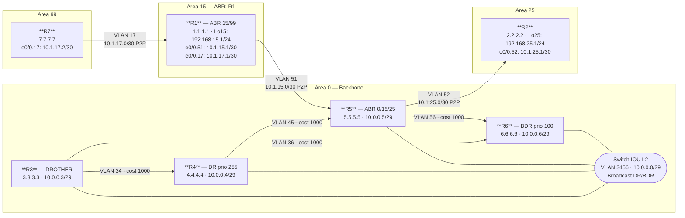

# Workbook Studenti — MOD-02: OSPFv2 Aree & Summarization

> **Piattaforme supportate:** GNS3 · ContainerLab (vrnetlab/IOU) · EVE-NG
> Le configurazioni iniziali sono integrate nel workbook — caricamento via paste manuale.

**Area:** AREA 1 — OSPF | **Ore:** 2h | **Codici syllabus:** 3.2.a · 3.2.b

---

## 1. TOPOLOGIA

### Diagramma logico



### Tabella di indirizzamento completa

| Router | Interfaccia    | VLAN | IPv4              | Area OSPF | Tipo link  |
|--------|----------------|------|-------------------|-----------|------------|
| R1     | e0/0.51        | 51   | 10.1.15.1/30      | Area 15   | P2P        |
| R1     | Lo15           | —    | 192.168.15.1/24   | Area 15   | Loopback   |
| R1     | Lo150          | —    | 10.15.0.1/24      | Area 15   | Loopback   |
| R1     | Lo151          | —    | 10.15.1.1/24      | Area 15   | Loopback   |
| R1     | Lo152          | —    | 10.15.2.1/24      | Area 15   | Loopback   |
| R1     | e0/0.17        | 17   | 10.1.17.1/30      | Area 99   | P2P        |
| R2     | e0/0.52        | 52   | 10.1.25.1/30      | Area 25   | P2P        |
| R2     | Lo25           | —    | 192.168.25.1/24   | Area 25   | Loopback   |
| R2     | Lo250          | —    | 10.25.0.1/24      | Area 25   | Loopback   |
| R2     | Lo251          | —    | 10.25.1.1/24      | Area 25   | Loopback   |
| R2     | Lo252          | —    | 10.25.2.1/24      | Area 25   | Loopback   |
| R3     | e0/0.3456      | 3456 | 10.0.0.3/29       | Area 0    | Broadcast  |
| R4     | e0/0.3456      | 3456 | 10.0.0.4/29       | Area 0    | Broadcast  |
| R5     | e0/0.3456      | 3456 | 10.0.0.5/29       | Area 0    | Broadcast  |
| R5     | e0/0.51        | 51   | 10.1.15.2/30      | Area 15   | P2P        |
| R5     | e0/0.52        | 52   | 10.1.25.2/30      | Area 25   | P2P        |
| R6     | e0/0.3456      | 3456 | 10.0.0.6/29       | Area 0    | Broadcast  |
| R7     | e0/0.17        | 17   | 10.1.17.2/30      | Area 99   | P2P        |

> **Router-ID:** R1=1.1.1.1, R2=2.2.2.2, R3=3.3.3.3, R4=4.4.4.4, R5=5.5.5.5, R6=6.6.6.6, R7=7.7.7.7

---

## 2. OBIETTIVI DELLA SESSIONE

Al termine di questo modulo lo studente sara' in grado di:

- [ ] Configurare R5 come ABR per le spoke area 15 e 25
- [ ] Implementare la summarization inter-area con il comando `area range` su un ABR
- [ ] Configurare e verificare le Stub area e Totally-Stub area, comprendendo le differenze sui LSA bloccati
- [ ] Implementare un Virtual Link attraverso una transit area non-stub per connettere Area 99 al backbone
- [ ] Comprendere perche' una transit area stub invalida il Virtual Link (vincolo RFC 2328)
- [ ] Redistribuire una rotta statica in OSPF e applicare `summary-address` sull'ASBR

**Codici syllabus coperti:** 3.2.a · 3.2.b

---

## 3. LAB SETUP

### Prerequisiti

- **MOD-01 completato:** le adiacenze sul Core Broadcast (VLAN 3456) e sul Core Ring sono in stato FULL
- R4=DR, R6=BDR su VLAN 3456 (priority configurata in MOD-01)
- Link VLAN 51 (R1-R5) e VLAN 52 (R2-R5) configurati come P2P ma non ancora in OSPF
- R7 raggiungibile via VLAN 17 da R1

### Configurazione Iniziale

Incollare manualmente la configurazione su ogni device (paste diretto in CLI).

#### R1

```
! MOD-02 cfg iniziale — R1
! Stato: fine MOD-01 — interfacce configurate, NESSUN processo OSPF
! Lo studente aggiunge OSPF Area 15 in Task T1
! Loopback Lo150/151/152 NON configurate (lo studente le aggiunge in T2)
!
hostname R1
no ip domain-lookup
!
interface ethernet 0/0
 no ip address
 no shutdown
!
interface ethernet 0/0.51
 encapsulation dot1Q 51
 ip address 10.1.15.1 255.255.255.252
 description P2P_to_R5_Area15
 ip ospf network point-to-point
 no shutdown
!
interface ethernet 0/0.17
 encapsulation dot1Q 17
 ip address 10.1.17.1 255.255.255.252
 description P2P_to_R7_Area99
 no shutdown
!
interface loopback 15
 ip address 192.168.15.1 255.255.255.0
 description Mgmt_Loopback_R1
 no shutdown
!
end
```

#### R2

```
! MOD-02 cfg iniziale — R2
! Stato: fine MOD-01 — interfacce configurate, NESSUN processo OSPF
! Lo studente aggiunge OSPF Area 25 in Task T1
! Loopback Lo250/251/252 NON configurate (lo studente le aggiunge in T2)
!
hostname R2
no ip domain-lookup
!
interface ethernet 0/0
 no ip address
 no shutdown
!
interface ethernet 0/0.52
 encapsulation dot1Q 52
 ip address 10.1.25.1 255.255.255.252
 description P2P_to_R5_Area25
 ip ospf network point-to-point
 no shutdown
!
interface loopback 25
 ip address 192.168.25.1 255.255.255.0
 description Mgmt_Loopback_R2
 no shutdown
!
end
```

#### R3

```
! MOD-02 cfg iniziale — R3
! Stato: fine MOD-01 (Area 0 funzionante, priority 0 su Broadcast, Ring P2P)
!
hostname R3
no ip domain-lookup
!
interface ethernet 0/0
 no ip address
 no shutdown
!
interface ethernet 0/0.3456
 encapsulation dot1Q 3456
 ip address 10.0.0.3 255.255.255.248
 description Core_Broadcast_Area0
 ip ospf priority 0
 no shutdown
!
interface ethernet 0/0.34
 encapsulation dot1Q 34
 ip address 10.0.34.1 255.255.255.252
 description P2P_R3-R4_Ring_Area0
 ip ospf 100 area 0
 ip ospf network point-to-point
 ip ospf cost 1000
 no shutdown
!
interface ethernet 0/0.36
 encapsulation dot1Q 36
 ip address 10.0.36.1 255.255.255.252
 description P2P_R3-R6_Ring_Area0
 ip ospf 100 area 0
 ip ospf network point-to-point
 ip ospf cost 1000
 no shutdown
!
router ospf 100
 router-id 3.3.3.3
 network 10.0.0.0 0.0.0.7 area 0
 passive-interface default
 no passive-interface ethernet 0/0.3456
 no passive-interface ethernet 0/0.34
 no passive-interface ethernet 0/0.36
!
end
```

#### R4

```
! MOD-02 cfg iniziale — R4
! Stato: fine MOD-01 — R4 = DR (priority 255) su Core Broadcast
!
hostname R4
no ip domain-lookup
!
interface ethernet 0/0
 no ip address
 no shutdown
!
interface ethernet 0/0.3456
 encapsulation dot1Q 3456
 ip address 10.0.0.4 255.255.255.248
 description Core_Broadcast_Area0
 ip ospf priority 255
 no shutdown
!
interface ethernet 0/0.34
 encapsulation dot1Q 34
 ip address 10.0.34.2 255.255.255.252
 description P2P_R3-R4_Ring_Area0
 ip ospf 100 area 0
 ip ospf network point-to-point
 ip ospf cost 1000
 no shutdown
!
interface ethernet 0/0.45
 encapsulation dot1Q 45
 ip address 10.0.45.1 255.255.255.252
 description P2P_R4-R5_Ring_Area0
 ip ospf 100 area 0
 ip ospf network point-to-point
 ip ospf cost 1000
 no shutdown
!
router ospf 100
 router-id 4.4.4.4
 network 10.0.0.0 0.0.0.7 area 0
 passive-interface default
 no passive-interface ethernet 0/0.3456
 no passive-interface ethernet 0/0.34
 no passive-interface ethernet 0/0.45
!
end
```

#### R5

```
! MOD-02 cfg iniziale — R5
! Stato: fine MOD-01
! R5: priority 0 su Broadcast (DROTHER), Ring P2P attivo
! e0/0.51 e e0/0.52 configurate con P2P ma NON in OSPF (T1 di MOD-02)
!
hostname R5
no ip domain-lookup
!
interface ethernet 0/0
 no ip address
 no shutdown
!
interface ethernet 0/0.3456
 encapsulation dot1Q 3456
 ip address 10.0.0.5 255.255.255.248
 description Core_Broadcast_Area0
 ip ospf priority 0
 no shutdown
!
interface ethernet 0/0.51
 encapsulation dot1Q 51
 ip address 10.1.15.2 255.255.255.252
 description P2P_to_R1_Area15
 ip ospf network point-to-point
 no shutdown
! NOTE: non in OSPF — lo studente aggiunge ip ospf 100 area 15 in T1
!
interface ethernet 0/0.52
 encapsulation dot1Q 52
 ip address 10.1.25.2 255.255.255.252
 description P2P_to_R2_Area25
 ip ospf network point-to-point
 no shutdown
! NOTE: non in OSPF — lo studente aggiunge ip ospf 100 area 25 in T1
!
interface ethernet 0/0.45
 encapsulation dot1Q 45
 ip address 10.0.45.2 255.255.255.252
 description P2P_R4-R5_Ring_Area0
 ip ospf 100 area 0
 ip ospf network point-to-point
 ip ospf cost 1000
 no shutdown
!
interface ethernet 0/0.56
 encapsulation dot1Q 56
 ip address 10.0.56.1 255.255.255.252
 description P2P_R5-R6_Ring_Area0
 ip ospf 100 area 0
 ip ospf network point-to-point
 ip ospf cost 1000
 no shutdown
!
router ospf 100
 router-id 5.5.5.5
 network 10.0.0.0 0.0.0.7 area 0
 passive-interface default
 no passive-interface ethernet 0/0.3456
 no passive-interface ethernet 0/0.45
 no passive-interface ethernet 0/0.56
!
end
```

#### R6

```
! MOD-02 cfg iniziale — R6
! Stato: fine MOD-01 — R6 = BDR (priority 100) su Core Broadcast
!
hostname R6
no ip domain-lookup
!
interface ethernet 0/0
 no ip address
 no shutdown
!
interface ethernet 0/0.3456
 encapsulation dot1Q 3456
 ip address 10.0.0.6 255.255.255.248
 description Core_Broadcast_Area0
 ip ospf priority 100
 no shutdown
!
interface ethernet 0/0.36
 encapsulation dot1Q 36
 ip address 10.0.36.2 255.255.255.252
 description P2P_R3-R6_Ring_Area0
 ip ospf 100 area 0
 ip ospf network point-to-point
 ip ospf cost 1000
 no shutdown
!
interface ethernet 0/0.56
 encapsulation dot1Q 56
 ip address 10.0.56.2 255.255.255.252
 description P2P_R5-R6_Ring_Area0
 ip ospf 100 area 0
 ip ospf network point-to-point
 ip ospf cost 1000
 no shutdown
!
router ospf 100
 router-id 6.6.6.6
 network 10.0.0.0 0.0.0.7 area 0
 passive-interface default
 no passive-interface ethernet 0/0.3456
 no passive-interface ethernet 0/0.36
 no passive-interface ethernet 0/0.56
!
end
```

#### R7

```
! MOD-02 cfg iniziale — R7
! Stato: solo interfaccia fisica configurata — NESSUN processo OSPF
! Lo studente aggiunge la configurazione completa in Task T4 (Virtual Link)
!
hostname R7
no ip domain-lookup
!
interface ethernet 0/0
 no ip address
 no shutdown
!
interface ethernet 0/0.17
 encapsulation dot1Q 17
 ip address 10.1.17.2 255.255.255.252
 description P2P_to_R1_Area99
 no shutdown
!
end
```

### Verifica pre-lab

```
! Verificare adiacenze Core da MOD-01:
R5# show ip ospf neighbor
! Atteso: R3, R4, R6 in FULL su e0/0.3456

! Verificare che R1 e R2 non abbiano ancora OSPF configurato:
R1# show ip ospf
! Atteso: nessun processo OSPF attivo

! Verificare connettivita' fisica VLAN 51:
R1# ping 10.1.15.2
! Atteso: 100% success
```

---

## 4. TASK LIST

| # | Task | Codice syllabus | Tempo stimato |
|---|------|-----------------|---------------|
| **T1** | Configurare R5 come ABR — Aree 15 e 25 | 3.2.a | 20 min |
| **T2** | Loopback e summarization inter-area | 3.2.a · 3.2.b | 15 min |
| **T3** | Stub Area 15 e Totally-Stub Area 25 | 3.2.a | 20 min |
| **T4** | Virtual Link: Area 99 attraverso Area 15 | 3.2.a | 25 min |
| **T5** | ASBR: redistribuzione rotta statica | 3.2.b | 15 min |

---

## 5. DETTAGLIO TASK

---

### T1 — Configurare R5 come ABR: Aree 15 e 25

#### TEORIA

**Area Border Router (ABR)**

Un ABR appartiene a due o piu' aree OSPF simultaneamente e mantiene una LSDB separata per ciascuna. Il suo ruolo e' tradurre le informazioni di topologia tra le aree usando i **LSA Type 3 (Summary LSA)**:

- Riceve i LSA Type 1 e 2 di un'area
- Genera LSA Type 3 verso le altre aree, annunciando i prefissi come route inter-area (`O IA`)
- Calcola SPF separatamente per ogni area

**Multi-area OSPF: perche' usarla**

| Beneficio | Meccanismo |
|-----------|------------|
| Riduzione LSDB | Ogni area mantiene solo i propri LSA interni |
| SPF localizzato | Un guasto in Area 15 non forza SPF recalculation in Area 0 |
| Summarization | L'ABR puo' aggregare prefissi prima di annunciarli al backbone |
| Stub area | Le aree periferiche possono bloccare i prefissi esterni |

**Verifica stato ABR**

```
show ip ospf              ! → "It is an area border router"
show ip ospf border-routers   ! → lista degli ABR noti
```

#### TASK

**Step 1 — Configurare OSPF su R1 (Area 15)**

```
R1(config)# router ospf 100
R1(config-router)# router-id 1.1.1.1
R1(config-router)# exit

R1(config)# interface ethernet 0/0.51
R1(config-subif)# ip ospf 100 area 15
R1(config-subif)# exit
```

**Step 2 — Configurare OSPF su R2 (Area 25)**

```
R2(config)# router ospf 100
R2(config-router)# router-id 2.2.2.2
R2(config-router)# exit

R2(config)# interface ethernet 0/0.52
R2(config-subif)# ip ospf 100 area 25
R2(config-subif)# exit
```

**Step 3 — Aggiungere le spoke area al processo OSPF di R5**

```
R5(config)# interface ethernet 0/0.51
R5(config-subif)# ip ospf 100 area 15
R5(config-subif)# exit

R5(config)# interface ethernet 0/0.52
R5(config-subif)# ip ospf 100 area 25
R5(config-subif)# exit
```

**Step 4 — Verificare lo stato ABR di R5**

```
R5# show ip ospf
R5# show ip ospf neighbor
R5# show ip ospf border-routers
R5# show ip route ospf
```

#### VERIFICA

```
R5# show ip ospf
 Routing Process "ospf 100" with ID 5.5.5.5
 ...
 It is an area border router
 Number of areas in this router is 3. 3 normal 0 stub 0 nssa

R5# show ip ospf neighbor
Neighbor ID  Pri  State   Dead Time  Address       Interface
1.1.1.1        1  FULL/   00:00:38   10.1.15.1     Et0/0.51
2.2.2.2        1  FULL/   00:00:36   10.1.25.1     Et0/0.52
3.3.3.3        0  FULL/DROTHER  ...  10.0.0.3      Et0/0.3456
4.4.4.4      255  FULL/DR  ...      10.0.0.4      Et0/0.3456
6.6.6.6      100  FULL/BDR  ...     10.0.0.6      Et0/0.3456

R1# show ip route ospf
      10.0.0.0/8 is variably subnetted ...
O IA     10.0.0.0/29 [110/20] via 10.1.15.2, Et0/0.51
O IA     10.0.34.0/30 [110/1010] via 10.1.15.2, Et0/0.51
O IA     10.1.25.0/30 [110/20] via 10.1.15.2, Et0/0.51
```

---

### T2 — Loopback e summarization inter-area

#### TEORIA

**Loopback in OSPF: /32 vs /24**

Per default, OSPF annuncia i prefissi loopback come /32, indipendentemente dalla maschera configurata. Per annunciarli con la maschera reale (/24 in questo lab):

```
interface loopback 15
  ip ospf network point-to-point
```

Questo forza OSPF a usare la maschera dell'interfaccia anziché il /32 di default.

**Area Range (summarization inter-area)**

L'ABR puo' aggregare piu' prefissi specifici in un unico summary prima di annunciarli verso il backbone, usando il comando `area range`:

```
router ospf 100
  area 15 range 10.15.0.0 255.255.252.0   ! aggrega 10.15.0.0/24, /24, /24 in un /22
  area 25 range 10.25.0.0 255.255.252.0
```

Effetto: i prefissi specifici (/24) scompaiono dalla LSDB di Area 0, sostituiti da un unico LSA Type 3 con il prefisso aggregato (/22). Riduce dimensione LSDB e stabilita' (i flap interni non propagano al backbone).

**Prerequisito di progettazione:** la summarization funziona solo se l'indirizzamento e' contiguo e pianificato. Se i prefissi non sono contigui, il summary copre spazio non assegnato (route "buco nero").

#### TASK

**Step 1 — Configurare le loopback su R1**

```
R1(config)# interface loopback 15
R1(config-if)# ip address 192.168.15.1 255.255.255.0
R1(config-if)# ip ospf 100 area 15
R1(config-if)# ip ospf network point-to-point
R1(config-if)# exit

R1(config)# interface loopback 150
R1(config-if)# ip address 10.15.0.1 255.255.255.0
R1(config-if)# ip ospf 100 area 15
R1(config-if)# ip ospf network point-to-point
R1(config-if)# exit

R1(config)# interface loopback 151
R1(config-if)# ip address 10.15.1.1 255.255.255.0
R1(config-if)# ip ospf 100 area 15
R1(config-if)# ip ospf network point-to-point
R1(config-if)# exit

R1(config)# interface loopback 152
R1(config-if)# ip address 10.15.2.1 255.255.255.0
R1(config-if)# ip ospf 100 area 15
R1(config-if)# ip ospf network point-to-point
R1(config-if)# exit
```

**Step 2 — Configurare le loopback su R2 (Area 25)**

```
! Replicare la struttura di R1 usando gli indirizzi 10.25.x.x e 192.168.25.x
R2(config)# interface loopback 25
R2(config-if)# ip address 192.168.25.1 255.255.255.0
R2(config-if)# ip ospf 100 area 25
R2(config-if)# ip ospf network point-to-point
R2(config-if)# exit

R2(config)# interface loopback 250
R2(config-if)# ip address 10.25.0.1 255.255.255.0
R2(config-if)# ip ospf 100 area 25
R2(config-if)# ip ospf network point-to-point
R2(config-if)# exit

! [analogamente Lo251 = 10.25.1.1/24 e Lo252 = 10.25.2.1/24]
```

**Step 3 — Configurare area range su R5**

```
R5(config)# router ospf 100
R5(config-router)# area 15 range 10.15.0.0 255.255.252.0
R5(config-router)# area 25 range 10.25.0.0 255.255.252.0
R5(config-router)# exit
```

**Step 4 — Verificare la summarization**

```
R4# show ip route ospf
R5# show ip ospf database summary
```

#### VERIFICA

```
R4# show ip route ospf
! Prima della summarization:
O IA  10.15.0.0/24 [110/20] via 10.0.0.5 ...
O IA  10.15.1.0/24 [110/20] via 10.0.0.5 ...
O IA  10.15.2.0/24 [110/20] via 10.0.0.5 ...

! Dopo area range su R5:
O IA  10.15.0.0/22 [110/20] via 10.0.0.5 ...    ! solo il summary /22
! Le singole /24 non compaiono piu' in Area 0
```

---

### T3 — Stub Area 15 e Totally-Stub Area 25

#### TEORIA

**Tipi di area e LSA bloccati**

| Tipo area | LSA Type 5 bloccati | LSA Type 3 bloccati | Default route iniettata | Configurazione |
|-----------|--------------------|--------------------|------------------------|----------------|
| Normal | No | No | No | (default) |
| Stub | Si' | No | Si' (O*IA) | `area N stub` su tutti i router dell'area |
| Totally-Stub | Si' | Si' | Si' (O*IA) | `area N stub no-summary` sull'ABR, `area N stub` sui router interni |
| NSSA | Converte in T7→T5 | No | Opzionale | `area N nssa` |

**Stub area:** elimina i LSA Type 5 (rotte esterne, E1/E2). L'ABR inietta automaticamente un LSA Type 3 con il prefisso `0.0.0.0/0` come default route. I router interni continuano a vedere le O IA verso le altre aree.

**Totally-Stub:** elimina anche i LSA Type 3 (inter-area). Il router interno vede solo:
- LSA Type 1 e 2 propri dell'area
- Un singolo LSA Type 3 con `0.0.0.0/0` come default route

Risultato: LSDB minima, SPF rapidissimo, nessuna scelta di routing complessa. Ideale per siti remoti con un solo link verso l'ABR.

> **Regola critica:** `no-summary` va configurato SOLO sull'ABR. I router interni usano solo `area N stub` (senza `no-summary`). Configurare `no-summary` su un router interno viene accettato da IOS ma non ha effetto — e genera confusione in fase di troubleshooting.

#### TASK

**Step 1 — Configurare Area 15 come Stub**

```
! Su R5 (ABR):
R5(config)# router ospf 100
R5(config-router)# area 15 stub
R5(config-router)# exit

! Su R1 (router interno):
R1(config)# router ospf 100
R1(config-router)# area 15 stub
R1(config-router)# exit
```

**Step 2 — Verificare Area 15 Stub**

```
R1# show ip ospf database
! Verificare: nessun LSA Type 5 nella LSDB

R1# show ip route ospf
! Verificare: O*IA 0.0.0.0/0 presente come default
! Le O IA verso Area 0 e Area 25 sono ancora visibili
```

**Step 3 — Configurare Area 25 come Totally-Stub**

```
! Su R5 (ABR) — solo qui il no-summary:
R5(config)# router ospf 100
R5(config-router)# area 25 stub no-summary
R5(config-router)# exit

! Su R2 (router interno) — solo stub, senza no-summary:
R2(config)# router ospf 100
R2(config-router)# area 25 stub
R2(config-router)# exit
```

**Step 4 — Verificare Area 25 Totally-Stub**

```
R2# show ip ospf database
! Verificare: un solo LSA Type 3 (la default 0.0.0.0/0)

R2# show ip route ospf
! Verificare: O*IA 0.0.0.0/0 come UNICA rotta OSPF
```

#### VERIFICA

```
R1# show ip route ospf
O*IA 0.0.0.0/0 [110/11] via 10.1.15.2, Et0/0.51    ! default route present
O IA 10.0.0.0/29 [110/20] via 10.1.15.2, Et0/0.51  ! inter-area ancora visibili
O IA 10.1.25.0/30 [110/20] via 10.1.15.2, Et0/0.51

R2# show ip route ospf
O*IA 0.0.0.0/0 [110/11] via 10.1.25.2, Et0/0.52    ! UNICA rotta OSPF in totally-stub

R2# show ip ospf database
! Solo Type 1 (propri) e un singolo Type 3 (0.0.0.0/0)
OSPF Router with ID (2.2.2.2) (Process ID 100)
                Summary Net Link States (Area 25)
 LS age: 45         Options: (No TOS-capability, DC, Upward)
 LS Type: Summary Links (Network)
 Link State ID: 0.0.0.0
 Advertising Router: 5.5.5.5
 ...
```

---

### T4 — Virtual Link: connettere Area 99 attraverso Area 15

#### TEORIA

**Il problema: Area 99 non raggiunge il backbone**

OSPF richiede che ogni area sia connessa direttamente al backbone (Area 0). Se un'area non ha un link fisico con Area 0, il traffico inter-area non viene instradato — la regola e' imposta per prevenire loop di routing.

In questa topologia:
- R7 (Area 99) e' collegato solo a R1 (via VLAN 17)
- R1 e' ABR tra Area 15 e Area 99, ma Area 15 non e' Area 0
- Risultato: Area 99 e' isolata — R7 non vede i prefissi di Area 0

**Soluzione: Virtual Link**

Il virtual link crea un'estensione logica di Area 0 che attraversa una **transit area** (in questo caso Area 15), collegando due ABR. Si configura tra i router-id dei due endpoint:

```
! R5 (lato Area 0):
area 15 virtual-link 1.1.1.1   ! router-id di R1

! R1 (lato Area 99):
area 15 virtual-link 5.5.5.5   ! router-id di R5
```

Il virtual link viene trattato come un'interfaccia virtuale di Area 0 su entrambi gli endpoint.

**Vincolo critico: la transit area NON puo' essere stub**

RFC 2328 vieta esplicitamente l'uso di una stub area o totally-stub come transit area per virtual link. Se Area 15 viene configurata come stub (vedi T3), il virtual link viene automaticamente disabilitato. In produzione: se un'area deve fungere da transit per virtual link, mantenerla normal.

> **Nota pratica per questo lab:** se hai gia' configurato Area 15 come stub in T3, rimuovi la configurazione stub prima di procedere con T4:
> `R5(config-router)# no area 15 stub` e `R1(config-router)# no area 15 stub`

#### TASK

**Step 1 — Setup R7: sub-interface VLAN 17 e OSPF**

Verificare che VLAN 17 sia nel database di Switch1 e permessa sul trunk.

```
! Su Switch1:
Switch1(config)# vlan 17
Switch1(config-vlan)# name P2P_R1-R7_Area99
Switch1(config-vlan)# exit
Switch1(config)# interface range ethernet 1/0 - 7
Switch1(config-if-range)# switchport trunk allowed vlan add 17
Switch1(config-if-range)# exit

! Su R1 — aggiungere sub-interface verso R7:
R1(config)# interface ethernet 0/0.17
R1(config-subif)# encapsulation dot1Q 17
R1(config-subif)# ip address 10.1.17.1 255.255.255.252
R1(config-subif)# description P2P_to_R7_Area99
R1(config-subif)# ip ospf 100 area 99
R1(config-subif)# no shutdown
R1(config-subif)# exit

! Su R7 — configurazione completa:
R7(config)# hostname R7
R7(config)# no ip domain-lookup
R7(config)# interface ethernet 0/0
R7(config-if)# no ip address
R7(config-if)# no shutdown
R7(config-if)# exit
R7(config)# interface ethernet 0/0.17
R7(config-subif)# encapsulation dot1Q 17
R7(config-subif)# ip address 10.1.17.2 255.255.255.252
R7(config-subif)# description P2P_to_R1_Area99
R7(config-subif)# no shutdown
R7(config-subif)# exit
R7(config)# router ospf 100
R7(config-router)# router-id 7.7.7.7
R7(config-router)# exit
R7(config)# interface ethernet 0/0.17
R7(config-subif)# ip ospf 100 area 99
R7(config-subif)# exit
```

**Step 2 — Verificare il problema (prima del virtual link)**

```
R7# show ip route ospf
! Atteso: tabella OSPF quasi vuota o solo prefissi Area 15 come O IA
! I prefissi di Area 0 (10.0.0.0/29 ecc.) NON sono visibili

R4# show ip route ospf
! Atteso: 10.1.17.0/30 e 7.7.7.7 NON compaiono
```

**Step 3 — Configurare il Virtual Link**

```
! Su R5 (ABR Area 0 / Area 15):
R5(config)# router ospf 100
R5(config-router)# area 15 virtual-link 1.1.1.1
R5(config-router)# exit

! Su R1 (ABR Area 15 / Area 99):
R1(config)# router ospf 100
R1(config-router)# area 15 virtual-link 5.5.5.5
R1(config-router)# exit
```

**Step 4 — Verificare il Virtual Link e la connettivita'**

```
R5# show ip ospf virtual-links
R5# show ip ospf neighbor

R7# show ip route ospf
R7# ping 10.0.0.4 source 10.1.17.2
```

#### VERIFICA

```
R5# show ip ospf virtual-links
Virtual Link OSPF_VL0 to router 1.1.1.1 is up
  Run as demand circuit
  DoNotAge LSA allowed, Cost of using 10
  Transit area 15, via interface Et0/0.51

R5# show ip ospf neighbor
Neighbor ID  Pri  State        Dead Time  Address       Interface
1.1.1.1        0  FULL/        00:00:37   10.1.15.1     Et0/0.51
1.1.1.1        0  FULL/        -          OSPF_VL0      !  due volte: link fisico + VL
4.4.4.4      255  FULL/DR      ...
6.6.6.6      100  FULL/BDR     ...

R7# show ip route ospf
O IA  10.0.0.0/29 [110/30] via 10.1.17.1, Et0/0.17
O IA  10.0.34.0/30 [110/1020] via 10.1.17.1, Et0/0.17
O IA  10.1.25.0/30 [110/30] via 10.1.17.1, Et0/0.17
! I prefissi di Area 0 ora sono visibili

R7# ping 10.0.0.4 source 10.1.17.2
!!!!!   ! success rate 100%
```

> **Effetto stub su virtual link:** se in T3 hai configurato Area 15 come stub, il virtual link andra' immediatamente in DOWN dopo la configurazione stub. Verificare con `show ip ospf virtual-links` — stato DOWN conferma il vincolo RFC 2328.

---

### T5 — ASBR: redistribuzione rotta statica e summary-address

#### TEORIA

**ASBR (Autonomous System Boundary Router)**

Un ASBR ridistribuisce rotte da fonti esterne (rotte statiche, altri protocolli) nel dominio OSPF. Le rotte ridistribuite vengono annunciate come **LSA Type 5 (AS External LSA)** con metrica E1 o E2:

| Tipo metrica | Calcolo costo | Tipico uso |
|-------------|---------------|------------|
| E1 | costo interno + metrica esterna | Quando il percorso interno conta |
| E2 (default) | solo metrica esterna | Quando la metrica esterna e' dominante |

**summary-address sull'ASBR**

L'ASBR puo' aggregare piu' LSA Type 5 in un unico summary prima di annunciarli:

```
router ospf 100
  summary-address 10.15.0.0 255.255.252.0
```

Diverso dalla `area range` dell'ABR: `summary-address` agisce sui prefissi esterni (Type 5), non su quelli inter-area (Type 3).

#### TASK

**Step 1 — Aggiungere rotte statiche su R1 e ridistribuirle in OSPF**

```
! Su R1 — rotte statiche simulate (interfacce Null0):
R1(config)# ip route 172.16.10.0 255.255.255.0 Null0
R1(config)# ip route 172.16.11.0 255.255.255.0 Null0
R1(config)# ip route 172.16.12.0 255.255.255.0 Null0

! Redistribuire le rotte statiche in OSPF:
R1(config)# router ospf 100
R1(config-router)# redistribute static subnets
R1(config-router)# exit
```

**Step 2 — Verificare le rotte E2 sugli altri router**

```
R4# show ip route ospf
! Atteso: O E2 172.16.10.0/24, 172.16.11.0/24, 172.16.12.0/24

R5# show ip ospf database external
! Atteso: LSA Type 5 originati da 1.1.1.1
```

**Step 3 — Applicare summary-address sull'ASBR R1**

```
R1(config)# router ospf 100
R1(config-router)# summary-address 172.16.0.0 255.255.240.0
R1(config-router)# exit
```

**Step 4 — Verificare la summarization delle rotte esterne**

```
R4# show ip route ospf
! Le singole /24 spariscono; compare O E2 172.16.0.0/20

R5# show ip ospf database external
! Un solo LSA Type 5 con prefisso 172.16.0.0/20
```

#### VERIFICA

```
R4# show ip route ospf
O E2  172.16.0.0/20 [110/20] via 10.0.0.5, Et0/0.3456
! Le singole /24 non compaiono

R5# show ip ospf database external
            AS External Link States
  LS age: 67          Options: (No TOS-capability, DC)
  LS Type: AS External Link
  Link State ID: 172.16.0.0 (External Network Number)
  Advertising Router: 1.1.1.1
  ...
  Network Mask: /20
  Metric Type: 2 (Larger than any link state path)
  Metric: 20
```

---

## 6. TROUBLESHOOTING GUIDE

| Sintomo | Causa probabile | Diagnosi | Fix |
|---------|----------------|----------|-----|
| R5 non compare come ABR | e0/0.51 o e0/0.52 non in OSPF | `show ip ospf interface brief` | `ip ospf 100 area 15` sull'interfaccia mancante |
| R1 non vede O IA verso Area 0 | R5 non e' ABR o adiacenza non FULL | `show ip ospf neighbor su R5` | Verificare che e0/0.51 sia in area 15 su entrambi i lati |
| `area range` non aggrega i prefissi | I prefissi non sono contigui o non rientrano nel range | `show ip ospf database summary` su R5 | Verificare che le loopback abbiano gli indirizzi corretti nel range |
| Area 25 stub: R2 vede ancora O E2 | `area 25 stub` non configurato su R2 | `show ip ospf su R2` → no stub flag | `area 25 stub` su R2 (sia in stub che totally-stub i router interni devono avere il flag) |
| Virtual Link in DOWN dopo stub | Area 15 configurata stub = transit area invalida | `show ip ospf virtual-links` → DOWN | `no area 15 stub` su R5 e R1; la transit area deve essere normal |
| R7 non vede rotte inter-area | Virtual link non ancora configurato | `show ip ospf virtual-links` → assente | Configurare `area 15 virtual-link` su R5 e R1 con i router-id corretti |
| R1 compare una sola volta nel neighbor table di R5 | Virtual link non attivo | `show ip ospf neighbor su R5` → 1.1.1.1 una sola volta | Verificare la configurazione VL su entrambi gli endpoint (router-id, area transit) |
| Rotte ridistribuite non compaiono sui router remoti | `subnets` dimenticato nel redistribute | `show ip ospf database external` → assente | `redistribute static subnets` (senza `subnets` vengono redistribuite solo le rotte classful) |
| summary-address non aggrega | Prefisso summary non copre tutti i componenti | `show ip ospf database external` → multiple T5 | Ricalcolare il summary corretto che includa tutti i prefissi da aggregare |

---

## 7. SOLUZIONI

> **NOTA:** Le soluzioni complete commentate sono disponibili nel file `soluzione.md` di questo modulo.

---

## 8. RIEPILOGO & EXAM TIPS

**Punti chiave del modulo:**

1. L'ABR mantiene una LSDB separata per ogni area e traduce le informazioni tra le aree tramite LSA Type 3 (`O IA`). Verificare sempre lo stato ABR con `show ip ospf` → "It is an area border router".
2. **Stub vs Totally-Stub:** stub blocca solo i Type 5 (external); totally-stub blocca anche i Type 3 (inter-area), lasciando solo la default route. Il comando `no-summary` va SOLO sull'ABR.
3. **Virtual Link:** si configura tra i router-id dei due ABR ai lati della transit area, NON tra gli indirizzi IP delle interfacce. La transit area deve essere normal — mai stub.
4. `area range` aggrega prefissi inter-area (Type 3) sull'ABR. `summary-address` aggrega prefissi esterni (Type 5) sull'ASBR. Sono comandi diversi con scopo diverso.
5. La redistribuzione di rotte statiche richiede il parametro `subnets`: senza, OSPF ridistribuisce solo rotte classful (/8, /16, /24) e ignora le subnet.

**Domande tipo CCNP:**

1. In una totally-stub area, quanti LSA Type 3 sono presenti nella LSDB dei router interni?
   > **Risposta:** Uno solo — il LSA Type 3 che contiene la default route `0.0.0.0/0`, iniettato automaticamente dall'ABR.

2. Un'azienda ha Area 99 connessa al backbone solo attraverso Area 15. Quale configurazione OSPF risolve il problema di connettivita' inter-area?
   > **Risposta:** Virtual Link configurato tra i router-id degli ABR ai lati di Area 15 (transit area). Area 15 deve essere normal (non stub).

3. Qual e' il comportamento di OSPF se si configura `area 15 stub` su un ABR e quella area e' transit area per un virtual link?
   > **Risposta:** Il virtual link viene disabilitato automaticamente. RFC 2328 proibisce l'uso di stub area come transit area.

4. Su R5 (ABR), si vede `O IA 10.15.0.0/22` ma non le singole /24 di Area 15. Quale comando ha generato questo comportamento?
   > **Risposta:** `area 15 range 10.15.0.0 255.255.252.0` nel processo OSPF di R5. Il comando aggrega i prefissi dell'area prima di annunciarli verso Area 0.


---

> © 2026 Matteo Mirenda — Tutti i diritti riservati.
> Materiale ad uso esclusivo degli studenti iscritti al corso.
> Vietata la riproduzione, distribuzione o condivisione
> senza autorizzazione scritta dell'autore.
> CCNP ENCOR 350-401 

---
