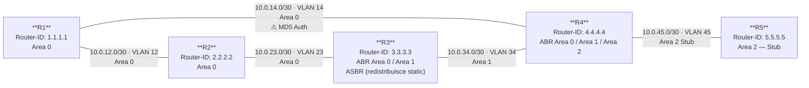

# Workbook Studenti — MOD-04: OSPF Troubleshooting

> **Piattaforme supportate:** GNS3 · ContainerLab (vrnetlab/IOU) · EVE-NG  
> **Ore:** 4h | **Codici syllabus:** 1.10.a · 1.10.b · 1.10.c · 1.10.d  
> **Prerequisiti moduli:** MOD-01 (OSPFv2 Fondamenta) · MOD-02 (Aree & Summarization) · MOD-03 (OSPFv3 Dual-Stack)

---

## 1. TOPOLOGIA



### Piano di Indirizzamento IPv4

| Link | VLAN | Subnet | R-A | IP R-A | R-B | IP R-B | Area OSPF |
|------|------|--------|-----|--------|-----|--------|-----------|
| R1–R2 | 12 | 10.0.12.0/30 | R1 | 10.0.12.1 | R2 | 10.0.12.2 | Area 0 |
| R2–R3 | 23 | 10.0.23.0/30 | R2 | 10.0.23.1 | R3 | 10.0.23.2 | Area 0 |
| R1–R4 | 14 | 10.0.14.0/30 | R1 | 10.0.14.1 | R4 | 10.0.14.2 | Area 0 |
| R3–R4 | 34 | 10.0.34.0/30 | R3 | 10.0.34.1 | R4 | 10.0.34.2 | Area 1 |
| R4–R5 | 45 | 10.0.45.0/30 | R4 | 10.0.45.1 | R5 | 10.0.45.2 | Area 2 |

### Loopback e Rotte Esterne

| Device | Interface | IPv4 | Area OSPF | Note |
|--------|-----------|------|-----------|------|
| R1 | Lo0 | 1.1.1.1/32 | 0 | Router-ID |
| R2 | Lo0 | 2.2.2.2/32 | 0 | Router-ID |
| R3 | Lo0 | 3.3.3.3/32 | 0 | Router-ID |
| R4 | Lo0 | 4.4.4.4/32 | 0 | Router-ID |
| R5 | Lo0 | 5.5.5.5/32 | 2 | Router-ID |
| R3 | — | 192.168.100.0/24 | ext E2 | Static → Null0, redistribuito |
| R3 | — | 192.168.200.0/24 | ext E1 | Static → Null0, redistribuito |
| R4 | — | 172.16.4.0/24 | ext | Static → Null0, redistribuito da R4 |

### Piano di Indirizzamento IPv6 (OSPFv3 — Scenario D)

| Link | Interface | R-A | IPv6 R-A | R-B | IPv6 R-B |
|------|-----------|-----|----------|-----|----------|
| R1–R2 | e0/0.12 | R1 | 2001:db8:12::1/64 | R2 | 2001:db8:12::2/64 |
| R2–R3 | e0/0.23 | R2 | 2001:db8:23::1/64 | R3 | 2001:db8:23::2/64 |
| R1 Lo0 | Lo0 | R1 | 2001:db8:1::1/128 | — | — |
| R2 Lo0 | Lo0 | R2 | 2001:db8:2::2/128 | — | — |
| R3 Lo0 | Lo0 | R3 | 2001:db8:3::3/128 | — | — |

---

## 2. OBIETTIVI DELLA SESSIONE

Al termine di questo modulo lo studente sarà in grado di:

- Diagnosticare e risolvere problemi di adiacenza OSPF (hello mismatch, MTU mismatch, area mismatch, autenticazione)
- Interpretare l'output di `show ip ospf neighbor`, `debug ip ospf adj` e `show ip ospf database`
- Comprendere il comportamento delle stub area e delle NSSA rispetto alle rotte esterne
- Configurare e diagnosticare un virtual-link OSPF attraverso un'area transit
- Distinguere rotte O, O IA, O E1, O E2 e la loro preferenza
- Manipolare il costo OSPF per ingegnerizzare il path
- Diagnosticare problemi di adiacenza OSPFv3 e prefissi IPv6 mancanti dalla routing table

**Codici syllabus coperti:** 1.10.a (OSPFv3) · 1.10.b (neighbor failure) · 1.10.c (area types) · 1.10.d (path preference)

---

## 3. LAB SETUP

> **Piattaforme supportate:** GNS3 · ContainerLab (vrnetlab/IOU) · EVE-NG

### Prerequisiti

**Conoscenze richieste:**
- OSPF processo, Router-ID, network type (MOD-01)
- Aree OSPF: backbone, stub, totally-stub, NSSA (MOD-02)
- OSPFv3 dual-stack, link-local, ipv6 ospf area (MOD-03)

**Moduli precedenti:** MOD-01, MOD-02, MOD-03 completati

### Nota importante sul lab

Questo lab è progettato come **troubleshooting**: le configurazioni iniziali contengono **errori intenzionali**. La rete è **rotta** in modo realistico. Il tuo compito è diagnosticare e risolvere i problemi, un task alla volta.

### Configurazione Iniziale

Carica le cfg via TFTP su ogni router:

```
Router# copy tftp: running-config
Address or name of remote host? 192.168.122.1
Source filename? ENCOR/MOD-04/r1-cfg
```

Sostituire `r1-cfg` con `r2-cfg`, `r3-cfg`, `r4-cfg`, `r5-cfg` rispettivamente.

---

#### R1

```
hostname R1
!
ip cef
!
interface Loopback0
 ip address 1.1.1.1 255.255.255.255
 ip ospf 1 area 0
!
interface Ethernet0/0
 no shutdown
!
interface Ethernet0/0.12
 encapsulation dot1Q 12
 ip address 10.0.12.1 255.255.255.252
 ip ospf network point-to-point
 ip ospf 1 area 0
 ip ospf hello-interval 10
 ip ospf dead-interval 40
 ipv6 address 2001:db8:12::1/64
 ipv6 ospf 1 area 0
!
interface Ethernet0/0.14
 encapsulation dot1Q 14
 ip address 10.0.14.1 255.255.255.252
 ip ospf network point-to-point
 ip ospf 1 area 0
 ip ospf authentication message-digest
 ip ospf message-digest-key 1 md5 WRONGPASS
!
router ospf 1
 router-id 1.1.1.1
!
ipv6 unicast-routing
ipv6 cef
!
interface Loopback0
 ipv6 address 2001:db8:1::1/128
 ipv6 ospf 1 area 0
!
ipv6 router ospf 1
 router-id 1.1.1.1
!
end
```

---

#### R2

```
hostname R2
!
ip cef
!
interface Loopback0
 ip address 2.2.2.2 255.255.255.255
 ip ospf 1 area 0
!
interface Ethernet0/0
 no shutdown
!
interface Ethernet0/0.12
 encapsulation dot1Q 12
 ip address 10.0.12.2 255.255.255.252
 ip ospf network point-to-point
 ip ospf 1 area 0
 ip ospf hello-interval 5
 ip ospf dead-interval 20
!
interface Ethernet0/0.23
 encapsulation dot1Q 23
 ip address 10.0.23.1 255.255.255.252
 ip mtu 1400
 ip ospf network point-to-point
 ip ospf 1 area 0
!
router ospf 1
 router-id 2.2.2.2
!
end
```

---

#### R3

```
hostname R3
!
ip cef
!
interface Loopback0
 ip address 3.3.3.3 255.255.255.255
 ip ospf 1 area 0
 ipv6 address 2001:db8:3::3/128
!
interface Ethernet0/0
 no shutdown
!
interface Ethernet0/0.23
 encapsulation dot1Q 23
 ip address 10.0.23.2 255.255.255.252
 ip ospf network point-to-point
 ip ospf 1 area 0
 ipv6 address 2001:db8:23::2/64
 ipv6 ospf 1 area 0
!
interface Ethernet0/0.34
 encapsulation dot1Q 34
 ip address 10.0.34.1 255.255.255.252
 ip ospf network point-to-point
 ip ospf 1 area 1
!
ip route 192.168.100.0 255.255.255.0 Null0
ip route 192.168.200.0 255.255.255.0 Null0
!
router ospf 1
 router-id 3.3.3.3
 redistribute static subnets route-map OSPF_REDIST
!
ip prefix-list PL_E1 seq 5 permit 192.168.200.0/24
!
route-map OSPF_REDIST permit 10
 match ip address prefix-list PL_E1
 set metric-type type-1
!
route-map OSPF_REDIST permit 20
!
ipv6 unicast-routing
ipv6 cef
!
ipv6 router ospf 1
 router-id 3.3.3.3
!
end
```

---

#### R4

```
hostname R4
!
ip cef
!
interface Loopback0
 ip address 4.4.4.4 255.255.255.255
 ip ospf 1 area 0
!
interface Ethernet0/0
 no shutdown
!
interface Ethernet0/0.14
 encapsulation dot1Q 14
 ip address 10.0.14.2 255.255.255.252
 ip ospf network point-to-point
 ip ospf 1 area 0
 ip ospf authentication message-digest
 ip ospf message-digest-key 1 md5 OSPF_KEY_R14
!
interface Ethernet0/0.34
 encapsulation dot1Q 34
 ip address 10.0.34.2 255.255.255.252
 ip ospf network point-to-point
 ip ospf 1 area 0
!
interface Ethernet0/0.45
 encapsulation dot1Q 45
 ip address 10.0.45.1 255.255.255.252
 ip ospf network broadcast
 ip ospf 1 area 2
!
ip route 172.16.4.0 255.255.255.0 Null0
!
router ospf 1
 router-id 4.4.4.4
 area 2 stub
 redistribute static subnets
!
end
```

---

#### R5

```
hostname R5
!
ip cef
!
interface Loopback0
 ip address 5.5.5.5 255.255.255.255
 ip ospf 1 area 2
!
interface Ethernet0/0
 no shutdown
!
interface Ethernet0/0.45
 encapsulation dot1Q 45
 ip address 10.0.45.2 255.255.255.252
 ip ospf network point-to-point
 ip ospf 1 area 2
!
router ospf 1
 router-id 5.5.5.5
 area 2 stub
!
end
```

---

### Verifica Pre-Lab

Dopo aver caricato tutti i cfg, verifica che il Layer 3 base funzioni (ping sui link diretti):

```
R1# ping 10.0.12.2
R1# ping 10.0.14.2
R2# ping 10.0.23.2
R3# ping 10.0.34.2
R4# ping 10.0.45.2
```

**Output atteso:** tutti i ping devono rispondere. La connettività IP di base è funzionante.

Verifica che OSPF **non** abbia formato alcuna adiacenza:

```
R1# show ip ospf neighbor
! Output atteso: nessun neighbor o tabella vuota
```

```
R3# show ip ospf neighbor
! Output atteso: nessun neighbor FULL
```

La rete è rotta a livello OSPF. Inizia il troubleshooting dal Task T1.

---

## 4. TASK LIST

| # | Task | Scenario | Codice | Tempo |
|---|------|----------|--------|-------|
| **T1** | R1–R2: il neighbor non si forma — diagnosi timer | A | 1.10.b | 20 min |
| **T2** | R2–R3: adiacenza bloccata in EXSTART — MTU mismatch | A | 1.10.b | 20 min |
| **T3** | R3–R4: nessuna adiacenza — Area-ID mismatch | A | 1.10.b | 15 min |
| **T4** | R1–R4: autenticazione MD5 fallisce | A | 1.10.b | 20 min |
| **T5** | R4–R5: network type mismatch | B | 1.10.c | 20 min |
| **T6** | Virtual-link R3↔R4 through Area 1 | B | 1.10.c | 25 min |
| **T7** | Area stub: R5 non vede la rotta esterna — perché? | B | 1.10.c | 20 min |
| **T8** | Path preference: O E1 vs O E2 | C | 1.10.d | 20 min |
| **T9** | Cost manipulation — forza il path alternativo | C | 1.10.d | 20 min |
| **T10** | OSPFv3: il neighbor IPv6 non si forma | D | 1.10.a | 20 min |
| **T11** | OSPFv3: prefisso IPv6 assente dalla routing table | D | 1.10.a | 15 min |

**Ordine consigliato:** T1 → T2 → T3 → T4 → T5 → T6 → T7 → T8 → T9 → T10 → T11  
T10 e T11 sono indipendenti dai task precedenti e possono essere eseguiti in parallelo.

---

## 5. DETTAGLIO TASK

---

### T1 — R1–R2: il neighbor non si forma (timer mismatch)

#### Teoria

OSPF scambia pacchetti **Hello** per scoprire e mantenere le adiacenze. Ogni Hello contiene:
- Router-ID, Area-ID, Network mask
- **Hello Interval** e **Dead Interval**
- Auth type, Options

Per formare un'adiacenza, i seguenti parametri devono **coincidere** tra i due vicini:
- Hello interval
- Dead interval
- Area-ID
- Authentication type e chiave
- MTU (verificata durante DBD exchange)

Se i timer non coincidono, il router che riceve il Hello lo **scarta silenziosamente**. Nessun messaggio di errore esplicito viene inviato all'altro router — l'adiacenza rimane in stato **DOWN** o **INIT** senza mai avanzare.

Timer default OSPF:
- Point-to-point, broadcast: Hello=10s, Dead=40s
- NBMA: Hello=30s, Dead=120s

#### Situazione

Dopo aver caricato le cfg, `show ip ospf neighbor` su R1 non mostra R2. R2 non è raggiungibile tramite OSPF nonostante il ping su 10.0.12.2 funzioni.

#### Strumenti di Diagnostica

Usa i comandi in questo ordine:

```
! Step 1: verifica lo stato neighbor
R1# show ip ospf neighbor

! Step 2: verifica i timer sull'interfaccia locale
R1# show ip ospf interface Ethernet0/0.12

! Step 3: verifica i timer sull'altro lato
R2# show ip ospf interface Ethernet0/0.12

! Step 4 (opzionale): debug per vedere gli hello ricevuti
R1# debug ip ospf hello
R1# undebug all
```

#### Attività

1. Esegui `show ip ospf interface Ethernet0/0.12` su R1. Annota Hello/Dead interval.
2. Esegui lo stesso comando su R2. Confronta i valori.
3. Identifica il mismatch.
4. Correggi la configurazione sul router con i timer errati.
5. Verifica che l'adiacenza si formi.

#### Verifica

```
R1# show ip ospf neighbor
! Atteso:
Neighbor ID     Pri   State           Dead Time   Address         Interface
2.2.2.2           0   FULL/  -        00:00:38    10.0.12.2       Ethernet0/0.12

R1# show ip ospf interface Ethernet0/0.12
! Verifica che Hello interval = 10, Dead interval = 40 su entrambi i lati
```

---

### T2 — R2–R3: adiacenza bloccata in EXSTART (MTU mismatch)

#### Teoria

Durante lo scambio **Database Description (DBD)**, ogni router include nel pacchetto il proprio **Interface MTU**. Il router che riceve il DBD confronta l'MTU dichiarata con la propria MTU locale. Se i valori non coincidono, il pacchetto DBD viene scartato e l'adiacenza rimane bloccata nello stato **EXSTART** o **EXCHANGE** — non avanza mai a LOADING o FULL.

Questo è diverso dal timer mismatch (T1): qui i hello vengono accettati e si raggiunge lo stato 2WAY, ma il processo di scambio LSDB si blocca.

Comandi chiave per diagnosticare:
- `show ip ospf neighbor` → stato EXSTART o EXCHANGE
- `show ip ospf interface` → verifica MTU locale
- `show interfaces` → verifica MTU fisica dell'interfaccia

Soluzioni possibili:
1. **Allineare le MTU** su entrambe le interfacce (preferibile)
2. **`ip ospf mtu-ignore`** su entrambe le interfacce (workaround, non rimuove il problema sottostante)

#### Situazione

Dopo aver risolto T1, il neighbor R2–R3 non raggiunge lo stato FULL. `show ip ospf neighbor` su R2 mostra R3 in stato EXSTART da diversi minuti.

#### Strumenti di Diagnostica

```
! Step 1: verifica stato neighbor
R2# show ip ospf neighbor detail

! Step 2: verifica MTU sull'interfaccia di R2
R2# show ip ospf interface Ethernet0/0.23
R2# show interfaces Ethernet0/0.23

! Step 3: verifica MTU sull'interfaccia di R3
R3# show ip ospf interface Ethernet0/0.23
R3# show interfaces Ethernet0/0.23

! Step 4: guarda i log
R2# show log | include MTU
```

#### Attività

1. Esegui `show ip ospf neighbor` su R2: identifica lo stato dell'adiacenza verso R3.
2. Esegui `show interfaces Ethernet0/0.23` su R2 e su R3: confronta i valori MTU.
3. Identifica su quale router è stata modificata la MTU.
4. Correggi il problema ripristinando la MTU corretta.
5. Verifica che l'adiacenza raggiunga lo stato FULL.

#### Verifica

```
R2# show ip ospf neighbor
! Atteso:
Neighbor ID     Pri   State           Dead Time   Address         Interface
3.3.3.3           0   FULL/  -        00:00:35    10.0.23.2       Ethernet0/0.23

R2# show interfaces Ethernet0/0.23 | include MTU
! Atteso: MTU 1500 bytes
```

---

### T3 — R3–R4: nessuna adiacenza (Area-ID mismatch)

#### Teoria

Ogni pacchetto Hello OSPF contiene l'**Area-ID** dell'interfaccia mittente. Il router ricevente confronta l'Area-ID del Hello con quella configurata sulla propria interfaccia. Se non coincidono, il Hello viene scartato — l'adiacenza non si forma.

Questo problema è silenzioso: nessun messaggio di errore viene inviato all'altro router. Il sintomo è identico a quello del timer mismatch: stato DOWN / INIT nel neighbor table.

Come distinguere area mismatch da timer mismatch:
- Timer mismatch: `show ip ospf interface` mostra timer diversi
- Area mismatch: `show ip ospf interface` mostra area diversa tra i due router
- Il debug `debug ip ospf adj` mostra "mismatched area" nel log

#### Situazione

Dopo aver risolto T1 e T2, R3 non forma adiacenza con R4 sul link 10.0.34.0/30. Il ping tra 10.0.34.1 e 10.0.34.2 funziona, ma OSPF non avanza.

#### Strumenti di Diagnostica

```
! Step 1: stato neighbor su R3
R3# show ip ospf neighbor

! Step 2: verifica area sull'interfaccia R3
R3# show ip ospf interface Ethernet0/0.34

! Step 3: verifica area sull'interfaccia R4
R4# show ip ospf interface Ethernet0/0.34

! Step 4: debug per confermare
R3# debug ip ospf adj
! Cerca: "Mismatched area" o "area x does not agree"
R3# undebug all
```

#### Attività

1. Confronta l'output di `show ip ospf interface Ethernet0/0.34` tra R3 e R4.
2. Identifica quale router ha l'area errata.
3. Correggi la configurazione.
4. Verifica la formazione dell'adiacenza.

**Nota:** dopo questo fix, R4 diventa ABR tra Area 0, Area 1 e Area 2. Verifica in `show ip ospf` che R4 sia riconosciuto come ABR.

#### Verifica

```
R3# show ip ospf neighbor
! Atteso: R4 (4.4.4.4) in stato FULL

R4# show ip ospf
! Atteso: "This router is an area border router"
! Atteso: Area 0, Area 1, Area 2 elencate

R1# show ip route ospf
! Atteso: rotte O IA verso le reti di Area 1 e Area 2
```

---

### T4 — R1–R4: autenticazione MD5 fallisce

#### Teoria

OSPF supporta due tipi di autenticazione:
- **Null** (nessuna): default
- **Plain text**: password in chiaro nel Hello
- **MD5**: hash MD5 del pacchetto + chiave (message-digest-key)

Con MD5, ogni interfaccia ha una o più chiavi numerate (`key-id`). Il router ricevente verifica che la chiave usata dal mittente esista localmente e che il digest sia corretto. Se la verifica fallisce, il pacchetto viene scartato e l'adiacenza non si forma.

Errori comuni:
1. Chiave MD5 diversa (testo della password)
2. Key-ID diverso (numero della chiave)
3. Auth type configurato solo su un lato

Diagnosi: `debug ip ospf adj` mostra messaggi espliciti come:
```
%OSPF-4-BADAUTH: Bad authentication from ...
```

#### Situazione

R1 e R4 condividono il link 10.0.14.0/30 (Area 0). Il ping funziona ma OSPF non forma adiacenza. Il task precedente (T3) ha risolto il problema R3–R4; ora devi risolvere R1–R4.

#### Strumenti di Diagnostica

```
! Step 1: verifica stato neighbor su R1
R1# show ip ospf neighbor

! Step 2: verifica configurazione auth su entrambi i lati
R1# show ip ospf interface Ethernet0/0.14
R4# show ip ospf interface Ethernet0/0.14

! Step 3: debug per vedere l'errore esatto
R1# debug ip ospf adj
! Attendi 40s (dead interval) e osserva i messaggi
R1# undebug all

! Step 4: verifica la chiave configurata
R1# show run interface Ethernet0/0.14
R4# show run interface Ethernet0/0.14
```

#### Attività

1. Usa `debug ip ospf adj` su R1: identifica il messaggio di errore.
2. Confronta le chiavi MD5 tra R1 e R4.
3. Identifica il router con la chiave errata e il valore corretto.
4. Correggi la configurazione.
5. Verifica la formazione dell'adiacenza.

#### Verifica

```
R1# show ip ospf neighbor
! Atteso: 4.4.4.4 in stato FULL su Ethernet0/0.14

R1# show ip ospf neighbor detail
! Atteso: Area 0 · authentication: message digest

R1# show ip route ospf
! Atteso: rotte verso 4.4.4.4/32, 10.0.34.0/30, 10.0.45.0/30, 5.5.5.5/32
```

---

### T5 — R4–R5: network type mismatch

#### Teoria

OSPF gestisce diverse tipologie di rete (`network type`), che determinano:
- Come avviene la scoperta dei neighbor (unicast vs multicast)
- Se viene eletto un DR/BDR
- Come vengono aggiornati i neighbor

| Network Type | DR/BDR | Hello/Dead |
|---|---|---|
| broadcast | Sì | 10/40 |
| point-to-point | No | 10/40 |
| non-broadcast | Sì | 30/120 |
| point-to-multipoint | No | 30/120 |

**Mismatch:** se un router usa `broadcast` e l'altro usa `point-to-point` sullo stesso segmento, il comportamento è inconsistente. Uno tenta la DR election, l'altro no. I hello vengono scambiati ma l'adiacenza non va mai a FULL.

Sintomo tipico: neighbor in stato **2WAY** ma mai FULL (lato broadcast), oppure EXSTART/EXCHANGE.

#### Situazione

Dopo aver risolto T1–T4, la topologia di Area 0 e Area 1 è funzionante. Tuttavia R5 (Area 2 stub) non appare nella neighbor table di R4. Verifica e risolvi.

#### Strumenti di Diagnostica

```
! Step 1: stato neighbor su R4
R4# show ip ospf neighbor

! Step 2: network type su entrambe le interfacce
R4# show ip ospf interface Ethernet0/0.45
R5# show ip ospf interface Ethernet0/0.45

! Step 3: debug hello per vedere cosa si scambiano
R4# debug ip ospf hello
R5# debug ip ospf hello
R4# undebug all
R5# undebug all
```

#### Attività

1. Confronta il network type di `Ethernet0/0.45` tra R4 e R5.
2. Identifica il mismatch.
3. Correggi il network type sul router errato (usa `point-to-point` per entrambi).
4. Verifica la formazione dell'adiacenza e che R5 veda la rotta default in Area 2 stub.

#### Verifica

```
R4# show ip ospf neighbor
! Atteso: 5.5.5.5 in stato FULL

R5# show ip route
! Atteso:
! O*IA  0.0.0.0/0 [110/...] via 10.0.45.1 (default route da ABR)
! O IA  1.1.1.1/32, 2.2.2.2/32, 3.3.3.3/32, 4.4.4.4/32
! O     5.5.5.5/32 is directly connected

R5# show ip ospf database
! Atteso: LSA Type 3 (summary) ma NO LSA Type 5 (external) — stub area
```

---

### T6 — Virtual-link R3↔R4 through Area 1

#### Teoria

Un **virtual-link** è un tunnel logico OSPF che connette un router non direttamente connesso ad Area 0 attraverso un'**area di transito**. Il virtual-link appare come un link punto-punto all'interno di Area 0.

Quando usarlo:
- Un'area non può raggiungere Area 0 direttamente
- Un ABR è "disconnesso" dalla backbone

Requisiti:
- L'area di transito deve essere una **normal area** (non stub, non NSSA, non totally-stub)
- I due endpoint del virtual-link devono essere **ABR** con almeno un'interfaccia in Area 0
- Il virtual-link si configura con il **Router-ID** dell'altro endpoint (non l'IP dell'interfaccia)

Sintomo di virtual-link mal configurato: `show ip ospf virtual-links` mostra stato **DOWN** o **POINT_TO_POINT** senza FULL.

#### Situazione

In questo task non c'è un errore pre-configurato. Dovrai configurare il virtual-link da zero e verificarlo, commettendo deliberatamente un errore comune (Router-ID sbagliato) per osservarne il sintomo.

**Obiettivo:** stabilire un virtual-link tra R3 e R4 attraverso Area 1 (area di transito). Questo garantisce ad Area 2 una connessione ridondante alla backbone tramite R3, indipendente dal link diretto R1–R4.

#### Attività

**Parte A — Configurazione errata (osserva il sintomo)**

Su R3, configura il virtual-link con il Router-ID sbagliato (usa 5.5.5.5 invece di 4.4.4.4):

```
R3(config)# router ospf 1
R3(config-router)# area 1 virtual-link 5.5.5.5
```

Verifica il risultato:

```
R3# show ip ospf virtual-links
! Osserva: stato DOWN — il peer non risponde
```

**Parte B — Fix: Router-ID corretto**

```
R3(config)# router ospf 1
R3(config-router)# no area 1 virtual-link 5.5.5.5
R3(config-router)# area 1 virtual-link 4.4.4.4
!
R4(config)# router ospf 1
R4(config-router)# area 1 virtual-link 3.3.3.3
```

#### Verifica

```
R3# show ip ospf virtual-links
! Atteso:
! Virtual Link OSPF_VL0 to router 4.4.4.4 is up
! Run as demand circuit
! DoNotAge LSA allowed
! Transit area 1, via interface Ethernet0/0.34, Cost of using 10

R4# show ip ospf virtual-links
! Atteso: Virtual Link a 3.3.3.3 is up

R3# show ip ospf neighbor
! Atteso: 4.4.4.4 appare ANCHE come vicino OSPF_VL0 (virtual link)
```

---

### T7 — Stub area: R5 non vede la rotta esterna

#### Teoria

Nelle **stub area** OSPF, i **LSA di tipo 5** (External LSA, generati da ASBR per rotte ridistribuite) non vengono propagati all'interno dell'area. Al loro posto, l'ABR genera un **LSA di tipo 3 con prefisso 0.0.0.0/0** (default route) che permette agli IR nella stub area di raggiungere qualsiasi destinazione esterna.

Questo comportamento è intenzionale: semplifica la LSDB nelle aree periferiche.

| Tipo area | LSA Type 5 | LSA Type 3 default |
|---|---|---|
| Normal | Sì | No (solo se configured) |
| Stub | No | Sì (automatica dall'ABR) |
| Totally-stub | No | Sì (unica rotta verso l'esterno) |
| NSSA | No (Type 5) ma Sì (Type 7) | Sì + Type 7→5 conversion |

Se hai bisogno che un router in una stub area sia in grado di redistribuire rotte esterne **all'interno** dell'area stessa, usa **NSSA** (Not-So-Stubby Area).

#### Situazione

R4 ridistribuisce la rotta statica 172.16.4.0/24 in OSPF. R5 (in Area 2 stub) non vede questa rotta nella sua routing table. Il task è diagnosticare il perché e valutare le soluzioni.

#### Strumenti di Diagnostica

```
! Step 1: routing table di R5
R5# show ip route

! Step 2: LSDB di R5 — cerca Type 5
R5# show ip ospf database
R5# show ip ospf database external

! Step 3: conferma che Area 2 è stub
R5# show ip ospf

! Step 4: verifica la rotta su R1 (dove deve apparire normalmente)
R1# show ip route 172.16.4.0
R1# show ip ospf database external
```

#### Attività

1. Esegui `show ip ospf database` su R5: quanti LSA Type 5 vedi? Perché?
2. Esegui `show ip ospf database` su R1: la rotta 172.16.4.0 è presente come Type 5?
3. Spiega perché R5 non vede la rotta esterna.
4. R5 ha comunque raggiungibilità verso 172.16.4.0? Come?

**Opzionale — Converti Area 2 in NSSA:**

Se volessimo che R5 veda specificamente la rotta 172.16.4.0, possiamo usare NSSA. In questo caso R4 genera un **Type 7 LSA** nell'area (invece di Type 5):

```
R4(config)# router ospf 1
R4(config-router)# no area 2 stub
R4(config-router)# area 2 nssa

R5(config)# router ospf 1
R5(config-router)# no area 2 stub
R5(config-router)# area 2 nssa
```

Verifica:

```
R5# show ip ospf database nssa-external
! Atteso: Type 7 LSA per 172.16.4.0

R5# show ip route 172.16.4.0
! Atteso: O N2 172.16.4.0 [110/20] via 10.0.45.1
```

#### Verifica

```
R5# show ip route
! Con Area 2 stub: nessuna rotta specifica 172.16.4.0; presente 0.0.0.0/0 via R4

! Con Area 2 NSSA:
R5# show ip route 172.16.4.0
! Atteso: O N2 172.16.4.0/24 [110/20]
```

---

### T8 — Path preference: O E1 vs O E2

#### Teoria

Le rotte OSPF esterne si dividono in due tipi:

**E2 (External Type 2)** — default:
- Il costo nella routing table è il **solo costo esterno** (assegnato dall'ASBR)
- Non varia con la distanza dall'ASBR: stessa metrica ovunque nel dominio
- Formato: `O E2 prefix [110/costo_esterno]`

**E1 (External Type 1)**:
- Il costo è **costo esterno + costo interno** (somma cumulativa dei link interni)
- Aumenta man mano che ci si allontana dall'ASBR
- Formato: `O E1 prefix [110/costo_esterno+interno]`

**Preferenza:** quando due router annunciano la stessa destinazione, uno come E1 e l'altro come E2:
- **E1 è sempre preferito su E2** (type preference, indipendente dal costo numerico)

Quando usare E1: quando vuoi che il routing interno influenzi la scelta tra più ASBR.  
Quando usare E2: quando il costo esterno è la sola metrica rilevante (es. routing tra provider).

#### Situazione

R3 redistribuisce due rotte statiche in OSPF:
- **192.168.100.0/24** → ridistribuita come **E2** (default), metrica 20
- **192.168.200.0/24** → ridistribuita come **E1**, metrica 20

Da R1, analizza come appaiono nella routing table e spiega la differenza di costo.

#### Strumenti di Diagnostica

```
! Step 1: routing table su R1
R1# show ip route ospf

! Step 2: dettaglio rotte esterne
R1# show ip ospf database external

! Step 3: dettaglio singola rotta
R1# show ip route 192.168.100.0
R1# show ip route 192.168.200.0
```

#### Attività

1. Esegui `show ip route ospf` su R1 e identifica le rotte E1 e E2.
2. Annota il costo (metrica) di ciascuna.
3. Calcola manualmente il costo E1 = metrica_esterna + costo_interfacce_interne (dalla tua posizione all'ASBR R3).
4. Verifica che il costo E2 sia fisso (uguale da R1, R2, R4).
5. Spostandoti su R2 e R4, confronta le metriche E1 e E2: quale varia e quale rimane costante?

#### Verifica

```
R1# show ip route 192.168.100.0 255.255.255.0
! Atteso: O E2 192.168.100.0/24 [110/20] — costo fisso

R1# show ip route 192.168.200.0 255.255.255.0
! Atteso: O E1 192.168.200.0/24 [110/20+costo_interno] — include costo link

R2# show ip route 192.168.100.0 255.255.255.0
! Atteso: O E2 [110/20] — identico a R1

R2# show ip route 192.168.200.0 255.255.255.0
! Atteso: O E1 [110/valore_maggiore] — R2 è più lontano da R3 rispetto a R1?
! (dipende dai link usati)
```

---

### T9 — Cost manipulation: forza il path alternativo

#### Teoria

OSPF usa il **costo dell'interfaccia** per calcolare il percorso SPF. Il costo default è:
```
Costo = 10^8 / Bandwidth(bps)
```
Su IOU (interfacce Ethernet 10Mbps): costo default = **10**

Il costo si modifica con:
```
ip ospf cost <valore>
```
oppure globalmente:
```
router ospf 1
 auto-cost reference-bandwidth <Mbps>
```

**Preferenza rotte OSPF** (dall'alta alla bassa priorità):
1. **O** — intra-area (stessa area dell'origine)
2. **O IA** — inter-area (rotte Type 3 LSA da altre aree)
3. **O E1** — external type 1
4. **O E2** — external type 2

Un'O (intra-area) è **sempre preferita** su un'O IA anche se il costo numerico dell'O IA è inferiore. Questa è una preferenza di tipo, non di costo.

#### Situazione

Da R1, esistono due path verso il loopback di R3 (3.3.3.3/32):
- **Path A:** R1 → R2 → R3 (via Area 0, tutto intra-area)
- **Path B:** R1 → R4 → R3 (via Area 0 fino a R4, poi Area 1 fino a R3)

Attualmente Path A è preferito. Il task è verificarlo e poi modificare i costi per forzare Path B.

Poi analizza la preferenza O vs O IA nella routing table di R1.

#### Attività

**Parte A — Analisi del path corrente**

```
R1# show ip route 3.3.3.3
! Identifica il next-hop corrente

R1# show ip ospf topology 3.3.3.3 255.255.255.255
! Oppure:
R1# show ip ospf rib | begin 3.3.3.3
```

**Parte B — Forza Path B aumentando il costo del link R1–R2**

```
R1(config)# interface Ethernet0/0.12
R1(config-if)# ip ospf cost 100
```

Verifica immediatamente:

```
R1# show ip route 3.3.3.3
! Atteso: next-hop cambia verso 10.0.14.2 (R4)
```

**Parte C — O vs O IA**

```
R1# show ip route ospf
! Identifica: quale rotta verso un prefix di Area 2 è O IA?
! Confronta con rotte O (intra-area)
```

Domanda: se riducessi il costo del link R1–R4 a 1 (cost 1), le rotte O IA diventerebbero preferite rispetto alle O?

#### Verifica

```
! Dopo aver impostato cost 100 su R1 e0/0.12:
R1# show ip route 3.3.3.3
! Atteso: via 10.0.14.2 (R4), non più via 10.0.12.2 (R2)

! Ripristina il costo originale:
R1(config)# interface Ethernet0/0.12
R1(config-if)# no ip ospf cost
```

---

### T10 — OSPFv3: il neighbor IPv6 non si forma

#### Teoria

**OSPFv3** è la versione di OSPF per IPv6. Differenze chiave rispetto a OSPFv2:
- Si abilita **per interfaccia** con `ipv6 ospf <process-id> area <area>`
- Non richiede il comando `network` nel processo
- Usa **indirizzi link-local** per i pacchetti Hello (non gli indirizzi globali)
- Richiede **`ipv6 unicast-routing`** abilitato globalmente

Prerequisiti minimi per OSPFv3:
1. `ipv6 unicast-routing` — abilita il routing IPv6 globalmente
2. `ipv6 cef` — opzionale ma raccomandato
3. Almeno un indirizzo IPv6 (globale o link-local) sull'interfaccia
4. `ipv6 ospf <pid> area <area>` sull'interfaccia

Senza `ipv6 unicast-routing`, il processo OSPFv3 non partirà e non verranno inviati hello IPv6.

#### Situazione

R1 ha OSPFv3 correttamente configurato su `Ethernet0/0.12`. R2 ha gli indirizzi IPv6 e la configurazione OSPFv3 nel file cfg, ma il neighbor non si forma. Diagnostica il problema.

#### Strumenti di Diagnostica

```
! Step 1: stato neighbor OSPFv3
R1# show ipv6 ospf neighbor
R2# show ipv6 ospf neighbor

! Step 2: verifica routing IPv6 globale su R2
R2# show ipv6 interface brief
R2# show run | include ipv6 unicast

! Step 3: verifica il processo OSPFv3 su R2
R2# show ipv6 ospf

! Step 4: verifica interfaccia
R2# show ipv6 ospf interface Ethernet0/0.12
```

#### Attività

1. Esegui `show ipv6 ospf` su R2: il processo OSPFv3 è attivo?
2. Esegui `show ipv6 interface brief` su R2: ci sono indirizzi IPv6 sulle interfacce?
3. Identifica il problema (mancanza di `ipv6 unicast-routing`) e correggi.
4. Aggiungi anche gli indirizzi IPv6 mancanti su R2 se necessario.
5. Verifica la formazione dell'adiacenza OSPFv3.

#### Verifica

```
R2(config)# ipv6 unicast-routing
R2(config)# interface Ethernet0/0.12
R2(config-if)# ipv6 address 2001:db8:12::2/64
R2(config-if)# ipv6 ospf 1 area 0
!
R2(config)# ipv6 router ospf 1
R2(config-rtr)# router-id 2.2.2.2

R1# show ipv6 ospf neighbor
! Atteso:
! OSPFv3 Router with ID (1.1.1.1) (Process ID 1)
! Neighbor ID     Pri   State           Dead Time   Interface ID    Interface
! 2.2.2.2           1   FULL/  -        00:00:37    ...             Ethernet0/0.12
```

---

### T11 — OSPFv3: prefisso IPv6 assente dalla routing table

#### Teoria

In OSPFv3, il comando `ipv6 ospf <pid> area <area>` su un'interfaccia serve a **due scopi simultanei**:
1. Avviare la scoperta dei neighbor OSPF su quell'interfaccia
2. Annunciare i prefissi IPv6 configurati su quell'interfaccia nella LSDB

Se un'interfaccia con un prefisso IPv6 **non** ha `ipv6 ospf area` configurato, quell'interfaccia non parteciperà a OSPFv3: né invierà hello, né il suo prefisso verrà annunciato nella LSDB.

Questo è diverso da OSPFv2, dove il comando `network` nel processo determina quali interfacce partecipano. In OSPFv3 è tutto per-interfaccia.

**Prerequisiti:** T10 risolto (R2 ha OSPFv3 funzionante).

#### Situazione

Dopo aver risolto T10, la adiacenza R1–R2 OSPFv3 è FULL. Tuttavia il prefisso `2001:db8:3::3/128` di R3 (loopback IPv6) non appare nella routing table IPv6 di R1. R3 ha OSPFv3 configurato su `Ethernet0/0.23` ma qualcosa manca.

#### Strumenti di Diagnostica

```
! Step 1: routing table IPv6 su R1
R1# show ipv6 route ospf

! Step 2: LSDB OSPFv3 su R1
R1# show ipv6 ospf database

! Step 3: verifica neighbour R2-R3 su OSPFv3
R2# show ipv6 ospf neighbor
R3# show ipv6 ospf neighbor

! Step 4: verifica interfacce OSPFv3 su R3
R3# show ipv6 ospf interface brief
```

#### Attività

1. `show ipv6 ospf interface brief` su R3: quali interfacce partecipano a OSPFv3?
2. Il loopback Lo0 di R3 ha `ipv6 ospf area` configurato?
3. Correggi la configurazione.
4. Verifica che il prefisso 2001:db8:3::3/128 appaia nella routing table IPv6 di R1.

#### Verifica

```
R3(config)# interface Loopback0
R3(config-if)# ipv6 ospf 1 area 0

R1# show ipv6 route ospf
! Atteso:
! OI  2001:db8:2::2/128 [110/...] (tramite R2)
! OI  2001:db8:3::3/128 [110/...] (tramite R2/R3)
! O   2001:db8:12::/64 [110/...]

R3# show ipv6 ospf interface brief
! Atteso: Lo0 e Ethernet0/0.23 entrambe in OSPFv3
```

---

## 6. TROUBLESHOOTING GUIDE

Reference card — sintomi OSPF più comuni.

| Sintomo | Stato neighbor | Causa probabile | Comando diagnosi | Fix |
|---------|---------------|-----------------|-----------------|-----|
| Neighbor non si forma | DOWN | Hello/dead timer mismatch | `show ip ospf interface` | Allineare timer su entrambi i lati |
| Neighbor non si forma | DOWN / INIT | Area-ID mismatch | `show ip ospf interface`, `debug ip ospf adj` | Correggere area su interfaccia |
| Neighbor non si forma | DOWN | Auth type mismatch | `debug ip ospf adj` | Aggiungere/rimuovere auth su entrambi |
| Neighbor non si forma | DOWN | Auth key MD5 errata | `debug ip ospf adj` → BADAUTH | Correggere chiave MD5 o key-ID |
| Neighbor bloccato EXSTART | EXSTART | MTU mismatch | `show interfaces`, `show ip ospf interface` | Allineare MTU o usare `ip ospf mtu-ignore` |
| Neighbor bloccato 2WAY | 2WAY | Network type mismatch (broadcast vs P2P) | `show ip ospf interface` → Network Type | Allineare network type |
| Rotta esterna assente in stub area | — | Stub/totally-stub blocca Type 5 LSA | `show ip ospf database`, `show ip ospf` | Usare NSSA oppure accettare default route |
| Virtual-link DOWN | — | Router-ID sbagliato nella configurazione | `show ip ospf virtual-links` | Usare il RID corretto dell'altro endpoint |
| Virtual-link DOWN | — | Area di transito è stub | `show ip ospf` | Usare una normal area come transit |
| E2 route ignorata da E1 | — | Preferenza tipo: E1 > E2 | `show ip route` → tipo rotta | Cambiare metric-type se necessario |
| O IA ignorata da O | — | Preferenza tipo: O > O IA | `show ip route` | Comportamento corretto — non modificare |
| Prefisso IPv6 assente (OSPFv3) | — | `ipv6 ospf area` mancante su interfaccia | `show ipv6 ospf interface brief` | Aggiungere `ipv6 ospf <pid> area <area>` |
| OSPFv3 non parte | — | `ipv6 unicast-routing` mancante | `show run \| include ipv6 unicast` | `ipv6 unicast-routing` globale |
| Adiacenza OSPFv3 non si forma | DOWN | No IPv6 address su interfaccia | `show ipv6 interface brief` | Configurare indirizzo IPv6 sull'interfaccia |
| OSPF converge lentamente | FULL ma lento | Timer di convergenza alti | `show ip ospf` | Ridurre hello/dead, usare BFD |
| Rotte O IA mancanti | — | ABR non connesso ad Area 0 | `show ip ospf` → is ABR? | Virtual-link o riconnettere ABR ad Area 0 |

---

## 7. SOLUZIONI

> Le soluzioni complete con cfg corretti e output di verifica sono nel file `soluzione.md`.  
> **Non consultare prima di aver completato i task.**

---

## 8. RIEPILOGO & EXAM TIPS

**Concetti chiave del modulo:**

- Il timer mismatch (hello/dead) causa stato DOWN silenzioso: nessun messaggio all'altro router
- Il MTU mismatch causa blocco in EXSTART: i hello funzionano, i DBD no
- L'area-ID mismatch causa stato DOWN silenzioso: verificare sempre `show ip ospf interface` su entrambi i lati
- L'MD5 auth fallisce silenziosamente tranne che con `debug ip ospf adj`
- In una stub area, i Type 5 LSA non entrano: R5 riceve sempre una default route dall'ABR
- Il virtual-link usa il **Router-ID** dell'endpoint, non l'IP dell'interfaccia
- E1 > E2 (type preference); O > O IA > O E1 > O E2
- OSPFv3 richiede `ipv6 unicast-routing` + `ipv6 ospf area` per-interfaccia

**Domande tipo CCNP:**

1. Due router OSPF scambiano hello ma l'adiacenza non va a FULL e rimane in EXSTART. Qual è la causa più probabile?
   - a) Timer mismatch   b) MTU mismatch ✓   c) Area mismatch   d) Auth mismatch

2. R5 si trova in una stub area. L'ASBR R3 ridistribuisce una rotta statica. Quale LSA vede R5 nella sua LSDB?
   - a) Type 5   b) Type 7   c) Type 3 con prefisso 0.0.0.0/0 ✓   d) Nessuno

3. Quale preferenza di rotta è corretta in OSPF?
   - a) O > O E1 > O IA > O E2   b) O > O IA > O E1 > O E2 ✓   c) O IA > O > O E1 > O E2   d) O E1 > O > O IA > O E2

4. Per configurare un virtual-link tra R3 e R4 attraverso Area 1, quale valore si usa come parametro?
   - a) IP dell'interfaccia in Area 1   b) IP del loopback   c) Router-ID dell'altro endpoint ✓   d) Area-ID

5. In OSPFv3, qual è il requisito minimo perché un prefisso IPv6 venga annunciato nella LSDB?
   - a) `network` nel processo   b) `ipv6 ospf <pid> area <area>` sull'interfaccia ✓   c) `ipv6 ospf advertise`   d) `redistribute connected`


---

> © 2026 Matteo Mirenda — Tutti i diritti riservati.
> Materiale ad uso esclusivo degli studenti iscritti al corso.
> Vietata la riproduzione, distribuzione o condivisione
> senza autorizzazione scritta dell'autore.
> CCNP ENCOR 350-401 

---
