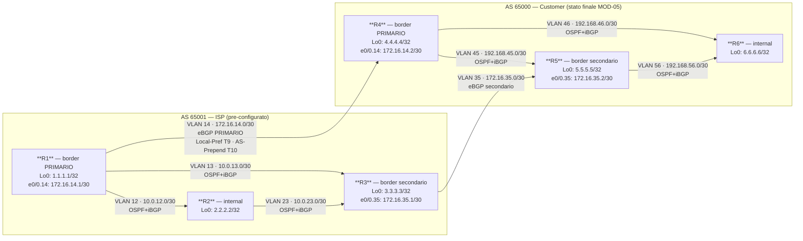

# Workbook Studenti — MOD-06: BGP Traffic Engineering

> **Piattaforme supportate:** GNS3 · ContainerLab (vrnetlab/IOU) · EVE-NG
> Le configurazioni iniziali sono integrate nel workbook — caricamento via paste manuale.

**Area:** AREA 2 — BGP | **Ore:** 2h | **Codici syllabus:** 1.11.c · 1.11.d · 1.11.e

---

## 1. TOPOLOGIA

### Diagramma Logico



### Piano di Indirizzamento

Identico a MOD-05. Riferirsi alla sezione 1 di MOD-05 per la tabella completa.

#### Riepilogo link eBGP (i piu' rilevanti per il TE)

| Collegamento | VLAN | IP Lato ISP | IP Lato Customer | Priorita' preferita |
|---|---|---|---|---|
| R1 — R4 | 14 | 172.16.14.1 (R1) | 172.16.14.2 (R4) | **PRIMARIO** |
| R3 — R5 | 35 | 172.16.35.1 (R3) | 172.16.35.2 (R5) | Secondario (backup) |

---

## 2. OBIETTIVI DELLA SESSIONE

Al termine di questo modulo lo studente sarà in grado di:

- [ ] Propagare una default route dall'ISP verso il Customer con due tecniche distinte
- [ ] Comprendere e applicare **Local Preference** per influenzare il traffico uscente dall'AS
- [ ] Comprendere e applicare **AS-Path Prepend** per influenzare il traffico entrante nell'AS
- [ ] Configurare e usare le **BGP Community** per la comunicazione di policy tra AS diversi
- [ ] Distinguere con precisione quando usare ciascun attributo BGP per il Traffic Engineering

**Codici syllabus coperti:** 1.11.c · 1.11.d · 1.11.e

**Prerequisiti:** MOD-05 completato. Tutti i peering BGP (iBGP full-mesh in entrambi gli AS, eBGP R1↔R4 e R3↔R5) devono essere in stato Established.

---

## 3. LAB SETUP

### Stato iniziale atteso (eredita' da MOD-05)

| Elemento | Router | Stato |
|---|---|---|
| Interfacce + loopback | Tutti | Operativo |
| OSPF 1 (link interni + loopback) | R1–R6 | Operativo |
| iBGP full-mesh | R1/R2/R3 (AS65001), R4/R5/R6 (AS65000) | Operativo |
| eBGP R1 ↔ R4 | R1, R4 | Established |
| eBGP R3 ↔ R5 | R3, R5 | Established |
| Annunci BGP Customer | R4 | 4.4.4.4/32 e 192.168.45.0/30 via network stmt |

### Configurazione Iniziale

Incollare manualmente la configurazione su ogni device (paste diretto in CLI).
Questi file rappresentano lo stato finale di MOD-05 (tutti i peering BGP operativi).

#### R1

```
! MOD-06 cfg iniziale — R1 (AS 65001 — ISP border verso R4)
! STATO FINALE MOD-05: OSPF 1 + iBGP full-mesh + eBGP R1↔R4 operativo
! Nessuna route-map / prefix-list / community / local-pref configurati
!
hostname R1
no ip domain-lookup
!
interface ethernet 0/0
 no ip address
 no shutdown
!
interface ethernet 0/0.12
 encapsulation dot1Q 12
 ip address 10.0.12.1 255.255.255.252
 description ISP_Internal_R1-R2
 no shutdown
!
interface ethernet 0/0.13
 encapsulation dot1Q 13
 ip address 10.0.13.1 255.255.255.252
 description ISP_Internal_R1-R3
 no shutdown
!
interface ethernet 0/0.14
 encapsulation dot1Q 14
 ip address 172.16.14.1 255.255.255.252
 description eBGP_to_R4_AS65000
 no shutdown
!
interface loopback 0
 ip address 1.1.1.1 255.255.255.255
 description Router-ID_and_iBGP_source
 no shutdown
!
router ospf 1
 router-id 1.1.1.1
 network 1.1.1.1 0.0.0.0 area 0
 network 10.0.12.0 0.0.0.3 area 0
 network 10.0.13.0 0.0.0.3 area 0
 passive-interface Loopback0
!
router bgp 65001
 bgp router-id 1.1.1.1
 neighbor 2.2.2.2 remote-as 65001
 neighbor 2.2.2.2 update-source Loopback0
 neighbor 2.2.2.2 next-hop-self
 neighbor 3.3.3.3 remote-as 65001
 neighbor 3.3.3.3 update-source Loopback0
 neighbor 3.3.3.3 next-hop-self
 neighbor 172.16.14.2 remote-as 65000
 network 1.1.1.1 mask 255.255.255.255
!
end
```

#### R2

```
! MOD-06 cfg iniziale — R2 (AS 65001 — ISP internal)
! STATO FINALE MOD-05: OSPF 1 + iBGP full-mesh operativo
!
hostname R2
no ip domain-lookup
!
interface ethernet 0/0
 no ip address
 no shutdown
!
interface ethernet 0/0.12
 encapsulation dot1Q 12
 ip address 10.0.12.2 255.255.255.252
 description ISP_Internal_R1-R2
 no shutdown
!
interface ethernet 0/0.23
 encapsulation dot1Q 23
 ip address 10.0.23.1 255.255.255.252
 description ISP_Internal_R2-R3
 no shutdown
!
interface loopback 0
 ip address 2.2.2.2 255.255.255.255
 description Router-ID_and_iBGP_source
 no shutdown
!
router ospf 1
 router-id 2.2.2.2
 network 2.2.2.2 0.0.0.0 area 0
 network 10.0.12.0 0.0.0.3 area 0
 network 10.0.23.0 0.0.0.3 area 0
 passive-interface Loopback0
!
router bgp 65001
 bgp router-id 2.2.2.2
 neighbor 1.1.1.1 remote-as 65001
 neighbor 1.1.1.1 update-source Loopback0
 neighbor 1.1.1.1 next-hop-self
 neighbor 3.3.3.3 remote-as 65001
 neighbor 3.3.3.3 update-source Loopback0
 neighbor 3.3.3.3 next-hop-self
 network 2.2.2.2 mask 255.255.255.255
!
end
```

#### R3

```
! MOD-06 cfg iniziale — R3 (AS 65001 — ISP border verso R5)
! STATO FINALE MOD-05: OSPF 1 + iBGP full-mesh + eBGP R3↔R5 operativo (T3 completato)
! Nessuna route-map / community / local-pref configurati
!
hostname R3
no ip domain-lookup
!
interface ethernet 0/0
 no ip address
 no shutdown
!
interface ethernet 0/0.13
 encapsulation dot1Q 13
 ip address 10.0.13.2 255.255.255.252
 description ISP_Internal_R1-R3
 no shutdown
!
interface ethernet 0/0.23
 encapsulation dot1Q 23
 ip address 10.0.23.2 255.255.255.252
 description ISP_Internal_R2-R3
 no shutdown
!
interface ethernet 0/0.35
 encapsulation dot1Q 35
 ip address 172.16.35.1 255.255.255.252
 description eBGP_to_R5_AS65000
 no shutdown
!
interface loopback 0
 ip address 3.3.3.3 255.255.255.255
 description Router-ID_and_iBGP_source
 no shutdown
!
router ospf 1
 router-id 3.3.3.3
 network 3.3.3.3 0.0.0.0 area 0
 network 10.0.13.0 0.0.0.3 area 0
 network 10.0.23.0 0.0.0.3 area 0
 passive-interface Loopback0
!
router bgp 65001
 bgp router-id 3.3.3.3
 neighbor 1.1.1.1 remote-as 65001
 neighbor 1.1.1.1 update-source Loopback0
 neighbor 1.1.1.1 next-hop-self
 neighbor 2.2.2.2 remote-as 65001
 neighbor 2.2.2.2 update-source Loopback0
 neighbor 2.2.2.2 next-hop-self
 neighbor 172.16.35.2 remote-as 65000
 network 3.3.3.3 mask 255.255.255.255
!
end
```

#### R4

```
! MOD-06 cfg iniziale — R4 (AS 65000 — Customer border verso R1)
! STATO FINALE MOD-05: OSPF 1 + iBGP full-mesh + eBGP R1↔R4 operativo
! Nessuna route-map / prefix-list / community / local-pref configurati
!
hostname R4
no ip domain-lookup
!
interface ethernet 0/0
 no ip address
 no shutdown
!
interface ethernet 0/0.14
 encapsulation dot1Q 14
 ip address 172.16.14.2 255.255.255.252
 description eBGP_to_R1_AS65001
 no shutdown
!
interface ethernet 0/0.45
 encapsulation dot1Q 45
 ip address 192.168.45.1 255.255.255.252
 description Customer_Internal_R4-R5
 no shutdown
!
interface ethernet 0/0.46
 encapsulation dot1Q 46
 ip address 192.168.46.1 255.255.255.252
 description Customer_Internal_R4-R6
 no shutdown
!
interface loopback 0
 ip address 4.4.4.4 255.255.255.255
 description Router-ID_iBGP_source_AS65000
 no shutdown
!
router ospf 1
 router-id 4.4.4.4
 network 4.4.4.4 0.0.0.0 area 0
 network 192.168.45.0 0.0.0.3 area 0
 network 192.168.46.0 0.0.0.3 area 0
 passive-interface Loopback0
!
router bgp 65000
 bgp router-id 4.4.4.4
 neighbor 172.16.14.1 remote-as 65001
 neighbor 5.5.5.5 remote-as 65000
 neighbor 5.5.5.5 update-source Loopback0
 neighbor 5.5.5.5 next-hop-self
 neighbor 6.6.6.6 remote-as 65000
 neighbor 6.6.6.6 update-source Loopback0
 neighbor 6.6.6.6 next-hop-self
 network 4.4.4.4 mask 255.255.255.255
 network 192.168.45.0 mask 255.255.255.252
!
end
```

#### R5

```
! MOD-06 cfg iniziale — R5 (AS 65000 — Customer border verso R3)
! STATO FINALE MOD-05: OSPF 1 + iBGP full-mesh + eBGP R3↔R5 operativo
! Nessuna route-map / prefix-list / community / local-pref configurati
!
hostname R5
no ip domain-lookup
!
interface ethernet 0/0
 no ip address
 no shutdown
!
interface ethernet 0/0.35
 encapsulation dot1Q 35
 ip address 172.16.35.2 255.255.255.252
 description eBGP_to_R3_AS65001
 no shutdown
!
interface ethernet 0/0.45
 encapsulation dot1Q 45
 ip address 192.168.45.2 255.255.255.252
 description Customer_Internal_R4-R5
 no shutdown
!
interface ethernet 0/0.56
 encapsulation dot1Q 56
 ip address 192.168.56.1 255.255.255.252
 description Customer_Internal_R5-R6
 no shutdown
!
interface loopback 0
 ip address 5.5.5.5 255.255.255.255
 description Router-ID_iBGP_source_AS65000
 no shutdown
!
router ospf 1
 router-id 5.5.5.5
 network 5.5.5.5 0.0.0.0 area 0
 network 192.168.45.0 0.0.0.3 area 0
 network 192.168.56.0 0.0.0.3 area 0
 passive-interface Loopback0
!
router bgp 65000
 bgp router-id 5.5.5.5
 neighbor 4.4.4.4 remote-as 65000
 neighbor 4.4.4.4 update-source Loopback0
 neighbor 4.4.4.4 next-hop-self
 neighbor 6.6.6.6 remote-as 65000
 neighbor 6.6.6.6 update-source Loopback0
 neighbor 6.6.6.6 next-hop-self
 neighbor 172.16.35.1 remote-as 65001
!
end
```

#### R6

```
! MOD-06 cfg iniziale — R6 (AS 65000 — Customer internal)
! STATO FINALE MOD-05: OSPF 1 + iBGP full-mesh operativo
! Nessuna route-map / prefix-list / community / local-pref configurati
!
hostname R6
no ip domain-lookup
!
interface ethernet 0/0
 no ip address
 no shutdown
!
interface ethernet 0/0.46
 encapsulation dot1Q 46
 ip address 192.168.46.2 255.255.255.252
 description Customer_Internal_R4-R6
 no shutdown
!
interface ethernet 0/0.56
 encapsulation dot1Q 56
 ip address 192.168.56.2 255.255.255.252
 description Customer_Internal_R5-R6
 no shutdown
!
interface loopback 0
 ip address 6.6.6.6 255.255.255.255
 description Router-ID_iBGP_source_AS65000
 no shutdown
!
router ospf 1
 router-id 6.6.6.6
 network 6.6.6.6 0.0.0.0 area 0
 network 192.168.46.0 0.0.0.3 area 0
 network 192.168.56.0 0.0.0.3 area 0
 passive-interface Loopback0
!
router bgp 65000
 bgp router-id 6.6.6.6
 neighbor 4.4.4.4 remote-as 65000
 neighbor 4.4.4.4 update-source Loopback0
 neighbor 4.4.4.4 next-hop-self
 neighbor 5.5.5.5 remote-as 65000
 neighbor 5.5.5.5 update-source Loopback0
 neighbor 5.5.5.5 next-hop-self
!
end
```

### Verifica pre-lab

```
! Su R1 — tutti i peering devono essere Established
R1# show ip bgp summary

! Su R4 — idem
R4# show ip bgp summary

! Su R1 — deve vedere 4.4.4.4/32 da AS65000
R1# show ip bgp 4.4.4.4

! Su R4 — deve vedere 1.1.1.1/32 da AS65001
R4# show ip bgp 1.1.1.1
```

Output atteso (`show ip bgp summary` su R1):
```
Neighbor        V    AS MsgRcvd MsgSent   TblVer  InQ OutQ Up/Down  State/PfxRcd
2.2.2.2         4 65001      xx      xx        x    0    0  xx:xx:xx        x
3.3.3.3         4 65001      xx      xx        x    0    0  xx:xx:xx        x
172.16.14.2     4 65000      xx      xx        x    0    0  xx:xx:xx        2
```

---

## 4. TASK LIST

| # | Task | Codici syllabus | Tempo stimato |
|---|---|---|---|
| T7 | Default route ISP → Customer: Metodo 1 (`network 0.0.0.0`) | 1.11.c | 15 min |
| T8 | Default route ISP → Customer: Metodo 2 (`default-originate`) | 1.11.c | 15 min |
| T9 | Local Preference — preferenza uscita AS65000 via R4↔R1 | 1.11.d | 20 min |
| T10 | AS-Path Prepend — preferenza ingresso AS65000 via R1↔R4 | 1.11.d | 20 min |
| T-EXTRA | BGP Community — coordinamento policy inter-AS | 1.11.e | 20 min |

**Tempo totale: ~90 min** (buffer: 30 min per discussione)

---

## 5. DETTAGLIO TASK

---

### T7 — Default Route ISP → Customer: Metodo 1 (network 0.0.0.0)

#### TEORIA

**Perche' la default route?**

Il Customer (AS 65000) non ha necessita' di ricevere la full Internet routing table dall'ISP. E' sufficiente ricevere una **default route** (0.0.0.0/0) che punta all'ISP. Questo riduce la complessita' e il consumo di memoria BGP sul Customer.

**Metodo 1 — `network 0.0.0.0`:**

Inserisce 0.0.0.0/0 nella BGP table con Origin IGP (i). Precondizione: deve esistere una route 0.0.0.0/0 nella routing table del router ISP (es. una route statica verso un next-hop upstream). Il comando e' globale: la default viene annunciata a TUTTI i neighbor automaticamente.

```
ip route 0.0.0.0 0.0.0.0 Null0   ! route statica fittizia per soddisfare il prerequisito
router bgp 65001
 network 0.0.0.0                  ! nota: nessuna mask = /0
```

> **Attenzione:** la route statica verso Null0 e' una pratica comune nei lab per generare il prefisso 0.0.0.0/0 nella routing table senza un vero uplink. In produzione, la default esisterebbe gia'.

#### TASK

Configurare su R1 (ISP border verso R4) per annunciare la default route al Customer:

```
R1# configure terminal

! Creare la route statica 0.0.0.0/0 fittizia (prerequisito per il network stmt)
R1(config)# ip route 0.0.0.0 0.0.0.0 Null0

! Annunciare 0.0.0.0/0 via BGP
R1(config)# router bgp 65001
R1(config-router)# network 0.0.0.0
R1(config-router)# end
```

#### VERIFICA

```
! Su R1 — verifica che 0.0.0.0/0 sia nella BGP table con origin i
R1# show ip bgp 0.0.0.0

! Su R4 — verifica che riceva la default route via BGP
R4# show ip bgp 0.0.0.0
R4# show ip route 0.0.0.0

! Su R5, R6 — verifica propagazione via iBGP
R5# show ip bgp 0.0.0.0
```

Output atteso (`show ip bgp 0.0.0.0` su R4):
```
BGP routing table entry for 0.0.0.0/0, version x
Paths: (1 available, best #1, table default)
  172.16.14.1 from 172.16.14.1 (1.1.1.1)
    Origin IGP, metric 0, localpref 100, valid, external, best
```

---

### T8 — Default Route ISP → Customer: Metodo 2 (default-originate)

#### TEORIA

**Metodo 2 — `neighbor X default-originate`:**

Invia una default route sintetica al neighbor specificato **senza che esista** 0.0.0.0/0 nella routing table locale. BGP genera il prefisso "al volo" solo per quel neighbor.

**Differenze chiave rispetto al Metodo 1:**

| Caratteristica | Metodo 1 (network 0.0.0.0) | Metodo 2 (default-originate) |
|---|---|---|
| Prerequisito routing table | Si (0.0.0.0/0 deve esistere) | No |
| Scope | Annunciata a tutti i neighbor | Solo al neighbor specificato |
| Origin | IGP (i) | IGP (i) |
| Visibile in `show ip bgp` locale? | Si | No (sintetica, non entra in tabella locale) |
| Condizionale con route-map? | No | Si (con `default-originate route-map`) |

**Scenario pratico:** l'ISP vuole mandare la default solo a R4 via il link VLAN14, e solo a R5 via il link VLAN35 (controllo granulare per neighbor).

#### TASK

Prima rimuovere il Metodo 1 per evitare sovrapposizioni:

```
R1# configure terminal
R1(config)# router bgp 65001
R1(config-router)# no network 0.0.0.0
R1(config-router)# end
R1(config)# no ip route 0.0.0.0 0.0.0.0 Null0
```

Ora configurare default-originate su R1 verso R4, e su R3 verso R5:

**R1** (default verso R4):
```
R1# configure terminal
R1(config)# router bgp 65001
R1(config-router)# neighbor 172.16.14.2 default-originate
R1(config-router)# end
```

**R3** (default verso R5):
```
R3# configure terminal
R3(config)# router bgp 65001
R3(config-router)# neighbor 172.16.35.2 default-originate
R3(config-router)# end
```

#### VERIFICA

```
! Su R1 — la default NON appare nella BGP table locale (e' sintetica)
R1# show ip bgp

! Su R4 — la default APPARE come ricevuta da R1
R4# show ip bgp 0.0.0.0
R4# show ip route 0.0.0.0

! Su R5 — la default APPARE come ricevuta da R3
R5# show ip bgp 0.0.0.0

! Verifica dettaglio neighbor: cerca la riga "Default information originated"
R1# show ip bgp neighbors 172.16.14.2 | include Default
```

Output atteso (`show ip bgp neighbors 172.16.14.2 | include Default` su R1):
```
  Default information originated, sending 0.0.0.0/0 to this neighbor
```

---

### T9 — Local Preference: controllo del traffico uscente da AS65000

#### TEORIA

**Che cos'e' Local Preference?**

Local Preference e' un attributo BGP **well-known discretionary** che controlla quale path viene preferito per **uscire dall'AS** (outbound traffic dal punto di vista del Customer).

**Regole fondamentali:**
- Propagato solo via **iBGP** (non attraversa mai i confini AS)
- Default: **100**
- **HIGHER wins** (valore piu' alto = preferito)
- Si posiziona al **2° posto** nell'algoritmo BGP best-path (dopo Weight, che e' Cisco-proprietary)

**Scenario:** AS65000 (Customer) ha due uscite verso Internet:
- Via R4 ↔ R1 (VLAN 14) — vogliamo sia **PRIMARIA**
- Via R5 ↔ R3 (VLAN 35) — vogliamo sia **BACKUP**

**Soluzione:** R4 imposta Local Preference = 200 sulle route ricevute da R1. R5 lascia Local Preference = 100 (default) sulle route ricevute da R3. Tutti i router iBGP in AS65000 preferiscono il path via R4 (200 > 100).

**Come funziona il flusso:**
```
R1 annuncia 1.1.1.1/32 → R4 riceve via eBGP → R4 applica route-map in: set local-pref 200
R4 propaga via iBGP a R5, R6 con LocPrf=200
R3 annuncia 1.1.1.1/32 → R5 riceve via eBGP → LocPrf rimane 100 (default)
R5 propaga via iBGP a R4, R6 con LocPrf=100
R6 ha due path: via R4 (200) e via R5 (100) → sceglie R4 → traffico esce via R4↔R1
```

#### TASK

Configurare una route-map su R4 che imposta Local Preference = 200 per tutte le route ricevute da R1 via eBGP:

```
R4# configure terminal

! Creare la route-map che alza il Local Preference
R4(config)# route-map SET-LP-HIGH permit 10
R4(config-route-map)# set local-preference 200
R4(config-route-map)# exit

! Applicare inbound sulle route ricevute da R1
R4(config)# router bgp 65000
R4(config-router)# neighbor 172.16.14.1 route-map SET-LP-HIGH in
R4(config-router)# end

! Applicare il soft reset per ri-processare le route gia' ricevute
R4# clear ip bgp 172.16.14.1 soft in
```

#### VERIFICA

```
! Su R4 — colonna LocPrf: 200 per route via R1, 100 per route via R5 (da R3)
R4# show ip bgp

! Verifica best path per 1.1.1.1/32: deve scegliere il path via 172.16.14.1 (R1)
R4# show ip bgp 1.1.1.1

! Su R6 — deve preferire il path via R4 (LocPrf 200) anziche' via R5 (LocPrf 100)
R6# show ip bgp 1.1.1.1
```

Output atteso (`show ip bgp 1.1.1.1` su R4):
```
BGP routing table entry for 1.1.1.1/32, version x
Paths: (2 available, best #1, table default)
  Advertised to update-groups:
     ...
  65001
    172.16.14.1 from 172.16.14.1 (1.1.1.1)
      Origin IGP, metric 0, localpref 200, valid, external, best
  65001
    172.16.35.1 from 5.5.5.5 (5.5.5.5)
      Origin IGP, metric 0, localpref 100, valid, internal
```

> `best` indica il path selezionato. Local Preference 200 > 100 → R1↔R4 vince.

Output atteso (`show ip bgp` su R4, parziale):
```
   Network          Next Hop            Metric LocPrf Weight Path
*> 1.1.1.1/32       172.16.14.1              0    200      0 65001 i
*  1.1.1.1/32       5.5.5.5                  0    100      0 65001 i
*> 0.0.0.0          172.16.14.1                   200      0 65001 i
```

---

### T10 — AS-Path Prepend: controllo del traffico entrante in AS65000

#### TEORIA

**Che cos'e' AS-Path Prepend?**

AS-Path Prepend e' una tecnica per influenzare il traffico **entrante nell'AS** (inbound traffic). Funziona aggiungendo artificialmente copie del proprio AS number all'AS-Path degli annunci eBGP uscenti.

**Regola BGP:** a parita' di altri attributi, viene preferito il path con **AS-Path piu' CORTO** (fewer hops).

**Scenario:** ISP (AS65001) riceve annunci del prefisso Customer (es. 192.168.45.0/30) da due path:
- Via R4 → R1: AS-Path = `65000` (lunghezza 1)
- Via R5 → R3: AS-Path = `65000` (lunghezza 1) — stesso!

Senza prepend, l'ISP potrebbe scegliere casualmente uno dei due path. Con il prepend sul link R5↔R3, l'AS-Path diventa `65000 65000 65000` (lunghezza 3) → l'ISP preferisce entrare via R1↔R4.

**Come funziona il flusso:**
```
R5 annuncia 192.168.45.0/30 a R3 → route-map out: set as-path prepend 65000 65000
R3 riceve AS-Path = "65000 65000 65000"
R1 riceve AS-Path = "65000" (no prepend)
Router ISP vede: path via R1 e' piu' corto → traffico Internet entra via R1↔R4
```

> **Attenzione alla direzione:** il prepend si configura sul Customer, outbound verso l'ISP, sul link che si vuole rendere MENO preferito. Si aggiunge il proprio AS number (65000).

#### TASK

Configurare AS-Path Prepend su R5 per rendere il link R5↔R3 meno preferito dall'ISP:

```
R5# configure terminal

! Creare la route-map con il prepend
R5(config)# route-map PREPEND permit 10
R5(config-route-map)# set as-path prepend 65000 65000
R5(config-route-map)# exit

! Applicare outbound verso R3 (ISP border)
R5(config)# router bgp 65000
R5(config-router)# neighbor 172.16.35.1 route-map PREPEND out
R5(config-router)# end

! Soft reset per propagare immediatamente
R5# clear ip bgp 172.16.35.1 soft out
```

#### VERIFICA

```
! Su R3 — verifica l'AS-Path ricevuto da R5: deve essere "65000 65000 65000"
R3# show ip bgp 192.168.45.0
R3# show ip bgp neighbors 172.16.35.2 routes

! Su R1 — verifica l'AS-Path ricevuto da R4: deve essere "65000" (senza prepend)
R1# show ip bgp 192.168.45.0

! Su R2 — riceve entrambi i path via iBGP: deve preferire quello via R1 (AS-Path piu' corto)
R2# show ip bgp 192.168.45.0
```

Output atteso (`show ip bgp 192.168.45.0` su R2):
```
BGP routing table entry for 192.168.45.0/30, version x
Paths: (2 available, best #1, table default)
  65000
    172.16.14.2 from 1.1.1.1 (1.1.1.1)
      Origin IGP, metric 0, localpref 100, valid, internal, best
  65000 65000 65000
    172.16.35.2 from 3.3.3.3 (3.3.3.3)
      Origin IGP, metric 0, localpref 100, valid, internal
```

> Il path con AS-Path `65000 65000 65000` (lunghezza 3) perde contro `65000` (lunghezza 1).

---

### T-EXTRA — BGP Community: coordinamento policy inter-AS

#### TEORIA

**Che cosa sono le BGP Community?**

Le Community sono un attributo BGP opzionale che permette di **taggare** un prefisso con un'informazione semantica. Questo tag puo' poi essere matchato da un altro router per applicare policy automaticamente.

**Formato Community:**
- **Standard**: 32-bit, formato `AA:NN` dove AA = AS number, NN = valore locale
- Abilitare il formato leggibile: `ip bgp-community new-format`
- Senza questo comando, il valore appare come numero intero (es. `4259840100` invece di `65000:100`)

**Community well-known (senza AS prefix):**

| Community | Significato |
|---|---|
| `no-export` | Non annunciare a nessun peer eBGP |
| `no-advertise` | Non annunciare a nessun peer (ne' iBGP ne' eBGP) |
| `local-AS` | Non esportare fuori dal proprio sub-AS (CONFED) |

**Scenario pratico:**

Il Customer (AS65000) vuole comunicare all'ISP: "Quando ricevi questo prefisso via il link di backup (R5↔R3), aggiungi un prepend di 2 hop per rendermi meno preferito". Il Customer tagga il prefisso con community `65000:200`. L'ISP ha una policy: se vede community `65000:200`, applica `set as-path prepend 65001 65001`.

Questo consente al Customer di **delegare** le decisioni di traffic engineering all'ISP senza configurare nulla direttamente sui router ISP ogni volta.

#### TASK

**Passo 1 — Abilitare il formato AA:NN su tutti i router**
```
! Eseguire su tutti i router per leggibilita'
(config)# ip bgp-community new-format
```

**Passo 2 — Customer R5: taggare annunci verso R3 con community 65000:200**
```
R5# configure terminal

! Aggiornare la route-map PREPEND (o crearne una nuova) per aggiungere community
R5(config)# route-map PREPEND permit 10
R5(config-route-map)# set community 65000:200
R5(config-route-map)# set as-path prepend 65000 65000
R5(config-route-map)# exit

R5(config-router)# end
R5# clear ip bgp 172.16.35.1 soft out
```

**Passo 3 — ISP R3: matchare la community e applicare prepend aggiuntivo**
```
R3# configure terminal

! Definire la community-list per matchare il tag del Customer
R3(config)# ip community-list standard CUST-TE permit 65000:200

! Route-map: se community 65000:200, aggiunge prepend lato ISP
R3(config)# route-map APPLY-PREPEND permit 10
R3(config-route-map)# match community CUST-TE
R3(config-route-map)# set as-path prepend 65001 65001
R3(config-route-map)# exit

! Permit catch-all per non filtrare altri prefissi
R3(config)# route-map APPLY-PREPEND permit 20
R3(config-route-map)# exit

! Applicare inbound sulle route ricevute da R5
R3(config)# router bgp 65001
R3(config-router)# neighbor 172.16.35.2 route-map APPLY-PREPEND in
R3(config-router)# end

R3# clear ip bgp 172.16.35.2 soft in
```

> **Nota:** `send-community` e' abilitato di default su IOS per eBGP in alcune versioni, ma in produzione va dichiarato esplicitamente:
> ```
> R5(config-router)# neighbor 172.16.35.1 send-community
> ```

#### VERIFICA

```
! Su R3 — verifica che veda la community sul prefisso ricevuto da R5
R3# show ip bgp 192.168.45.0

! Su R1 — verifica AS-Path: path via R3 deve ora avere prepend aggiuntivo
R1# show ip bgp 192.168.45.0

! Confronto finale su R2 (router ISP internal): best path deve essere via R1
R2# show ip bgp 192.168.45.0
```

Output atteso (`show ip bgp 192.168.45.0` su R3, parziale):
```
  65000 65000 65000
    172.16.35.2 from 172.16.35.2 (5.5.5.5)
      Origin IGP, metric 0, localpref 100, valid, external
      Community: 65000:200
```

Output atteso (`show ip bgp 192.168.45.0` su R1 dopo il prepend ISP):
```
  65001 65001 65000 65000 65000
    3.3.3.3 from 3.3.3.3 (3.3.3.3)
      Origin IGP, ...
  65000
    172.16.14.2 from 172.16.14.2 (4.4.4.4)
      Origin IGP, ... best
```

---

## 6. TROUBLESHOOTING GUIDE

| Sintomo | Causa probabile | Diagnosi | Fix |
|---|---|---|---|
| **Local Preference non si propaga** | `set local-preference` applicato outbound invece che inbound; o route-map non applicata | `show ip bgp 1.1.1.1` su R4 — colonna LocPrf mostra ancora 100 | Verificare che `route-map SET-LP-HIGH in` sia sul neighbor eBGP; `clear soft in` |
| **Local Preference corretto su R4 ma non su R6** | `next-hop-self` mancante → R6 non installa la route via R4 | `show ip bgp 1.1.1.1` su R6 — vede solo path con next-hop irraggiungibile | Aggiungere `neighbor X next-hop-self` su R4/R5 verso i peer iBGP |
| **AS-Path Prepend non visibile su R1** | `send-community` non configurato (diverso problema); route-map applicata inbound anziche' outbound | `show ip bgp neighbors 172.16.35.2 advertised-routes` su R5 — AS-Path corto? | Verificare `route-map PREPEND out` (non `in`); `clear soft out` |
| **default-originate non appare su R4** | Il neighbor R4 ha una policy inbound che filtra 0.0.0.0/0 | `show ip bgp 0.0.0.0` su R4 — assente | Verificare prefix-list inbound su R4; aggiungere `permit 0.0.0.0/0` |
| **Community non visibile su R3** | `send-community` mancante su R5 verso R3 | `show ip bgp 192.168.45.0` su R3 — nessuna riga Community | Aggiungere `neighbor 172.16.35.1 send-community` su R5 |
| **Route-map applica prepend a tutti i prefissi** | Manca il `match community` nella route-map ISP; permit 10 senza match matcha tutto | `show ip bgp` su R3 — tutti i prefissi AS65000 hanno AS-Path lungo | Aggiungere `match community CUST-TE` alla seq 10; inserire seq 20 permit catch-all |
| **`show ip bgp` mostra community come numero intero** | `ip bgp-community new-format` non configurato | Output: `Community: 4259840200` invece di `65000:200` | `ip bgp-community new-format` in config globale su quel router |

---

## 7. SOLUZIONI

> **SEZIONE IN SVILUPPO** — Le soluzioni complete commentate saranno disponibili nel file `soluzione.md` di questo modulo.

---

## 8. RIEPILOGO & EXAM TIPS

### Mappa concettuale: quale attributo per quale scopo?

```
Voglio controllare il traffico USCENTE dal mio AS?
  → Local Preference (attributo iBGP, higher wins, default 100)
  → Si configura INBOUND sul border router che riceve la route eBGP

Voglio controllare il traffico ENTRANTE nel mio AS?
  → AS-Path Prepend (attributo eBGP, shorter wins)
  → Si configura OUTBOUND verso il peer eBGP sul link da rendere MENO preferito

Voglio comunicare policy a un altro AS in modo automatico?
  → BGP Community (tag 32-bit, formato AA:NN)
  → Richiede accordo con il peer + send-community abilitato
```

### Punti chiave

1. **Local Preference** e' propagato solo via iBGP — non esce mai dall'AS. Agisce sul traffico **uscente** (chi sceglie il path per andare fuori dall'AS).
2. **AS-Path Prepend** e' visibile ai router degli AS vicini — agisce sul traffico **entrante** (gli altri AS scelgono un path piu' corto verso di te).
3. **default-originate** e' piu' granulare di `network 0.0.0.0`: si applica solo al neighbor specificato e non richiede la presence di 0.0.0.0/0 nella routing table locale.
4. Le **Community well-known** (`no-export`, `no-advertise`) sono strumenti potenti per limitare la propagazione di prefissi senza route-map complesse.
5. L'algoritmo BGP best-path valuta gli attributi in ordine: Weight → Local Preference → AS-Path locale → Origin → MED → eBGP vs iBGP → IGP metric → ...

### Exam Tips CCNP ENCOR

> Le seguenti domande sono tipiche del formato esame 350-401:

1. Un ingegnere configura `set local-preference 200` su R4 per le route ricevute via eBGP. Quale traffico viene influenzato?
   - a) Traffico in ingresso nell'AS65000 da Internet
   - **b) Traffico in uscita dall'AS65000 verso Internet**
   - c) Traffico tra i router iBGP dell'AS65000
   - d) Solo il traffico verso il prefisso 1.1.1.1/32

2. L'ISP riceve lo stesso prefisso Customer da due path con AS-Path `65000` e `65000 65000 65000`. Quale path seleziona l'ISP (a parita' di tutti gli altri attributi)?
   - **a) Il path con AS-Path `65000`** (piu' corto)
   - b) Il path con AS-Path `65000 65000 65000` (piu' lungo = piu' specifico)
   - c) Dipende dalla Local Preference dell'ISP
   - d) Viene fatto load-balancing tra i due path

3. Un operatore vuole che l'ISP non ri-annunci un proprio prefisso ad altri AS. Quale community deve taggare sul prefisso?
   - a) `local-AS`
   - b) `no-advertise`
   - **c) `no-export`**
   - d) `65000:0`

4. Qual e' la differenza principale tra `neighbor X default-originate` e `network 0.0.0.0`?
   - a) Nessuna differenza pratica
   - b) `network 0.0.0.0` richiede che l'AS abbia un uplink reale verso Internet
   - **c) `default-originate` non richiede 0.0.0.0/0 nella routing table locale e si applica solo al neighbor specificato**
   - d) `default-originate` funziona solo su iBGP

5. Un ingegnere applica `route-map PREPEND out` su R5 verso R3, ma R1 vede ancora AS-Path corto per il prefisso Customer. Quale e' la causa piu' probabile?
   - a) La route-map deve essere applicata `in` anziche' `out`
   - **b) Il soft reset non e' stato eseguito: `clear ip bgp 172.16.35.1 soft out`**
   - c) L'AS-Path Prepend funziona solo su iBGP
   - d) Il prepend e' troppo lungo (serve massimo 1 hop)


---

> © 2026 Matteo Mirenda — Tutti i diritti riservati.
> Materiale ad uso esclusivo degli studenti iscritti al corso.
> Vietata la riproduzione, distribuzione o condivisione
> senza autorizzazione scritta dell'autore.
> CCNP ENCOR 350-401 

---
