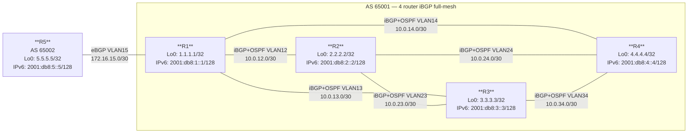
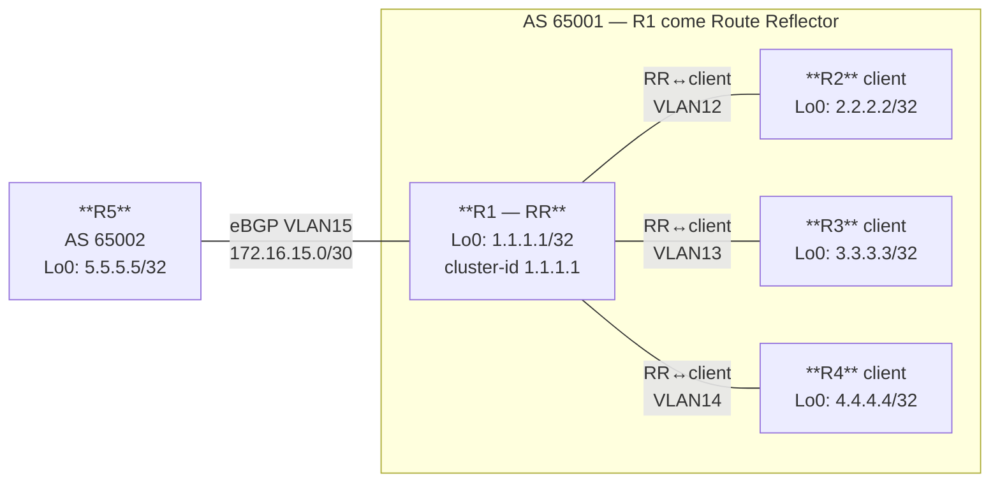

# Workbook Studenti — MOD-07: BGP Route Reflector & IPv6 BGP

**Area:** AREA 2 — BGP | **Ore:** 1.5h | **Codici syllabus:** 1.11.d · 1.11.f

**Piattaforme supportate:** GNS3 · ContainerLab (vrnetlab/IOU) · EVE-NG

---

## 1. TOPOLOGIA

### Diagramma Logico — Stato Iniziale (iBGP Full-Mesh)



### Diagramma Logico — Stato Finale (Route Reflector)



### Piano di Indirizzamento

Tutti i router collegano via `Ethernet0/0` a uno switch GNS3. I link logici usano sub-interface 802.1Q. Convenzione VLAN: concatenazione dei numeri dei due router (R1-R2 → VLAN 12).

#### Link interni AS 65001 (OSPF + iBGP)

| Collegamento | VLAN | IP Lato A | IP Lato B |
|---|---|---|---|
| R1 — R2 | 12 | 10.0.12.1/30 | 10.0.12.2/30 |
| R1 — R3 | 13 | 10.0.13.1/30 | 10.0.13.2/30 |
| R1 — R4 | 14 | 10.0.14.1/30 | 10.0.14.2/30 |
| R2 — R3 | 23 | 10.0.23.1/30 | 10.0.23.2/30 |
| R2 — R4 | 24 | 10.0.24.1/30 | 10.0.24.2/30 |
| R3 — R4 | 34 | 10.0.34.1/30 | 10.0.34.2/30 |

#### Link eBGP inter-AS

| Collegamento | VLAN | IP R1 | IP R5 |
|---|---|---|---|
| R1 — R5 | 15 | 172.16.15.1/30 | 172.16.15.2/30 |

#### Loopback e identificatori

| Router | IPv4 Loopback | IPv6 Loopback | AS | Ruolo |
|---|---|---|---|---|
| R1 | 1.1.1.1/32 | 2001:db8:1::1/128 | 65001 | Route Reflector |
| R2 | 2.2.2.2/32 | 2001:db8:2::2/128 | 65001 | RR Client |
| R3 | 3.3.3.3/32 | 2001:db8:3::3/128 | 65001 | RR Client |
| R4 | 4.4.4.4/32 | 2001:db8:4::4/128 | 65001 | RR Client |
| R5 | 5.5.5.5/32 | 2001:db8:5::5/128 | 65002 | eBGP peer |

---

## 2. OBIETTIVI DELLA SESSIONE

Al termine di questo modulo lo studente sarà in grado di:

- [ ] Calcolare il numero di sessioni iBGP in un full-mesh e spiegare il problema di scalabilità
- [ ] Configurare un Route Reflector e definire i client con `route-reflector-client`
- [ ] Spiegare come Originator-ID e Cluster-List prevengono i loop BGP
- [ ] Configurare MP-BGP con `address-family ipv6` per l'annuncio di prefissi IPv6
- [ ] Verificare la propagazione di route IPv6 con `show bgp ipv6 unicast`

**Codici syllabus coperti:** 1.11.d · 1.11.f

**Prerequisiti:** MOD-05 (iBGP full-mesh, next-hop-self, update-source) · MOD-06 (attributi BGP)

---

## 3. LAB SETUP

**Piattaforme supportate:** GNS3 · ContainerLab (vrnetlab/IOU) · EVE-NG

### Prerequisiti

- Topologia MOD-07 caricata e avviata in GNS3
- Conoscenza iBGP full-mesh e attributi BGP (MOD-05/06)
- Comprensione di Loopback come source delle sessioni iBGP

### Configurazione Iniziale

Caricare su ogni router (paste manuale o via TFTP):

```
copy tftp://192.168.122.1/ENCOR/MOD-07/rx-cfg running-config
```

#### R1

```
hostname R1
no ip domain-lookup
ipv6 unicast-routing
!
interface Ethernet0/0
 no ip address
 no shutdown
!
interface Ethernet0/0.12
 encapsulation dot1Q 12
 ip address 10.0.12.1 255.255.255.252
 description iBGP_OSPF_R1-R2
 no shutdown
!
interface Ethernet0/0.13
 encapsulation dot1Q 13
 ip address 10.0.13.1 255.255.255.252
 description iBGP_OSPF_R1-R3
 no shutdown
!
interface Ethernet0/0.14
 encapsulation dot1Q 14
 ip address 10.0.14.1 255.255.255.252
 description iBGP_OSPF_R1-R4
 no shutdown
!
interface Ethernet0/0.15
 encapsulation dot1Q 15
 ip address 172.16.15.1 255.255.255.252
 description eBGP_to_R5_AS65002
 no shutdown
!
interface Loopback0
 ip address 1.1.1.1 255.255.255.255
 ipv6 address 2001:db8:1::1/128
 description RID_iBGP_source
 no shutdown
!
router ospf 1
 router-id 1.1.1.1
 network 1.1.1.1 0.0.0.0 area 0
 network 10.0.12.0 0.0.0.3 area 0
 network 10.0.13.0 0.0.0.3 area 0
 network 10.0.14.0 0.0.0.3 area 0
 passive-interface Loopback0
!
router bgp 65001
 bgp router-id 1.1.1.1
 ! iBGP full-mesh verso R2 R3 R4:
 neighbor 2.2.2.2 remote-as 65001
 neighbor 2.2.2.2 update-source Loopback0
 neighbor 2.2.2.2 next-hop-self
 neighbor 3.3.3.3 remote-as 65001
 neighbor 3.3.3.3 update-source Loopback0
 neighbor 3.3.3.3 next-hop-self
 neighbor 4.4.4.4 remote-as 65001
 neighbor 4.4.4.4 update-source Loopback0
 neighbor 4.4.4.4 next-hop-self
 ! eBGP verso R5:
 neighbor 172.16.15.2 remote-as 65002
 !
 address-family ipv4
  neighbor 2.2.2.2 activate
  neighbor 3.3.3.3 activate
  neighbor 4.4.4.4 activate
  neighbor 172.16.15.2 activate
  network 1.1.1.1 mask 255.255.255.255
 exit-address-family
 !
 ! address-family ipv6 -- DA CONFIGURARE in Task 3
!
end
```

#### R2

```
hostname R2
no ip domain-lookup
ipv6 unicast-routing
!
interface Ethernet0/0
 no ip address
 no shutdown
!
interface Ethernet0/0.12
 encapsulation dot1Q 12
 ip address 10.0.12.2 255.255.255.252
 description iBGP_OSPF_R2-R1
 no shutdown
!
interface Ethernet0/0.23
 encapsulation dot1Q 23
 ip address 10.0.23.1 255.255.255.252
 description iBGP_OSPF_R2-R3
 no shutdown
!
interface Ethernet0/0.24
 encapsulation dot1Q 24
 ip address 10.0.24.1 255.255.255.252
 description iBGP_OSPF_R2-R4
 no shutdown
!
interface Loopback0
 ip address 2.2.2.2 255.255.255.255
 ipv6 address 2001:db8:2::2/128
 description RID_iBGP_source
 no shutdown
!
router ospf 1
 router-id 2.2.2.2
 network 2.2.2.2 0.0.0.0 area 0
 network 10.0.12.0 0.0.0.3 area 0
 network 10.0.23.0 0.0.0.3 area 0
 network 10.0.24.0 0.0.0.3 area 0
 passive-interface Loopback0
!
router bgp 65001
 bgp router-id 2.2.2.2
 neighbor 1.1.1.1 remote-as 65001
 neighbor 1.1.1.1 update-source Loopback0
 neighbor 1.1.1.1 next-hop-self
 neighbor 3.3.3.3 remote-as 65001
 neighbor 3.3.3.3 update-source Loopback0
 neighbor 3.3.3.3 next-hop-self
 neighbor 4.4.4.4 remote-as 65001
 neighbor 4.4.4.4 update-source Loopback0
 neighbor 4.4.4.4 next-hop-self
 !
 address-family ipv4
  neighbor 1.1.1.1 activate
  neighbor 3.3.3.3 activate
  neighbor 4.4.4.4 activate
  network 2.2.2.2 mask 255.255.255.255
 exit-address-family
!
end
```

#### R3

```
hostname R3
no ip domain-lookup
ipv6 unicast-routing
!
interface Ethernet0/0
 no ip address
 no shutdown
!
interface Ethernet0/0.13
 encapsulation dot1Q 13
 ip address 10.0.13.2 255.255.255.252
 description iBGP_OSPF_R3-R1
 no shutdown
!
interface Ethernet0/0.23
 encapsulation dot1Q 23
 ip address 10.0.23.2 255.255.255.252
 description iBGP_OSPF_R3-R2
 no shutdown
!
interface Ethernet0/0.34
 encapsulation dot1Q 34
 ip address 10.0.34.1 255.255.255.252
 description iBGP_OSPF_R3-R4
 no shutdown
!
interface Loopback0
 ip address 3.3.3.3 255.255.255.255
 ipv6 address 2001:db8:3::3/128
 description RID_iBGP_source
 no shutdown
!
router ospf 1
 router-id 3.3.3.3
 network 3.3.3.3 0.0.0.0 area 0
 network 10.0.13.0 0.0.0.3 area 0
 network 10.0.23.0 0.0.0.3 area 0
 network 10.0.34.0 0.0.0.3 area 0
 passive-interface Loopback0
!
router bgp 65001
 bgp router-id 3.3.3.3
 neighbor 1.1.1.1 remote-as 65001
 neighbor 1.1.1.1 update-source Loopback0
 neighbor 1.1.1.1 next-hop-self
 neighbor 2.2.2.2 remote-as 65001
 neighbor 2.2.2.2 update-source Loopback0
 neighbor 2.2.2.2 next-hop-self
 neighbor 4.4.4.4 remote-as 65001
 neighbor 4.4.4.4 update-source Loopback0
 neighbor 4.4.4.4 next-hop-self
 !
 address-family ipv4
  neighbor 1.1.1.1 activate
  neighbor 2.2.2.2 activate
  neighbor 4.4.4.4 activate
  network 3.3.3.3 mask 255.255.255.255
 exit-address-family
!
end
```

#### R4

```
hostname R4
no ip domain-lookup
ipv6 unicast-routing
!
interface Ethernet0/0
 no ip address
 no shutdown
!
interface Ethernet0/0.14
 encapsulation dot1Q 14
 ip address 10.0.14.2 255.255.255.252
 description iBGP_OSPF_R4-R1
 no shutdown
!
interface Ethernet0/0.24
 encapsulation dot1Q 24
 ip address 10.0.24.2 255.255.255.252
 description iBGP_OSPF_R4-R2
 no shutdown
!
interface Ethernet0/0.34
 encapsulation dot1Q 34
 ip address 10.0.34.2 255.255.255.252
 description iBGP_OSPF_R4-R3
 no shutdown
!
interface Loopback0
 ip address 4.4.4.4 255.255.255.255
 ipv6 address 2001:db8:4::4/128
 description RID_iBGP_source
 no shutdown
!
router ospf 1
 router-id 4.4.4.4
 network 4.4.4.4 0.0.0.0 area 0
 network 10.0.14.0 0.0.0.3 area 0
 network 10.0.24.0 0.0.0.3 area 0
 network 10.0.34.0 0.0.0.3 area 0
 passive-interface Loopback0
!
router bgp 65001
 bgp router-id 4.4.4.4
 neighbor 1.1.1.1 remote-as 65001
 neighbor 1.1.1.1 update-source Loopback0
 neighbor 1.1.1.1 next-hop-self
 neighbor 2.2.2.2 remote-as 65001
 neighbor 2.2.2.2 update-source Loopback0
 neighbor 2.2.2.2 next-hop-self
 neighbor 3.3.3.3 remote-as 65001
 neighbor 3.3.3.3 update-source Loopback0
 neighbor 3.3.3.3 next-hop-self
 !
 address-family ipv4
  neighbor 1.1.1.1 activate
  neighbor 2.2.2.2 activate
  neighbor 3.3.3.3 activate
  network 4.4.4.4 mask 255.255.255.255
 exit-address-family
!
end
```

#### R5

```
hostname R5
no ip domain-lookup
ipv6 unicast-routing
!
interface Ethernet0/0
 no ip address
 no shutdown
!
interface Ethernet0/0.15
 encapsulation dot1Q 15
 ip address 172.16.15.2 255.255.255.252
 description eBGP_to_R1_AS65001
 no shutdown
!
interface Loopback0
 ip address 5.5.5.5 255.255.255.255
 ipv6 address 2001:db8:5::5/128
 description Router_ID
 no shutdown
!
router bgp 65002
 bgp router-id 5.5.5.5
 neighbor 172.16.15.1 remote-as 65001
 !
 address-family ipv4
  neighbor 172.16.15.1 activate
  network 5.5.5.5 mask 255.255.255.255
  network 172.16.0.0 mask 255.255.0.0
 exit-address-family
 !
 ! address-family ipv6 -- DA CONFIGURARE in Task 3
!
ip route 172.16.0.0 255.255.0.0 Null0
!
end
```

### Verifica Pre-Lab

Prima di iniziare i task, verificare che il punto di partenza sia corretto:

```
! Su R1 — verifica OSPF: attesi vicini R2, R3, R4
R1# show ip ospf neighbor

! Su R1 — verifica iBGP full-mesh: attesi 3 iBGP + 1 eBGP in Established
R1# show ip bgp summary

! Conta le sessioni iBGP totali nell'AS65001
! R1-R2 + R1-R3 + R1-R4 + R2-R3 + R2-R4 + R3-R4 = 6 sessioni

! Su R2 — verifica che veda il prefisso 5.5.5.5/32 via R1 (iBGP)
R2# show ip bgp 5.5.5.5

! Su R4 — verifica che veda 5.5.5.5/32 (proveniente da R5 via eBGP, poi iBGP)
R4# show ip bgp 5.5.5.5
```

Output atteso `show ip bgp summary` su R1:
```
Neighbor        V    AS MsgRcvd MsgSent   TblVer  InQ OutQ Up/Down  State/PfxRcd
2.2.2.2         4 65001      xx      xx        x    0    0  xx:xx:xx        1
3.3.3.3         4 65001      xx      xx        x    0    0  xx:xx:xx        1
4.4.4.4         4 65001      xx      xx        x    0    0  xx:xx:xx        1
172.16.15.2     4 65002      xx      xx        x    0    0  xx:xx:xx        2
```

---

## 4. TASK LIST

| # | Task | Codici syllabus | Tempo stimato |
|---|---|---|---|
| T1 | Il problema del full-mesh iBGP | 1.11.d | 20 min |
| T2 | Route Reflector: configurazione e verifica | 1.11.d | 30 min |
| T3 | MP-BGP: address-family IPv6 | 1.11.f | 25 min |

**Tempo totale: ~75 min** (buffer: 15 min)

---

## 5. DETTAGLIO TASK

---

### T1 — Il Problema del Full-Mesh iBGP

#### TEORIA

**La regola split-horizon iBGP**

Un router BGP non ri-annuncia a un peer iBGP un prefisso appreso da un altro peer iBGP. Questa regola previene i loop all'interno dell'AS. La conseguenza diretta è che ogni router iBGP deve avere una sessione TCP/BGP diretta con **ogni altro** router iBGP dell'AS: il **full-mesh**.

**Il problema di scalabilità**

Con N router iBGP in full-mesh, il numero di sessioni necessarie è:

```
Sessioni = N × (N - 1) / 2
```

| N router | Sessioni |
|---|---|
| 3 | 3 |
| 4 | **6** |
| 10 | 45 |
| 50 | 1.225 |
| 100 | 4.950 |

In questo lab abbiamo 4 router → 6 sessioni. In una rete ISP reale con 50+ router iBGP, il full-mesh diventa ingestibile: ogni router aggiunto richiede N-1 nuove sessioni su tutti gli altri router.

**Problemi operativi del full-mesh:**
- Configurazione ripetitiva e soggetta a errori
- Ogni cambio di policy deve essere replicato su tutti i peer
- CPU e memoria crescono con O(N²) per il processing degli UPDATE

#### TASK

Analizzare il full-mesh pre-configurato e contare le sessioni.

```
! Su ogni router — conta i neighbor iBGP
R1# show ip bgp summary | include 65001
R2# show ip bgp summary | include 65001
R3# show ip bgp summary | include 65001
R4# show ip bgp summary | include 65001
```

Compilare la tabella:

| Router | Neighbor iBGP | N sessioni iBGP |
|---|---|---|
| R1 | R2, R3, R4 | 3 |
| R2 | R1, R3, R4 | 3 |
| R3 | R1, R2, R4 | 3 |
| R4 | R1, R2, R3 | 3 |
| **Totale unico** | | **6** |

Verifica che ogni router veda il prefisso 5.5.5.5/32 annunciato da R5:
```
R1# show ip bgp 5.5.5.5
R2# show ip bgp 5.5.5.5
R3# show ip bgp 5.5.5.5
R4# show ip bgp 5.5.5.5
```

#### VERIFICA

```
! Conta le sessioni su R1
R1# show ip bgp summary
! Atteso: 3 neighbor in AS65001 + 1 in AS65002 = 4 righe

! Verifica che R4 veda 5.5.5.5/32 (next-hop = 1.1.1.1 via iBGP)
R4# show ip bgp 5.5.5.5
! Atteso: next-hop 1.1.1.1, appreso da peer 1.1.1.1 (R1)
```

> **Domanda di riflessione:** cosa succederebbe se rimuovessi la sessione R1-R4 ma non aggiungessi un RR? R4 vedrebbe ancora 5.5.5.5/32?

---

### T2 — Route Reflector: Configurazione e Verifica

#### TEORIA

**Il Route Reflector (RR)**

Il Route Reflector elimina il requisito del full-mesh iBGP permettendo a un router centrale (il RR) di re-annunciare le route apprese da un client iBGP verso altri client. Le regole di reflection sono:

| Sorgente della route | Viene riflessa a |
|---|---|
| Da peer eBGP | A tutti i client e non-client iBGP |
| Da peer iBGP **client** | A tutti gli altri client e a tutti i non-client |
| Da peer iBGP **non-client** | Solo ai client (non agli altri non-client) |

**Loop Prevention: Originator-ID e Cluster-List**

Il RR aggiunge due attributi BGP per prevenire i loop di reflection:

- **Originator-ID**: contiene il Router-ID del router che ha originato la route nell'AS. Se un router riceve una route con il proprio RID come Originator-ID, la scarta.
- **Cluster-List**: lista dei Cluster-ID attraversati. Se il RR riceve una route con il proprio Cluster-ID nella lista, la scarta. Il `cluster-id` si configura sul RR (default = Router-ID del RR).

**Configurazione sul RR (lato RR):**
```
router bgp <AS>
 neighbor <client-IP> route-reflector-client
```

**Sui client NON è necessaria nessuna configurazione speciale.** Vedono il RR come un normale peer iBGP.

**Riduzione sessioni con RR:**
- Prima: 6 sessioni (full-mesh con N=4)
- Dopo: 3 sessioni (RR→R2, RR→R3, RR→R4)
- Risparmio: 3 sessioni (50%)

#### TASK

**Fase 1 — Configurare R1 come Route Reflector**

Su R1: aggiungere `route-reflector-client` ai neighbor iBGP (R2, R3, R4):

```
R1# configure terminal
R1(config)# router bgp 65001
R1(config-router)# address-family ipv4
R1(config-router-af)# neighbor 2.2.2.2 route-reflector-client
R1(config-router-af)# neighbor 3.3.3.3 route-reflector-client
R1(config-router-af)# neighbor 4.4.4.4 route-reflector-client
R1(config-router-af)# bgp cluster-id 1.1.1.1
R1(config-router-af)# exit
R1(config-router)# end
```

**Fase 2 — Rimuovere le sessioni dirette tra client**

Sui client (R2, R3, R4): rimuovere le sessioni iBGP che non passano dal RR.

Su R2 (rimuove sessioni verso R3 e R4):
```
R2# configure terminal
R2(config)# router bgp 65001
R2(config-router)# no neighbor 3.3.3.3 remote-as 65001
R2(config-router)# no neighbor 4.4.4.4 remote-as 65001
R2(config-router)# end
```

Su R3 (rimuove sessioni verso R2 e R4):
```
R3# configure terminal
R3(config)# router bgp 65001
R3(config-router)# no neighbor 2.2.2.2 remote-as 65001
R3(config-router)# no neighbor 4.4.4.4 remote-as 65001
R3(config-router)# end
```

Su R4 (rimuove sessioni verso R2 e R3):
```
R4# configure terminal
R4(config)# router bgp 65001
R4(config-router)# no neighbor 2.2.2.2 remote-as 65001
R4(config-router)# no neighbor 3.3.3.3 remote-as 65001
R4(config-router)# end
```

#### VERIFICA

```
! Su R1 — verifica che sia configurato come RR
R1# show ip bgp neighbors 2.2.2.2 | include reflector
! Atteso: "Route Reflector Client: yes"

! Su R2 — verifica che abbia solo 1 sessione iBGP (verso R1)
R2# show ip bgp summary
! Atteso: solo 1.1.1.1 in AS65001

! Su R2 — il prefisso 5.5.5.5/32 arriva ancora via R1 (RR lo riflette)?
R2# show ip bgp 5.5.5.5
! Atteso: next-hop 1.1.1.1 (con attributo Originator-ID = 1.1.1.1)

! Su R4 — verifica 5.5.5.5/32 presente (riflesso da R1)
R4# show ip bgp 5.5.5.5

! Conta le sessioni residue su R1
R1# show ip bgp summary
! Atteso: 3 neighbor iBGP (R2/R3/R4) + 1 eBGP (R5) = 4 totali
```

Output atteso `show ip bgp 5.5.5.5` su R2 (dopo RR):
```
BGP routing table entry for 5.5.5.5/32, version 3
Paths: (1 available, best #1, table default)
  Advertised to update-groups:
     1
  65002
    172.16.15.2 from 1.1.1.1 (1.1.1.1)
      Origin IGP, metric 0, localpref 100, valid, internal, best
      Originator: 1.1.1.1, Cluster list: 1.1.1.1
```

> **Nota:** `Originator: 1.1.1.1` e `Cluster list: 1.1.1.1` confermano il meccanismo di loop prevention del RR.

---

### T3 — MP-BGP: Address-Family IPv6

#### TEORIA

**Perché BGP ha bisogno di address-family separate per IPv6?**

Il BGP tradizionale (RFC 1771) trasporta solo informazioni di routing IPv4. Con l'introduzione di IPv6 si è reso necessario estendere BGP per supportare famiglie di indirizzi aggiuntive — da qui **MP-BGP** (MultiProtocol BGP, RFC 4760).

**Address-Family (AF):** ogni AF è un contesto indipendente all'interno della stessa sessione TCP BGP. Le sessioni TCP rimangono basate su IPv4 (o IPv6), ma il contenuto degli UPDATE cambia in base all'AF attiva.

```
address-family ipv4         → route IPv4 (classico)
address-family ipv6         → route IPv6 (MP-BGP)
address-family vpnv4        → route MPLS L3VPN
```

**Configurazione MP-BGP IPv6:**

```
router bgp <AS>
 neighbor <IP> remote-as <AS>
 !
 address-family ipv6
  neighbor <IP> activate
  network <IPv6-prefix>/<len>
 exit-address-family
```

**Nota:** la sessione TCP di trasporto può rimanere IPv4 (loopback IPv4) anche mentre trasporta aggiornamenti IPv6. I `next-hop` nell'AF IPv6 devono però essere indirizzi IPv6 raggiungibili (tipicamente i loopback IPv6).

**Perché serve `next-hop-self` per IPv6?**

Esattamente come per IPv4, quando R1 annuncia via iBGP un prefisso IPv6 appreso via eBGP, il next-hop originale (indirizzo IPv6 di R5) non è raggiungibile dai client interni. Con `next-hop-self` nell'AF IPv6, R1 sostituisce il next-hop con il proprio loopback IPv6.

#### TASK

**Passo 1 — Abilitare address-family ipv6 su R1**

```
R1# configure terminal
R1(config)# router bgp 65001
R1(config-router)# address-family ipv6
R1(config-router-af)# neighbor 2.2.2.2 activate
R1(config-router-af)# neighbor 2.2.2.2 route-reflector-client
R1(config-router-af)# neighbor 2.2.2.2 next-hop-self
R1(config-router-af)# neighbor 3.3.3.3 activate
R1(config-router-af)# neighbor 3.3.3.3 route-reflector-client
R1(config-router-af)# neighbor 3.3.3.3 next-hop-self
R1(config-router-af)# neighbor 4.4.4.4 activate
R1(config-router-af)# neighbor 4.4.4.4 route-reflector-client
R1(config-router-af)# neighbor 4.4.4.4 next-hop-self
R1(config-router-af)# neighbor 172.16.15.2 activate
R1(config-router-af)# network 2001:db8:1::1/128
R1(config-router-af)# exit
R1(config-router)# end
```

**Passo 2 — Abilitare address-family ipv6 sui client (R2, R3, R4)**

Su R2:
```
R2# configure terminal
R2(config)# router bgp 65001
R2(config-router)# address-family ipv6
R2(config-router-af)# neighbor 1.1.1.1 activate
R2(config-router-af)# network 2001:db8:2::2/128
R2(config-router-af)# exit
R2(config-router)# end
```

Su R3:
```
R3# configure terminal
R3(config)# router bgp 65001
R3(config-router)# address-family ipv6
R3(config-router-af)# neighbor 1.1.1.1 activate
R3(config-router-af)# network 2001:db8:3::3/128
R3(config-router-af)# exit
R3(config-router)# end
```

Su R4:
```
R4# configure terminal
R4(config)# router bgp 65001
R4(config-router)# address-family ipv6
R4(config-router-af)# neighbor 1.1.1.1 activate
R4(config-router-af)# network 2001:db8:4::4/128
R4(config-router-af)# exit
R4(config-router)# end
```

**Passo 3 — Abilitare address-family ipv6 su R5 (eBGP)**

```
R5# configure terminal
R5(config)# router bgp 65002
R5(config-router)# address-family ipv6
R5(config-router-af)# neighbor 172.16.15.1 activate
R5(config-router-af)# network 2001:db8:5::5/128
R5(config-router-af)# exit
R5(config-router)# end
```

#### VERIFICA

```
! Su R1 — verifica che la AF IPv6 sia attiva con tutti i neighbor
R1# show bgp ipv6 unicast summary
! Atteso: 4 neighbor attivi (R2/R3/R4 via iBGP + R5 via eBGP)

! Su R1 — verifica che i prefissi IPv6 siano presenti
R1# show bgp ipv6 unicast
! Atteso: 2001:db8:1::/128 ... 2001:db8:5::/128

! Su R2 — il prefisso IPv6 di R5 arriva via RR da R1?
R2# show bgp ipv6 unicast 2001:db8:5::5/128
! Atteso: next-hop 2001:db8:1::1 (R1, route-reflector)

! Su R4 — tutti i prefissi IPv6 presenti?
R4# show bgp ipv6 unicast
```

Output atteso `show bgp ipv6 unicast` su R2:
```
   Network          Next Hop            Metric LocPrf Weight Path
*>i2001:DB8:1::1/128
                    2001:DB8:1::1            0    100      0 i
*>i2001:DB8:3::3/128
                    2001:DB8:1::1            0    100      0 i
*>i2001:DB8:4::4/128
                    2001:DB8:1::1            0    100      0 i
*> 2001:DB8:2::2/128
                    ::                       0         32768 i
*>i2001:DB8:5::5/128
                    2001:DB8:1::1            0    100      0 65002 i
```

> **Nota:** R2 vede tutti i prefissi IPv6 con next-hop = 2001:db8:1::1 (il loopback IPv6 di R1, grazie a `next-hop-self`). Il `i` prima della rete indica route riflesse dal RR.

---

## 6. TROUBLESHOOTING GUIDE

| Sintomo | Causa probabile | Diagnosi | Fix |
|---|---|---|---|
| R2 non vede 5.5.5.5/32 dopo rimozione sessioni | RR non configurato correttamente su R1 | `show ip bgp neighbors 2.2.2.2 | include reflector` | Aggiungere `neighbor 2.2.2.2 route-reflector-client` nell'AF ipv4 |
| Loop detection: route scartata con Originator-ID = proprio RID | Topologia con RR ridondanti — cluster-id non impostato | `show ip bgp 5.5.5.5` — verifica Cluster-List | Impostare `bgp cluster-id` uguale su entrambi gli RR dello stesso cluster |
| `show bgp ipv6 unicast` vuoto su R2 | AF IPv6 non attivata nel peer | `show bgp ipv6 unicast summary` — neighbor non attivi | Verificare `neighbor 1.1.1.1 activate` nell'`address-family ipv6` |
| Prefisso IPv6 presente ma non installato (no `>`) | Next-hop IPv6 non raggiungibile | `show bgp ipv6 unicast X::/Y` — next-hop | Aggiungere `neighbor X next-hop-self` nella AF ipv6 su R1 |
| Sessioni iBGP cadono dopo `no neighbor` | Rimossa anche la sessione verso il RR per errore | `show ip bgp summary` | Aggiungere di nuovo `neighbor 1.1.1.1 remote-as 65001` sul client |
| `network 2001:db8:X::X/128` ignorato | Prefisso non nella routing table IPv6 | `show ipv6 route 2001:db8:X::X` | Verificare che il loopback IPv6 sia up: `show interface Lo0` |

---

## 7. SOLUZIONI

> Le configurazioni complete commentate riga per riga sono nel file `soluzione.md` di questo modulo.

---

## 8. RIEPILOGO & EXAM TIPS

### Punti Chiave

1. **Full-mesh iBGP** scala male: N*(N-1)/2 sessioni → problema operativo con >10 router
2. **Route Reflector** si configura solo sul RR con `neighbor X route-reflector-client`; i client non richiedono modifiche
3. **Originator-ID**: RID dell'originatore, impedisce che la route torni al mittente
4. **Cluster-List**: lista di RR attraversati, impedisce loop tra RR multipli
5. **MP-BGP IPv6**: stessa sessione TCP IPv4, ma `address-family ipv6` separata; necessario `next-hop-self` per la raggiungibilità del next-hop IPv6

### Exam Tips CCNP ENCOR

> Formato domande tipico 350-401:

1. Quale attributo BGP viene aggiunto dal Route Reflector per prevenire i loop tra client?
   - a) MED
   - **b) Originator-ID**
   - c) Local Preference
   - d) Community

2. In un AS con 10 router iBGP full-mesh, quante sessioni TCP BGP sono necessarie?
   - a) 10
   - **b) 45**
   - c) 90
   - d) 100

3. Per abilitare l'annuncio di prefissi IPv6 via BGP su IOS, quale configurazione è necessaria?
   - a) `ipv6 bgp enable`
   - **b) `address-family ipv6` con `neighbor X activate` e `network X::/Y`**
   - c) `redistribute ipv6 bgp`
   - d) `bgp address-family ipv6 unicast`

4. Un Route Reflector client deve essere configurato con un comando speciale per accettare route riflesse?
   - a) Sì, `neighbor X accept-reflected`
   - **b) No, il client non richiede nessuna configurazione speciale**
   - c) Sì, `neighbor X rr-client-accept`
   - d) Sì, `bgp reflection accept`

5. Dopo la configurazione del RR, su un client si osserva `Cluster list: 1.1.1.1` in `show ip bgp X`. Cosa significa?
   - **a) La route è passata attraverso il RR con cluster-id 1.1.1.1**
   - b) La route è stata originata da 1.1.1.1
   - c) La route è bloccata dal loop detection
   - d) Il cluster-id è il next-hop della route
