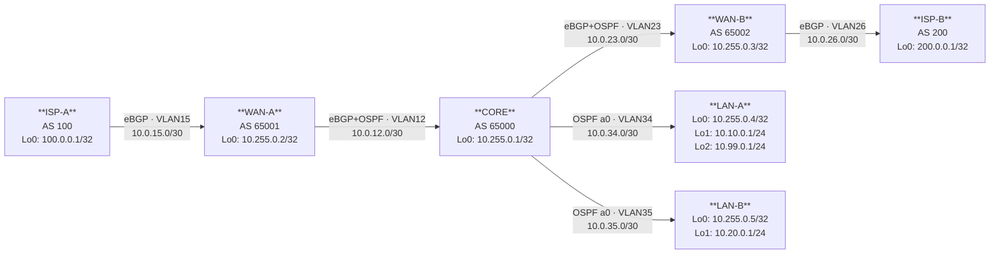

# Workbook Studenti — MOD-08: Redistribuzione BGP↔OSPF & Prefix Filtering

> **Piattaforme supportate:** GNS3 · ContainerLab (vrnetlab/IOU) · EVE-NG

---

## 1. TOPOLOGIA



### Tabella Indirizzamento

| Device | Interfaccia | IP / Mask | VLAN | Protocollo | Ruolo |
|--------|-------------|-----------|------|-----------|-------|
| ISP-A | Loopback0 | 100.0.0.1/32 | — | — | Router-id BGP, prefisso annunciato |
| ISP-A | Eth0/0.15 | 10.0.15.1/30 | 15 | eBGP | Peering con WAN-A |
| WAN-A | Loopback0 | 10.255.0.2/32 | — | OSPF (passivo) | Router-id OSPF e BGP |
| WAN-A | Eth0/0.15 | 10.0.15.2/30 | 15 | eBGP | Peering con ISP-A |
| WAN-A | Eth0/0.12 | 10.0.12.1/30 | 12 | eBGP + OSPF | Peering con CORE |
| CORE | Loopback0 | 10.255.0.1/32 | — | OSPF (passivo) | Router-id BGP e OSPF |
| CORE | Eth0/0.12 | 10.0.12.2/30 | 12 | eBGP + OSPF | Peering con WAN-A |
| CORE | Eth0/0.23 | 10.0.23.2/30 | 23 | eBGP + OSPF | Peering con WAN-B |
| CORE | Eth0/0.34 | 10.0.34.1/30 | 34 | OSPF | Peering con LAN-A |
| CORE | Eth0/0.35 | 10.0.35.1/30 | 35 | OSPF | Peering con LAN-B |
| WAN-B | Loopback0 | 10.255.0.3/32 | — | OSPF (passivo) | Router-id OSPF e BGP |
| WAN-B | Eth0/0.23 | 10.0.23.1/30 | 23 | eBGP + OSPF | Peering con CORE |
| WAN-B | Eth0/0.26 | 10.0.26.2/30 | 26 | eBGP | Peering con ISP-B |
| ISP-B | Loopback0 | 200.0.0.1/32 | — | — | Router-id BGP, prefisso annunciato |
| ISP-B | Eth0/0.26 | 10.0.26.1/30 | 26 | eBGP | Peering con WAN-B |
| LAN-A | Loopback0 | 10.255.0.4/32 | — | OSPF (passivo) | Router-id |
| LAN-A | Loopback1 | 10.10.0.1/24 | — | OSPF (passivo, p2p) | Rete interna produzione A |
| LAN-A | Loopback2 | 10.99.0.1/24 | — | OSPF (passivo, p2p) | Rete guest A (usata in MOD-09) |
| LAN-A | Eth0/0.34 | 10.0.34.2/30 | 34 | OSPF | Peering con CORE |
| LAN-B | Loopback0 | 10.255.0.5/32 | — | OSPF (passivo) | Router-id |
| LAN-B | Loopback1 | 10.20.0.1/24 | — | OSPF (passivo, p2p) | Rete interna produzione B |
| LAN-B | Eth0/0.35 | 10.0.35.2/30 | 35 | OSPF | Peering con CORE |

### Tabella AS e Protocolli

| Device | BGP AS | OSPF process | Note |
|--------|--------|--------------|------|
| ISP-A | 100 | — | Solo eBGP verso WAN-A; annuncia 100.0.0.0/8 |
| WAN-A | 65001 | Process 1 / area 0 | eBGP con ISP-A e CORE; OSPF con CORE |
| CORE | 65000 | Process 1 / area 0 | eBGP con WAN-A e WAN-B; OSPF con tutti i router interni; punto di redistribuzione |
| WAN-B | 65002 | Process 1 / area 0 | eBGP con ISP-B e CORE; OSPF con CORE |
| ISP-B | 200 | — | Solo eBGP verso WAN-B; annuncia 200.0.0.0/8 |
| LAN-A | — | Process 1 / area 0 | Solo OSPF |
| LAN-B | — | Process 1 / area 0 | Solo OSPF |

---

## 2. OBIETTIVI DELLA SESSIONE

Al termine di questo modulo lo studente sarà in grado di:

- [ ] Creare prefix-list per filtrare prefissi di routing per lunghezza e rete
- [ ] Usare route-map come strumento di filtro e controllo nella redistribuzione
- [ ] Configurare la redistribuzione bidirezionale OSPF↔BGP su un router di bordo
- [ ] Comprendere e prevenire i loop di redistribuzione usando il route tagging
- [ ] Distinguere i contesti d'uso di route-map in redistribuzione vs BGP neighbor policy

**Codici syllabus coperti:** 1.3 · 1.4 · 1.5 · 3.2.d

**Prerequisiti:** MOD-05 (BGP Fondamenta) · MOD-06 (BGP Traffic Engineering)

---

## 3. LAB SETUP

> **Piattaforme supportate:** GNS3 · ContainerLab (vrnetlab/IOU) · EVE-NG

### Prerequisiti

- Conoscenza di BGP eBGP: sessioni, tabella BGP, network statement (MOD-05)
- Conoscenza di route-map e prefix-list in contesto BGP neighbor (MOD-06)
- Conoscenza di OSPF base: area 0, interfacce passive, router-id (MOD-01)

> **Nota didattica:** In MOD-06 hai usato prefix-list e route-map per influenzare gli attributi BGP
> tra neighbor (MED, Local-Preference, as-path prepend). In questo modulo usi gli stessi strumenti
> in un contesto diverso: il filtro della redistribuzione tra protocolli. La sintassi è identica;
> cambia il punto di applicazione e il significato del permit/deny.

### Configurazione Iniziale

Carica le configurazioni sui device tramite paste manuale o TFTP.

**TFTP (path di riferimento):**
```
copy tftp://192.168.122.1/ENCOR/MOD-08/device-cfg running-config
```

---

#### ISP-A

```
hostname ISP-A
!
no ip domain-lookup
!
interface Loopback0
 ip address 100.0.0.1 255.255.255.255
!
interface Ethernet0/0
 no shutdown
!
interface Ethernet0/0.15
 encapsulation dot1Q 15
 ip address 10.0.15.1 255.255.255.252
 description to_WAN-A
!
! Rotta statica per rendere 100.0.0.0/8 un prefisso valido (aggregate)
ip route 100.0.0.0 255.0.0.0 Null0
!
router bgp 100
 bgp router-id 100.0.0.1
 no bgp default ipv4-unicast
 neighbor 10.0.15.2 remote-as 65001
 !
 address-family ipv4
  neighbor 10.0.15.2 activate
  network 100.0.0.0
 exit-address-family
!
end
```

---

#### ISP-B

```
hostname ISP-B
!
no ip domain-lookup
!
interface Loopback0
 ip address 200.0.0.1 255.255.255.255
!
interface Ethernet0/0
 no shutdown
!
interface Ethernet0/0.26
 encapsulation dot1Q 26
 ip address 10.0.26.1 255.255.255.252
 description to_WAN-B
!
ip route 200.0.0.0 255.0.0.0 Null0
!
router bgp 200
 bgp router-id 200.0.0.1
 no bgp default ipv4-unicast
 neighbor 10.0.26.2 remote-as 65002
 !
 address-family ipv4
  neighbor 10.0.26.2 activate
  network 200.0.0.0
 exit-address-family
!
end
```

---

#### WAN-A

```
hostname WAN-A
!
no ip domain-lookup
!
interface Loopback0
 ip address 10.255.0.2 255.255.255.255
 ip ospf 1 area 0
!
interface Ethernet0/0
 no shutdown
!
interface Ethernet0/0.15
 encapsulation dot1Q 15
 ip address 10.0.15.2 255.255.255.252
 description to_ISP-A
!
interface Ethernet0/0.12
 encapsulation dot1Q 12
 ip address 10.0.12.1 255.255.255.252
 description to_CORE
 ip ospf 1 area 0
!
router ospf 1
 router-id 10.255.0.2
 passive-interface Loopback0
!
router bgp 65001
 bgp router-id 10.255.0.2
 no bgp default ipv4-unicast
 neighbor 10.0.15.1 remote-as 100
 neighbor 10.0.12.2 remote-as 65000
 !
 address-family ipv4
  neighbor 10.0.15.1 activate
  neighbor 10.0.12.2 activate
 exit-address-family
!
end
```

---

#### WAN-B

```
hostname WAN-B
!
no ip domain-lookup
!
interface Loopback0
 ip address 10.255.0.3 255.255.255.255
 ip ospf 1 area 0
!
interface Ethernet0/0
 no shutdown
!
interface Ethernet0/0.23
 encapsulation dot1Q 23
 ip address 10.0.23.1 255.255.255.252
 description to_CORE
 ip ospf 1 area 0
!
interface Ethernet0/0.26
 encapsulation dot1Q 26
 ip address 10.0.26.2 255.255.255.252
 description to_ISP-B
!
router ospf 1
 router-id 10.255.0.3
 passive-interface Loopback0
!
router bgp 65002
 bgp router-id 10.255.0.3
 no bgp default ipv4-unicast
 neighbor 10.0.26.1 remote-as 200
 neighbor 10.0.23.2 remote-as 65000
 !
 address-family ipv4
  neighbor 10.0.26.1 activate
  neighbor 10.0.23.2 activate
 exit-address-family
!
end
```

---

#### CORE

```
hostname CORE
!
no ip domain-lookup
!
interface Loopback0
 ip address 10.255.0.1 255.255.255.255
 ip ospf 1 area 0
!
interface Ethernet0/0
 no shutdown
!
interface Ethernet0/0.12
 encapsulation dot1Q 12
 ip address 10.0.12.2 255.255.255.252
 description to_WAN-A
 ip ospf 1 area 0
!
interface Ethernet0/0.23
 encapsulation dot1Q 23
 ip address 10.0.23.2 255.255.255.252
 description to_WAN-B
 ip ospf 1 area 0
!
interface Ethernet0/0.34
 encapsulation dot1Q 34
 ip address 10.0.34.1 255.255.255.252
 description to_LAN-A
 ip ospf 1 area 0
!
interface Ethernet0/0.35
 encapsulation dot1Q 35
 ip address 10.0.35.1 255.255.255.252
 description to_LAN-B
 ip ospf 1 area 0
!
router ospf 1
 router-id 10.255.0.1
 passive-interface Loopback0
!
! Nota: nessuna redistribuzione configurata — da configurare nei task T3/T4/T5
router bgp 65000
 bgp router-id 10.255.0.1
 no bgp default ipv4-unicast
 neighbor 10.0.12.1 remote-as 65001
 neighbor 10.0.23.1 remote-as 65002
 !
 address-family ipv4
  neighbor 10.0.12.1 activate
  neighbor 10.0.23.1 activate
 exit-address-family
!
end
```

---

#### LAN-A

```
hostname LAN-A
!
no ip domain-lookup
!
interface Loopback0
 ip address 10.255.0.4 255.255.255.255
 ip ospf 1 area 0
!
! ip ospf network point-to-point: annuncia /24 esatto invece di host route /32
interface Loopback1
 ip address 10.10.0.1 255.255.255.0
 ip ospf network point-to-point
 ip ospf 1 area 0
!
interface Loopback2
 ip address 10.99.0.1 255.255.255.0
 ip ospf network point-to-point
 ip ospf 1 area 0
!
interface Ethernet0/0
 no shutdown
!
interface Ethernet0/0.34
 encapsulation dot1Q 34
 ip address 10.0.34.2 255.255.255.252
 description to_CORE
 ip ospf 1 area 0
!
router ospf 1
 router-id 10.255.0.4
 passive-interface Loopback0
 passive-interface Loopback1
 passive-interface Loopback2
!
end
```

---

#### LAN-B

```
hostname LAN-B
!
no ip domain-lookup
!
interface Loopback0
 ip address 10.255.0.5 255.255.255.255
 ip ospf 1 area 0
!
interface Loopback1
 ip address 10.20.0.1 255.255.255.0
 ip ospf network point-to-point
 ip ospf 1 area 0
!
interface Ethernet0/0
 no shutdown
!
interface Ethernet0/0.35
 encapsulation dot1Q 35
 ip address 10.0.35.2 255.255.255.252
 description to_CORE
 ip ospf 1 area 0
!
router ospf 1
 router-id 10.255.0.5
 passive-interface Loopback0
 passive-interface Loopback1
!
end
```

---

### Verifica Pre-Lab

Esegui questi comandi dopo aver caricato le cfg. Tutti devono restituire l'output indicato prima di procedere con i task.

**Su CORE — verifica OSPF:**
```
CORE# show ip ospf neighbor
```
Atteso: 4 neighbor in stato FULL (WAN-A, WAN-B, LAN-A, LAN-B)

**Su CORE — verifica BGP:**
```
CORE# show ip bgp summary
```
Atteso: 2 neighbor Up (WAN-A: 10.0.12.1, WAN-B: 10.0.23.1), stato `Idle` o `Active`
(ISP-A e ISP-B non peerano con CORE direttamente)

**Su CORE — verifica routing table:**
```
CORE# show ip route
```
Atteso: rotte OSPF (O) per 10.10.0.0/24, 10.20.0.0/24, 10.99.0.0/24, 10.255.0.x/32.
NON atteso: rotte BGP verso 100.0.0.0/8 o 200.0.0.0/8 (redistribuzione non ancora configurata)

**Su LAN-A — verifica OSPF:**
```
LAN-A# show ip route ospf
```
Atteso: rotte O per 10.0.12.0/30, 10.0.23.0/30, 10.0.35.0/30, 10.255.0.x/32, 10.20.0.0/24
NON atteso: rotte 100.0.0.0/8 o 200.0.0.0/8

---

## 4. TASK LIST

| # | Task | Codice syllabus | Tempo stimato |
|---|------|-----------------|---------------|
| T1 | Prefix-list: filtrare prefissi di routing | 3.2.d | 20 min |
| T2 | Route-map: struttura e uso in redistribuzione | 3.2.d | 15 min |
| T3 | Redistribuzione OSPF → BGP su CORE | 1.3 | 20 min |
| T4 | Redistribuzione BGP → OSPF su CORE | 1.3 | 20 min |
| T5 | Tagging & Loop Prevention | 1.4 · 1.5 | 25 min |

---

## 5. DETTAGLIO TASK

### T1 — Prefix-list: Filtrare i Prefissi di Routing

#### TEORIA

Una **prefix-list** è uno strumento per filtrare prefissi di routing in base a rete e lunghezza della maschera. Si usa in redistribuzione, in BGP neighbor policy e come condizione nelle route-map.

**Struttura:**
```
ip prefix-list NOME seq N { permit | deny } A.B.C.D/LEN [ ge MIN ] [ le MAX ]
```

- `seq N`: ordine di valutazione (il più basso vince, come ACL)
- `ge MIN`: lunghezza maschera ≥ MIN (filtra prefissi più specifici)
- `le MAX`: lunghezza maschera ≤ MAX (filtra prefissi meno specifici)
- Implicit deny alla fine: tutto ciò che non è esplicitamente permesso viene negato

**Differenza da ACL:** La prefix-list opera su **prefissi di routing** (rete + lunghezza mask), non su IP di singoli pacchetti. Non può essere applicata sulle interfacce per filtrare traffico.

**Operatori ge/le — esempi:**
| Entry | Cosa matcha |
|-------|-------------|
| `permit 10.0.0.0/8` | Solo esattamente 10.0.0.0/8 |
| `permit 10.0.0.0/8 le 24` | Tutte le subnet di 10.0.0.0/8 da /8 a /24 |
| `permit 0.0.0.0/0 le 32` | Qualsiasi prefisso (equivale a "any") |
| `deny 0.0.0.0/0 le 32` | Nega tutto (spesso come clausola finale esplicita) |

**Contesto in questo modulo:**  
In MOD-06 hai usato prefix-list come filtro sui prefissi BGP ricevuti/inviati da un neighbor (`neighbor X prefix-list`). Qui useremo le prefix-list come **condizioni di match** nelle route-map applicate alla redistribuzione. L'obiettivo è scegliere esattamente quali prefissi OSPF redistribuire in BGP e viceversa.

#### TASK

Su **CORE**, crea due prefix-list:

**1. INTERNAL-ONLY** — permette solo i prefissi LAN interni (da esportare via BGP):
```
CORE(config)# ip prefix-list INTERNAL-ONLY seq 10 permit 10.10.0.0/24
CORE(config)# ip prefix-list INTERNAL-ONLY seq 20 permit 10.20.0.0/24
CORE(config)# ip prefix-list INTERNAL-ONLY seq 30 deny 0.0.0.0/0 le 32
```

**2. ISP-PREFIXES** — permette solo i prefissi ISP (da importare in OSPF):
```
CORE(config)# ip prefix-list ISP-PREFIXES seq 10 permit 100.0.0.0/8
CORE(config)# ip prefix-list ISP-PREFIXES seq 20 permit 200.0.0.0/8
CORE(config)# ip prefix-list ISP-PREFIXES seq 30 deny 0.0.0.0/0 le 32
```

> **Nota:** La clausola `deny 0.0.0.0/0 le 32` al seq 30 è ridondante (l'implicit deny farebbe lo stesso) ma è buona pratica renderla esplicita per chiarezza del design.

#### VERIFICA

```
CORE# show ip prefix-list INTERNAL-ONLY
ip prefix-list INTERNAL-ONLY: 3 entries
   seq 10 permit 10.10.0.0/24
   seq 20 permit 10.20.0.0/24
   seq 30 deny 0.0.0.0/0 le 32

CORE# show ip prefix-list ISP-PREFIXES
ip prefix-list ISP-PREFIXES: 3 entries
   seq 10 permit 100.0.0.0/8
   seq 20 permit 200.0.0.0/8
   seq 30 deny 0.0.0.0/0 le 32
```

Test manuale — verifica che un prefisso venga matchato correttamente:
```
CORE# show ip prefix-list INTERNAL-ONLY 10.10.0.0/24
   seq 10 permit 10.10.0.0/24 (hit count: 0)

CORE# show ip prefix-list INTERNAL-ONLY 10.99.0.0/24
   seq 30 deny 0.0.0.0/0 le 32 (hit count: 0)
```

---

### T2 — Route-map: Struttura e Uso in Redistribuzione

#### TEORIA

Una **route-map** è una sequenza ordinata di clausole, ognuna con condizioni `match` e azioni `set`. Funziona come una policy top-down: il primo match vince; se nessuna clausola fa match, c'è un implicit deny.

**Struttura:**
```
route-map NOME { permit | deny } SEQ
 match ip address prefix-list NOME-LISTA
 set tag N
```

**Permit vs Deny nella redistribuzione:**
- `permit N`: se le condizioni di match sono soddisfatte → redistribuisci il prefisso (applica le set actions)
- `deny N`: se le condizioni di match sono soddisfatte → NON redistribuire il prefisso
- Clausola senza `match` (match vuoto) → matcha tutti i prefissi non già matchati

**Differenza dal contesto MOD-06:**  
In MOD-06 hai usato route-map con `neighbor X route-map NOME in/out` per modificare attributi BGP
(Local-Preference, MED, as-path). Le azioni `set` agivano su attributi BGP.  
Qui la route-map viene usata in `redistribute` per decidere **quali prefissi passano** da un protocollo
all'altro. Le azioni `set` qui impostano tag OSPF o metric — non attributi BGP.

#### TASK

Su **CORE**, crea le due route-map che userai in T3 e T4:

**1. OSPF-TO-BGP** — filtra cosa redistribuire da OSPF a BGP:
```
CORE(config)# route-map OSPF-TO-BGP permit 10
CORE(config-route-map)# match ip address prefix-list INTERNAL-ONLY
CORE(config-route-map)# exit
```

**2. BGP-TO-OSPF** — filtra cosa redistribuire da BGP a OSPF:
```
CORE(config)# route-map BGP-TO-OSPF permit 10
CORE(config-route-map)# match ip address prefix-list ISP-PREFIXES
CORE(config-route-map)# exit
```

> **Nota:** Non è presente ancora il `set tag` — lo aggiungeremo in T5 per il loop prevention.

#### VERIFICA

```
CORE# show route-map OSPF-TO-BGP
route-map OSPF-TO-BGP, permit, sequence 10
  Match clauses:
    ip address prefix-lists: INTERNAL-ONLY
  Set clauses:
  Policy routing matches: 0 packets, 0 bytes

CORE# show route-map BGP-TO-OSPF
route-map BGP-TO-OSPF, permit, sequence 10
  Match clauses:
    ip address prefix-lists: ISP-PREFIXES
  Set clauses:
  Policy routing matches: 0 packets, 0 bytes
```

---

### T3 — Redistribuzione OSPF → BGP su CORE

#### TEORIA

Il comando `redistribute` preleva le rotte di un protocollo e le inserisce nella RIB (e nei processi di aggiornamento) di un altro protocollo. Su CORE, vogliamo che i prefissi interni (appresi via OSPF: 10.10.0.0/24, 10.20.0.0/24, 10.99.0.0/24) vengano propagati via BGP agli ISP.

**Sintassi in BGP:**
```
router bgp AS
 address-family ipv4
  redistribute ospf PROC [route-map NOME]
```

- `PROC`: numero di processo OSPF
- `route-map NOME`: filtro opzionale; senza route-map, redistribuisce TUTTE le rotte OSPF

**Cosa succede senza route-map (pericolo):**  
Senza filtro, CORE redistribuirebbe in BGP anche le rotte OSPF di infrastruttura (10.0.12.0/30,
10.0.23.0/30, 10.255.0.x/32...) che gli ISP non devono vedere. Sempre usare una route-map.

**Origine delle rotte redistribuite:**  
Le rotte OSPF ridistribuite in BGP appaiono con origin `?` (incomplete) nella tabella BGP. Questo è normale e non impedisce la propagazione.

#### TASK

Su **CORE**, aggiungi la redistribuzione OSPF → BGP:

```
CORE(config)# router bgp 65000
CORE(config-router)# address-family ipv4
CORE(config-router-af)# redistribute ospf 1 route-map OSPF-TO-BGP
CORE(config-router-af)# end
```

#### VERIFICA

**Su CORE** — verifica che i prefissi LAN compaiano nella tabella BGP:
```
CORE# show ip bgp
```
Atteso: voci per `10.10.0.0/24` e `10.20.0.0/24` con status `*>` e next-hop `0.0.0.0` (rotte locali).
`10.99.0.0/24` NON deve comparire (non è in INTERNAL-ONLY).

```
CORE# show ip bgp 10.10.0.0/24
BGP routing table entry for 10.10.0.0/24, version X
Paths: (1 available, best #1, table Default-IP-Routing-Table)
  Local
    0.0.0.0 from 0.0.0.0 (10.255.0.1)
      Origin incomplete, metric X, localpref 100, weight 32768, valid, sourced, best
```

**Su WAN-A** — verifica che i prefissi arrivino da CORE via eBGP:
```
WAN-A# show ip bgp
```
Atteso: `10.10.0.0/24` e `10.20.0.0/24` con next-hop `10.0.12.2` (CORE).

**Su ISP-A** — verifica propagazione fino all'ISP:
```
ISP-A# show ip bgp
```
Atteso: `10.10.0.0/24` e `10.20.0.0/24` con next-hop `10.0.15.2` (WAN-A).

> **Domanda di ragionamento:** Perché 10.99.0.0/24 non viene redistribuito? Cosa bisogna
> modificare per includerlo? (Risposta: aggiungere `seq 30 permit 10.99.0.0/24` in INTERNAL-ONLY)

---

### T4 — Redistribuzione BGP → OSPF su CORE

#### TEORIA

Il percorso inverso: CORE redistribuisce i prefissi ISP (appresi via BGP: 100.0.0.0/8, 200.0.0.0/8) nel dominio OSPF, così che LAN-A e LAN-B possano raggiungere Internet.

**Sintassi in OSPF:**
```
router ospf PROC
 redistribute bgp AS metric N metric-type { 1 | 2 } subnets [route-map NOME]
```

Parametri fondamentali:
- `metric N`: costo OSPF da assegnare alla rotta esterna (seed metric)
- `metric-type 1` (E1): la metrica aumenta lungo il percorso (metrica interna + esterna). Preferito quando vuoi che il path selection consideri la distanza interna dal confine OSPF.
- `metric-type 2` (E2): la metrica rimane fissa ovunque nel dominio (solo metrica esterna, default). Preferito quando il costo interno è irrilevante.
- **`subnets`**: keyword obbligatoria se ridistribuisci rotte non classful (qualsiasi /24, /30 etc.). Senza questa keyword, solo rotte classful vengono redistribuite — uno degli errori più comuni.

**E1 vs E2 nella tabella di routing:**
```
O E2 100.0.0.0/8 [110/20] via 10.0.12.2  ← metric fissa 20
O E1 100.0.0.0/8 [110/30] via 10.0.12.2  ← metric 20 + 10 (costo link interno)
```

#### TASK

Su **CORE**, aggiungi la redistribuzione BGP → OSPF:

```
CORE(config)# router ospf 1
CORE(config-router)# redistribute bgp 65000 metric 20 metric-type 1 subnets route-map BGP-TO-OSPF
CORE(config-router)# end
```

#### VERIFICA

**Su CORE** — verifica il database OSPF (rotte esterne):
```
CORE# show ip ospf database external
```
Atteso: LSA tipo 5 per `100.0.0.0/8` (metric 20, E1) e `200.0.0.0/8` (metric 20, E1)

**Su LAN-A** — verifica routing table:
```
LAN-A# show ip route ospf
```
Atteso:
```
O E1  100.0.0.0/8 [110/30] via 10.0.34.1, Ethernet0/0.34
O E1  200.0.0.0/8 [110/30] via 10.0.34.1, Ethernet0/0.34
```
(metric = 20 seed + 10 costo link LAN-A→CORE)

**Test di raggiungibilità:**
```
LAN-A# ping 100.0.0.1 source Loopback1
```
Atteso: successo (traffico da 10.10.0.1 verso ISP-A via CORE→WAN-A→ISP-A)

---

### T5 — Tagging & Loop Prevention

#### TEORIA

**Il problema del loop di redistribuzione:**

CORE esegue redistribuzione bidirezionale: OSPF→BGP e BGP→OSPF. Cosa succede con i prefissi ISP?

1. ISP-A annuncia `100.0.0.0/8` via BGP a WAN-A → CORE
2. CORE redistribuisce `100.0.0.0/8` in OSPF (T4) → LAN-A/LAN-B lo vedono come `O E1`
3. CORE apprende `100.0.0.0/8` anche via OSPF (come rotta E1, AD=110) oltre che via BGP (AD=20)
4. BGP vince (AD 20 < 110), quindi la rotta BGP rimane nella RIB
5. Ma OSPF ha comunque `100.0.0.0/8` nel suo database come LSA tipo 5
6. Senza filtro, la route-map OSPF-TO-BGP potrebbe redistribuire `100.0.0.0/8` di nuovo in BGP
   (se non filtrata da INTERNAL-ONLY — in questo caso il filtro ci protegge)

In questo lab, INTERNAL-ONLY già esclude 100.0.0.0/8 dalla redistribuzione OSPF→BGP. Tuttavia, in topologie più complesse con più ASBR o prefix-list meno restrittive, il problema del loop è reale.

**La soluzione universale — Route Tagging:**

1. Quando redistribuisci BGP→OSPF, aggiungi un **tag** numerico alle rotte redistribuite (es. tag 100)
2. Quando redistribuisci OSPF→BGP, aggiungi una clausola `deny` che blocca le rotte con quel tag
3. Le rotte redistribuite in OSPF portano il tag → quando OSPF le "rimanda" all'ASBR,
   la route-map le identifica e le scarta prima di inserirle in BGP

**Sintassi:**
```
route-map BGP-TO-OSPF permit 10
 match ip address prefix-list ISP-PREFIXES
 set tag 100           ← marca le rotte redistributed in OSPF

route-map OSPF-TO-BGP deny 5     ← seq INFERIORE a 10 → viene valutata per prima
 match tag 100         ← blocca le rotte con quel tag (quelle che vengono da BGP)
route-map OSPF-TO-BGP permit 10
 match ip address prefix-list INTERNAL-ONLY
```

Il tag OSPF è un numero intero allegato all'LSA; non è visibile nel forwarding, solo nella policy.

#### TASK

**Passo 1 — Aggiungi `set tag` nella route-map BGP-TO-OSPF:**

```
CORE(config)# route-map BGP-TO-OSPF permit 10
CORE(config-route-map)# set tag 100
CORE(config-route-map)# exit
```

**Passo 2 — Aggiungi la clausola deny PRIMA del permit in OSPF-TO-BGP:**

```
CORE(config)# route-map OSPF-TO-BGP deny 5
CORE(config-route-map)# match tag 100
CORE(config-route-map)# exit
```

> **Importante:** la clausola `deny 5` ha sequence number inferiore a `permit 10`,
> quindi viene valutata per prima. Le rotte con tag 100 vengono bloccate prima ancora
> che vengano matchate da INTERNAL-ONLY.

#### VERIFICA

**Verifica che il tag sia presente nel database OSPF:**
```
CORE# show ip ospf database external
```
Cerca il campo `External Tag` nell'output — deve mostrare `100` per le rotte 100.0.0.0/8 e 200.0.0.0/8.

**Verifica route-map aggiornata:**
```
CORE# show route-map OSPF-TO-BGP
route-map OSPF-TO-BGP, deny, sequence 5
  Match clauses:
    tag: 100
  Set clauses:
route-map OSPF-TO-BGP, permit, sequence 10
  Match clauses:
    ip address prefix-lists: INTERNAL-ONLY
  Set clauses:
```

**Verifica che BGP non contenga prefissi ISP come rotte redistribute da OSPF:**
```
CORE# show ip bgp 100.0.0.0/8
```
La rotta deve essere appresa via BGP (next-hop 10.0.12.1 da WAN-A), NON come rotta locale con
next-hop 0.0.0.0 (che indicherebbe una redistribuzione da OSPF).

**Test loop:** su LAN-A verifica che i prefissi ISP siano ancora raggiungibili:
```
LAN-A# ping 100.0.0.1 source Loopback1
LAN-A# ping 200.0.0.1 source Loopback1
```
Entrambi devono rispondere — il tag non ha interrotto la raggiungibilità, solo prevenuto il loop.

---

## 6. TROUBLESHOOTING GUIDE

| Sintomo | Causa probabile | Diagnosi | Fix |
|---------|----------------|----------|-----|
| `show ip bgp` su CORE non mostra 10.10.0.0/24 | Redistribuzione OSPF→BGP non attiva o filtrata | `show ip bgp` · `show route-map` · `debug ip bgp updates` | Verificare `redistribute ospf 1 route-map OSPF-TO-BGP` sotto `address-family ipv4` |
| Prefissi LAN non arrivano a ISP-A | BGP non propaga a WAN-A o WAN-A non propaga a ISP-A | `show ip bgp summary` · `show ip bgp neighbors 10.0.12.2 advertised-routes` | Verificare sessioni BGP Up; verificare next-hop reachability |
| `show ip route ospf` su LAN-A non mostra 100.0.0.0/8 | Redistribuzione BGP→OSPF non attiva o keyword `subnets` mancante | `show ip ospf database external` su CORE | Aggiungere `subnets` al comando `redistribute bgp` |
| Rotte E2 invece di E1 | `metric-type 2` in `redistribute bgp` | `show ip route ospf` (cerca E2 invece di E1) | Cambiare `metric-type 1` |
| Prefix-list non matcha | Lunghezza maschera errata o rete errata | `show ip prefix-list NOME prefix` | Usare `show ip prefix-list NOME A.B.C.D/LEN` per test manuale |
| Route-map non applicata | `redistribute` senza `route-map` o nome errato | `show ip protocols` | Verificare il nome esatto (`case-sensitive`) |
| Tag OSPF non visibile | BGP→OSPF redistribuzione senza `set tag` | `show ip ospf database external` | Aggiungere `set tag 100` nella `route-map BGP-TO-OSPF` |

---

## 7. SOLUZIONI

> Le configurazioni complete e commentate sono in **`soluzione.md`** (riservato al docente).

---

## 8. RIEPILOGO & EXAM TIPS

**Punti chiave:**

- **Prefix-list vs ACL:** la prefix-list filtra prefissi di routing (rete + mask length); l'ACL filtra traffico IP. Non sono intercambiabili nello stesso contesto.
- **`subnets` in redistribute BGP→OSPF:** senza questa keyword, solo rotte classful vengono redistribuite. È l'errore più frequente.
- **Route-map in redistribuzione:** `permit` = redistribuisci; `deny` = scarta. Senza match esplicito, la clausola matcha tutto (attenzione: un `permit` senza match redistribuisce tutto).
- **Loop prevention con tag:** sempre applicare `set tag` nella direzione BGP→OSPF e `match tag deny` prima del `permit` nella route-map OSPF→BGP. Questo pattern è fondamentale in qualsiasi dual-redistribution scenario.
- **metric-type E1 vs E2:** E1 somma metrica interna + esterna (varia lungo il path); E2 usa solo la metrica esterna (fissa). E1 è preferito per selezione del path ottimale.

**Domande tipo CCNP:**

1. Un router esegue redistribuzione da OSPF a BGP. Alcune rotte OSPF non compaiono nella tabella BGP. Quale keyword mancante nella route-map OSPF causerebbe questo?
2. Qual è la differenza tra `metric-type 1` e `metric-type 2` in `redistribute bgp ... metric-type`?
3. In un design con due ASBR che redistribuiscono tra BGP e OSPF, come si previene il loop di redistribuzione?
4. Perché è necessaria la keyword `subnets` in `redistribute bgp X metric Y metric-type 1 subnets`?
5. Un prefix-list con `seq 10 permit 10.0.0.0/8 le 24` matcha `10.10.0.0/24`? E `10.10.0.0/25`?
