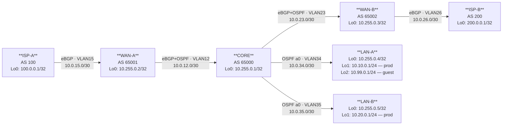

# Workbook Studenti — MOD-09: PBR & Route Manipulation Avanzata

> **Piattaforme supportate:** GNS3 · ContainerLab (vrnetlab/IOU) · EVE-NG

---

## 1. TOPOLOGIA

La topologia è identica a MOD-08. Le configurazioni di partenza includono già la redistribuzione
BGP↔OSPF e il loop prevention tramite tag, completati in MOD-08.



**Scenario di questo modulo:**  
LAN-A ha due reti: `10.10.0.0/24` (produzione) e `10.99.0.0/24` (guest).  
Il traffico guest deve uscire su **WAN-B** (ISP-B), mentre il traffico produzione usa il path normale via WAN-A.  
La soluzione è **Policy-Based Routing (PBR)** su CORE.

### Tabella Indirizzamento

| Device | Interfaccia | IP / Mask | VLAN | Protocollo | Ruolo |
|--------|-------------|-----------|------|-----------|-------|
| ISP-A | Loopback0 | 100.0.0.1/32 | — | — | Prefisso ISP-A |
| ISP-A | Eth0/0.15 | 10.0.15.1/30 | 15 | eBGP | Peering con WAN-A |
| WAN-A | Loopback0 | 10.255.0.2/32 | — | OSPF (passivo) | Router-id |
| WAN-A | Eth0/0.15 | 10.0.15.2/30 | 15 | eBGP | Peering con ISP-A |
| WAN-A | Eth0/0.12 | 10.0.12.1/30 | 12 | eBGP + OSPF | Peering con CORE |
| CORE | Loopback0 | 10.255.0.1/32 | — | OSPF (passivo) | Router-id |
| CORE | Eth0/0.12 | 10.0.12.2/30 | 12 | eBGP + OSPF | Peering con WAN-A |
| CORE | Eth0/0.23 | 10.0.23.2/30 | 23 | eBGP + OSPF | Peering con WAN-B |
| CORE | Eth0/0.34 | 10.0.34.1/30 | 34 | OSPF | Peering con LAN-A — **PBR applicato qui** |
| CORE | Eth0/0.35 | 10.0.35.1/30 | 35 | OSPF | Peering con LAN-B |
| WAN-B | Loopback0 | 10.255.0.3/32 | — | OSPF (passivo) | Router-id |
| WAN-B | Eth0/0.23 | 10.0.23.1/30 | 23 | eBGP + OSPF | Peering con CORE |
| WAN-B | Eth0/0.26 | 10.0.26.2/30 | 26 | eBGP | Peering con ISP-B |
| ISP-B | Loopback0 | 200.0.0.1/32 | — | — | Prefisso ISP-B |
| ISP-B | Eth0/0.26 | 10.0.26.1/30 | 26 | eBGP | Peering con WAN-B |
| LAN-A | Loopback0 | 10.255.0.4/32 | — | OSPF (passivo) | Router-id |
| LAN-A | Loopback1 | 10.10.0.1/24 | — | OSPF (passivo, p2p) | **Rete produzione** — path normale |
| LAN-A | Loopback2 | 10.99.0.1/24 | — | OSPF (passivo, p2p) | **Rete guest** — da reindirizzare via PBR |
| LAN-A | Eth0/0.34 | 10.0.34.2/30 | 34 | OSPF | Peering con CORE |
| LAN-B | Loopback0 | 10.255.0.5/32 | — | OSPF (passivo) | Router-id |
| LAN-B | Loopback1 | 10.20.0.1/24 | — | OSPF (passivo, p2p) | Rete produzione |
| LAN-B | Eth0/0.35 | 10.0.35.2/30 | 35 | OSPF | Peering con CORE |

---

## 2. OBIETTIVI DELLA SESSIONE

Al termine di questo modulo lo studente sarà in grado di:

- [ ] Configurare Policy-Based Routing (PBR) per reindirizzare traffico in base all'IP sorgente
- [ ] Usare `set ip next-hop verify-availability` con IP SLA per PBR condizionale
- [ ] Manipolare l'Administrative Distance per controllare la preferenza tra protocolli di routing
- [ ] Configurare floating static route come percorso di backup
- [ ] Usare IP SLA + track per l'installazione condizionale di rotte statiche

**Codici syllabus coperti:** 1.2 · 1.6 · 3.2.d

**Prerequisiti:** MOD-08 (Redistribuzione BGP↔OSPF) · MOD-05 · MOD-01

---

## 3. LAB SETUP

> **Piattaforme supportate:** GNS3 · ContainerLab (vrnetlab/IOU) · EVE-NG

### Prerequisiti

- MOD-08 completato: redistribuzione BGP↔OSPF con loop prevention via tag
- Conoscenza di OSPF e BGP base (MOD-01, MOD-05)
- Comprensione di route-map e prefix-list (MOD-08)

### Configurazione Iniziale

Le cfg di MOD-09 corrispondono allo stato finale di MOD-08 (redistribuzione + tag configurati).

**TFTP (path di riferimento):**
```
copy tftp://192.168.122.1/ENCOR/MOD-09/device-cfg running-config
```

---

#### ISP-A

```
hostname ISP-A
!
no ip domain-lookup
!
interface Loopback0
 ip address 100.0.0.1 255.255.255.255
!
interface Ethernet0/0
 no shutdown
!
interface Ethernet0/0.15
 encapsulation dot1Q 15
 ip address 10.0.15.1 255.255.255.252
 description to_WAN-A
!
ip route 100.0.0.0 255.0.0.0 Null0
!
router bgp 100
 bgp router-id 100.0.0.1
 no bgp default ipv4-unicast
 neighbor 10.0.15.2 remote-as 65001
 !
 address-family ipv4
  neighbor 10.0.15.2 activate
  network 100.0.0.0
 exit-address-family
!
end
```

---

#### ISP-B

```
hostname ISP-B
!
no ip domain-lookup
!
interface Loopback0
 ip address 200.0.0.1 255.255.255.255
!
interface Ethernet0/0
 no shutdown
!
interface Ethernet0/0.26
 encapsulation dot1Q 26
 ip address 10.0.26.1 255.255.255.252
 description to_WAN-B
!
ip route 200.0.0.0 255.0.0.0 Null0
!
router bgp 200
 bgp router-id 200.0.0.1
 no bgp default ipv4-unicast
 neighbor 10.0.26.2 remote-as 65002
 !
 address-family ipv4
  neighbor 10.0.26.2 activate
  network 200.0.0.0
 exit-address-family
!
end
```

---

#### WAN-A

```
hostname WAN-A
!
no ip domain-lookup
!
interface Loopback0
 ip address 10.255.0.2 255.255.255.255
 ip ospf 1 area 0
!
interface Ethernet0/0
 no shutdown
!
interface Ethernet0/0.15
 encapsulation dot1Q 15
 ip address 10.0.15.2 255.255.255.252
 description to_ISP-A
!
interface Ethernet0/0.12
 encapsulation dot1Q 12
 ip address 10.0.12.1 255.255.255.252
 description to_CORE
 ip ospf 1 area 0
!
router ospf 1
 router-id 10.255.0.2
 passive-interface Loopback0
!
router bgp 65001
 bgp router-id 10.255.0.2
 no bgp default ipv4-unicast
 neighbor 10.0.15.1 remote-as 100
 neighbor 10.0.12.2 remote-as 65000
 !
 address-family ipv4
  neighbor 10.0.15.1 activate
  neighbor 10.0.12.2 activate
 exit-address-family
!
end
```

---

#### WAN-B

```
hostname WAN-B
!
no ip domain-lookup
!
interface Loopback0
 ip address 10.255.0.3 255.255.255.255
 ip ospf 1 area 0
!
interface Ethernet0/0
 no shutdown
!
interface Ethernet0/0.23
 encapsulation dot1Q 23
 ip address 10.0.23.1 255.255.255.252
 description to_CORE
 ip ospf 1 area 0
!
interface Ethernet0/0.26
 encapsulation dot1Q 26
 ip address 10.0.26.2 255.255.255.252
 description to_ISP-B
!
router ospf 1
 router-id 10.255.0.3
 passive-interface Loopback0
!
router bgp 65002
 bgp router-id 10.255.0.3
 no bgp default ipv4-unicast
 neighbor 10.0.26.1 remote-as 200
 neighbor 10.0.23.2 remote-as 65000
 !
 address-family ipv4
  neighbor 10.0.26.1 activate
  neighbor 10.0.23.2 activate
 exit-address-family
!
end
```

---

#### CORE (stato finale MOD-08 — redistribuzione + tag preconfigurati)

```
hostname CORE
!
no ip domain-lookup
!
interface Loopback0
 ip address 10.255.0.1 255.255.255.255
 ip ospf 1 area 0
!
interface Ethernet0/0
 no shutdown
!
interface Ethernet0/0.12
 encapsulation dot1Q 12
 ip address 10.0.12.2 255.255.255.252
 description to_WAN-A
 ip ospf 1 area 0
!
interface Ethernet0/0.23
 encapsulation dot1Q 23
 ip address 10.0.23.2 255.255.255.252
 description to_WAN-B
 ip ospf 1 area 0
!
interface Ethernet0/0.34
 encapsulation dot1Q 34
 ip address 10.0.34.1 255.255.255.252
 description to_LAN-A
 ip ospf 1 area 0
!
interface Ethernet0/0.35
 encapsulation dot1Q 35
 ip address 10.0.35.1 255.255.255.252
 description to_LAN-B
 ip ospf 1 area 0
!
ip prefix-list INTERNAL-ONLY seq 10 permit 10.10.0.0/24
ip prefix-list INTERNAL-ONLY seq 20 permit 10.20.0.0/24
ip prefix-list INTERNAL-ONLY seq 30 deny 0.0.0.0/0 le 32
!
ip prefix-list ISP-PREFIXES seq 10 permit 100.0.0.0/8
ip prefix-list ISP-PREFIXES seq 20 permit 200.0.0.0/8
ip prefix-list ISP-PREFIXES seq 30 deny 0.0.0.0/0 le 32
!
route-map OSPF-TO-BGP deny 5
 match tag 100
!
route-map OSPF-TO-BGP permit 10
 match ip address prefix-list INTERNAL-ONLY
!
route-map BGP-TO-OSPF permit 10
 match ip address prefix-list ISP-PREFIXES
 set tag 100
!
router ospf 1
 router-id 10.255.0.1
 passive-interface Loopback0
 redistribute bgp 65000 metric 20 metric-type 1 subnets route-map BGP-TO-OSPF
!
router bgp 65000
 bgp router-id 10.255.0.1
 no bgp default ipv4-unicast
 neighbor 10.0.12.1 remote-as 65001
 neighbor 10.0.23.1 remote-as 65002
 !
 address-family ipv4
  neighbor 10.0.12.1 activate
  neighbor 10.0.23.1 activate
  redistribute ospf 1 route-map OSPF-TO-BGP
 exit-address-family
!
end
```

---

#### LAN-A

```
hostname LAN-A
!
no ip domain-lookup
!
interface Loopback0
 ip address 10.255.0.4 255.255.255.255
 ip ospf 1 area 0
!
interface Loopback1
 ip address 10.10.0.1 255.255.255.0
 ip ospf network point-to-point
 ip ospf 1 area 0
!
interface Loopback2
 ip address 10.99.0.1 255.255.255.0
 ip ospf network point-to-point
 ip ospf 1 area 0
!
interface Ethernet0/0
 no shutdown
!
interface Ethernet0/0.34
 encapsulation dot1Q 34
 ip address 10.0.34.2 255.255.255.252
 description to_CORE
 ip ospf 1 area 0
!
router ospf 1
 router-id 10.255.0.4
 passive-interface Loopback0
 passive-interface Loopback1
 passive-interface Loopback2
!
end
```

---

#### LAN-B

```
hostname LAN-B
!
no ip domain-lookup
!
interface Loopback0
 ip address 10.255.0.5 255.255.255.255
 ip ospf 1 area 0
!
interface Loopback1
 ip address 10.20.0.1 255.255.255.0
 ip ospf network point-to-point
 ip ospf 1 area 0
!
interface Ethernet0/0
 no shutdown
!
interface Ethernet0/0.35
 encapsulation dot1Q 35
 ip address 10.0.35.2 255.255.255.252
 description to_CORE
 ip ospf 1 area 0
!
router ospf 1
 router-id 10.255.0.5
 passive-interface Loopback0
 passive-interface Loopback1
!
end
```

---

### Verifica Pre-Lab

Esegui questi comandi dopo aver caricato le cfg:

**Su CORE — verifica redistribuzione attiva:**
```
CORE# show ip bgp | include 10.10
```
Atteso: `*> 10.10.0.0/24` — redistribuzione OSPF→BGP funzionante dal MOD-08

```
CORE# show ip route ospf | include 100.0
```
Atteso: `O E1 100.0.0.0/8` — redistribuzione BGP→OSPF funzionante

**Su CORE — verifica route-map con tag:**
```
CORE# show ip ospf database external
```
Atteso: External Tag 100 sui LSA per 100.0.0.0/8 e 200.0.0.0/8

**Su LAN-A — verifica raggiungibilità baseline:**
```
LAN-A# ping 100.0.0.1 source Loopback1
LAN-A# ping 200.0.0.1 source Loopback1
```
Entrambi devono rispondere (ISP raggiungibili tramite redistribuzione MOD-08)

---

## 4. TASK LIST

| # | Task | Codice syllabus | Tempo stimato |
|---|------|-----------------|---------------|
| T1 | PBR: reindirizzamento traffico guest via WAN-B | 1.2 | 20 min |
| T2 | PBR con verify-availability e IP SLA | 1.2 | 20 min |
| T3A | Administrative Distance: preferenza tra protocolli | 1.6 | 15 min |
| T3B | Floating Static Route: percorso di backup | 1.6 | 10 min |
| T3C | IP SLA + Track: rotta condizionale | 3.2.d | 15 min |
| T4 | Troubleshooting PBR e route manipulation | 1.2 · 1.6 | 20 min |

---

## 5. DETTAGLIO TASK

### T1 — PBR: Reindirizzamento Traffico Guest via WAN-B

#### TEORIA

Il **routing normale** sceglie il percorso basandosi sulla **destinazione** del pacchetto (destination-based routing). La **tabella di routing** è il criterio unico.

Il **Policy-Based Routing (PBR)** permette di scegliere il percorso in base a qualsiasi combinazione di criteri: IP sorgente, IP destinazione, protocollo, porta, lunghezza pacchetto, ToS. Il PBR bypassa la tabella di routing per i pacchetti che fanno match.

**Componenti del PBR:**
1. **ACL estesa** — identifica i pacchetti da trattare con policy
2. **Route-map PBR** — definisce l'azione (`set ip next-hop`, `set interface`, `set ip default next-hop`)
3. **`ip policy route-map`** — applica la route-map su un'interfaccia in direzione **inbound**

**`set ip next-hop` vs `set ip default next-hop`:**
- `set ip next-hop X`: usa sempre questo next-hop se X è raggiungibile, **ignora la routing table**
- `set ip default next-hop X`: usa questo next-hop solo se **non c'è una rotta più specifica** in tabella

**`ip policy` vs `ip local policy`:**
- `ip policy route-map` su interfaccia: agisce su traffico **transitante** (forward path)
- `ip local policy route-map` su processo globale: agisce su traffico **generato dal router stesso**

**Regola di posizionamento:**  
Il PBR si applica sull'interfaccia di **ingresso** del traffico che vuoi reindirizzare.  
Nel nostro scenario: il traffico guest viene da LAN-A, entra in CORE via `Eth0/0.34` → PBR su `Eth0/0.34 inbound`.

#### TASK

**Passo 1 — Crea l'ACL che identifica il traffico guest:**

```
CORE(config)# ip access-list extended ACL-GUEST
CORE(config-ext-nacl)# permit ip 10.99.0.0 0.0.0.255 any
CORE(config-ext-nacl)# exit
```

**Passo 2 — Crea la route-map PBR:**

```
CORE(config)# route-map PBR-GUEST permit 10
CORE(config-route-map)# match ip address ACL-GUEST
CORE(config-route-map)# set ip next-hop 10.0.23.1
CORE(config-route-map)# exit
CORE(config)# route-map PBR-GUEST permit 20
CORE(config-route-map)# exit
```

> La clausola `permit 20` senza match permette al traffico non-guest di seguire il routing normale.
> Senza questa clausola, tutto il traffico non matchato verrebbe droppato (implicit deny).

**Passo 3 — Applica la route-map sull'interfaccia verso LAN-A (inbound):**

```
CORE(config)# interface Ethernet0/0.34
CORE(config-subif)# ip policy route-map PBR-GUEST
CORE(config-subif)# end
```

#### VERIFICA

**Verifica configurazione:**
```
CORE# show ip policy
Interface          Route map
Ethernet0/0.34     PBR-GUEST
```

**Verifica matching PBR:**
```
CORE# debug ip policy
```
Invia un ping da LAN-A con source Loopback2 (10.99.0.1):
```
LAN-A# ping 200.0.0.1 source Loopback2
```

Atteso nel debug su CORE:
```
IP: s=10.99.0.1 (Ethernet0/0.34), d=200.0.0.1, len 100, FIB policy match
IP: route map PBR-GUEST, item 10, permit
IP: s=10.99.0.1 (Ethernet0/0.34), g=10.0.23.1, len 100, policy routed
```

**Verifica che il traffico produzione NON sia interessato:**
```
LAN-A# ping 100.0.0.1 source Loopback1
```
Deve rispondere (traffico da 10.10.0.1 — non matchato da ACL-GUEST — segue routing normale via WAN-A)

```
CORE# undebug all
```

---

### T2 — PBR con verify-availability e IP SLA

#### TEORIA

Con `set ip next-hop 10.0.23.1`, il PBR invia sempre il traffico guest verso WAN-B, anche se WAN-B non è raggiungibile. In questo caso il traffico viene droppato: nessun fallback automatico.

**`set ip next-hop verify-availability`** aggiunge una verifica di raggiungibilità:
```
set ip next-hop verify-availability NEXT-HOP SEQ track TRACK-ID
```
- Se il track object è `Up` → usa il next-hop specificato
- Se il track object è `Down` → passa alla clausola successiva della route-map (o al routing normale)

**IP SLA** permette di monitorare attivamente la raggiungibilità di un host o servizio:
```
ip sla ID
 icmp-echo DEST-IP [source-ip SRC-IP]
  frequency SECONDS
ip sla schedule ID life forever start-time now
```

**Track object** associa uno stato (Up/Down) a un IP SLA:
```
track TRACK-ID ip sla SLA-ID reachability
```

Il track è `Up` se l'icmp-echo riceve risposta; `Down` se non la riceve.

#### TASK

**Passo 1 — Configura IP SLA per monitorare WAN-B:**

```
CORE(config)# ip sla 1
CORE(config-ip-sla)# icmp-echo 10.0.23.1 source-ip 10.0.23.2
CORE(config-ip-sla-echo)# frequency 5
CORE(config-ip-sla-echo)# exit
CORE(config)# ip sla schedule 1 life forever start-time now
```

**Passo 2 — Crea il track object:**

```
CORE(config)# track 1 ip sla 1 reachability
CORE(config-track)# exit
```

**Passo 3 — Aggiorna la route-map PBR per usare verify-availability:**

```
CORE(config)# route-map PBR-GUEST permit 10
CORE(config-route-map)# match ip address ACL-GUEST
CORE(config-route-map)# set ip next-hop verify-availability 10.0.23.1 1 track 1
CORE(config-route-map)# exit
```

> Il `set ip next-hop 10.0.23.1` precedente viene **sostituito** da `verify-availability`.
> Il parametro `1` è il numero di sequenza (per permettere più next-hop alternativi).

#### VERIFICA

**Verifica stato IP SLA:**
```
CORE# show ip sla statistics 1
```
Atteso: `Latest operation return code: OK` — WAN-B risponde

**Verifica stato track:**
```
CORE# show track 1
Track 1
  IP SLA 1 reachability
  Reachability is Up
  ...
```

**Verifica PBR funziona (track Up):**
```
LAN-A# ping 200.0.0.1 source Loopback2
```
Deve rispondere — traffico guest ancora instradato via WAN-B.

**Simulazione failure — shut WAN-B interface (solo in lab):**
```
CORE(config)# interface Ethernet0/0.23
CORE(config-subif)# shutdown
```

Attendi ~10 secondi (2 frequenze SLA), poi verifica:
```
CORE# show track 1
  Reachability is Down
```

Riprova il ping guest — ora il traffico seguirà il routing normale (non droppato):
```
LAN-A# ping 200.0.0.1 source Loopback2
```
Il ping potrebbe fallire (200.0.0.0/8 non più raggiungibile senza WAN-B) ma il PBR non droppa più.

**Ripristina:**
```
CORE(config)# interface Ethernet0/0.23
CORE(config-subif)# no shutdown
```

---

### T3A — Administrative Distance: Preferenza tra Protocolli

#### TEORIA

L'**Administrative Distance (AD)** è il valore che IOS usa per scegliere tra rotte apprese da protocolli diversi verso la stessa destinazione. AD più basso = preferito.

| Protocollo | AD default |
|-----------|-----------|
| Connected | 0 |
| Static | 1 |
| eBGP | 20 |
| OSPF | 110 |
| OSPF E1/E2 | 110 |
| iBGP | 200 |

Nel nostro scenario:
- CORE apprende `100.0.0.0/8` via eBGP (AD=20) da WAN-A (che lo riceve da ISP-A)
- CORE redistribuisce `100.0.0.0/8` in OSPF come E1 → CORE stesso lo vede in OSPF (AD=110)
- BGP vince (20 < 110) → routing table mostra solo la rotta BGP

**`distance bgp EBGP IBGP LOCAL`:**  
Permette di cambiare l'AD dei tre tipi di rotte BGP:
- `EBGP`: distanza per rotte eBGP (default 20)
- `IBGP`: distanza per rotte iBGP (default 200)
- `LOCAL`: distanza per rotte locali (network statement, default 200)

#### TASK

Scenario: vogliamo che CORE preferisca la rotta OSPF E1 (AD=110) invece di eBGP per i prefissi ISP.
Aumenta l'AD eBGP su CORE a 150:

```
CORE(config)# router bgp 65000
CORE(config-router)# distance bgp 150 200 200
CORE(config-router)# end
```

#### VERIFICA

```
CORE# show ip route 100.0.0.0
```

**Prima del cambio:** `B    100.0.0.0/8 [20/0] via 10.0.12.1`  
**Dopo il cambio:** `O E1 100.0.0.0/8 [110/30] via 10.0.12.2` (OSPF E1 vince — ma nota che è lo stesso link!)

> **Attenzione:** In questo scenario specifico, il next-hop è lo stesso (via CORE verso WAN-A) quindi
> il cambio non altera il forwarding effettivo. Questo task dimostra il **meccanismo** dell'AD,
> non un design pratico. In una topologia con ASBR multipli, il cambio di AD farebbe scegliere
> un percorso fisicamente diverso.

**Ripristina il default:**
```
CORE(config)# router bgp 65000
CORE(config-router)# no distance bgp
CORE(config-router)# end
```

---

### T3B — Floating Static Route: Percorso di Backup

#### TEORIA

Una **floating static route** è una rotta statica con AD più alto del protocollo primario.  
Normalmente è nascosta nella routing table (il protocollo primario ha AD più basso).  
Quando il protocollo primario non ha più la rotta (link failure, neighbor down), la static route  
emerge nella routing table come backup.

**Esempio:**
- OSPF apprende `10.10.0.0/24` via Eth0/0.34 con AD=110
- Static route: `ip route 10.10.0.0 255.255.255.0 10.0.23.1 200` (AD=200)
- Normalmente: routing table mostra `O 10.10.0.0/24 [110/x]` — static non visibile
- Se OSPF perde la rotta: routing table mostra `S 10.10.0.0/24 [200/0]` — backup attivo

#### TASK

Su CORE, aggiungi una floating static route verso la rete LAN-A produzione, con percorso alternativo via WAN-B:

```
CORE(config)# ip route 10.10.0.0 255.255.255.0 10.0.23.1 200
CORE(config)# end
```

#### VERIFICA

**Stato normale — OSPF vince:**
```
CORE# show ip route 10.10.0.0
Routing entry for 10.10.0.0/24
  Known via "ospf 1", distance 110, metric ...
```
La static route non compare (AD=200 > OSPF=110).

**Simula failure OSPF (shut interfaccia verso LAN-A):**
```
CORE(config)# interface Ethernet0/0.34
CORE(config-subif)# shutdown
```

```
CORE# show ip route 10.10.0.0
Routing entry for 10.10.0.0/24
  Known via "static", distance 200, metric 0
  * 10.0.23.1
```
La floating static emerge come backup.

**Ripristina:**
```
CORE(config)# interface Ethernet0/0.34
CORE(config-subif)# no shutdown
CORE(config)# no ip route 10.10.0.0 255.255.255.0 10.0.23.1 200
```

---

### T3C — IP SLA + Track: Rotta Condizionale

#### TEORIA

Con le sole floating static route, il failover avviene solo quando l'interfaccia cade (link failure fisica). Se il next-hop è raggiungibile ma il servizio è irraggiungibile (es. ISP upstream down), la static route rimane attiva inutilmente.

**IP SLA + Track** permette di associare l'installazione di una rotta statica alla raggiungibilità di un endpoint specifico:

```
ip sla ID
 icmp-echo DEST [source-ip SRC]
  frequency N
ip sla schedule ID life forever start-time now

track TRACK-ID ip sla SLA-ID reachability

ip route RETE MASK NEXTHOP [AD] track TRACK-ID
```

Quando il track è `Down` (SLA non risponde), la static route viene rimossa dalla routing table.  
Quando il track torna `Up`, la static route viene reinstallata.

#### TASK

Scenario: aggiungi una rotta statica verso ISP-B (200.0.0.0/8) via WAN-B, condizionata alla raggiungibilità di ISP-B. Questa rotta compete con la rotta OSPF E1 (AD=110) — falla vincere usando AD=1.

**Passo 1 — Configura IP SLA 2 per monitorare ISP-B:**

```
CORE(config)# ip sla 2
CORE(config-ip-sla)# icmp-echo 200.0.0.1 source-ip 10.0.23.2
CORE(config-ip-sla-echo)# frequency 5
CORE(config-ip-sla-echo)# exit
CORE(config)# ip sla schedule 2 life forever start-time now
```

**Passo 2 — Crea track object 2:**

```
CORE(config)# track 2 ip sla 2 reachability
CORE(config-track)# exit
```

**Passo 3 — Aggiungi rotta statica condizionale (AD=1 per vincere su OSPF E1):**

```
CORE(config)# ip route 200.0.0.0 255.0.0.0 10.0.23.1 1 track 2
CORE(config)# end
```

#### VERIFICA

**Verifica SLA e track:**
```
CORE# show ip sla statistics 2
CORE# show track 2
```
Entrambi devono mostrare stato `Up`/`OK`.

**Verifica routing table:**
```
CORE# show ip route 200.0.0.0
```
Atteso: `S 200.0.0.0/8 [1/0] via 10.0.23.1` (static con AD=1 vince su OSPF E1 con AD=110)

**Verifica che LAN-A raggiunga ISP-B via percorso diretto:**
```
LAN-A# ping 200.0.0.1 source Loopback1
```

**Simula failure (shut ISP-B lato WAN-B — o semplicemente WAN-B interface):**
```
CORE(config)# interface Ethernet0/0.23
CORE(config-subif)# shutdown
```
Attendi 10s, verifica:
```
CORE# show track 2
  Reachability is Down

CORE# show ip route 200.0.0.0
O E1  200.0.0.0/8 [110/30] via ...
```
La static route è stata rimossa; OSPF E1 emerge come fallback.

**Ripristina:**
```
CORE(config)# interface Ethernet0/0.23
CORE(config-subif)# no shutdown
```

---

### T4 — Troubleshooting PBR e Route Manipulation

#### Scenario A — PBR non reindirizza il traffico guest

**Sintomi:** Il ping da LAN-A Loopback2 (10.99.0.1) verso ISP-B non prende il percorso via WAN-B.

**Diagnosi:**
```
CORE# show ip policy
CORE# debug ip policy
LAN-A# ping 200.0.0.1 source Loopback2
```

**Possibili cause:**
1. `ip policy route-map PBR-GUEST` non applicato sulla giusta interfaccia
2. ACL-GUEST con wildcard errata (es. `0.0.0.255` invece di `0.0.255.255` per /16)
3. Route-map applicata in outbound invece che inbound
4. Clausola `permit 20` mancante → traffico non-guest viene droppato

**Fix per causa 1:** Verificare `show ip policy` — se l'interfaccia non compare, applicare `ip policy route-map PBR-GUEST` su `Ethernet0/0.34`

**Fix per causa 3:** Il PBR funziona solo `ip policy` su interfaccia di ingresso. Non esiste `ip policy out`.

#### Scenario B — Floating static route sempre attiva (non flottante)

**Sintomi:** `show ip route` mostra sia la rotta OSPF che la statica; quella statica sembra sempre preferita.

**Diagnosi:**
```
CORE# show ip route 10.10.0.0
CORE# show ip route static
```

**Causa probabile:** AD della static route (es. 100) inferiore all'AD di OSPF (110) → static vince sempre.

**Fix:** Usa AD > 110: `ip route 10.10.0.0 255.255.255.0 10.0.23.1 200`

#### Scenario C — IP SLA sempre Up anche quando il target è irraggiungibile

**Sintomi:** `show track 1` mostra sempre `Up` anche dopo aver shutdownato l'interfaccia verso WAN-B.

**Causa probabile:** IP SLA usa come source un'interfaccia ancora attiva, e raggiunge il target tramite un path alternativo. Oppure il `source-ip` non è specificato e IOS usa un'altra interfaccia.

**Diagnosi:**
```
CORE# show ip sla statistics 1
CORE# show ip sla configuration 1
```

**Fix:** Specificare `source-ip` correttamente (l'IP dell'interfaccia verso WAN-B: `10.0.23.2`).
Se WAN-B cade, quell'IP non è più utilizzabile → SLA fallisce → track Down.

---

## 6. TROUBLESHOOTING GUIDE

| Sintomo | Causa probabile | Diagnosi | Fix |
|---------|----------------|----------|-----|
| PBR non matcha il traffico | ACL-GUEST errata o route-map non applicata | `debug ip policy` · `show ip policy` | Verificare ACL e `ip policy` sull'interfaccia corretta |
| Traffico non-guest droppato | Route-map PBR senza clausola finale permit | `show route-map PBR-GUEST` | Aggiungere `route-map PBR-GUEST permit 20` (senza match) |
| verify-availability non fa fallover | Track non associato all'SLA o SLA non in esecuzione | `show track 1` · `show ip sla statistics 1` | Verificare `ip sla schedule` e associazione track |
| Floating static sempre attiva | AD troppo basso (< AD protocollo primario) | `show ip route` (confronta AD) | Aumentare AD static sopra 110 (OSPF) |
| IP SLA non pinga il target | Source IP errato o target non risponde a ICMP | `show ip sla configuration` | Verificare source-ip e che il target risponda a ping |
| `distance bgp` non ha effetto | Configurato sotto processo OSPF invece che BGP | `show ip bgp` (verifica AD) | `distance bgp` va sotto `router bgp AS` |

---

## 7. SOLUZIONI

> Le configurazioni complete e commentate sono in **`soluzione.md`** (riservato al docente).

---

## 8. RIEPILOGO & EXAM TIPS

**Punti chiave:**

- **PBR vs routing normale:** il routing normale usa solo la destinazione; il PBR può usare sorgente, destinazione, protocollo, lunghezza. Applicare sempre sull'interfaccia **in ingresso** del flusso da reindirizzare.
- **`set ip next-hop` vs `set ip default next-hop`:** il primo forza sempre il next-hop PBR; il secondo è un fallback usato solo se non c'è rotta più specifica in tabella.
- **`verify-availability` + track:** rende il PBR condizionale alla raggiungibilità del next-hop — senza, un next-hop irraggiungibile causa drop silenzioso.
- **Floating static route:** AD deve essere MAGGIORE dell'AD del protocollo primario per essere "sommersa". Errore comune: impostare AD uguale o inferiore → la static vince sempre.
- **IP SLA + track:** permette failover basato sulla raggiungibilità applicativa (ICMP, TCP, UDP), non solo sul link fisico. Sempre specificare `source-ip` per legare il probe all'interfaccia corretta.

**Domande tipo CCNP:**

1. Qual è la differenza tra `ip policy route-map` e `ip local policy route-map`?
2. Un router ha `set ip next-hop 10.0.23.1` in una route-map PBR. Il next-hop non è raggiungibile. Cosa succede al traffico matchato? Come si risolve?
3. Qual è l'AD default di eBGP? Cosa succede se configuro `distance bgp 150 200 200`?
4. Una floating static route con AD=90 è impostata per una rete appresa via OSPF (AD=110). La rotta è veramente "flottante"?
5. Con `track 1 ip sla 1 reachability`, quando il track diventa Down?
