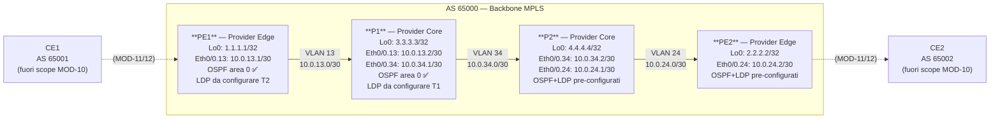

# Workbook Studenti — MOD-10: MPLS LDP & Fondamenta

> **Piattaforme supportate:** GNS3 · ContainerLab (vrnetlab/IOU) · EVE-NG
> Le configurazioni iniziali sono integrate nel workbook — caricamento via paste manuale.

**Area:** AREA 4 — MPLS | **Ore:** 2h | **Codici syllabus:** 2.1
**Prerequisito:** OSPF area 0 pre-configurato su PE1, P1, P2, PE2. Backbone IP già assegnato.

---

## 1. TOPOLOGIA

### Diagramma logico



> In questo modulo lavoriamo solo sul backbone. Le interfacce verso CE1 e CE2
> saranno attivate in MOD-11 (L3VPN) e MOD-12 (L2VPN).

### Piano di indirizzamento

| Device | Interfaccia   | Indirizzo IP      | Ruolo              | Note                    |
|--------|---------------|-------------------|--------------------|-------------------------|
| PE1    | Loopback0     | 1.1.1.1/32        | Router-ID / LDP    | MP-BGP update-source    |
| PE1    | Eth0/0.13     | 10.0.13.1/30      | Backbone → P1      | OSPF + MPLS (da abilitare) |
| P1     | Loopback0     | 3.3.3.3/32        | Router-ID / LDP    | Solo backbone           |
| P1     | Eth0/0.13     | 10.0.13.2/30      | Backbone → PE1     | OSPF + MPLS (da abilitare) |
| P1     | Eth0/0.34     | 10.0.34.1/30      | Backbone → P2      | OSPF + MPLS (da abilitare) |
| P2     | Loopback0     | 4.4.4.4/32        | Router-ID / LDP    | Solo backbone           |
| P2     | Eth0/0.34     | 10.0.34.2/30      | Backbone → P1      | Già configurato         |
| P2     | Eth0/0.24     | 10.0.24.1/30      | Backbone → PE2     | Già configurato         |
| PE2    | Loopback0     | 2.2.2.2/32        | Router-ID / LDP    | MP-BGP update-source    |
| PE2    | Eth0/0.24     | 10.0.24.2/30      | Backbone → P2      | Già configurato         |

> **NOTA:** P2 e PE2 hanno già LDP configurato nelle cfg di partenza.
> Il lab richiede di completare **P1** e **PE1**.

---

## 2. OBIETTIVI DELLA SESSIONE

Al termine di questo modulo lo studente sarà in grado di:

- [ ] Spiegare il funzionamento di MPLS: FEC, label, LIB, LFIB, PHP
- [ ] Configurare LDP su router IOS (ldp router-id, mpls ip su interfaccia)
- [ ] Verificare lo stato delle sessioni LDP e la forwarding table
- [ ] Eseguire un traceroute MPLS e interpretare il popping PHP

**Codici syllabus coperti:** 2.1

---

## 3. LAB SETUP

### Configurazione Iniziale

Incollare manualmente la configurazione su ogni device (paste diretto in CLI).

#### PE1

```
! MOD-10 — PE1 (Provider Edge 1)
! Stato iniziale: OSPF area 0 attivo — MPLS non ancora configurato
! Lo studente configura: mpls ldp router-id, mpls ip sulle interfacce backbone
!
hostname PE1
!
no ip domain lookup
ip routing
!
interface Loopback0
 ip address 1.1.1.1 255.255.255.255
 no shutdown
!
interface Ethernet0/0
 no ip address
 no shutdown
!
interface Ethernet0/0.13
 encapsulation dot1Q 13
 ip address 10.0.13.1 255.255.255.252
!
router ospf 1
 router-id 1.1.1.1
 network 1.1.1.1 0.0.0.0 area 0
 network 10.0.13.0 0.0.0.3 area 0
!
line con 0
 logging synchronous
!
end
```

#### P1

```
! MOD-10 — P1 (Provider Core 1)
! Stato iniziale: OSPF area 0 attivo — MPLS non ancora configurato
! Lo studente configura: mpls label protocol ldp, mpls ldp router-id, mpls ip sulle interfacce
!
hostname P1
!
no ip domain lookup
ip routing
!
interface Loopback0
 ip address 3.3.3.3 255.255.255.255
 no shutdown
!
interface Ethernet0/0
 no ip address
 no shutdown
!
interface Ethernet0/0.13
 encapsulation dot1Q 13
 ip address 10.0.13.2 255.255.255.252
!
interface Ethernet0/0.34
 encapsulation dot1Q 34
 ip address 10.0.34.1 255.255.255.252
!
router ospf 1
 router-id 3.3.3.3
 network 3.3.3.3 0.0.0.0 area 0
 network 10.0.13.0 0.0.0.3 area 0
 network 10.0.34.0 0.0.0.3 area 0
!
line con 0
 logging synchronous
!
end
```

#### P2

```
! MOD-10 — P2 (Provider Core 2)
! Stato iniziale: OSPF area 0 + MPLS LDP pre-configurati
! P2 e PE2 sono pre-configurati per permettere la verifica end-to-end
!
hostname P2
!
no ip domain lookup
ip routing
!
mpls label protocol ldp
!
interface Loopback0
 ip address 4.4.4.4 255.255.255.255
 no shutdown
!
interface Ethernet0/0
 no ip address
 no shutdown
!
interface Ethernet0/0.34
 encapsulation dot1Q 34
 ip address 10.0.34.2 255.255.255.252
 mpls ip
!
interface Ethernet0/0.24
 encapsulation dot1Q 24
 ip address 10.0.24.1 255.255.255.252
 mpls ip
!
router ospf 1
 router-id 4.4.4.4
 network 4.4.4.4 0.0.0.0 area 0
 network 10.0.34.0 0.0.0.3 area 0
 network 10.0.24.0 0.0.0.3 area 0
!
mpls ldp router-id Loopback0 force
!
line con 0
 logging synchronous
!
end
```

#### PE2

```
! MOD-10 — PE2 (Provider Edge 2)
! Stato iniziale: OSPF area 0 + MPLS LDP pre-configurati
! PE2 e P2 sono pre-configurati — lo studente completa solo PE1 e P1
!
hostname PE2
!
no ip domain lookup
ip routing
!
mpls label protocol ldp
!
interface Loopback0
 ip address 2.2.2.2 255.255.255.255
 no shutdown
!
interface Ethernet0/0
 no ip address
 no shutdown
!
interface Ethernet0/0.24
 encapsulation dot1Q 24
 ip address 10.0.24.2 255.255.255.252
 mpls ip
!
router ospf 1
 router-id 2.2.2.2
 network 2.2.2.2 0.0.0.0 area 0
 network 10.0.24.0 0.0.0.3 area 0
!
mpls ldp router-id Loopback0 force
!
line con 0
 logging synchronous
!
end
```

### Prerequisiti

- GNS3 avviato con topologia MOD-10 caricata
- OSPF area 0 attivo su tutti i link backbone (PE1-P1, P1-P2, P2-PE2)
- Tutti i loopback raggiungibili via OSPF (verificare con `show ip route ospf`)

### Verifica pre-lab

Eseguire su ogni router backbone prima di iniziare:

```
show ip ospf neighbor
show ip route ospf
```

Output atteso su PE1:

```
PE1# show ip ospf neighbor
Neighbor ID   Pri  State         Interface
3.3.3.3         1  FULL/DR       Ethernet0/0.13

PE1# show ip route ospf
O     3.3.3.3/32 [110/11] via 10.0.13.2, Eth0/0.13
O     4.4.4.4/32 [110/21] via 10.0.13.2, Eth0/0.13
O     2.2.2.2/32 [110/31] via 10.0.13.2, Eth0/0.13
```

Se OSPF non è convergente, **non procedere** — LDP dipende dalla routing table IP.

---

## 4. TASK LIST

| #  | Task                                        | Codice | Tempo stimato |
|----|---------------------------------------------|--------|---------------|
| T1 | Abilitare MPLS LDP su P1                    | 2.1    | 15 min        |
| T2 | Abilitare MPLS LDP su PE1                   | 2.1    | 10 min        |
| T3 | Verificare full label reachability backbone  | 2.1    | 15 min        |
| T4 | Traceroute MPLS e analisi PHP               | 2.1    | 10 min        |

---

## 5. DETTAGLIO TASK

---

### T1 — Abilitare MPLS LDP su P1

#### TEORIA

**MPLS — Multiprotocol Label Switching**

MPLS sostituisce il classico lookup IP hop-by-hop con uno switching basato su
**label numeriche** a 20 bit, molto più veloci da processare.

Terminologia fondamentale:

| Termine | Significato |
|---------|-------------|
| **FEC** (Forwarding Equivalence Class) | Un prefisso IP che riceve una label (es. 1.1.1.1/32) |
| **LIB** (Label Information Base) | Database di tutti i binding label↔FEC ricevuti via LDP |
| **LFIB** (Label Forwarding Information Base) | Subset attivo usato per il forwarding reale |
| **PHP** (Penultimate Hop Popping) | Il penultimo router rimuove la label outer prima del PE egress |

**Come funziona LDP (Label Distribution Protocol)**

1. Ogni router invia **hello multicast** (UDP 646) su ogni interfaccia abilitata.
   I vicini si scoprono senza configurazione manuale.
2. Una sessione **TCP porta 646** viene stabilita tra i loopback dei due router
   (non sull'indirizzo del link — per questo serve `ldp router-id Loopback0`).
3. I due router si scambiano **label binding** per ogni prefisso nella propria
   routing table.
4. Il data plane usa le label per operazioni di **swap / push / pop** senza
   mai guardare l'indirizzo IP di destinazione del payload.

**PHP — perché è importante**

Il PE egress annuncia la propria loopback con label **implicit-null (valore 3)**.
Questo dice al penultimo hop (P1) di fare **POP** dell'outer label invece di
SWAP. Il PE riceve il pacchetto con una label in meno e deve fare un solo
lookup invece di due.

#### TASK

Configurare LDP su P1:

```
P1# configure terminal

! Passo 1: abilita LDP globalmente e imposta il router-id forzato sul loopback
P1(config)# mpls label protocol ldp
P1(config)# mpls ldp router-id Loopback0 force

! Passo 2: abilita MPLS IP sull'interfaccia verso PE1
P1(config)# interface Ethernet0/0.13
P1(config-if)# mpls ip

! Passo 3: abilita MPLS IP sull'interfaccia verso P2
P1(config)# interface Ethernet0/0.34
P1(config-if)# mpls ip

P1(config-if)# end
```

> **Nota IOU:** su IOS-based IOU non serve `mpls label protocol ldp`
> (è già il default). La riga non causa errori ma può essere omessa.

#### VERIFICA

```
P1# show mpls interfaces
Interface              IP            Tunnel   BGP Static Operational
Ethernet0/0.13         Yes (ldp)     No       No  No     Yes
Ethernet0/0.34         Yes (ldp)     No       No  No     Yes

P1# show mpls ldp neighbor
    Peer LDP Ident: 1.1.1.1:0; Local LDP Ident 3.3.3.3:0
        State: Oper; Downstream; via Eth0/0.13
    Peer LDP Ident: 4.4.4.4:0; Local LDP Ident 3.3.3.3:0
        State: Oper; Downstream; via Eth0/0.34
```

Entrambi i neighbor devono essere in stato **Oper**.

---

### T2 — Abilitare MPLS LDP su PE1

#### TEORIA

PE1 è il **PE (Provider Edge)** — il router che si interfaccia con i
customer. Deve partecipare all'LSP (Label Switched Path) del backbone.

La procedura è identica a P1, ma PE1 ha **un solo link backbone** (verso P1).

#### TASK

```
PE1# configure terminal

PE1(config)# mpls label protocol ldp
PE1(config)# mpls ldp router-id Loopback0 force

PE1(config)# interface Ethernet0/0.13
PE1(config-if)# mpls ip

PE1(config-if)# end
```

#### VERIFICA

```
PE1# show mpls interfaces
Interface              IP            Tunnel   BGP Static Operational
Ethernet0/0.13         Yes (ldp)     No       No  No     Yes

PE1# show mpls ldp neighbor
    Peer LDP Ident: 3.3.3.3:0; Local LDP Ident 1.1.1.1:0
        State: Oper; Downstream; via Eth0/0.13
```

Il neighbor deve essere **3.3.3.3 (P1)** in stato Oper.
Se rimane in Active, verificare che OSPF sia convergente.

---

### T3 — Verificare full label reachability backbone

#### TEORIA

Con LDP attivo su tutti i link backbone (PE1-P1, P1-P2, P2-PE2), ogni router
conosce label per i loopback di tutti gli altri. Questo crea un **LSP (Label
Switched Path)** end-to-end tra PE1 e PE2.

La **LFIB** (`show mpls forwarding-table`) mostra le label usate per il
forwarding. Per la loopback 2.2.2.2 (PE2), PE1 avrà un'entry con label
outgoing verso P1.

#### TASK

Eseguire i seguenti comandi su **tutti** i router backbone e raccogliere
l'output:

```
! Su PE1:
PE1# show mpls ldp neighbor
PE1# show mpls forwarding-table

! Su P1:
P1# show mpls ldp neighbor
P1# show mpls forwarding-table

! Su P2:
P2# show mpls ldp neighbor
P2# show mpls forwarding-table

! Su PE2:
PE2# show mpls ldp neighbor
PE2# show mpls forwarding-table
```

Poi eseguire il ping end-to-end tra loopback:

```
PE1# ping 2.2.2.2 source Loopback0 repeat 5
```

#### VERIFICA

Output atteso `show mpls forwarding-table` su PE1 (estratto):

```
PE1# show mpls forwarding-table
Local  Outgoing    Prefix              Bytes     Outgoing   Next Hop
Label  Label or    or Tunnel Id        Switched  interface
       Tunnel-Id
16     16          2.2.2.2/32          0         Et0/0.13   10.0.13.2
17     17          3.3.3.3/32          0         Et0/0.13   10.0.13.2
18     18          4.4.4.4/32          0         Et0/0.13   10.0.13.2
```

Ping atteso:

```
PE1# ping 2.2.2.2 source Loopback0
!!!!!
Success rate is 100 percent (5/5)
```

> **Domanda:** Perché il ping verso 2.2.2.2 usa label switching anche se
> PE1 conosce la rotta OSPF? Chi decide di usare MPLS invece di IP puro?

---

### T4 — Traceroute MPLS e analisi PHP

#### TEORIA

Il **traceroute MPLS** mostra il percorso dell'LSP hop per hop, incluse le
label usate. Il comando `traceroute mpls ipv4 X.X.X.X/32` verifica che
esista un LSP valido verso il FEC specificato.

Il **traceroute IP normale** (`traceroute 2.2.2.2 source Lo0`) mostra invece
gli indirizzi IP dei router intermedi. Combinando i due si può osservare il
PHP: l'ultimo hop prima di PE2 non mostra label.

#### TASK

```
! Traceroute IP con source loopback (osservare gli hop intermedi)
PE1# traceroute 2.2.2.2 source Loopback0

! Traceroute MPLS specifico per il FEC 2.2.2.2/32
PE1# traceroute mpls ipv4 2.2.2.2/32

! Verifica forwarding table per il prefisso 2.2.2.2/32
PE1# show mpls forwarding-table | include 2.2.2.2
```

#### VERIFICA

```
PE1# traceroute 2.2.2.2 source Loopback0
  1  10.0.13.2    [MPLS: Label 16 Exp 0]   (P1)
  2  10.0.34.2    [MPLS: Label 16 Exp 0]   (P2)
  3  2.2.2.2                                (PE2 — nessuna label: PHP già avvenuto su P2)
```

> **Analisi PHP:** P2 è il penultimo hop. Ha ricevuto da PE2 la label
> implicit-null (3) per 2.2.2.2/32, quindi fa **POP** invece di SWAP.
> PE2 riceve il pacchetto **senza label outer** e lo forwarda direttamente.

```
PE1# traceroute mpls ipv4 2.2.2.2/32
!!!!!
Success rate is 100 percent (5/5), round-trip min/avg/max = 1/2/4 ms
```

---

## 6. TROUBLESHOOTING GUIDE

| Sintomo | Causa probabile | Diagnosi | Fix |
|---------|----------------|----------|-----|
| `show mpls ldp neighbor` vuoto | `mpls ip` mancante sull'interfaccia | `show mpls interfaces` — colonna Operational = No | Aggiungere `mpls ip` sull'interfaccia |
| Neighbor in stato **Active** | LDP non raggiunge il peer via TCP | OSPF deve essere Up prima: `show ip ospf neighbor` | Risolvere OSPF, poi LDP si alza automaticamente |
| Neighbor in stato **Oper** ma nessuna label per 2.2.2.2 | `mpls ldp router-id` non impostato | `show mpls ldp bindings` — mancano entry | `mpls ldp router-id Loopback0 force` e riavviare LDP |
| Ping 2.2.2.2 source Lo0 fallisce | OSPF non ha 2.2.2.2/32 in tabella | `show ip route 2.2.2.2` | Verificare OSPF su tutta la backbone |
| MTU mismatch LDP | MTU diverso sulle interfacce | `show interfaces Eth0/0.13 | include MTU` | Allineare MTU o impostare `mpls mtu` |

---

## 7. SOLUZIONI

> Le soluzioni complete con output commentati sono nel file `soluzione.md`.

**Configurazione P1 — sintesi:**

```
mpls label protocol ldp
mpls ldp router-id Loopback0 force
!
interface Ethernet0/0.13
 mpls ip
!
interface Ethernet0/0.34
 mpls ip
```

**Configurazione PE1 — sintesi:**

```
mpls label protocol ldp
mpls ldp router-id Loopback0 force
!
interface Ethernet0/0.13
 mpls ip
```

---

## 8. RIEPILOGO & EXAM TIPS

**Punti chiave:**

- MPLS usa label a 20 bit per fare switching senza lookup IP hop-by-hop
- LDP distribuisce label via TCP 646 tra loopback — OSPF deve essere convergente prima
- La LFIB (`show mpls forwarding-table`) contiene solo le label attive per il forwarding
- PHP (implicit-null label 3) ottimizza il PE egress: riceve pacchetti senza outer label
- `mpls ldp router-id Loopback0 force` è obbligatorio per usare il loopback come transport

**Domande tipo CCNP:**

1. Qual è la differenza tra LIB e LFIB?
2. Cosa significa implicit-null e quale router lo annuncia?
3. Un router P nel backbone vede mai l'indirizzo IP destination del payload customer?
4. Se OSPF non è convergente, LDP si alza ugualmente? Perché?
5. Quante label ha un pacchetto MPLS puro (solo LDP, nessuna VPN) a metà del backbone?


---

> © 2026 Matteo Mirenda — Tutti i diritti riservati.
> Materiale ad uso esclusivo degli studenti iscritti al corso.
> Vietata la riproduzione, distribuzione o condivisione
> senza autorizzazione scritta dell'autore.
> CCNP ENCOR 350-401 

---
