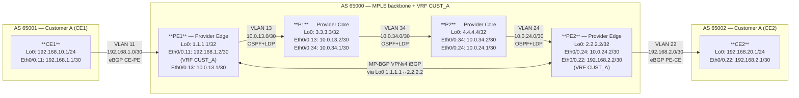

# Workbook Studenti — MOD-11: MPLS L3VPN

> **Piattaforme supportate:** GNS3 · ContainerLab (vrnetlab/IOU) · EVE-NG
> Le configurazioni iniziali sono integrate nel workbook — caricamento via paste manuale.

**Area:** AREA 4 — MPLS | **Ore:** 2h | **Codici syllabus:** 2.2
**Prerequisito:** MOD-10 completato — LDP attivo su tutta la backbone (PE1, P1, P2, PE2).

---

## 1. TOPOLOGIA

### Diagramma logico



### Piano di indirizzamento

| Device | Interfaccia   | Indirizzo IP        | Ruolo                 | Note                  |
|--------|---------------|---------------------|-----------------------|-----------------------|
| PE1    | Loopback0     | 1.1.1.1/32          | Router-ID / MP-BGP    | update-source         |
| PE1    | Eth0/0.13     | 10.0.13.1/30        | Backbone → P1         | Da MOD-10             |
| PE1    | Eth0/0.11     | 192.168.1.2/30      | → CE1 (VRF CUST_A)    | Da abilitare          |
| CE1    | Eth0/0.11     | 192.168.1.1/30      | → PE1 (eBGP AS65001)  |                       |
| PE2    | Loopback0     | 2.2.2.2/32          | Router-ID / MP-BGP    | update-source         |
| PE2    | Eth0/0.24     | 10.0.24.2/30        | Backbone → P2         | Da MOD-10             |
| PE2    | Eth0/0.22     | 192.168.2.2/30      | → CE2 (VRF CUST_A)    | Da abilitare          |
| CE2    | Eth0/0.22     | 192.168.2.1/30      | → PE2 (eBGP AS65002)  |                       |

### Parametri VPN

| Parametro             | Valore          |
|-----------------------|-----------------|
| AS Provider           | 65000           |
| AS Customer A (CE1)   | 65001           |
| AS Customer B (CE2)   | 65002           |
| VRF Name              | CUST_A          |
| Route Distinguisher   | 65000:100       |
| Route Target export   | 65000:100       |
| Route Target import   | 65000:100       |
| MP-BGP peer PE1       | 1.1.1.1 (Lo0)   |
| MP-BGP peer PE2       | 2.2.2.2 (Lo0)   |

---

## 2. OBIETTIVI DELLA SESSIONE

Al termine di questo modulo lo studente sarà in grado di:

- [ ] Creare una VRF con Route Distinguisher e Route Target corretti
- [ ] Configurare MP-BGP iBGP tra PE per il trasporto VPNv4
- [ ] Configurare eBGP CE-PE all'interno della VRF
- [ ] Verificare il doppio stack di label (outer LDP + inner VPN) e tracciare il percorso end-to-end

**Codici syllabus coperti:** 2.2

---

## 3. LAB SETUP

### Configurazione Iniziale

Incollare manualmente la configurazione su ogni device (paste diretto in CLI).
P1 e P2 sono identici allo stato finale di MOD-10 (MPLS LDP già configurato).

#### PE1

```
! MOD-11 — PE1 (Provider Edge 1)
! Stato iniziale: MOD-10 completato (OSPF + MPLS LDP up)
! Interfaccia CE1 pre-configurata con IP ma SENZA VRF
! Lo studente configura: ip vrf CUST_A, ip vrf forwarding, MP-BGP VPNv4, eBGP CE-PE
! NOTA: quando si esegue "ip vrf forwarding CUST_A" su Eth0/0.11
!        l'indirizzo IP viene rimosso automaticamente da IOS — riassegnarlo subito.
!
hostname PE1
!
no ip domain lookup
ip routing
!
mpls label protocol ldp
!
interface Loopback0
 ip address 1.1.1.1 255.255.255.255
 no shutdown
!
interface Ethernet0/0
 no ip address
 no shutdown
!
interface Ethernet0/0.13
 encapsulation dot1Q 13
 ip address 10.0.13.1 255.255.255.252
 mpls ip
!
interface Ethernet0/0.11
 encapsulation dot1Q 11
 ip address 192.168.1.2 255.255.255.252
!
router ospf 1
 router-id 1.1.1.1
 network 1.1.1.1 0.0.0.0 area 0
 network 10.0.13.0 0.0.0.3 area 0
!
mpls ldp router-id Loopback0 force
!
line con 0
 logging synchronous
!
end
```

#### PE2

```
! MOD-11 — PE2 (Provider Edge 2)
! Stato iniziale: MOD-10 completato (OSPF + MPLS LDP up)
! Interfaccia CE2 pre-configurata con IP ma SENZA VRF
! Lo studente configura: ip vrf CUST_A, ip vrf forwarding, eBGP CE-PE
!
hostname PE2
!
no ip domain lookup
ip routing
!
mpls label protocol ldp
!
interface Loopback0
 ip address 2.2.2.2 255.255.255.255
 no shutdown
!
interface Ethernet0/0
 no ip address
 no shutdown
!
interface Ethernet0/0.24
 encapsulation dot1Q 24
 ip address 10.0.24.2 255.255.255.252
 mpls ip
!
interface Ethernet0/0.22
 encapsulation dot1Q 22
 ip address 192.168.2.2 255.255.255.252
!
router ospf 1
 router-id 2.2.2.2
 network 2.2.2.2 0.0.0.0 area 0
 network 10.0.24.0 0.0.0.3 area 0
!
mpls ldp router-id Loopback0 force
!
line con 0
 logging synchronous
!
end
```

#### P1

```
! MOD-11 — P1 (Provider Core 1)
! Stato iniziale: uguale al risultato finale di MOD-10 (OSPF + MPLS LDP full)
! P1 non richiede modifiche in questo modulo
!
hostname P1
!
no ip domain lookup
ip routing
!
mpls label protocol ldp
!
interface Loopback0
 ip address 3.3.3.3 255.255.255.255
 no shutdown
!
interface Ethernet0/0
 no ip address
 no shutdown
!
interface Ethernet0/0.13
 encapsulation dot1Q 13
 ip address 10.0.13.2 255.255.255.252
 mpls ip
!
interface Ethernet0/0.34
 encapsulation dot1Q 34
 ip address 10.0.34.1 255.255.255.252
 mpls ip
!
router ospf 1
 router-id 3.3.3.3
 network 3.3.3.3 0.0.0.0 area 0
 network 10.0.13.0 0.0.0.3 area 0
 network 10.0.34.0 0.0.0.3 area 0
!
mpls ldp router-id Loopback0 force
!
line con 0
 logging synchronous
!
end
```

#### P2

```
! MOD-11 — P2 (Provider Core 2)
! Stato iniziale: uguale al risultato finale di MOD-10 (OSPF + MPLS LDP full)
! P2 non richiede modifiche in questo modulo
!
hostname P2
!
no ip domain lookup
ip routing
!
mpls label protocol ldp
!
interface Loopback0
 ip address 4.4.4.4 255.255.255.255
 no shutdown
!
interface Ethernet0/0
 no ip address
 no shutdown
!
interface Ethernet0/0.34
 encapsulation dot1Q 34
 ip address 10.0.34.2 255.255.255.252
 mpls ip
!
interface Ethernet0/0.24
 encapsulation dot1Q 24
 ip address 10.0.24.1 255.255.255.252
 mpls ip
!
router ospf 1
 router-id 4.4.4.4
 network 4.4.4.4 0.0.0.0 area 0
 network 10.0.34.0 0.0.0.3 area 0
 network 10.0.24.0 0.0.0.3 area 0
!
mpls ldp router-id Loopback0 force
!
line con 0
 logging synchronous
!
end
```

#### CE1

```
! MOD-11 — CE1 (Customer Edge 1 — AS 65001)
! Stato iniziale: connettività verso PE1 attiva — nessun routing dinamico
! Lo studente configura: BGP AS 65001, neighbor PE1, network statement
!
hostname CE1
!
no ip domain lookup
ip routing
!
interface Loopback0
 ip address 192.168.10.1 255.255.255.0
 no shutdown
!
interface Ethernet0/0
 no ip address
 no shutdown
!
interface Ethernet0/0.11
 encapsulation dot1Q 11
 ip address 192.168.1.1 255.255.255.252
!
ip route 0.0.0.0 0.0.0.0 192.168.1.2
!
line con 0
 logging synchronous
!
end
```

#### CE2

```
! MOD-11 — CE2 (Customer Edge 2 — AS 65002)
! Stato iniziale: connettività verso PE2 attiva — nessun routing dinamico
! Lo studente configura: BGP AS 65002, neighbor PE2, network statement
!
hostname CE2
!
no ip domain lookup
ip routing
!
interface Loopback0
 ip address 192.168.20.1 255.255.255.0
 no shutdown
!
interface Ethernet0/0
 no ip address
 no shutdown
!
interface Ethernet0/0.22
 encapsulation dot1Q 22
 ip address 192.168.2.1 255.255.255.252
!
ip route 0.0.0.0 0.0.0.0 192.168.2.2
!
line con 0
 logging synchronous
!
end
```

### Prerequisiti

- MOD-10 completato: LDP Up su PE1-P1, P1-P2, P2-PE2
- Ping 1.1.1.1 ↔ 2.2.2.2 source Loopback0 funzionante via MPLS

### Verifica pre-lab

```
PE1# show mpls ldp neighbor
! Atteso: State: Oper — peer 3.3.3.3

PE1# ping 2.2.2.2 source Loopback0
! Atteso: !!!!! Success rate 100%
```

Se uno dei due check fallisce, tornare a MOD-10 e risolvere LDP prima di continuare.

---

## 4. TASK LIST

| #  | Task                                         | Codice | Tempo stimato |
|----|----------------------------------------------|--------|---------------|
| T1 | Definire VRF CUST_A su PE1 e PE2             | 2.2    | 20 min        |
| T2 | Configurare MP-BGP iBGP PE1 ↔ PE2 (VPNv4)   | 2.2    | 20 min        |
| T3 | Configurare eBGP CE-PE (CE1↔PE1, CE2↔PE2)   | 2.2    | 20 min        |
| T4 | Verifica end-to-end e analisi label stack     | 2.2    | 10 min        |

---

## 5. DETTAGLIO TASK

---

### T1 — Definire VRF CUST_A su PE1 e PE2

#### TEORIA

**VRF — Virtual Routing and Forwarding**

Una VRF è una routing table separata all'interno dello stesso router.
Permette di ospitare traffico di clienti diversi sullo stesso backbone
senza che si vedano a vicenda — anche se usano gli stessi prefissi IP.

**Route Distinguisher (RD) vs Route Target (RT) — differenza fondamentale**

| Attributo | Scopo | Chi lo usa | Formato |
|-----------|-------|-----------|---------|
| **RD** | Rende unico il prefisso VPN nel BGP table globale. Due VRF su PE diversi possono avere 10.0.0.0/8 — RD diverso → nessun conflitto. | Solo PE (locale) | AS:nn (es. 65000:100) |
| **RT** | Controlla la distribuzione delle route tra VRF. export = "chi annuncia"; import = "chi accetta" | Tutti i PE della VPN | AS:nn (es. 65000:100) |

Per una VPN full-mesh semplice come questa: **RD = RT = stessa stringa**.

**VPNv4 = RD + prefisso IPv4 del customer**

Il prefisso 192.168.1.0/30 di CE1 diventa, in BGP:
`65000:100:192.168.1.0/30` — globalmente unico nel backbone.

#### TASK

Configurare VRF CUST_A su PE1:

```
PE1# configure terminal

! Crea la VRF con RD e RT
PE1(config)# ip vrf CUST_A
PE1(config-vrf)# rd 65000:100
PE1(config-vrf)# route-target export 65000:100
PE1(config-vrf)# route-target import 65000:100
PE1(config-vrf)# exit

! Assegna l'interfaccia verso CE1 alla VRF
! ATTENZIONE: l'IP viene rimosso automaticamente → riassegnarlo subito
PE1(config)# interface Ethernet0/0.11
PE1(config-if)# encapsulation dot1Q 11
PE1(config-if)# ip vrf forwarding CUST_A
PE1(config-if)# ip address 192.168.1.2 255.255.255.252
PE1(config-if)# no shutdown
PE1(config-if)# end
```

Ripetere su PE2 (interfaccia Eth0/0.22, IP 192.168.2.2/30):

```
PE2(config)# ip vrf CUST_A
PE2(config-vrf)# rd 65000:100
PE2(config-vrf)# route-target export 65000:100
PE2(config-vrf)# route-target import 65000:100
PE2(config-vrf)# exit

PE2(config)# interface Ethernet0/0.22
PE2(config-if)# encapsulation dot1Q 22
PE2(config-if)# ip vrf forwarding CUST_A
PE2(config-if)# ip address 192.168.2.2 255.255.255.252
PE2(config-if)# no shutdown
PE2(config-if)# end
```

> **Trappola comune:** dopo `ip vrf forwarding CUST_A`, IOS **cancella l'IP**.
> Se dimentichi di riassegnarlo, il neighbor eBGP verso il CE non sale mai.
> Verifica immediata: `show ip int brief | include Eth0/0`

#### VERIFICA

```
PE1# show ip vrf
  Name                             Default RD          Interfaces
  CUST_A                           65000:100           Et0/0.11

PE1# show ip route vrf CUST_A
! Atteso: solo la rete connected 192.168.1.0/30
C   192.168.1.0/30 is directly connected, Ethernet0/0.11
```

---

### T2 — MP-BGP iBGP tra PE1 e PE2 (address-family vpnv4)

#### TEORIA

**MP-BGP (RFC 4760) — Multi-Protocol BGP**

MP-BGP estende BGP per trasportare famiglie di indirizzi diverse da IPv4.
In L3VPN usa l'`address-family vpnv4`.

Ogni NLRI VPNv4 trasportato contiene:
- Prefisso: RD + prefisso IP customer → identificatore globalmente unico
- Next-hop: loopback del PE annunciante (raggiungibile via LDP/MPLS)
- VPN label: allocata dall'egress PE per identificare VRF e interfaccia di uscita
- Extended community RT: controlla quali VRF importano la route

La sessione iBGP usa i loopback come source (`update-source Loopback0`):
il percorso fisico tra PE1 e PE2 usa MPLS, ma BGP lavora solo a livello IP.

**Perché `send-community extended`?**
Il Route Target è trasportato come BGP extended community.
Senza questo comando, le RT non vengono inviate e il peer non sa
quali route importare — la VRF rimane vuota.

#### TASK

Configurare su PE1:

```
PE1(config)# router bgp 65000
PE1(config-router)# bgp router-id 1.1.1.1
PE1(config-router)# neighbor 2.2.2.2 remote-as 65000
PE1(config-router)# neighbor 2.2.2.2 update-source Loopback0
PE1(config-router)# !
PE1(config-router)# address-family vpnv4
PE1(config-router-af)# neighbor 2.2.2.2 activate
PE1(config-router-af)# neighbor 2.2.2.2 send-community extended
PE1(config-router-af)# exit-address-family
PE1(config-router)# end
```

Configurare su PE2 (speculare):

```
PE2(config)# router bgp 65000
PE2(config-router)# bgp router-id 2.2.2.2
PE2(config-router)# neighbor 1.1.1.1 remote-as 65000
PE2(config-router)# neighbor 1.1.1.1 update-source Loopback0
PE2(config-router)# !
PE2(config-router)# address-family vpnv4
PE2(config-router-af)# neighbor 1.1.1.1 activate
PE2(config-router-af)# neighbor 1.1.1.1 send-community extended
PE2(config-router-af)# exit-address-family
PE2(config-router)# end
```

#### VERIFICA

```
PE1# show bgp vpnv4 unicast summary
Neighbor        V    AS MsgRcvd MsgSent   TblVer  InQ OutQ Up/Down  State/PfxRcd
2.2.2.2         4 65000      10      10        1    0    0 00:01:30  0
```

Commento: `State/PfxRcd = 0` è corretto — la VRF esiste ma CE non ha ancora
annunciato prefix via eBGP.

---

### T3 — eBGP CE-PE (CE1↔PE1 e CE2↔PE2)

#### TEORIA

**eBGP CE-PE — routing tra customer e provider**

Il CE (Customer Edge) parla eBGP con il PE.
Il PE configura il neighbor CE **all'interno della VRF** (`address-family ipv4 vrf`).
Il CE non sa nulla di MPLS o VRF — vede solo una normale sessione eBGP.

Questo è il punto di ingresso delle route customer nel backbone VPN:
CE1 annuncia 192.168.1.0/30 → PE1 la installa in VRF CUST_A →
PE1 la ridistribuisce via MP-BGP a PE2 → PE2 la installa in VRF CUST_A →
PE2 la annuncia via eBGP a CE2.

#### TASK

Configurare PE1 (neighbor CE1 nella VRF):

```
PE1(config)# router bgp 65000
PE1(config-router)# address-family ipv4 vrf CUST_A
PE1(config-router-af)# neighbor 192.168.1.1 remote-as 65001
PE1(config-router-af)# neighbor 192.168.1.1 activate
PE1(config-router-af)# exit-address-family
PE1(config-router)# end
```

Configurare CE1:

```
CE1(config)# router bgp 65001
CE1(config-router)# bgp router-id 192.168.1.1
CE1(config-router)# neighbor 192.168.1.2 remote-as 65000
CE1(config-router)# !
CE1(config-router)# address-family ipv4
CE1(config-router-af)# network 192.168.1.0 mask 255.255.255.252
CE1(config-router-af)# neighbor 192.168.1.2 activate
CE1(config-router-af)# exit-address-family
CE1(config-router)# end
```

Ripetere su PE2 e CE2:

```
! PE2:
PE2(config)# router bgp 65000
PE2(config-router)# address-family ipv4 vrf CUST_A
PE2(config-router-af)# neighbor 192.168.2.1 remote-as 65002
PE2(config-router-af)# neighbor 192.168.2.1 activate
PE2(config-router-af)# exit-address-family

! CE2:
CE2(config)# router bgp 65002
CE2(config-router)# bgp router-id 192.168.2.1
CE2(config-router)# neighbor 192.168.2.2 remote-as 65000
CE2(config-router)# !
CE2(config-router)# address-family ipv4
CE2(config-router-af)# network 192.168.2.0 mask 255.255.255.252
CE2(config-router-af)# neighbor 192.168.2.2 activate
CE2(config-router-af)# exit-address-family
```

#### VERIFICA

```
PE1# show bgp vpnv4 unicast vrf CUST_A summary
Neighbor        V    AS MsgRcvd MsgSent   TblVer  InQ OutQ Up/Down  State/PfxRcd
192.168.1.1     4 65001      8       8        3    0    0 00:00:45  1
2.2.2.2         4 65000     15      15        3    0    0 00:02:10  1

PE1# show ip route vrf CUST_A
C   192.168.1.0/30 is directly connected, Et0/0.11
B   192.168.2.0/30 [200/0] via 2.2.2.2, label [16 20]
!                                                outer LDP  inner VPN
```

---

### T4 — Verifica end-to-end e analisi label stack

#### TEORIA

**Il doppio stack di label — schema riassuntivo**

Quando CE2 manda traffico verso CE1 (attraverso PE2 → P2 → P1 → PE1):

```
CE2 → PE2:  [IP: 192.168.2.1 → 192.168.1.1]  (nessuna label)
PE2 → P2:   [outer=16 LDP][inner=20 VPN][IP payload]
P2 → P1:    [outer=22 LDP][inner=20 VPN][IP payload]   (swap outer)
P1 → PE1:   [inner=20 VPN][IP payload]                 (PHP: pop outer)
PE1 → CE1:  [IP: 192.168.2.1 → 192.168.1.1]            (pop inner, forward)
```

I router P **non vedono mai** l'IP del customer. Lavorano solo sulla label outer.
PE1 usa la label inner 20 per identificare VRF CUST_A e l'uscita verso CE1.

#### TASK

```
! Test: ping da CE1 a CE2 (end-to-end VPN)
CE1# ping 192.168.2.1 source Ethernet0/0.11

! Verifica prefissi VPNv4 su PE1 con dettaglio label
PE1# show bgp vpnv4 unicast vrf CUST_A 192.168.2.0

! Verifica forwarding table VRF su PE2 (label stack completo)
PE2# show ip route vrf CUST_A

! Verifica LFIB VPN su PE2
PE2# show mpls forwarding-table vrf CUST_A
```

#### VERIFICA

```
CE1# ping 192.168.2.1 source Ethernet0/0.11
!!!!!
Success rate is 100 percent (5/5)

PE1# show bgp vpnv4 unicast vrf CUST_A 192.168.2.0
BGP routing table entry for 65000:100:192.168.2.0/30
  192.168.2.1 from 2.2.2.2 (2.2.2.2)
  Extended Community: RT:65000:100
  mpls labels in/out nolabel/19
!                          ↑
!                          VPN label 19 allocata da PE2 per questo prefisso
!                          PE1 la usa come inner label quando manda traffico verso CE2

PE2# show ip route vrf CUST_A
B   192.168.1.0/30 [200/0] via 1.1.1.1, label [16 20]
!                                           outer LDP  inner VPN allocata da PE1
```

> **Domanda riflessione:** Perché `ping vrf CUST_A 192.168.2.1 source Lo0`
> da PE1 non funziona, mentre funziona da CE1?
> (Il loopback di PE1 non è nel VRF CUST_A — non ha una route VPN associata.)

---

## 6. TROUBLESHOOTING GUIDE

| Sintomo | Causa probabile | Diagnosi | Fix |
|---------|----------------|----------|-----|
| BGP vpnv4 stuck in **Active** | Loopback peer non raggiungibile via MPLS | `ping 2.2.2.2 source Lo0` da PE1 | Verificare LDP da MOD-10 |
| BGP Established ma 0 prefix in VRF | `send-community extended` mancante | `show bgp vpnv4 unicast all` — RT assente | Aggiungere `send-community extended` e reset neighbor |
| Interfaccia CE perde l'IP dopo VRF | Comportamento IOS normale | `show ip int brief` | Riassegnare `ip address` dopo `ip vrf forwarding` |
| CE-PE eBGP in **Active** | Interfaccia non nella VRF, IP non assegnato | `show ip int brief \| include Eth0/0.11` | Verificare IP e VRF sull'interfaccia PE |
| Route VRF presenti su PE1 ma ping CE1→CE2 fallisce | RT mismatch (import ≠ export) | `show bgp vpnv4 unicast all` — verificare RT su entrambi i PE | Allineare route-target import su PE2 |
| `show ip route vrf CUST_A` mostra label [0 0] | LDP non ha label per il loopback PE remoto | `show mpls forwarding-table` — manca entry per 2.2.2.2 | Verificare LDP backbone da MOD-10 |

---

## 7. SOLUZIONI

> Le configurazioni complete con output commentati sono nel file `soluzione.md`.

**Sintesi configurazione PE1:**

```
ip vrf CUST_A
 rd 65000:100
 route-target export 65000:100
 route-target import 65000:100
!
interface Ethernet0/0.11
 encapsulation dot1Q 11
 ip vrf forwarding CUST_A
 ip address 192.168.1.2 255.255.255.252
!
router bgp 65000
 bgp router-id 1.1.1.1
 neighbor 2.2.2.2 remote-as 65000
 neighbor 2.2.2.2 update-source Loopback0
 !
 address-family vpnv4
  neighbor 2.2.2.2 activate
  neighbor 2.2.2.2 send-community extended
 exit-address-family
 !
 address-family ipv4 vrf CUST_A
  neighbor 192.168.1.1 remote-as 65001
  neighbor 192.168.1.1 activate
 exit-address-family
```

---

## 8. RIEPILOGO & EXAM TIPS

**Punti chiave:**

- Il RD rende il prefisso unico nel BGP table globale; il RT controlla import/export tra VRF
- MP-BGP VPNv4 trasporta: prefisso VPN, next-hop (loopback PE), VPN label, RT
- `send-community extended` è obbligatorio: senza di esso il RT non viene inviato
- `ip vrf forwarding` su un'interfaccia cancella l'IP — riassegnarlo immediatamente
- La route VPN in `show ip route vrf CUST_A` mostra il double label: `[outer-LDP inner-VPN]`

**Domande tipo CCNP:**

1. Qual è la differenza tra RD e RT? Uno dei due può essere uguale su due PE diversi?
2. Perché la sessione MP-BGP tra PE1 e PE2 usa i loopback e non gli IP dei link?
3. Cosa succede se `send-community extended` manca su un solo PE?
4. Un router P nel backbone vede la VPN label? Perché?
5. In uno scenario hub-and-spoke come si configurano RT import/export diversamente?


---

> © 2026 Matteo Mirenda — Tutti i diritti riservati.
> Materiale ad uso esclusivo degli studenti iscritti al corso.
> Vietata la riproduzione, distribuzione o condivisione
> senza autorizzazione scritta dell'autore.
> CCNP ENCOR 350-401 

---
