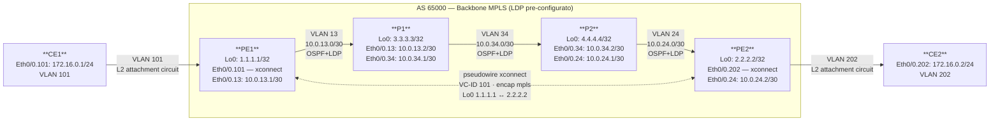

# Workbook Studenti — MOD-12: MPLS L2VPN (xconnect / AToM)

> **Piattaforme supportate:** GNS3 · ContainerLab (vrnetlab/IOU) · EVE-NG
> Le configurazioni iniziali sono integrate nel workbook — caricamento via paste manuale.

**Area:** AREA 4 — MPLS | **Ore:** 1.5h | **Codici syllabus:** 2.2
**Prerequisito:** MOD-10 completato — LDP attivo su tutta la backbone. MOD-11 opzionale.

---

## 1. TOPOLOGIA

### Diagramma logico



### Piano di indirizzamento — interfacce L2VPN

| Device | Interfaccia   | Indirizzo IP     | Ruolo                       | Note                        |
|--------|---------------|------------------|-----------------------------|-----------------------------|
| PE1    | Eth0/0.101    | **NESSUNO**      | Attachment circuit (xconn)  | PE fa solo switching label  |
| PE1    | Loopback0     | 1.1.1.1/32       | Peer xconnect               | Indirizzo peer pseudowire   |
| PE2    | Eth0/0.202    | **NESSUNO**      | Attachment circuit (xconn)  | PE fa solo switching label  |
| PE2    | Loopback0     | 2.2.2.2/32       | Peer xconnect               | Indirizzo peer pseudowire   |
| CE1    | Eth0/0.101    | 172.16.0.1/24    | Endpoint L2VPN              | Ping test                   |
| CE2    | Eth0/0.202    | 172.16.0.2/24    | Endpoint L2VPN              | Ping test                   |

### Parametri pseudowire

| Parametro       | Valore          |
|-----------------|-----------------|
| VC-ID           | 101             |
| Encapsulation   | mpls            |
| PE1 peer (Lo0)  | 1.1.1.1         |
| PE2 peer (Lo0)  | 2.2.2.2         |
| VLAN lato CE1   | 101             |
| VLAN lato CE2   | 202             |

---

## 2. OBIETTIVI DELLA SESSIONE

Al termine di questo modulo lo studente sarà in grado di:

- [ ] Spiegare la differenza tra L3VPN e L2VPN (xconnect/AToM)
- [ ] Configurare un pseudowire xconnect punto-a-punto su IOS
- [ ] Verificare lo stato del pseudowire e la VC label via LDP
- [ ] Diagnosticare le cause più comuni di xconnect DOWN

**Codici syllabus coperti:** 2.2

---

## 3. LAB SETUP

### Configurazione Iniziale

Incollare manualmente la configurazione su ogni device (paste diretto in CLI).
P1 e P2 sono identici allo stato finale di MOD-10 (backbone MPLS già configurato).

#### PE1

```
! MOD-12 — PE1
! Stato iniziale: backbone MPLS LDP operativo (risultato MOD-10)
! Eth0/0.101 pronta per xconnect — NESSUN IP, NESSUN xconnect
! Lo studente configura: xconnect 2.2.2.2 101 encapsulation mpls
!
hostname PE1
!
no ip domain lookup
ip routing
!
mpls label protocol ldp
!
interface Loopback0
 ip address 1.1.1.1 255.255.255.255
 no shutdown
!
interface Ethernet0/0
 no ip address
 no shutdown
!
interface Ethernet0/0.13
 encapsulation dot1Q 13
 ip address 10.0.13.1 255.255.255.252
 mpls ip
!
interface Ethernet0/0.101
 encapsulation dot1Q 101
 no ip address
!
router ospf 1
 router-id 1.1.1.1
 network 1.1.1.1 0.0.0.0 area 0
 network 10.0.13.0 0.0.0.3 area 0
!
mpls ldp router-id Loopback0 force
!
line con 0
 logging synchronous
!
end
```

#### PE2

```
! MOD-12 — PE2
! Stato iniziale: backbone MPLS LDP operativo (risultato MOD-10)
! Eth0/0.202 pronta per xconnect — NESSUN IP, NESSUN xconnect
! Lo studente configura: xconnect 1.1.1.1 101 encapsulation mpls
!
hostname PE2
!
no ip domain lookup
ip routing
!
mpls label protocol ldp
!
interface Loopback0
 ip address 2.2.2.2 255.255.255.255
 no shutdown
!
interface Ethernet0/0
 no ip address
 no shutdown
!
interface Ethernet0/0.24
 encapsulation dot1Q 24
 ip address 10.0.24.2 255.255.255.252
 mpls ip
!
interface Ethernet0/0.202
 encapsulation dot1Q 202
 no ip address
!
router ospf 1
 router-id 2.2.2.2
 network 2.2.2.2 0.0.0.0 area 0
 network 10.0.24.0 0.0.0.3 area 0
!
mpls ldp router-id Loopback0 force
!
line con 0
 logging synchronous
!
end
```

#### P1

```
! MOD-12 — P1 — invariato rispetto a MOD-10/11
!
hostname P1
!
no ip domain lookup
ip routing
!
mpls label protocol ldp
!
interface Loopback0
 ip address 3.3.3.3 255.255.255.255
 no shutdown
!
interface Ethernet0/0
 no ip address
 no shutdown
!
interface Ethernet0/0.13
 encapsulation dot1Q 13
 ip address 10.0.13.2 255.255.255.252
 mpls ip
!
interface Ethernet0/0.34
 encapsulation dot1Q 34
 ip address 10.0.34.1 255.255.255.252
 mpls ip
!
router ospf 1
 router-id 3.3.3.3
 network 3.3.3.3 0.0.0.0 area 0
 network 10.0.13.0 0.0.0.3 area 0
 network 10.0.34.0 0.0.0.3 area 0
!
mpls ldp router-id Loopback0 force
!
line con 0
 logging synchronous
!
end
```

#### P2

```
! MOD-12 — P2 — invariato rispetto a MOD-10/11
!
hostname P2
!
no ip domain lookup
ip routing
!
mpls label protocol ldp
!
interface Loopback0
 ip address 4.4.4.4 255.255.255.255
 no shutdown
!
interface Ethernet0/0
 no ip address
 no shutdown
!
interface Ethernet0/0.34
 encapsulation dot1Q 34
 ip address 10.0.34.2 255.255.255.252
 mpls ip
!
interface Ethernet0/0.24
 encapsulation dot1Q 24
 ip address 10.0.24.1 255.255.255.252
 mpls ip
!
router ospf 1
 router-id 4.4.4.4
 network 4.4.4.4 0.0.0.0 area 0
 network 10.0.34.0 0.0.0.3 area 0
 network 10.0.24.0 0.0.0.3 area 0
!
mpls ldp router-id Loopback0 force
!
line con 0
 logging synchronous
!
end
```

#### CE1

```
! MOD-12 — CE1
! Stato iniziale: interfaccia Eth0/0.101 con IP (endpoint L2VPN lato CE)
! Il CE non sa di essere su una rete MPLS — vede un link L2 diretto verso CE2
! Test: ping 172.16.0.2 — funziona quando xconnect è UP su PE1 e PE2
!
hostname CE1
!
no ip domain lookup
ip routing
!
interface Ethernet0/0
 no ip address
 no shutdown
!
interface Ethernet0/0.101
 encapsulation dot1Q 101
 ip address 172.16.0.1 255.255.255.0
!
line con 0
 logging synchronous
!
end
```

#### CE2

```
! MOD-12 — CE2
! Stato iniziale: interfaccia Eth0/0.202 con IP (endpoint L2VPN lato CE)
! NOTA: VLAN asimmetrica — CE2 usa VLAN 202, CE1 usa VLAN 101
!       Il PE fa la traduzione VLAN tramite xconnect
! Test: ping 172.16.0.1 quando xconnect è UP
!
hostname CE2
!
no ip domain lookup
ip routing
!
interface Ethernet0/0
 no ip address
 no shutdown
!
interface Ethernet0/0.202
 encapsulation dot1Q 202
 ip address 172.16.0.2 255.255.255.0
!
line con 0
 logging synchronous
!
end
```

### Prerequisiti

- MOD-10 completato: LDP Up su PE1-P1, P1-P2, P2-PE2
- Ping 1.1.1.1 ↔ 2.2.2.2 source Loopback0 funzionante

### Verifica pre-lab

```
PE1# show mpls ldp neighbor
! Atteso: State: Oper — peer 3.3.3.3 (P1)

PE1# ping 2.2.2.2 source Loopback0
! Atteso: !!!!! Success rate 100%
```

---

## 4. TASK LIST

| #  | Task                                             | Codice | Tempo stimato |
|----|--------------------------------------------------|--------|---------------|
| T1 | Confronto L3VPN vs L2VPN — comprensione xconnect | 2.2    | 15 min        |
| T2 | Configurare pseudowire PE1 ↔ PE2                 | 2.2    | 20 min        |
| T3 | Verificare traffico L2 CE1 ↔ CE2                 | 2.2    | 10 min        |
| T4 | Diagnosi xconnect DOWN — troubleshooting guidato | 2.2    | 15 min        |

---

## 5. DETTAGLIO TASK

---

### T1 — Comprensione xconnect e confronto L3VPN vs L2VPN

#### TEORIA

**AToM — Any Transport over MPLS**

xconnect (chiamato anche VPWS, Virtual Private Wire Service) crea un
collegamento punto-a-punto L2 tra due interfacce PE. Il PE non fa routing:
riceve un frame Ethernet dal CE, lo incapsula con due label MPLS e lo spedisce
all'altro PE che lo consegna al CE remoto senza guardare il contenuto IP.

**Confronto L3VPN vs L2VPN (xconnect)**

| Aspetto | L3VPN (MOD-11) | L2VPN xconnect (MOD-12) |
|---------|----------------|-------------------------|
| Cosa trasporta il PE | Pacchetti IP (fa routing) | Frame Ethernet interi (fa switching) |
| IP sull'interfaccia PE-CE | Si — il PE ha IP nella VRF | No — l'interfaccia PE non ha IP |
| CE vede | Route remote via BGP | Link Ethernet diretto (stesso /24) |
| Inner label | VPN label (da MP-BGP) | VC label (da LDP VC FEC) |
| Segnalazione inner label | MP-BGP address-family vpnv4 | LDP (Label Distribution Protocol) |
| Visibilità routing | CE fa routing L3 | CE non fa routing — L2 trasparente |

**Come funziona xconnect — meccanismo**

1. Il PE riceve un frame Ethernet dal CE sull'interfaccia di accesso
2. Alloca una **VC label** (segnalata all'altro PE via LDP con VC FEC Element)
3. Impone il doppio stack: `[outer LDP per trasporto][inner VC label][frame L2]`
4. Il PE remoto riceve, riconosce la VC label, e consegna il frame grezzo al CE
5. I router P nel backbone vedono solo la label outer — non sanno nulla del frame L2

**VC-ID — deve essere identico su entrambi i PE**
Il VC-ID è il numero che identifica il pseudowire. Se i due PE hanno VC-ID diversi,
il pseudowire non si alza (LDP non riesce a fare il match tra i due endpoint).

#### TASK

Nessuna configurazione in questo task. Rispondere alle domande di riflessione:

1. Perché l'interfaccia PE verso CE non deve avere un indirizzo IP in xconnect?
2. In L3VPN, chi alloca la VPN label? In L2VPN xconnect, chi alloca la VC label?
3. CE1 e CE2 sono entrambi nella subnet 172.16.0.0/24. In L3VPN funzionerebbe?

---

### T2 — Configurare pseudowire PE1 ↔ PE2

#### TEORIA

Il comando `xconnect` collega un'interfaccia locale a un peer remoto identificato
dal suo loopback, usando un VC-ID come identificatore del pseudowire.

**Sintassi:**
```
interface <tipo>
 encapsulation dot1Q <vlan>
 xconnect <ip-peer-loopback> <vc-id> encapsulation mpls
```

L'interfaccia locale **non deve avere** `ip address` — se presente, xconnect fallisce.
LDP negozia automaticamente la VC label con il peer.

> **Nota VLAN asimmetrica:** PE1 usa VLAN 101 (lato CE1), PE2 usa VLAN 202
> (lato CE2). Questo è normale in xconnect — le VLAN locali possono essere
> diverse. Ciò che conta è il VC-ID (deve essere **uguale** su entrambi i PE).

#### TASK

Configurare PE1:

```
PE1# configure terminal

PE1(config)# interface Ethernet0/0.101
PE1(config-if)# encapsulation dot1Q 101
! Nessun ip address — il PE fa solo label switching del frame L2
PE1(config-if)# xconnect 2.2.2.2 101 encapsulation mpls
PE1(config-if)# end
```

Configurare PE2:

```
PE2# configure terminal

PE2(config)# interface Ethernet0/0.202
PE2(config-if)# encapsulation dot1Q 202
PE2(config-if)# xconnect 1.1.1.1 101 encapsulation mpls
PE2(config-if)# end
```

> **Attenzione:** Il VC-ID `101` è identico su entrambi i PE.
> Il peer è il loopback dell'altro PE (2.2.2.2 su PE1, 1.1.1.1 su PE2).

#### VERIFICA

```
PE1# show xconnect all
Legend:  XC ST=Xconnect State  S1=Segment1 State  S2=Segment2 State
         UP=Up         DN=Down  AD=Admin Down      IA=Inactive
         NH=No Hardware         RQ=Not Qualified   L=Local
XC ST  Segment 1                    S1 Segment 2                    S2
------+---------------------------------+--+---------------------------------+--
UP     pri ac Et0/0.101:101(Eth)     UP mpls 2.2.2.2:101             UP

PE2# show xconnect all
UP     pri ac Et0/0.202:202(Eth)     UP mpls 1.1.1.1:101             UP
```

Entrambi i PE devono mostrare stato **UP-UP** (Segment1 UP e Segment2 UP).

---

### T3 — Verifica traffico L2 CE1 ↔ CE2

#### TEORIA

CE1 e CE2 sono nella stessa subnet 172.16.0.0/24. Il PE non fa routing —
trasporta i frame Ethernet interi. ARP funziona normalmente: il broadcast ARP
di CE1 arriva a CE2 attraverso il pseudowire come se fossero sullo stesso
segmento Ethernet.

#### TASK

```
! Ping da CE1 a CE2 attraverso il pseudowire
CE1# ping 172.16.0.2 source Ethernet0/0.101

! Verifica dettaglio pseudowire su PE1
PE1# show mpls l2transport vc detail

! Verifica label stack imposto da PE1
PE1# show mpls l2transport vc 101
```

#### VERIFICA

```
CE1# ping 172.16.0.2 source Ethernet0/0.101
!!!!!
Success rate is 100 percent (5/5)

PE1# show mpls l2transport vc detail
Local interface: Et0/0.101 up, line protocol up, Ethernet up
  Destination address: 2.2.2.2, VC ID: 101, VC status: up
  Output interface: Et0/0.13, imposed label stack {16 21}
!                                                   ↑   ↑
!                                          outer LDP   inner VC label
!                              16 = label LDP per raggiungere 2.2.2.2
!                              21 = VC label allocata da PE2 per VC-ID 101
  Create time: 00:05:12, last status change time: 00:05:10
  Signaling protocol: LDP, peer 2.2.2.2:0 ESTABLISHED
```

> **Osservazione:** Il frame che PE1 manda a P1 ha due label: 16 (outer LDP,
> scambiata da P1 e P2) e 21 (inner VC, interpretata solo da PE2 che sa quale
> interfaccia CE usare per consegnare il frame).

---

### T4 — Diagnosi xconnect DOWN

#### TEORIA

Lo stato `show xconnect all` può mostrare diverse combinazioni:

| S1 | S2 | Significato |
|----|----|----|
| UP | UP | Pseudowire operativo — traffico L2 funziona |
| UP | DN | Segmento locale UP, segmento MPLS DOWN (problema backbone o LDP) |
| DN | — | Interfaccia locale DOWN o Admin Down |
| UP | IA | xconnect non attivo — VC-ID mismatch o peer non raggiungibile |

#### TASK

Analizzare i seguenti scenari ipotetici e rispondere alla diagnosi:

**Scenario A:** `show xconnect all` mostra `S2 = DN`
```
PE1# show xconnect all
UP     pri ac Et0/0.101:101(Eth)     UP mpls 2.2.2.2:101             DN
```

Quale comando eseguiresti per prima cosa? Cosa controlli?

**Scenario B:** `show xconnect all` mostra `S2 = DN` e LDP peer 2.2.2.2 non è in tabella LDP

```
PE1# show mpls ldp neighbor | include 2.2.2.2
! nessun output
```

Cosa significa? Come si risolve?

**Scenario C:** LDP è Up, ma xconnect rimane DN

```
PE1# show mpls l2transport vc detail
  VC ID: 101, VC status: down
  Signaling protocol: LDP, peer 2.2.2.2:0 ESTABLISHED
  Last label RX from peer: none
```

Causa più probabile?

#### VERIFICA — risposte attese

- Scenario A: `show mpls ldp neighbor` → verificare se LDP verso 2.2.2.2 è Oper.
  Se non c'è: problema backbone LDP (verificare da MOD-10).
- Scenario B: LDP non ha sessione con 2.2.2.2 → backbone MPLS non funzionante.
  Risolvere OSPF e LDP su tutti i link backbone prima di xconnect.
- Scenario C: peer 2.2.2.2 non ha ancora configurato xconnect, oppure usa
  un VC-ID diverso (es. 102 invece di 101). Verificare configurazione PE2.

---

## 6. TROUBLESHOOTING GUIDE

| Sintomo | Causa probabile | Diagnosi | Fix |
|---------|----------------|----------|-----|
| xconnect S2 = DN | LDP session DOWN verso il peer PE | `show mpls ldp neighbor` | Risolvere LDP backbone (MOD-10) |
| xconnect S2 = IA | VC-ID mismatch tra PE1 e PE2 | `show mpls l2transport vc detail` — "Last label RX: none" | Allineare VC-ID su entrambi i PE |
| xconnect S1 = DN | Interfaccia locale DOWN o assente | `show interfaces Eth0/0.101` | Verificare cavo, no shutdown, encapsulation |
| Ping CE1→CE2 fallisce con xconnect UP-UP | IP mancante su CE, subnet diversa | `show ip int brief` su CE1 e CE2 | Assegnare IP nella stessa subnet /24 |
| xconnect fallisce con "IP address on interface" | Interfaccia PE ha `ip address` configurato | `show run int Eth0/0.101` | Rimuovere `ip address` dall'interfaccia |
| `show mpls l2transport vc` non mostra VC label | LDP established ma VC FEC non negoziato | `debug mpls l2transport signaling` | Verificare che entrambi i PE abbiano configurato xconnect |

---

## 7. SOLUZIONI

> Le configurazioni complete con output commentati sono nel file `soluzione.md`.

**Sintesi configurazione PE1:**

```
interface Ethernet0/0.101
 encapsulation dot1Q 101
 xconnect 2.2.2.2 101 encapsulation mpls
```

**Sintesi configurazione PE2:**

```
interface Ethernet0/0.202
 encapsulation dot1Q 202
 xconnect 1.1.1.1 101 encapsulation mpls
```

---

## 8. RIEPILOGO & EXAM TIPS

**Punti chiave:**

- xconnect (AToM) trasporta frame L2 interi — il PE non fa routing, non ha IP sull'interfaccia CE
- Il VC-ID deve essere **identico** su entrambi i PE — è l'identificatore del pseudowire
- La VC label viene segnalata via **LDP** (non MP-BGP come in L3VPN)
- Il label stack è identico a L3VPN: `[outer LDP][inner VC label][frame L2]`
- PHP si applica anche qui: il penultimo hop rimuove la outer label prima del PE egress

**Domande tipo CCNP:**

1. In xconnect, perché l'interfaccia PE verso CE non deve avere un indirizzo IP?
2. Chi alloca la VC label in xconnect e tramite quale protocollo viene distribuita?
3. Qual è la differenza tra il VC-ID e la VC label?
4. Se il VC-ID su PE1 è 101 e su PE2 è 102, cosa succede al pseudowire?
5. In che modo il provider garantisce separazione tra pseudowire di clienti diversi?


---

> © 2026 Matteo Mirenda — Tutti i diritti riservati.
> Materiale ad uso esclusivo degli studenti iscritti al corso.
> Vietata la riproduzione, distribuzione o condivisione
> senza autorizzazione scritta dell'autore.
> CCNP ENCOR 350-401 

---
