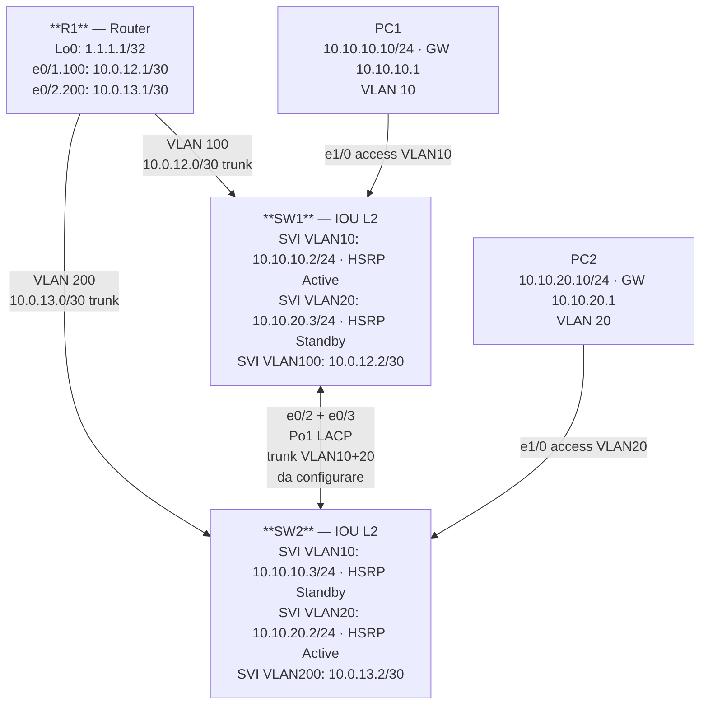

# Workbook Studenti — MOD-13: EtherChannel LACP

> **Piattaforme supportate:** GNS3 · ContainerLab (vrnetlab/IOU) · EVE-NG
> Le configurazioni iniziali sono integrate nel workbook — caricamento via paste manuale.

**Area:** Layer 2 Technologies | **Ore:** 1h | **Codici syllabus:** 3.1.b

---

## 1. TOPOLOGIA



### Piano di indirizzamento

| Device | Interfaccia | IP / Mask | Ruolo | Note |
|--------|-------------|-----------|-------|------|
| R1 | e0/1.100 | 10.0.12.1/30 | Transit R1-SW1 | Sub-IF VLAN 100 |
| R1 | e0/2.200 | 10.0.13.1/30 | Transit R1-SW2 | Sub-IF VLAN 200 |
| R1 | Lo0 | 1.1.1.1/32 | Target IP SLA | — |
| SW1 | SVI VLAN 100 | 10.0.12.2/30 | Transit R1-SW1 | — |
| SW1 | SVI VLAN 10 | 10.10.10.2/24 | Gateway VLAN 10 | HSRP Active |
| SW1 | SVI VLAN 20 | 10.10.20.3/24 | Gateway VLAN 20 | HSRP Standby |
| SW2 | SVI VLAN 200 | 10.0.13.2/30 | Transit R1-SW2 | — |
| SW2 | SVI VLAN 10 | 10.10.10.3/24 | Gateway VLAN 10 | HSRP Standby |
| SW2 | SVI VLAN 20 | 10.10.20.2/24 | Gateway VLAN 20 | HSRP Active |
| PC1 | eth0 | 10.10.10.10/24 | Host VLAN 10 | GW 10.10.10.1 |
| PC2 | eth0 | 10.10.20.10/24 | Host VLAN 20 | GW 10.10.20.1 |
| SPAN-dst | eth0 | — | Sniffer passivo | SW1 e1/1 |

### Piano VLAN

| VLAN | Nome | Scopo | Porte |
|------|------|-------|-------|
| 10 | DATA | Host PC1 | SW1 e1/0 (access) |
| 20 | VOICE | Host PC2 | SW2 e1/0 (access) |
| 100 | TRANSIT-R1-SW1 | Transit R1↔SW1 | SW1 e0/1 |
| 200 | TRANSIT-R1-SW2 | Transit R1↔SW2 | SW2 e0/1 |

---

## 2. OBIETTIVI DELLA SESSIONE

Al termine di questo modulo lo studente sarà in grado di:

- [ ] Configurare un EtherChannel LACP tra due switch IOU L2
- [ ] Verificare il bundle Po1 con i comandi `show etherchannel` e `show lacp`
- [ ] Identificare i parametri che devono essere identici su tutti i membri del canale
- [ ] Diagnosticare e correggere i mismatch più comuni

**Codici syllabus coperti:** 3.1.b — EtherChannel (LACP)

---

## 3. LAB SETUP

### Configurazione Iniziale

Incollare manualmente la configurazione su ogni device (paste diretto in CLI).

#### R1

```
hostname R1
!
vrf definition LAB
 address-family ipv4
 exit-address-family
!
no ip domain lookup
ip routing
!
interface Loopback0
 ip address 1.1.1.1 255.255.255.255
 no shutdown
!
interface Ethernet0/0
 vrf forwarding LAB
 ip address dhcp
 no shutdown
!
interface Ethernet0/1
 no ip address
 no shutdown
!
interface Ethernet0/1.100
 encapsulation dot1Q 100
 ip address 10.0.12.1 255.255.255.252
!
interface Ethernet0/2
 no ip address
 no shutdown
!
interface Ethernet0/2.200
 encapsulation dot1Q 200
 ip address 10.0.13.1 255.255.255.252
!
ip route 10.10.10.0 255.255.255.0 10.0.12.2
ip route 10.10.10.0 255.255.255.0 10.0.13.2 10
ip route 10.10.20.0 255.255.255.0 10.0.13.2
ip route 10.10.20.0 255.255.255.0 10.0.12.2 10
ip route vrf LAB 0.0.0.0 0.0.0.0 192.168.122.1
!
end
```

#### SW1

```
hostname SW1
!
vrf definition LAB
 address-family ipv4
 exit-address-family
!
no ip domain lookup
ip routing
!
vlan 10
 name DATA
!
vlan 20
 name VOICE
!
vlan 100
 name TRANSIT-R1-SW1
!
interface Ethernet0/0
 no switchport
 vrf forwarding LAB
 ip address dhcp
 duplex half
 no shutdown
!
interface Ethernet0/1
 switchport trunk encapsulation dot1q
 switchport mode trunk
 switchport trunk allowed vlan 10,20,100
 no shutdown
!
interface Ethernet0/2
 no shutdown
!
interface Ethernet0/3
 no shutdown
!
interface Ethernet1/0
 switchport mode access
 switchport access vlan 10
 spanning-tree portfast
 no shutdown
!
interface Vlan10
 ip address 10.10.10.2 255.255.255.0
 no shutdown
!
interface Vlan20
 ip address 10.10.20.3 255.255.255.0
 no shutdown
!
interface Vlan100
 ip address 10.0.12.2 255.255.255.252
 no shutdown
!
ip route 0.0.0.0 0.0.0.0 10.0.12.1
ip route vrf LAB 0.0.0.0 0.0.0.0 192.168.122.1
!
end
```

#### SW2

```
hostname SW2
!
vrf definition LAB
 address-family ipv4
 exit-address-family
!
no ip domain lookup
ip routing
!
vlan 10
 name DATA
!
vlan 20
 name VOICE
!
vlan 200
 name TRANSIT-R1-SW2
!
interface Ethernet0/0
 no switchport
 vrf forwarding LAB
 ip address dhcp
 duplex half
 no shutdown
!
interface Ethernet0/1
 switchport trunk encapsulation dot1q
 switchport mode trunk
 switchport trunk allowed vlan 10,20,200
 no shutdown
!
interface Ethernet0/2
 no shutdown
!
interface Ethernet0/3
 no shutdown
!
interface Ethernet1/0
 switchport mode access
 switchport access vlan 20
 spanning-tree portfast
 no shutdown
!
interface Ethernet1/1
 no shutdown
!
interface Vlan10
 ip address 10.10.10.3 255.255.255.0
 no shutdown
!
interface Vlan20
 ip address 10.10.20.2 255.255.255.0
 no shutdown
!
interface Vlan200
 ip address 10.0.13.2 255.255.255.252
 no shutdown
!
ip route 0.0.0.0 0.0.0.0 10.0.13.1
ip route vrf LAB 0.0.0.0 0.0.0.0 192.168.122.1
!
end
```

### Prerequisiti

- GNS3 avviato con topologia MOD-13 caricata
- Connettività TFTP verificata (`ping 192.168.122.1` da e0/0 VRF LAB)
- PC1 e PC2 VPCS configurati con IP e gateway

### Verifica pre-lab

Eseguire i seguenti comandi prima di iniziare i task. Tutti devono rispondere correttamente:

```
! Su SW1 — verificare VLAN database e trunk verso R1
SW1# show vlan brief
SW1# show interfaces e0/1 trunk

! Su SW2 — stessa verifica
SW2# show vlan brief
SW2# show interfaces e0/1 trunk

! Verifica connettività transit SW1 → R1
SW1# ping 10.0.12.1

! Verifica connettività transit SW2 → R1
SW2# ping 10.0.13.1
```

> Nota: e0/2 e e0/3 su SW1 e SW2 sono UP ma non hanno ancora configurazione — sono le porte che userete per Po1.

---

## 4. TASK LIST

| # | Task | Codice syllabus | Tempo stimato |
|---|------|-----------------|---------------|
| T1 | EtherChannel LACP — Po1 tra SW1 e SW2 | 3.1.b | 20' |

---

## 5. DETTAGLIO TASK

### T1 — EtherChannel LACP

#### TEORIA

**Cos'è EtherChannel?**

EtherChannel (IEEE 802.3ad) aggrega più link fisici in un unico canale logico (Port-Channel). Vantaggi:
- **Banda aggregata**: 2 link da 1 Gbps → Port-Channel da 2 Gbps
- **Ridondanza**: se un link fisico cade, il traffico continua sugli altri
- **Loop-free per STP**: STP vede il Port-Channel come un singolo link, eliminando la necessità di bloccare porte

**Modalità di negoziazione**

| Modalità | Protocollo | Comportamento |
|----------|------------|---------------|
| `active` | LACP (802.3ad) | Invia LACP PDU, negozia attivamente |
| `passive` | LACP (802.3ad) | Risponde alle LACP PDU, non le inizia |
| `desirable` | PAgP (Cisco) | Invia PAgP PDU, negozia attivamente |
| `auto` | PAgP (Cisco) | Risponde alle PAgP PDU, non le inizia |
| `on` | Nessuno | Bundle statico, nessuna negoziazione — rischio loop |

> **Regola fondamentale LACP**: almeno un lato deve essere `active`. Due lati `passive` non formano il bundle.

> **Best practice**: usare sempre LACP (`active/active` o `active/passive`) invece di `on` in ambienti di produzione.

**Parametri che devono corrispondere su tutti i membri del canale**

Se uno qualsiasi di questi parametri differisce tra le porte fisiche, LACP non forma il bundle:

| Parametro | Dove verificare |
|-----------|----------------|
| Speed e duplex | `show interfaces e0/2` |
| VLAN allowed sul trunk | `show interfaces e0/2 trunk` |
| Native VLAN | `show interfaces e0/2 trunk` |
| Modalità switchport (trunk/access) | `show interfaces e0/2 switchport` |
| Tipo di incapsulamento (dot1q) | `show interfaces e0/2 trunk` |

**Come si configura il trunk su IOU L2**

Su IOU L2 (a differenza di alcuni switch fisici) il comando `switchport mode trunk` richiede prima l'esplicitazione dell'incapsulamento:

```
switchport trunk encapsulation dot1q
switchport mode trunk
```

La configurazione del trunk va fatta sull'interfaccia **Port-Channel logica** (Po1), non sulle porte fisiche. IOS propaga automaticamente la configurazione del Po1 sui membri.

#### TASK

**Step 1** — Configurare EtherChannel LACP su SW1 (e0/2 + e0/3 → SW2):

```
SW1(config)# interface range e0/2 - 3
SW1(config-if-range)# channel-group 1 mode active
SW1(config-if-range)# exit
```

**Step 2** — Configurare il Port-Channel 1 come trunk su SW1:

```
SW1(config)# interface port-channel 1
SW1(config-if)# switchport trunk encapsulation dot1q
SW1(config-if)# switchport mode trunk
SW1(config-if)# switchport trunk allowed vlan 10,20
SW1(config-if)# no shutdown
```

**Step 3** — Configurare EtherChannel LACP su SW2 (e0/2 + e0/3 → SW1):

```
SW2(config)# interface range e0/2 - 3
SW2(config-if-range)# channel-group 1 mode active
SW2(config-if-range)# exit
```

**Step 4** — Configurare il Port-Channel 1 come trunk su SW2:

```
SW2(config)# interface port-channel 1
SW2(config-if)# switchport trunk encapsulation dot1q
SW2(config-if)# switchport mode trunk
SW2(config-if)# switchport trunk allowed vlan 10,20
SW2(config-if)# no shutdown
```

> Nota: entrambi i lati sono `active`. LACP active/active è la configurazione raccomandata per massima disponibilità.

#### VERIFICA

Eseguire i comandi di verifica nell'ordine indicato:

**1. Verifica stato EtherChannel**

```
SW1# show etherchannel summary
```

Output atteso:
```
Flags: D-down P-bundled s-suspended I-stand-alone H-Hot-standby
       R-Layer3 S-Layer2 U-in-use N-not in use f-failed
Number of channel-groups in use: 1

Group Port-channel Protocol Ports
------+-------------+-----------+-------------------------------
1     Po1(SU)       LACP        Et0/2(P) Et0/3(P)
```

> **Interpretazione flag**: `SU` = Layer2 (S) + in-use (U). `P` su ogni porta = bundled (nel canale). Se una porta mostra `D` o `I`, c'è un problema di configurazione.

**2. Verifica dettaglio LACP**

```
SW1# show lacp neighbor
```

Output atteso:
```
Channel group 1 neighbors

                LACP port     Admin     Oper    Port     Port
Port    Flags  Priority       Key       Key     Number   State
Et0/2   SA     32768          0x1       0x1     0x3      0x3D
Et0/3   SA     32768          0x1       0x1     0x4      0x3D
```

> **Flag SA**: S = Short timers, A = Active. Il campo `State 0x3D` indica porta bundled e in forwarding.

**3. Verifica trunk sul Port-Channel**

```
SW1# show interfaces port-channel 1 trunk
```

Output atteso:
```
Port     Mode      Encapsulation  Status    Native vlan
Po1      on        802.1q         trunking  1

Port     Vlans allowed and active in management domain
Po1      10,20

Port     Vlans in spanning tree forwarding state and not pruned
Po1      10,20
```

**4. Verifica connettività inter-switch**

```
! Da SW1 — ping verso SVI VLAN 10 di SW2
SW1# ping 10.10.10.3 source vlan 10

! Da SW1 — ping verso SVI VLAN 20 di SW2
SW1# ping 10.10.20.2 source vlan 20
```

Entrambi i ping devono avere successo (5/5 pacchetti).

---

## 6. TROUBLESHOOTING GUIDE

| Sintomo | Causa probabile | Diagnosi | Fix |
|---------|-----------------|----------|-----|
| Po1 non appare in `show etherchannel summary` | Nessun `channel-group` sulle porte fisiche | `show run int e0/2` | Aggiungere `channel-group 1 mode active` sulle porte |
| Po1 mostra flag `SD` (down) | Entrambi i lati in modalità `passive` | `show lacp neighbor` — nessun neighbor | Cambiare almeno un lato in `active` |
| Porte fisiche mostrano flag `I` (stand-alone) | Mismatch VLAN allowed o speed/duplex | `show interfaces e0/2 trunk` su entrambi i lati | Allineare la configurazione del trunk |
| Po1 = `SU` ma ping inter-switch fallisce | VLAN non nel trunk o SVI down | `show interfaces po1 trunk` + `show vlan brief` | Aggiungere VLAN mancanti o alzare SVI |
| Errore "incompatible with port-channel" | Configurazione trunk fatta sulla porta fisica anziché su Po1 | `show run int e0/2` | Pulire con `default interface e0/2`, rifare config su Po1 |
| Incapsulamento mancante su IOU L2 | `switchport mode trunk` senza `encapsulation dot1q` prima | `show int po1 trunk` — stato non "trunking" | Aggiungere `switchport trunk encapsulation dot1q` su Po1 |

---

## 7. SOLUZIONI

Vedere il file `soluzione.md` nella stessa cartella per le configurazioni complete commentate.

---

## 8. RIEPILOGO & EXAM TIPS

**Punti chiave:**

- EtherChannel LACP aggrega link fisici in un unico canale logico aumentando banda e ridondanza
- Almeno un lato deve essere `active` — due lati `passive` non formano il bundle
- Speed, duplex, VLAN allowed, native VLAN e modalità trunk devono essere identici su tutti i membri
- Su IOU L2 il trunk si configura sull'interfaccia Port-Channel, non sulle porte fisiche
- STP vede il Port-Channel come un singolo link — nessuna necessità di bloccare porte fisiche

**Domande tipo CCNP:**

1. Qual è la differenza tra modalità LACP `active` e `passive`? Cosa succede se entrambi i lati sono `passive`?
2. Quali parametri devono essere identici su tutte le porte fisiche di un EtherChannel per permettere la formazione del bundle?
3. Perché si preferisce LACP rispetto alla modalità `on` in ambienti di produzione?
4. In `show etherchannel summary`, cosa significano i flag `SU`, `P` e `D`?
5. È possibile avere porte fisiche in modalità LACP `active` e altre in modalità `on` nello stesso Port-Channel?
