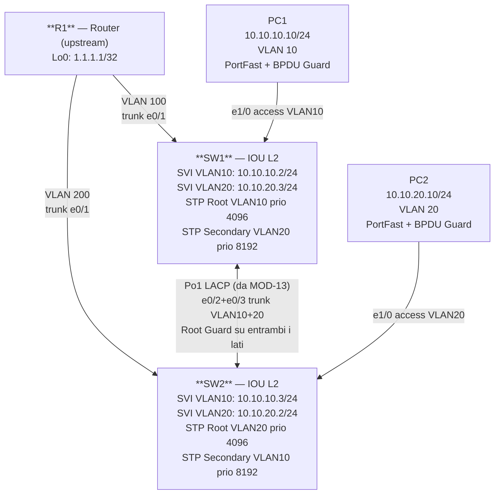

# Workbook Studenti — MOD-14: Spanning Tree

> **Piattaforme supportate:** GNS3 · ContainerLab (vrnetlab/IOU) · EVE-NG
> Le configurazioni iniziali sono integrate nel workbook — caricamento via paste manuale.

**Area:** Layer 2 Technologies | **Ore:** 1h | **Codici syllabus:** 3.1.c

---

## 1. TOPOLOGIA



### Piano di indirizzamento

| Device | Interfaccia | IP / Mask | Ruolo |
|--------|-------------|-----------|-------|
| SW1 | SVI VLAN 10 | 10.10.10.2/24 | HSRP Active VLAN 10 |
| SW1 | SVI VLAN 20 | 10.10.20.3/24 | HSRP Standby VLAN 20 |
| SW2 | SVI VLAN 10 | 10.10.10.3/24 | HSRP Standby VLAN 10 |
| SW2 | SVI VLAN 20 | 10.10.20.2/24 | HSRP Active VLAN 20 |
| PC1 | eth0 | 10.10.10.10/24 | Host VLAN 10 |
| PC2 | eth0 | 10.10.20.10/24 | Host VLAN 20 |

### Ruoli STP per VLAN

| VLAN | Root Bridge | Designated | Root Port (sull'altro switch) |
|------|-------------|------------|-------------------------------|
| VLAN 10 | SW1 (priority 4096) | SW1 su Po1 | SW2 — Po1 |
| VLAN 20 | SW2 (priority 4096) | SW2 su Po1 | SW1 — Po1 |

---

## 2. OBIETTIVI DELLA SESSIONE

Al termine di questo modulo lo studente sarà in grado di:

- [ ] Configurare il root bridge primario e secondario per VLAN specifiche
- [ ] Abilitare PortFast e BPDU Guard sulle porte host
- [ ] Configurare Root Guard sulle porte trunk per proteggere il root bridge
- [ ] Verificare la topologia STP e testare BPDU Guard in condizioni di err-disabled
- [ ] Distinguere tra 802.1D (STP), 802.1w (RSTP) e 802.1s (MST)

**Codici syllabus coperti:** 3.1.c — Spanning Tree (STP, RSTP, MST), PortFast, BPDU Guard, Root Guard

**Prerequisito obbligatorio:** MOD-13 completato — Po1 tra SW1 e SW2 deve essere UP.

---

## 3. LAB SETUP

### Configurazione Iniziale

Incollare manualmente la configurazione su ogni device (paste diretto in CLI).
Questi file includono la configurazione di MOD-13 (EtherChannel Po1 già configurato).

#### SW1

```
! MOD-14 — SW1
! Stato iniziale: EtherChannel Po1 (LACP) già configurato — da MOD-13 completato
! Lo studente configura: spanning-tree priority per VLAN, PortFast, BPDU Guard, Root Guard
!
hostname SW1
!
vrf definition LAB
 address-family ipv4
 exit-address-family
!
no ip domain lookup
ip routing
!
vlan 10
 name DATA
!
vlan 20
 name VOICE
!
vlan 100
 name TRANSIT-R1-SW1
!
interface Ethernet0/0
 no switchport
 vrf forwarding LAB
 ip address dhcp
 duplex half
 no shutdown
!
interface Ethernet0/1
 switchport trunk encapsulation dot1q
 switchport mode trunk
 switchport trunk allowed vlan 10,20,100
 no shutdown
!
interface Ethernet0/2
 channel-group 1 mode active
 no shutdown
!
interface Ethernet0/3
 channel-group 1 mode active
 no shutdown
!
interface Ethernet1/0
 switchport mode access
 switchport access vlan 10
 spanning-tree portfast
 no shutdown
!
interface Port-channel1
 switchport trunk encapsulation dot1q
 switchport mode trunk
 switchport trunk allowed vlan 10,20
 no shutdown
!
interface Vlan10
 ip address 10.10.10.2 255.255.255.0
 no shutdown
!
interface Vlan20
 ip address 10.10.20.3 255.255.255.0
 no shutdown
!
interface Vlan100
 ip address 10.0.12.2 255.255.255.252
 no shutdown
!
ip route 0.0.0.0 0.0.0.0 10.0.12.1
ip route vrf LAB 0.0.0.0 0.0.0.0 192.168.122.1
!
end
```

#### SW2

```
! MOD-14 — SW2
! Stato iniziale: EtherChannel Po1 (LACP) già configurato — da MOD-13 completato
! Lo studente configura: spanning-tree priority per VLAN, PortFast, BPDU Guard, Root Guard
!
hostname SW2
!
vrf definition LAB
 address-family ipv4
 exit-address-family
!
no ip domain lookup
ip routing
!
vlan 10
 name DATA
!
vlan 20
 name VOICE
!
vlan 200
 name TRANSIT-R1-SW2
!
interface Ethernet0/0
 no switchport
 vrf forwarding LAB
 ip address dhcp
 duplex half
 no shutdown
!
interface Ethernet0/1
 switchport trunk encapsulation dot1q
 switchport mode trunk
 switchport trunk allowed vlan 10,20,200
 no shutdown
!
interface Ethernet0/2
 channel-group 1 mode active
 no shutdown
!
interface Ethernet0/3
 channel-group 1 mode active
 no shutdown
!
interface Ethernet1/0
 switchport mode access
 switchport access vlan 20
 spanning-tree portfast
 no shutdown
!
interface Ethernet1/1
 no shutdown
!
interface Port-channel1
 switchport trunk encapsulation dot1q
 switchport mode trunk
 switchport trunk allowed vlan 10,20
 no shutdown
!
interface Vlan10
 ip address 10.10.10.3 255.255.255.0
 no shutdown
!
interface Vlan20
 ip address 10.10.20.2 255.255.255.0
 no shutdown
!
interface Vlan200
 ip address 10.0.13.2 255.255.255.252
 no shutdown
!
ip route 0.0.0.0 0.0.0.0 10.0.13.1
ip route vrf LAB 0.0.0.0 0.0.0.0 192.168.122.1
!
end
```

### Prerequisiti

- Po1 tra SW1 e SW2 UP con flag `SU` e porte `P` (da MOD-13)
- VLAN 10 e 20 presenti su entrambi gli switch e nel trunk Po1
- SVI VLAN 10 e 20 UP su SW1 e SW2

### Verifica pre-lab

```
! Verificare che Po1 sia UP — prerequisito fondamentale
SW1# show etherchannel summary
! Output atteso: Po1(SU) LACP Et0/2(P) Et0/3(P)

! Verificare VLAN nel trunk Po1
SW1# show interfaces port-channel 1 trunk
! VLAN 10,20 devono essere in "allowed and active"

! Verificare stato STP corrente (prima della configurazione)
SW1# show spanning-tree vlan 10
SW1# show spanning-tree vlan 20
! Annotare il root bridge attuale — probabilmente scelto per MAC più basso
```

---

## 4. TASK LIST

| # | Task | Codice syllabus | Tempo stimato |
|---|------|-----------------|---------------|
| T1 | STP Root Bridge Election | 3.1.c | 10' |
| T2 | PortFast e BPDU Guard sulle porte host | 3.1.c | 10' |
| T3 | Root Guard sul trunk Po1 | 3.1.c | 5' |

---

## 5. DETTAGLIO TASK

### T1 — STP Root Bridge Election

#### TEORIA

**Varianti Spanning Tree a confronto**

| Standard | Nome | Convergenza | Topologia | Note |
|----------|------|-------------|-----------|------|
| IEEE 802.1D | STP | 30-50 sec | 1 albero per bridge group | Legacy, obsoleto |
| IEEE 802.1w | RSTP | 1-3 sec | 1 albero per bridge group | Default su IOU L2 |
| IEEE 802.1s | MST | 1-3 sec | N alberi per gruppi di VLAN | Efficiente in grandi reti |
| Cisco PVST+ | — | 30-50 sec | 1 albero per VLAN | Legacy Cisco |
| Cisco RPVST+ | — | 1-3 sec | 1 albero per VLAN | Default su switch Cisco moderni |

> Su IOU L2 il protocollo di default è RSTP (rapid-pvst). Verificare con `show spanning-tree vlan 10`.

**Elezione del Root Bridge**

L'elezione avviene in due fasi:
1. Il bridge con **Bridge Priority** più bassa vince
2. A parità di priority, vince il bridge con **MAC address** più basso

Bridge ID = Priority (16 bit) + MAC Address (48 bit)

La priority è configurabile in multipli di 4096 (0, 4096, 8192, ... 61440). Il valore di default è **32768**. Alla priority viene sommato automaticamente il numero di VLAN (es. priority 4096 + VLAN 10 → Bridge Priority visualizzata = 4106).

**Stati delle porte RSTP**

| Stato | Forwarding? | Apprendimento MAC? |
|-------|-------------|-------------------|
| Discarding | No | No |
| Learning | No | Si |
| Forwarding | Si | Si |

**Ruoli delle porte**

- **Root Port**: la porta con il percorso migliore (costo minore) verso il Root Bridge — una sola per switch non-root
- **Designated Port**: la porta che invia traffico verso un segmento — una per ogni segmento
- **Alternate Port**: percorso alternativo verso il Root — in stato Discarding (backup del Root Port)
- **Backup Port**: backup della Designated — in stato Discarding

#### TASK

**Step 1** — Configurare SW1 come root primario VLAN 10, secondario VLAN 20:

```
SW1(config)# spanning-tree vlan 10 priority 4096
! SW1 diventa root VLAN 10 (Bridge ID = 4096 + 10 = 4106)

SW1(config)# spanning-tree vlan 20 priority 8192
! SW1 sarà secondario VLAN 20 (Bridge ID = 8192 + 20 = 8212)
! Priorità più alta = più alto numero = peggior candidato per root
```

**Step 2** — Configurare SW2 come root primario VLAN 20, secondario VLAN 10:

```
SW2(config)# spanning-tree vlan 20 priority 4096
! SW2 diventa root VLAN 20 (Bridge ID = 4096 + 20 = 4116)

SW2(config)# spanning-tree vlan 10 priority 8192
! SW2 sarà secondario VLAN 10 (Bridge ID = 8192 + 10 = 8202)
```

> **Perché questa simmetria?** Il root bridge di ogni VLAN corrisponde allo switch HSRP Active per quella VLAN (verrà configurato in MOD-15). SW1 gestisce VLAN 10, SW2 gestisce VLAN 20 — STP e HSRP sono allineati, il traffico non fa percorsi asimmetrici.

#### VERIFICA

```
! SW1 deve essere root VLAN 10
SW1# show spanning-tree vlan 10
```

Output atteso:
```
VLAN0010
  Spanning tree enabled protocol rstp
  Root ID    Priority    4106
             Address     aabb.cc00.0100
             This bridge is the root
             Hello Time   2 sec  Max Age 20 sec  Forward Delay 15 sec

  Bridge ID  Priority    4106   (priority 4096 sys-id-ext 10)
             Address     aabb.cc00.0100
             Hello Time   2 sec  Max Age 20 sec  Forward Delay 15 sec
```

```
! SW2 deve essere root VLAN 20
SW2# show spanning-tree vlan 20
```

Output atteso su SW2:
```
VLAN0020
  Root ID    Priority    4116
             Address     aabb.cc00.0200
             This bridge is the root
```

```
! Su SW2 — verifica root port VLAN 10 (deve essere Po1)
SW2# show spanning-tree vlan 10
```

Output atteso:
```
  Root ID    Priority    4106
             Address     aabb.cc00.0100
             Cost        4
             Port        Po1
             ! SW2 raggiunge il root VLAN 10 (SW1) tramite Po1
```

---

### T2 — PortFast e BPDU Guard sulle porte host

#### TEORIA

**PortFast**

Bypassa gli stati STP intermedi (Discarding → Learning → Forwarding) sulle porte access collegate a host. La porta passa direttamente in Forwarding al link-up.

- **Attivare SOLO su porte host** — mai su porte trunk o Port-Channel
- Su porte trunk, PortFast genera un syslog di warning ma non blocca il trunk
- Non modifica il comportamento STP: invia comunque BPDU

**BPDU Guard**

Protezione contro switch non autorizzati connessi su porte host. Se la porta con BPDU Guard riceve una BPDU (dal basso), va immediatamente in stato **err-disabled**.

- Si usa sempre in coppia con PortFast
- La porta err-disabled richiede intervento manuale per il ripristino: `shutdown` + `no shutdown`
- In alternativa, configurare `errdisable recovery cause bpduguard` per il ripristino automatico

**BPDU Guard vs Root Guard**

| Feature | Protegge da | Azione | Dove si usa |
|---------|-------------|--------|------------|
| BPDU Guard | Switch non autorizzato su porte host | err-disabled | Porte PortFast (host) |
| Root Guard | Root bridge inatteso da una porta trunk | root-inconsistent | Porte trunk/Port-Channel |

#### TASK

**Step 1** — Configurare PortFast e BPDU Guard su SW1 e1/0 (PC1):

```
SW1(config)# interface ethernet 1/0
SW1(config-if)# spanning-tree portfast
SW1(config-if)# spanning-tree bpduguard enable
```

**Step 2** — Configurare PortFast e BPDU Guard su SW2 e1/0 (PC2):

```
SW2(config)# interface ethernet 1/0
SW2(config-if)# spanning-tree portfast
SW2(config-if)# spanning-tree bpduguard enable
```

#### VERIFICA

```
! Verifica PortFast e BPDU Guard attivi su e1/0
SW1# show spanning-tree interface ethernet 1/0 detail
```

Output atteso (estratto):
```
Port 65 (Ethernet1/0) of VLAN0010 is designated forwarding
   ...
   The port is in the portfast mode
   Bpdu guard is enabled
```

**Test BPDU Guard (opzionale — con supervisore)**

Connettere temporaneamente un secondo switch IOU su e1/0 di SW1. Appena il link si alza e il secondo switch invia BPDU:

```
! Syslog atteso su SW1:
%SPANTREE-2-BLOCK_BPDUGUARD: Received BPDU on port Ethernet1/0 with BPDU Guard enabled.
  Disabling port Ethernet1/0.
%PM-4-ERR_DISABLE: bpduguard error detected on Et1/0, putting Et1/0 in err-disable state.

! Verifica stato err-disabled:
SW1# show interfaces ethernet 1/0 status
! Status: err-disabled

! Ripristino manuale dopo aver rimosso il dispositivo non autorizzato:
SW1(config)# interface ethernet 1/0
SW1(config-if)# shutdown
SW1(config-if)# no shutdown
```

---

### T3 — Root Guard sul trunk Po1

#### TEORIA

Root Guard previene che uno switch collegato tramite una porta specifica diventi il nuovo Root Bridge. Se la porta riceve una **BPDU superiore** (con Bridge ID più basso del root attuale), la porta entra in stato **root-inconsistent** (Discarding) senza andare err-disabled.

Al contrario di BPDU Guard, Root Guard si **auto-ripristina**: quando le BPDU superiori smettono di arrivare, la porta torna in Forwarding automaticamente.

**Quando usare Root Guard:** su tutte le porte trunk verso switch che non devono mai diventare root bridge — tipicamente porte verso ISP, switch di access layer, o switch di terze parti.

#### TASK

**Step 1** — Configurare Root Guard su Po1 di SW1:

```
SW1(config)# interface port-channel 1
SW1(config-if)# spanning-tree guard root
```

**Step 2** — Configurare Root Guard su Po1 di SW2:

```
SW2(config)# interface port-channel 1
SW2(config-if)# spanning-tree guard root
```

#### VERIFICA

```
! Verifica Root Guard attivo su Po1
SW1# show spanning-tree vlan 10 | include Po1
! La porta deve essere in Forwarding/Designated (nessun cambio se non ci sono BPDU superiori)

! Verifica completa dettagli interfaccia
SW1# show spanning-tree interface port-channel 1 detail
```

Output atteso (estratto):
```
Port ... (Port-channel1) of VLAN0010 is designated forwarding
   ...
   Loop guard is disabled on the port (Default is disabled)
   Root guard is enabled on the port
```

> Se Po1 ricevesse BPDU superiori (simulabili abbassando la priority di un terzo switch), il syslog mostrerebbe:
> `%SPANTREE-2-ROOTGUARD_BLOCK: Root guard blocking port Port-channel1 on VLAN0010.`

---

## 6. TROUBLESHOOTING GUIDE

| Sintomo | Causa probabile | Diagnosi | Fix |
|---------|-----------------|----------|-----|
| Root bridge eletto per MAC (non per priority) | Priority non configurata o non in multipli di 4096 | `show spanning-tree vlan 10` — confrontare Bridge ID | Riconfigurare con `spanning-tree vlan 10 priority 4096` |
| Po1 non compare in `show spanning-tree` | Po1 down o VLAN non nel trunk | `show etherchannel summary` + `show int po1 trunk` | Verificare MOD-13; aggiungere VLAN mancanti |
| Porta host non va in Forwarding immediatamente | PortFast non configurato | `show spanning-tree int e1/0 detail` | Aggiungere `spanning-tree portfast` |
| e1/0 in err-disabled dopo BPDU Guard | Ricevuta BPDU — dispositivo non autorizzato connesso | `show interfaces e1/0 status` + `show log` | Rimuovere il dispositivo; `shutdown`/`no shutdown` |
| Root Guard mette Po1 in root-inconsistent | Un terzo switch connesso a Po1 ha priority più bassa del root attuale | `show spanning-tree vlan X inconsistentports` | Aumentare priority dello switch terzo o rimuovere la connessione |
| SW1 non è root VLAN 10 dopo la configurazione | Un altro switch ha priority ancora più bassa (es. priority 0 preesistente) | `show spanning-tree vlan 10` — confrontare Bridge ID | Abbassare la priority di SW1 a 0 o rimuovere la configurazione sull'altro switch |

---

## 7. SOLUZIONI

Vedere il file `soluzione.md` nella stessa cartella per le configurazioni complete commentate.

---

## 8. RIEPILOGO & EXAM TIPS

**Punti chiave:**

- La priority STP deve essere un multiplo di 4096; il valore effettivo visualizzato include il VLAN ID (es. 4096 + 10 = 4106)
- Root Bridge per ogni VLAN deve corrispondere allo switch HSRP Active: SW1 gestisce VLAN 10, SW2 gestisce VLAN 20
- PortFast + BPDU Guard vanno sempre configurati sulle porte host — mai su porte trunk
- Root Guard si usa sulle porte trunk per proteggere l'elezione del root bridge
- BPDU Guard mette la porta in err-disabled (richiede intervento manuale); Root Guard mette in root-inconsistent (auto-recovery)

**Domande tipo CCNP:**

1. Qual è la differenza tra BPDU Guard e Root Guard? Quando si usa uno rispetto all'altro?
2. Se la priority di SW1 è 4096 su VLAN 10, qual è il Bridge ID effettivo visualizzato?
3. Una porta trunk con PortFast attivo: cosa succede e perché è comunque errato?
4. In RSTP, quali sono i tre stati delle porte e i quattro ruoli?
5. SW1 ha priority 4096 su VLAN 10 e SW2 ha priority 4096 su VLAN 10 — chi diventa root?
