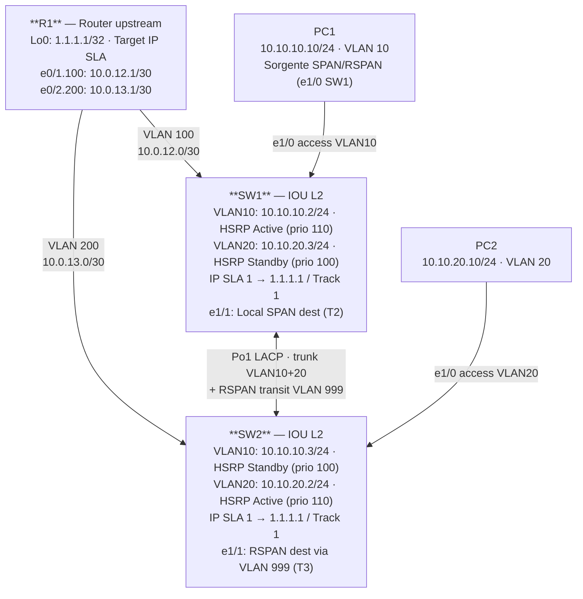

# Workbook Studenti — MOD-16: IP SLA & SPAN

> **Piattaforme supportate:** GNS3 · ContainerLab (vrnetlab/IOU) · EVE-NG
> Le configurazioni iniziali sono integrate nel workbook — caricamento via paste manuale.

**Area:** Network Assurance | **Ore:** 2h | **Codici syllabus:** 4.3 · 4.4

---

## 1. TOPOLOGIA



### Topologia SPAN/RSPAN

| Sessione | Tipo | Sorgente | Destinazione | Note |
|---------|------|---------|-------------|------|
| Session 1 | Local SPAN | SW1 e1/0 (PC1) | SW1 e1/1 (SPAN-dst) | Solo traffico locale SW1 |
| Session 2 | RSPAN | SW1 e1/0 (PC1) | SW2 e1/1 via VLAN 999 | Traffico cross-switch |

---

## 2. OBIETTIVI DELLA SESSIONE

Al termine di questo modulo lo studente sarà in grado di:

- [ ] Configurare IP SLA ICMP e monitorare i risultati con `show ip sla statistics`
- [ ] Configurare e verificare una sessione Local SPAN su SW1
- [ ] Configurare e verificare una sessione RSPAN cross-switch (SW1 → SW2)
- [ ] Descrivere il funzionamento di ERSPAN e i casi d'uso rispetto a RSPAN
- [ ] Selezionare il tipo di SPAN appropriato per diversi scenari di troubleshooting

**Codici syllabus coperti:** 4.3 — IP SLA (monitoring); 4.4 — SPAN (local, RSPAN, ERSPAN)

**Nota:** La parte IP SLA Tracking è trattata in dettaglio in MOD-15. In questo modulo il focus è IP SLA come strumento di monitoring proattivo e SPAN per l'analisi del traffico.

**Prerequisiti:** MOD-13 (Po1 UP) + MOD-14 (STP configurato) + MOD-15 (HSRP + IP SLA di base)

---

## 3. LAB SETUP

### Configurazione Iniziale

Incollare manualmente la configurazione su ogni device (paste diretto in CLI).
SW1 e SW2 includono già Po1 LACP + STP + HSRP + IP SLA da MOD-13/14/15.

#### SW1

```
! MOD-16 — SW1
! Stato iniziale: EtherChannel Po1 + STP + HSRP v2 + IP SLA tracking configurati
! Da MOD-13+14+15 completati.
! SW1: HSRP Active VLAN 10 (priority 110), Standby VLAN 20 (priority 100)
! IP SLA 1: ping 1.1.1.1 source vlan 10, track 1, standby 10 track 1 decrement 20
! Lo studente configura: IP SLA con threshold/reaction (T1), SPAN locale (T2), RSPAN (T3)
!
hostname SW1
!
vrf definition LAB
 address-family ipv4
 exit-address-family
!
no ip domain lookup
ip routing
!
vlan 10
 name DATA
!
vlan 20
 name VOICE
!
vlan 100
 name TRANSIT-R1-SW1
!
interface Ethernet0/0
 no switchport
 vrf forwarding LAB
 ip address dhcp
 duplex half
 no shutdown
!
interface Ethernet0/1
 switchport trunk encapsulation dot1q
 switchport mode trunk
 switchport trunk allowed vlan 10,20,100
 no shutdown
!
interface Ethernet0/2
 channel-group 1 mode active
 no shutdown
!
interface Ethernet0/3
 channel-group 1 mode active
 no shutdown
!
interface Ethernet1/0
 switchport mode access
 switchport access vlan 10
 spanning-tree portfast
 spanning-tree bpduguard enable
 no shutdown
!
interface Port-channel1
 switchport trunk encapsulation dot1q
 switchport mode trunk
 switchport trunk allowed vlan 10,20
 spanning-tree guard root
 no shutdown
!
interface Vlan10
 ip address 10.10.10.2 255.255.255.0
 standby version 2
 standby 10 ip 10.10.10.1
 standby 10 priority 110
 standby 10 preempt
 standby 10 timers 1 3
 standby 10 track 1 decrement 20
 no shutdown
!
interface Vlan20
 ip address 10.10.20.3 255.255.255.0
 standby version 2
 standby 20 ip 10.10.20.1
 standby 20 priority 100
 standby 20 preempt
 standby 20 timers 1 3
 no shutdown
!
interface Vlan100
 ip address 10.0.12.2 255.255.255.252
 no shutdown
!
spanning-tree vlan 10 priority 4096
spanning-tree vlan 20 priority 8192
!
ip sla 1
 icmp-echo 1.1.1.1 source-interface vlan 10
 frequency 5
ip sla schedule 1 life forever start-time now
!
track 1 ip sla 1 reachability
!
ip route 0.0.0.0 0.0.0.0 10.0.12.1
ip route vrf LAB 0.0.0.0 0.0.0.0 192.168.122.1
!
end
```

#### SW2

```
! MOD-16 — SW2
! Stato iniziale: EtherChannel Po1 + STP + HSRP v2 + IP SLA tracking configurati
! SW2: HSRP Standby VLAN 10 (priority 100), Active VLAN 20 (priority 110)
! IP SLA 1: ping 1.1.1.1 source vlan 20, track 1, standby 20 track 1 decrement 20
! Lo studente configura: SPAN locale (T2), RSPAN cross-switch VLAN 999 (T3), ERSPAN teoria (T4)
!
hostname SW2
!
vrf definition LAB
 address-family ipv4
 exit-address-family
!
no ip domain lookup
ip routing
!
vlan 10
 name DATA
!
vlan 20
 name VOICE
!
vlan 200
 name TRANSIT-R1-SW2
!
interface Ethernet0/0
 no switchport
 vrf forwarding LAB
 ip address dhcp
 duplex half
 no shutdown
!
interface Ethernet0/1
 switchport trunk encapsulation dot1q
 switchport mode trunk
 switchport trunk allowed vlan 10,20,200
 no shutdown
!
interface Ethernet0/2
 channel-group 1 mode active
 no shutdown
!
interface Ethernet0/3
 channel-group 1 mode active
 no shutdown
!
interface Ethernet1/0
 switchport mode access
 switchport access vlan 20
 spanning-tree portfast
 spanning-tree bpduguard enable
 no shutdown
!
interface Ethernet1/1
 no shutdown
!
interface Port-channel1
 switchport trunk encapsulation dot1q
 switchport mode trunk
 switchport trunk allowed vlan 10,20
 spanning-tree guard root
 no shutdown
!
interface Vlan10
 ip address 10.10.10.3 255.255.255.0
 standby version 2
 standby 10 ip 10.10.10.1
 standby 10 priority 100
 standby 10 preempt
 standby 10 timers 1 3
 no shutdown
!
interface Vlan20
 ip address 10.10.20.2 255.255.255.0
 standby version 2
 standby 20 ip 10.10.20.1
 standby 20 priority 110
 standby 20 preempt
 standby 20 timers 1 3
 standby 20 track 1 decrement 20
 no shutdown
!
interface Vlan200
 ip address 10.0.13.2 255.255.255.252
 no shutdown
!
spanning-tree vlan 20 priority 4096
spanning-tree vlan 10 priority 8192
!
ip sla 1
 icmp-echo 1.1.1.1 source-interface vlan 20
 frequency 5
ip sla schedule 1 life forever start-time now
!
track 1 ip sla 1 reachability
!
ip route 0.0.0.0 0.0.0.0 10.0.13.1
ip route vrf LAB 0.0.0.0 0.0.0.0 192.168.122.1
!
end
```

### Prerequisiti

- Po1 tra SW1 e SW2 UP (MOD-13)
- STP e HSRP configurati (MOD-14 e MOD-15)
- R1 raggiungibile da SW1 (ping 1.1.1.1 da VLAN 10)

### Verifica pre-lab

```
! Verificare raggiungibilità R1 Lo0 da SW1 (target IP SLA)
SW1# ping 1.1.1.1

! Verificare che VLAN 999 non sia già presente (pulizia)
SW1# show vlan brief | include 999

! Verificare stato interfaccia e1/1 su SW1 (destinazione SPAN)
SW1# show interfaces ethernet 1/1 status
```

---

## 4. TASK LIST

| # | Task | Codice syllabus | Tempo stimato |
|---|------|-----------------|---------------|
| T1 | IP SLA ICMP — Monitoring proattivo | 4.4 | 15' |
| T2 | Local SPAN — Mirror di PC1 su SW1 | 4.3 | 15' |
| T3 | RSPAN — Cross-switch da SW1 a SW2 | 4.3 | 20' |
| T4 | ERSPAN — Teoria | 4.3 | (teoria) |

---

## 5. DETTAGLIO TASK

### T1 — IP SLA ICMP — Monitoring proattivo

#### TEORIA

**IP SLA come strumento di monitoring**

Oltre all'uso con Object Tracking (visto in MOD-15), IP SLA è uno strumento autonomo di verifica della qualità della rete. Permette di:
- Monitorare la **raggiungibilità** di un host/servizio
- Misurare la **latenza** (RTT) e il **jitter** (variazione di latenza)
- Rilevare **packet loss** su un path specifico
- Generare **alert SNMP** quando la qualità scende sotto una soglia

**Struttura di una probe IP SLA**

```
ip sla <id>              ← Identificatore numerico
 <tipo>                  ← icmp-echo, udp-jitter, tcp-connect, ecc.
 frequency <secondi>     ← Intervallo tra le probe
 threshold <ms>          ← Soglia RTT (per alert)
 timeout <ms>            ← Timeout prima di dichiarare la probe fallita
exit
ip sla schedule <id> life forever start-time now
```

**Tipi di probe e use case**

| Tipo probe | Parametri chiave | Use case |
|-----------|-----------------|---------|
| `icmp-echo` | IP destinazione, source | Verifica raggiungibilità (ping attivo) |
| `udp-jitter` | IP:porta, codec | Misura MOS VoIP — latenza, jitter, loss |
| `tcp-connect` | IP:porta | Verifica disponibilità servizio TCP |
| `http` | URL, versione HTTP | Verifica disponibilità applicazione web |
| `dns` | Nome da risolvere, server DNS | Verifica disponibilità e performance DNS |

**Threshold e Reaction**

IP SLA può generare eventi quando la qualità scende sotto una soglia:
```
ip sla reaction-configuration 1 react rtt threshold-type immediate
 threshold-value 100 50
 action-type trapOnly
! Se RTT > 100ms: alert SNMP trap
! La reazione può essere anche: trapAndTrigger (avvia altra probe), none
```

#### TASK

**Step 1** — Configurare IP SLA ICMP su SW1 con threshold:

```
SW1(config)# ip sla 2
SW1(config-ip-sla)# icmp-echo 1.1.1.1 source-interface vlan 10
SW1(config-ip-sla-echo)# frequency 10
SW1(config-ip-sla-echo)# threshold 100
SW1(config-ip-sla-echo)# timeout 5000
SW1(config-ip-sla-echo)# exit
SW1(config)# ip sla schedule 2 life forever start-time now
```

> Nota: IP SLA 1 è già configurata in MOD-15 (frequency 5s, collegata a Track). Usiamo SLA 2 per il monitoring indipendente — frequency 10s, threshold 100ms.

**Step 2** — Verificare i risultati:

```
SW1# show ip sla statistics 2
SW1# show ip sla statistics 2 details
```

#### VERIFICA

```
SW1# show ip sla statistics 2
```

Output atteso:
```
IPSLAs Latest Operation Statistics
IPSLA operation id: 2
        Latest RTT: 1 milliseconds
Latest operation start time: *00:02:10.000 UTC
Latest operation return code: OK
Number of successes: 12
Number of failures: 0
Operation time to live: Forever
```

```
SW1# show ip sla statistics 2 details
```

Output atteso (estratto):
```
RTT Values:
  RTTAvg: 1     RTTMin/Max: 1/2   RTTSum: 12     RTTSum2: 14
  NumOfRTT: 12  RTTThreshold: 100
Packet Loss Values:
  PacketLossSD: 0  PacketLossDS: 0
  OutOfSequence: 0  Discarded: 0
```

```
! Visualizzare tutte le probe configurate
SW1# show ip sla configuration 2
```

```
! Visualizzare stato operativo di tutte le probe
SW1# show ip sla summary
```

---

### T2 — Local SPAN — Mirror di PC1 su SW1

#### TEORIA

**Cos'è SPAN**

SPAN (Switched Port Analyzer) copia il traffico di una o più porte/VLAN sorgente verso una porta destinazione dove è collegato uno strumento di analisi (Wireshark, tcpdump, IDS/IPS, VPCS con dump).

**Caratteristiche Local SPAN**

- Sorgente e destinazione devono essere sullo **stesso switch**
- La porta destinazione viene **rimossa dal normale forwarding** mentre la sessione è attiva: non risponde ad ARP, non può fare ping
- Si può monitorare: Rx (ingress), Tx (egress), o entrambe le direzioni (Both)
- Una sessione SPAN ha un solo destination port

**Limitazioni Local SPAN**

- Non può catturare traffico tra switch diversi senza RSPAN
- La porta destination non può essere in una VLAN normale attiva durante la sessione
- Su IOU L2: massimo 4 sessioni SPAN contemporanee

**Architettura Local SPAN in questo lab**

```
PC1 → e1/0 (sorgente Rx+Tx) → [SW1 SPAN engine] → e1/1 (destinazione) → SPAN-dst VPCS
```

#### TASK

**Step 1** — Configurare Local SPAN session 1 su SW1:

```
SW1(config)# monitor session 1 source interface ethernet 1/0 both
! 'both' = cattura Rx (da PC1) e Tx (verso PC1)
! Alternativa: 'rx' solo ingress, 'tx' solo egress

SW1(config)# monitor session 1 destination interface ethernet 1/1
! e1/1 = SPAN-dst VPCS — riceverà una copia di tutto il traffico di e1/0
```

**Step 2** — Generare traffico da PC1:

```
PC1> ping 10.10.10.1 repeat 10
! Genera traffico ICMP su VLAN 10 — deve essere catturato dalla sessione SPAN
```

**Step 3** — Verificare la cattura su SPAN-dst (facoltativo — funzionalità limitata su VPCS):

```
! Sul VPCS SPAN-dst (connesso a SW1 e1/1):
SPAN-dst> packet-dump
! Genera traffico da PC1 e osservare i frame ICMP apparire
```

#### VERIFICA

```
SW1# show monitor session 1
```

Output atteso:
```
Session 1
----------
Type              : Local Session
Source Ports      :
    Both          : Et1/0
Destination Ports : Et1/1
    Encapsulation : Native
        Ingress   : Disabled
Operational Status: Up
```

```
! Verifica che la sessione sia operativa
SW1# show monitor
! Mostra tutte le sessioni SPAN configurate
```

> **Nota IOU L2:** La porta destination e1/1 con SPAN attivo non risponde a ping e non fa ARP. Il VPCS su e1/1 riceve i frame ma non può inviare. Non assegnare una VLAN di accesso attiva su e1/1 mentre la sessione SPAN è configurata.

---

### T3 — RSPAN — Cross-switch da SW1 a SW2

#### TEORIA

**Cos'è RSPAN**

RSPAN (Remote SPAN) estende il mirroring su switch multipli usando una **VLAN dedicata** (RSPAN VLAN) come mezzo di trasporto. Il traffico sorgente viene incapsulato nella RSPAN VLAN e portato fino allo switch di destinazione attraverso il trunk.

**Architettura RSPAN**

```
[Switch Sorgente]          [Trunk]         [Switch Destinazione]
  Session source     →   RSPAN VLAN   →    Session destination
  (inietta traffico        (trasporta        (estrae traffico
   nella VLAN RSPAN)        il clone)         dalla VLAN RSPAN)
```

**Caratteristiche RSPAN VLAN**

- Creata come VLAN normale ma con il flag `remote-span`
- Il flag impedisce che venga usata per traffico normale (no flooding BUM ordinario)
- Deve essere configurata su **tutti** gli switch che la trasportano
- Deve essere aggiunta al trunk tra gli switch

**Differenza RSPAN vs Local SPAN vs ERSPAN**

| Tipo | Trasporto | Limiti | Uso |
|------|----------|--------|-----|
| Local SPAN | Interno allo switch | Stesso switch | Single switch troubleshooting |
| RSPAN | VLAN L2 (trunk) | Stesso dominio broadcast | Multi-switch, stesso sito |
| ERSPAN | GRE su IP (L3) | Nessuno | Multi-sito, datacenter |

**In questo lab:**
- Sorgente: SW1 e1/0 (PC1, VLAN 10)
- Destinazione: SW2 e1/1 (SPAN-dst VPCS)
- Trasporto: VLAN 999 via Po1

#### TASK

**Step 1** — Rimuovere la Local SPAN session 1 da SW1 (cleanup T2):

```
SW1(config)# no monitor session 1
```

**Step 2** — Creare la RSPAN VLAN 999 su entrambi gli switch:

```
SW1(config)# vlan 999
SW1(config-vlan)# name RSPAN
SW1(config-vlan)# remote-span
! Il flag 'remote-span' marca questa VLAN come RSPAN — traffico normale non passa

SW2(config)# vlan 999
SW2(config-vlan)# name RSPAN
SW2(config-vlan)# remote-span
```

**Step 3** — Configurare la RSPAN source session su SW1:

```
SW1(config)# monitor session 2 source interface ethernet 1/0 both
! Sorgente: porta PC1, entrambe le direzioni

SW1(config)# monitor session 2 destination remote vlan 999
! Destinazione: inietta il traffico clonato nella VLAN 999
! Il traffico viene trasportato via Po1 fino a SW2
```

**Step 4** — Configurare la RSPAN destination session su SW2:

```
SW2(config)# monitor session 2 source remote vlan 999
! Sorgente RSPAN: estrae il traffico dalla VLAN 999

SW2(config)# monitor session 2 destination interface ethernet 1/1
! Consegna il traffico clonato alla porta e1/1 (SPAN-dst)
```

**Step 5** — Aggiungere VLAN 999 al trunk Po1 su entrambi gli switch:

```
SW1(config)# interface port-channel 1
SW1(config-if)# switchport trunk allowed vlan add 999

SW2(config)# interface port-channel 1
SW2(config-if)# switchport trunk allowed vlan add 999
```

**Step 6** — Generare traffico e verificare la cattura:

```
! Genera traffico da PC1
PC1> ping 10.10.10.1 repeat 10

! Su SPAN-dst (SW2 e1/1) — deve vedere il traffico di PC1
SPAN-dst> packet-dump
```

#### VERIFICA

```
SW1# show monitor session 2
```

Output atteso:
```
Session 2
----------
Type              : Remote Source Session
Source Ports      :
    Both          : Et1/0
Dest RSPAN VLAN   : 999
Operational Status: Up
```

```
SW2# show monitor session 2
```

Output atteso:
```
Session 2
----------
Type              : Remote Destination Session
Source RSPAN VLAN : 999
Destination Ports : Et1/1
    Encapsulation : Native
        Ingress   : Disabled
Operational Status: Up
```

```
! Verifica RSPAN VLAN 999
SW1# show vlan id 999
```

Output atteso:
```
VLAN Name                             Status    Ports
---- -------------------------------- --------- -------------------------------
999  RSPAN                            active

VLAN Type  SAID       MTU   Parent RingNo BrdgMode Trans1 Trans2
---- ----- ---------- ----- ------ ------ -------- ------ ------
999  enet  100999     1500  -      -      -        0      0

Remote SPAN VLAN
```

```
! Verifica VLAN 999 nel trunk Po1
SW1# show interfaces port-channel 1 trunk
! VLAN 999 deve apparire in "allowed and active"
```

---

### T4 — ERSPAN — Teoria

#### TEORIA

**Cos'è ERSPAN**

ERSPAN (Encapsulated Remote SPAN) estende il mirroring oltre i confini Layer 2 usando **GRE** (Generic Routing Encapsulation, IP protocollo 47) per trasportare il traffico mirrorato su una rete IP routed. È definito nella RFC 4176.

**Differenze rispetto a RSPAN**

| Aspetto | RSPAN | ERSPAN |
|---------|-------|--------|
| Trasporto | VLAN L2 (trunk) | GRE su IP (L3) |
| Confini | Stesso dominio L2 | Qualsiasi rete IP |
| Overhead | Solo tag VLAN 802.1Q | GRE header ~50 byte |
| Collector | Switch della stessa rete | Qualsiasi host IP |
| Standard | IEEE 802.1Q | RFC 4176 |

**Architettura ERSPAN**

```
[Switch sorgente]          [Rete IP]         [Collector remoto]
 ERSPAN Source  ──── GRE tunnel ─────────→   Wireshark / IDS / SIEM
 Session (tipo 2)   IP proto 47              filtra su: ip.proto == 47
```

**ERSPAN Type II vs Type III**

| Tipo | Header | Informazioni aggiuntive |
|------|--------|------------------------|
| Type II | GRE + 8 byte ERSPAN | Session ID, VLAN originale, direzione |
| Type III | GRE + ERSPAN + extended | Timestamp, originale VLAN, grandezza frame |

Type II è il più diffuso e supportato. Type III è definito nell'RFC 8226 e supportato da piattaforme più recenti.

**Perché non è disponibile in questo lab**

IOU L2 non supporta ERSPAN. Richiede:
- IOS-XE (Catalyst 9000, CSR1000v)
- IOS-XR (ASR 9000)
- In GNS3: sostituire SW1/SW2 con immagini CSR1000v o IOSv

**Sintassi di riferimento IOS-XE (solo per studio)**

```
! ERSPAN Source Session su IOS-XE
monitor session 3 type erspan-source
 source interface GigabitEthernet1 both
 destination
  erspan-id 1
  ip address 10.0.0.100    ! IP del collector remoto
  origin ip address 10.0.0.1   ! IP sorgente del tunnel GRE
  no shutdown
!
! Sul collector (Wireshark):
! - Filtro: ip.proto == 47  (GRE)
! - Oppure: erspan.session_id == 1
!
! Con tcpdump:
! tcpdump -i eth0 proto gre -w capture.pcap
```

**Matrice di scelta SPAN**

| Scenario | Tipo consigliato |
|---------|-----------------|
| Analisi traffico su singola porta/switch | Local SPAN |
| Analisi traffico cross-switch, stesso sito | RSPAN |
| Analisi traffico da branch remoto verso datacenter | ERSPAN |
| Collector centralizzato per più siti | ERSPAN |
| Switch non supportano ERSPAN | RSPAN + GRE manuale sul collector |

**Domande di riflessione per l'esame**

1. In quale scenario sceglieresti ERSPAN invece di RSPAN?
2. Quale protocollo di trasporto usa ERSPAN? Qual è il numero IP del protocollo?
3. Cosa contiene l'ERSPAN header che non è presente in RSPAN?
4. Un router può attraversare il traffico ERSPAN? Può attraversare RSPAN?

---

## 6. TROUBLESHOOTING GUIDE

| Sintomo | Causa probabile | Diagnosi | Fix |
|---------|-----------------|----------|-----|
| IP SLA con 0 successi e "Not Started" | `ip sla schedule` mancante | `show ip sla statistics 2` | Aggiungere `ip sla schedule 2 life forever start-time now` |
| IP SLA con timeout costanti | Source-interface errata o R1 non raggiungibile | `ping 1.1.1.1 source vlan 10` da SW1 | Verificare rotte e SVI VLAN 10 |
| SPAN session non appare | Errore di sintassi o ID sessione già in uso | `show monitor` — lista tutte le sessioni | Rimuovere con `no monitor session 1` e ricreare |
| SPAN-dst non riceve traffico | Session non Operational o porta destinazione errata | `show monitor session 1` — Status: Down | Verificare che e1/1 non abbia config VLAN attiva |
| RSPAN non funziona — sessione Down | RSPAN VLAN non ha flag `remote-span` | `show vlan id 999` — manca "Remote SPAN VLAN" | Aggiungere `remote-span` nella config VLAN 999 |
| RSPAN funziona su SW1 ma SW2 non riceve | VLAN 999 non nel trunk Po1 | `show int po1 trunk` — colonna "allowed and active" | `switchport trunk allowed vlan add 999` su entrambi |
| Sessione RSPAN ID in conflitto | Session 1 di Local SPAN non rimossa | `show monitor` — due sessioni con stesso ID | `no monitor session 1` prima di creare session 2 |
| Porta SPAN-dst risponde a ping (sbagliato) | La sessione SPAN non è attiva — e1/1 è normale | `show monitor session 1` — Status verifica | Verificare configurazione sessione SPAN |

---

## 7. SOLUZIONI

Vedere il file `soluzione.md` nella stessa cartella per le configurazioni complete commentate.

---

## 8. RIEPILOGO & EXAM TIPS

**Punti chiave:**

- IP SLA genera probe attivi per monitorare raggiungibilità (icmp-echo) e qualità (udp-jitter per VoIP)
- Local SPAN opera su un singolo switch — la porta destination è rimossa dal forwarding normale
- RSPAN usa una VLAN dedicata con flag `remote-span` per trasportare il traffico cross-switch
- ERSPAN usa GRE (proto IP 47) e può attraversare qualsiasi rete IP — non disponibile su IOU L2
- Matrice di scelta: Local SPAN = stesso switch; RSPAN = multi-switch stesso sito; ERSPAN = multi-sito

**Domande tipo CCNP:**

1. Qual è la differenza tra Local SPAN e RSPAN? Quando useresti RSPAN?
2. Una porta SPAN destination può fare normale forwarding durante la sessione?
3. RSPAN VLAN: cosa succede se non si aggiunge il flag `remote-span`?
4. ERSPAN usa quale protocollo di trasporto e quale numero IP?
5. IP SLA `udp-jitter`: cosa misura e per quale applicazione è particolarmente utile?
