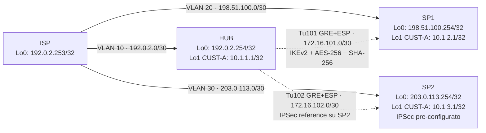

# Workbook Studenti — MOD-18: IPSec IKEv2 & VTI

**Area:** AREA 7 — OVERLAY & VPN | **Ore:** 2h | **Codici syllabus:** 4.4, 4.5
**Prerequisito:** MOD-17 completato — stessa topologia, stessi cfg di partenza

> **Piattaforme supportate:** GNS3 · ContainerLab (vrnetlab/IOU) · EVE-NG

---

## 1. TOPOLOGIA

La topologia e' identica a MOD-17. I cfg di partenza includono gia' VRF CUST-A/CUST-B, tunnel GRE P2P e route statiche completati in MOD-17.

**Nuovo in questo modulo:** aggiunta di tunnel protection IPSec su Tu101 (HUB↔SP1) e Tu102 (HUB↔SP2).



### Piano di indirizzamento (invariato da MOD-17)

| Router | Lo0 (Global) | Lo1 CUST-A | Tu101 CUST-A | Tu102 CUST-A |
|--------|--------------|------------|--------------|--------------|
| HUB | 192.0.2.254 | 10.1.1.1 | 172.16.101.1 | 172.16.102.1 |
| SP1 | 198.51.100.254 | 10.1.2.1 | 172.16.101.2 | — |
| SP2 | 203.0.113.254 | 10.1.3.1 | — | 172.16.102.2 |

---

## 2. OBIETTIVI DELLA SESSIONE

Al termine di questo modulo lo studente sara' in grado di:

- [ ] Descrivere la suite crittografica IPSec: cifratura, integrita', autenticazione peer e PFS
- [ ] Spiegare la struttura dell'header ESP (SPI, ICV, tunnel mode vs transport mode)
- [ ] Descrivere il flusso IKEv2: IKE_SA_INIT, IKE_AUTH, CREATE_CHILD_SA
- [ ] Confrontare `tunnel protection ipsec profile` (VTI) con `crypto map` (legacy)
- [ ] Esaminare la configurazione IPSec pre-caricata su SP2 come reference
- [ ] Configurare IKEv2 proposal, policy, keyring e profile su HUB e SP1
- [ ] Configurare transform-set e IPSec profile su HUB e SP1
- [ ] Applicare `tunnel protection ipsec profile` sui tunnel GRE esistenti
- [ ] Verificare le SA IKEv2 e IPSec con `show crypto` commands
- [ ] Interpretare i contatori `#pkts encaps/decaps` per confermare il traffico cifrato

**Codici syllabus:** 4.4 (IPSec), 4.5 (IKEv2)

---

## 3. LAB SETUP

### Prerequisito

MOD-17 completato su tutti i router. I cfg di partenza di MOD-18 sono gli stessi di MOD-17 con l'aggiunta della configurazione IPSec completa su SP2 (reference).

Se si riparte da zero (nuova sessione), caricare le configurazioni di MOD-17 (inline cfg disponibili in `MOD-17/workbook.md` Sezione 3) oppure via TFTP:
```
HUB# copy tftp://192.168.122.1/ENCOR/MOD-17/hub-cfg running-config
SP1# copy tftp://192.168.122.1/ENCOR/MOD-17/sp1-cfg running-config
SP2# copy tftp://192.168.122.1/ENCOR/MOD-17/sp2-cfg running-config
ISP# copy tftp://192.168.122.1/ENCOR/MOD-17/isp-cfg running-config
```

> SP2 ha gia' IKEv2 + IPSec pre-configurati nel cfg come reference. Non modificare SP2 in questa sessione.

### Verifica pre-lab

```
HUB# show ip route vrf CUST-A
HUB# ping vrf CUST-A 10.1.2.1 source Loopback1
HUB# ping vrf CUST-A 10.1.3.1 source Loopback1
HUB# show crypto ikev2 sa       ! atteso: vuoto (nessuna SA ancora)
```

---

## 4. TASK LIST

| # | Task | Descrizione | Durata |
|---|------|-------------|--------|
| T4.1 | Esamina SP2 reference | Analisi config IPSec pre-caricata | 10 min |
| T4.2 | IKEv2 proposal + policy | Configurazione algoritmi Phase 1 su HUB e SP1 | 8 min |
| T4.3 | Keyring HUB | PSK per peer SP1 e SP2 identificati per Lo0 | 5 min |
| T4.4 | IKEv2 profile HUB | Match peer, autenticazione pre-shared | 8 min |
| T4.5 | Transform-set + IPSec profile | Algoritmi ESP Phase 2 su HUB e SP1 | 8 min |
| T4.6 | Tunnel protection | Applicare IPSEC-PROF su Tu101/Tu102 HUB, Tu101 SP1 | 5 min |
| T4.7 | Trigger SA + verifica Phase 1 | Ping per avviare negoziazione IKE | 8 min |
| T4.8 | Verifica Phase 2 e contatori ESP | pkts encaps/decaps > 0 | 5 min |

---

## 5. DETTAGLIO TASK

---

### TEORIA PARTE A — La Suite Crittografica IPSec

IPSec non e' un singolo protocollo: e' un **framework** composto da blocchi intercambiabili. Ogni blocco risolve un problema di sicurezza distinto. La configurazione IOS sceglie l'algoritmo per ciascun blocco.

| Obiettivo di sicurezza | Meccanismo | Algoritmi IOS | Raccomandazione |
|------------------------|-----------|---------------|-----------------|
| Riservatezza (confidentiality) | Cifratura simmetrica (encryption) | DES, 3DES, AES-128/192/256 | AES-256 — standard attuale |
| Integrita' (integrity) | Hash / MAC | MD5, SHA-1, SHA-256, SHA-384 | SHA-256 minimo — MD5/SHA-1 deboli |
| Autenticazione peer | PSK o certificati X.509 | Pre-Shared Key, PKI | PSK in lab, PKI in produzione |
| Perfect Forward Secrecy | Diffie-Hellman | Group 2 (1024-bit), 14 (2048-bit), 19/20 (ECC) | Group 14 minimo — Group 2 debole |

**PFS (Perfect Forward Secrecy):** con PFS attivo, viene eseguito uno scambio DH indipendente ad ogni Phase 2. Anche se una chiave di sessione viene compromessa, le sessioni precedenti e future rimangono protette — ogni sessione ha chiavi derivate in modo indipendente.

---

### TEORIA PARTE B — Il Protocollo ESP

**ESP (Encapsulating Security Payload, protocollo IP 50)** e' il protocollo che trasporta effettivamente i dati cifrati nella VPN. Non usa porte TCP/UDP — opera direttamente sopra IP (come GRE usa protocollo 47, ESP usa protocollo 50).

Struttura dell'header ESP:
```
┌──────────────┬───────────────┬──────────────────────┬───────────────┬──────────────┐
│  SPI (32bit) │ Seq Num(32bit)│  Payload (dati cifr.)│ Padding + NH  │  ICV / MAC   │
│              │               │                      │               │              │
└─────────────────────────────┴──────────────────────┴───────────────┴──────────────┘
  ← in chiaro →               ←────────── cifrato ───────────────────→
  ←──────────────────────────────── autenticato (tutto tranne ICV) ──────────────────→
```

- **SPI (Security Parameter Index):** identifica la Security Association. Il ricevente usa l'SPI per trovare nel suo SAD (Security Association Database) la chiave corretta per decifrare.
- **ICV (Integrity Check Value):** il MAC calcolato sull'header + payload cifrato. Garantisce che il pacchetto non sia stato alterato in transito.

**Tunnel mode vs Transport mode:**

```
! TRANSPORT MODE: cifra solo il payload — l'IP originale e' visibile
! Usato per comunicazioni host-to-host
[ Outer IP ] [ ESP header ] [ Payload cifrato ] [ ESP trailer + ICV ]

! TUNNEL MODE: cifra l'intero pacchetto IP originale (header + payload)
! Standard per VPN gateway-to-gateway e GRE+IPSec
[ Outer IP ] [ ESP header ] [ IP orig + Payload cifrato ] [ ESP trailer + ICV ]
! Nel nostro lab: Tunnel mode su Tu101/Tu102
! GRE incapsula il traffico VRF CUST-A, poi ESP cifra il pacchetto GRE intero
```

---

### TEORIA PARTE C — Flusso VPN Setup: IKEv2

IKE (Internet Key Exchange) e' il protocollo di controllo che negozia le Security Association prima che possa fluire traffico ESP.

**IKEv2 in 3 scambi:**

| Fase | Messaggi | Cosa succede |
|------|----------|-------------|
| IKE_SA_INIT | 1→2, 2→1 | Scambio proposte + nonce + chiave DH pubblica. Entrambi derivano la chiave condivisa. Il canale e' ora cifrato. |
| IKE_AUTH | 3→4, 4→3 | Autenticazione peer con PSK o certificato. Proposta SA IPSec (transform-set). ISAKMP SA completata. |
| CREATE_CHILD_SA | bidirezionale | Negozia transform-set ESP. Crea 2 SA IPSec unidirezionali: SA-inbound (SPI-in) + SA-outbound (SPI-out). Deriva chiavi di sessione. |

Stato IOS atteso dopo Phase 1 completata:
```
show crypto isakmp sa  → QM_IDLE (= ISAKMP SA attiva, pronta per Phase 2)
show crypto ikev2 sa   → READY
```

---

### TEORIA PARTE D — tunnel protection vs crypto map

| Caratteristica | crypto map (legacy) | tunnel protection (VTI) |
|----------------|---------------------|-------------------------|
| Selezione traffico | ACL extended | Tutto il traffico sull'interfaccia tunnel |
| Interfaccia di applicazione | Fisica o sub-interface | Interfaccia tunnel virtuale |
| Compatibilita' DMVPN | Non compatibile con mGRE | Richiesto per DMVPN |
| Scalabilita' | N peer = N crypto map entries | 1 profilo per N spoke |
| Sintassi IOS | `crypto map NOME seq ipsec-isakmp` | `tunnel protection ipsec profile NOME` |

> **Regola pratica:** in qualsiasi deployment moderno (e in tutti gli scenari DMVPN) si usa `tunnel protection`. Il `crypto map` e' da conoscere per l'esame ma non si usa nei nuovi design.

---

### TEORIA PARTE E — Struttura configurazione IOS IKEv2

```
! ── BLOCCO 1: IKEv2 Proposal ────────────────────────────────────────────
! Definisce gli algoritmi per la Phase 1 (canale di controllo IKE)
crypto ikev2 proposal PROP-ENCOR
 encryption aes-cbc-256    ! cifratura Phase 1
 integrity sha256           ! MAC/hash Phase 1
 group 14                   ! DH 2048-bit per scambio chiavi

! ── BLOCCO 2: IKEv2 Policy ──────────────────────────────────────────────
! Lega il proposal alla negoziazione IKE (piu' policy = fallback ordinato)
crypto ikev2 policy POL-ENCOR
 proposal PROP-ENCOR

! ── BLOCCO 3: Keyring ───────────────────────────────────────────────────
! PSK per ogni peer, identificato dal suo IP NBMA (Loopback0)
crypto ikev2 keyring KR-ENCOR
 peer SP1
  address 198.51.100.254    ! Lo0 di SP1 — non l'IP tunnel!
  pre-shared-key cisco123
 peer SP2
  address 203.0.113.254
  pre-shared-key cisco123

! ── BLOCCO 4: IKEv2 Profile ─────────────────────────────────────────────
! Collega identita' del peer → keyring → autenticazione
crypto ikev2 profile PROF-ENCOR
 match identity remote address 198.51.100.254 255.255.255.255
 match identity remote address 203.0.113.254 255.255.255.255
 authentication remote pre-share
 authentication local pre-share
 keyring local KR-ENCOR

! ── BLOCCO 5: Transform-Set ─────────────────────────────────────────────
! Definisce gli algoritmi per la Phase 2 (canale dati ESP)
crypto ipsec transform-set TS-ENCOR esp-aes 256 esp-sha256-hmac
 mode tunnel

! ── BLOCCO 6: IPSec Profile ─────────────────────────────────────────────
! Lega transform-set e IKEv2 profile in un unico oggetto da applicare al tunnel
crypto ipsec profile IPSEC-PROF
 set transform-set TS-ENCOR
 set ikev2-profile PROF-ENCOR

! ── BLOCCO 7: Applicazione all'interfaccia tunnel ────────────────────────
! VTI — nessuna ACL, nessun crypto map
interface Tunnel101
 tunnel protection ipsec profile IPSEC-PROF
```

---

### TASK T4.1 — Esaminare la configurazione IPSec su SP2 (reference)

SP2 ha gia' IKEv2 + IPSec pre-configurati. Esaminarli **prima** di configurare HUB e SP1 — e' il modello da replicare.

#### TASK

```
SP2# show crypto ikev2 proposal
SP2# show crypto ikev2 policy
SP2# show crypto ikev2 keyring
SP2# show crypto ikev2 profile
SP2# show crypto ipsec transform-set
SP2# show crypto ipsec profile
SP2# show interface Tunnel102 | include protection
```

#### VERIFICA

Output atteso `show crypto ikev2 proposal`:
```
IKEv2 proposal: PROP-ENCOR
     Encryption : AES-CBC-256
     Integrity  : SHA256
     PRF        : SHA256
     DH Group   : DH_GROUP_2048_MODP/Group 14
```

Output atteso `show crypto ipsec profile`:
```
IPSEC profile IPSEC-PROF
        IKEv2 Profile: PROF-ENCOR
        Transform sets={ TS-ENCOR: { esp-256-aes esp-sha256-hmac  }, }
```

> Annotare la struttura: 4 blocchi IKEv2 (proposal → policy → keyring → profile) + 2 blocchi IPSec (transform-set → profile) + applicazione sul tunnel. Questa e' la sequenza che replicherai su HUB e SP1.

---

### TASK T4.2 — Configurare IKEv2 proposal e policy su HUB e SP1

Gli algoritmi devono essere identici su tutti i peer per permettere la negoziazione.

#### TASK

**Su HUB:**
```
HUB(config)# crypto ikev2 proposal PROP-ENCOR
HUB(config-ikev2-proposal)# encryption aes-cbc-256
HUB(config-ikev2-proposal)# integrity sha256
HUB(config-ikev2-proposal)# group 14
HUB(config-ikev2-proposal)# exit
HUB(config)# crypto ikev2 policy POL-ENCOR
HUB(config-ikev2-policy)# proposal PROP-ENCOR
HUB(config-ikev2-policy)# exit
```

Ripetere identicamente su SP1.

#### VERIFICA T4.2

```
HUB# show crypto ikev2 proposal
```

---

### TASK T4.3 — Configurare keyring su HUB

Il keyring definisce il PSK per ogni peer, identificato dall'IP del suo Loopback0 (NBMA address — non l'IP tunnel).

#### TASK

```
HUB(config)# crypto ikev2 keyring KR-ENCOR
HUB(config-ikev2-keyring)# peer SP1
HUB(config-ikev2-keyring-peer)# address 198.51.100.254
HUB(config-ikev2-keyring-peer)# pre-shared-key cisco123
HUB(config-ikev2-keyring)# peer SP2
HUB(config-ikev2-keyring-peer)# address 203.0.113.254
HUB(config-ikev2-keyring-peer)# pre-shared-key cisco123
HUB(config-ikev2-keyring-peer)# exit
HUB(config-ikev2-keyring)# exit
```

> Perche' l'IP del Loopback0 e' non l'IP tunnel? Perche' IKEv2 negozia usando gli IP dell'outer header ESP — che sono i Loopback0 (tunnel source/destination nell'underlay), non gli IP overlay.

#### VERIFICA T4.3

```
HUB# show crypto ikev2 keyring
```

---

### TASK T4.4 — Configurare IKEv2 profile su HUB

Il profile collega l'identita' del peer remoto al keyring e definisce il metodo di autenticazione.

#### TASK

```
HUB(config)# crypto ikev2 profile PROF-ENCOR
HUB(config-ikev2-profile)# match identity remote address 198.51.100.254 255.255.255.255
HUB(config-ikev2-profile)# match identity remote address 203.0.113.254 255.255.255.255
HUB(config-ikev2-profile)# authentication remote pre-share
HUB(config-ikev2-profile)# authentication local pre-share
HUB(config-ikev2-profile)# keyring local KR-ENCOR
HUB(config-ikev2-profile)# exit
```

Su SP1, il profile ha un solo `match identity` (solo HUB):
```
SP1(config)# crypto ikev2 profile PROF-ENCOR
SP1(config-ikev2-profile)# match identity remote address 192.0.2.254 255.255.255.255
SP1(config-ikev2-profile)# authentication remote pre-share
SP1(config-ikev2-profile)# authentication local pre-share
SP1(config-ikev2-profile)# keyring local KR-ENCOR
SP1(config-ikev2-profile)# exit
```

#### VERIFICA T4.4

```
HUB# show crypto ikev2 profile
```

---

### TASK T4.5 — Configurare transform-set e IPSec profile su HUB e SP1

#### TASK

**Su HUB (e identico su SP1):**
```
HUB(config)# crypto ipsec transform-set TS-ENCOR esp-aes 256 esp-sha256-hmac
HUB(cfg-crypto-trans)# mode tunnel
HUB(cfg-crypto-trans)# exit
HUB(config)# crypto ipsec profile IPSEC-PROF
HUB(ipsec-profile)# set transform-set TS-ENCOR
HUB(ipsec-profile)# set ikev2-profile PROF-ENCOR
HUB(ipsec-profile)# exit
```

#### VERIFICA T4.5

```
HUB# show crypto ipsec transform-set
HUB# show crypto ipsec profile
```

---

### TASK T4.6 — Applicare tunnel protection sui tunnel GRE

Questo e' il comando che "attiva" IPSec sul tunnel. Da questo momento, ogni pacchetto che attraversa il tunnel viene cifrato con ESP.

#### TASK

**Su HUB:**
```
HUB(config)# interface Tunnel101
HUB(config-if)# tunnel protection ipsec profile IPSEC-PROF
HUB(config)# interface Tunnel102
HUB(config-if)# tunnel protection ipsec profile IPSEC-PROF
```

**Su SP1:**
```
SP1(config)# interface Tunnel101
SP1(config-if)# tunnel protection ipsec profile IPSEC-PROF
```

> SP2 ha gia' `tunnel protection ipsec profile IPSEC-PROF` su Tunnel102 nel cfg pre-caricato.

#### VERIFICA T4.6

```
HUB# show interface Tunnel101 | include protection
```

Output atteso:
```
  Tunnel protection via IPSec (profile "IPSEC-PROF")
```

---

### TASK T4.7 — Trigger SA e verifica Phase 1 (IKEv2)

Prima di triggerare, verificare che non ci siano SA attive (stato iniziale pulito).

#### TASK

```
HUB# show crypto ikev2 sa      ! atteso: vuoto
HUB# show crypto isakmp sa     ! atteso: vuoto

! TRIGGER: forza la negoziazione IKE inviando traffico
HUB# ping vrf CUST-A 10.1.2.1 source Loopback1 repeat 5

! Dopo il ping — verifica Phase 1:
HUB# show crypto isakmp sa
HUB# show crypto ikev2 sa
```

#### VERIFICA T4.7

Output atteso `show crypto isakmp sa`:
```
IPv4 Crypto ISAKMP SA
dst             src             state     conn-id  status
198.51.100.254  192.0.2.254     QM_IDLE   1001     ACTIVE
203.0.113.254   192.0.2.254     QM_IDLE   1002     ACTIVE
```

- `QM_IDLE` = IKE Phase 1 (ISAKMP SA) attiva
- `ACTIVE` = la SA e' in uso

Output atteso `show crypto ikev2 sa`:
```
IPv4 Crypto IKEv2 SA

Tunnel-id Local                 Remote                fvrf/ivrf            Status
1         192.0.2.254/4500      198.51.100.254/4500    none/CUST-A         READY
2         192.0.2.254/4500      203.0.113.254/4500     none/CUST-A         READY
```

- `READY` = IKEv2 SA completata (Phase 1)

---

### TASK T4.8 — Verifica Phase 2 e contatori ESP

#### TASK

```
HUB# show crypto ipsec sa
HUB# show crypto ipsec sa | include encaps|decaps
HUB# show crypto engine connections active
```

#### VERIFICA T4.8

Output atteso `show crypto ipsec sa | include encaps|decaps`:
```
    #pkts encaps: 5, #pkts encrypt: 5, #pkts digest: 5
    #pkts decaps: 5, #pkts decrypt: 5, #pkts verify: 5
```

- **encaps > 0:** i pacchetti in uscita vengono incapsulati in ESP
- **decaps > 0:** i pacchetti in entrata vengono de-incapsulati e verificati
- Se uno dei due e' 0 ma l'altro no: problema asimmetrico (routing o policy unidirezionale)

> **Checkpoint MOD-18:** show crypto ipsec sa mostra pkts encaps/decaps > 0. Il traffico VRF CUST-A e' cifrato con AES-256 e autenticato con SHA-256. show crypto isakmp sa: QM_IDLE per entrambi i peer.

---

## 6. TROUBLESHOOTING GUIDE

| Sintomo | Causa | Diagnosi | Fix |
|---------|-------|----------|-----|
| `show crypto ikev2 sa` rimane vuoto dopo il ping | Proposal non corrispondenti tra i peer | `debug crypto ikev2` — cercare "no proposal chosen" | Verificare che encryption/integrity/group siano identici su entrambi i peer |
| Phase 1 up (`QM_IDLE`) ma `pkts encaps = 0` | Transform-set non corrispondenti (Phase 2 fallisce) | `debug crypto ipsec` — cercare "no transform" | Verificare `show crypto ipsec transform-set` su entrambi i peer |
| Phase 1 fallisce: "Authentication failed" | PSK diverso tra i peer | `debug crypto ikev2 error` | Verificare `pre-shared-key` nel keyring — case sensitive |
| `tunnel protection` applicato ma tunnel DOWN | IKEv2 profile mancante o match identity errato | `show crypto ikev2 profile` — verificare `match identity` | Aggiungere l'IP del peer remoto nel `match identity remote address` |
| `pkts encaps` incrementa ma `pkts decaps = 0` | Il peer remoto non ha configurato la protezione sul suo tunnel | `show crypto ipsec sa` sul peer remoto | Applicare `tunnel protection ipsec profile` sul tunnel del peer |
| SA si negozia ma traffico non passa | MTU troppo alto — overhead GRE+ESP > MTU link | `show interface Tu101` — MTU 1476 default GRE | Ridurre MTU: `ip mtu 1400` sul tunnel, o abilitare TCP MSS clamping |
| `show crypto isakmp sa` mostra `MM_NO_STATE` | Main Mode fallisce — Phase 1 non si completa | `debug crypto isakmp` | Verificare policy, keyring e raggiungibilita' peer (Lo0 pingabile?) |

---

## 7. SOLUZIONI

> **Attenzione:** questa sezione e' riservata al docente. Non distribuire agli studenti prima del lab.

Vedi file `MOD-18/soluzione.md` per configurazione completa HUB e SP1.

---

## 8. RIEPILOGO & EXAM TIPS

### Concetti chiave

- **IPSec e' un framework**, non un protocollo singolo: sceglie indipendentemente cifratura (AES), integrita' (SHA), autenticazione peer (PSK/PKI) e PFS (DH group)
- **ESP usa protocollo IP 50** — non TCP/UDP. Il SPI nel header identifica la SA; l'ICV garantisce l'integrita'
- **Tunnel mode** cifra l'intero pacchetto IP originale (header + payload) — standard per GRE+IPSec e VPN gateway-to-gateway
- **IKEv2 in 2 fasi:** IKE_SA_INIT + IKE_AUTH (Phase 1) → CREATE_CHILD_SA (Phase 2). QM_IDLE su IOS = Phase 1 completata
- **`tunnel protection ipsec profile`** e' il metodo VTI moderno — obbligatorio per DMVPN. Il `crypto map` e' legacy
- **7 blocchi di config IKEv2:** proposal → policy → keyring → IKEv2 profile → transform-set → IPSec profile → applicazione sul tunnel
- **Contatori ESP:** `pkts encaps/decaps > 0` = traffico cifrato/decifrato correttamente. Asimmetria = problema unidirezionale

### Domande tipo CCNP ENCOR

1. Quale protocollo IP numero trasporta i dati cifrati in una VPN IPSec?
   - A) UDP 500
   - B) TCP 443
   - **C) IP protocollo 50 (ESP)** ← corretto
   - D) IP protocollo 47 (GRE)

2. Nello output `show crypto isakmp sa`, il campo `state` mostra `QM_IDLE`. Cosa significa?
   - A) La Phase 1 non e' ancora completata
   - **B) La Phase 1 (ISAKMP SA) e' attiva e Phase 2 e' in attesa di traffico** ← corretto
   - C) La VPN e' completamente non operativa
   - D) Il PSK e' errato

3. In quale scenario si usa `mode transport` invece di `mode tunnel` nel transform-set?
   - A) VPN tra due gateway su Internet
   - **B) Comunicazione host-to-host — l'IP originale deve essere visibile** ← corretto
   - C) GRE su IPSec — sempre tunnel mode
   - D) DMVPN Phase 1

4. Qual e' il vantaggio principale di `tunnel protection ipsec profile` rispetto a `crypto map`?
   - A) Supporta piu' algoritmi crittografici
   - B) Non richiede IKEv2
   - **C) Compatibile con DMVPN mGRE e non richiede ACL per selezionare il traffico** ← corretto
   - D) E' piu' veloce nella negoziazione Phase 1

5. Dopo aver configurato IPSec, `show crypto ipsec sa` mostra `pkts encaps: 5, pkts decaps: 0`. Causa piu' probabile?
   - A) PSK sbagliato
   - B) Transform-set non corrispondente
   - **C) Il peer remoto non ha applicato tunnel protection sul suo tunnel** ← corretto — il traffico esce cifrato ma non torna cifrato
   - D) DH group non corrispondente
