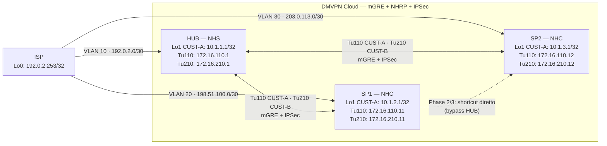

# Workbook Studenti — MOD-19: DMVPN Phase 1, Phase 2 & Phase 3

**Area:** AREA 7 — OVERLAY & VPN | **Ore:** 3h | **Codici syllabus:** 4.6, 4.7, 4.8
**Prerequisito:** MOD-18 completato — tunnel protection IPSec gia' applicata

> **Piattaforme supportate:** GNS3 · ContainerLab (vrnetlab/IOU) · EVE-NG

---

## 1. TOPOLOGIA

### Diagramma — DMVPN Cloud



### Piano di indirizzamento — DMVPN Cloud

| Tunnel | VRF | IP HUB | IP SP1 | IP SP2 | Subnet |
|--------|-----|--------|--------|--------|--------|
| Tu110 | CUST-A | 172.16.110.1 | 172.16.110.11 | 172.16.110.12 | 172.16.110.0/24 |
| Tu210 | CUST-B | 172.16.210.1 | 172.16.210.11 | 172.16.210.12 | 172.16.210.0/24 |

### Parametri NHRP

| Parametro | CUST-A (Tu110) | CUST-B (Tu210) |
|-----------|----------------|----------------|
| network-id | 110 | 210 |
| NHS (tunnel IP) | 172.16.110.1 | 172.16.210.1 |
| NHS NBMA (Lo0) | 192.0.2.254 | 192.0.2.254 |

---

## 2. OBIETTIVI DELLA SESSIONE

Al termine di questo modulo lo studente sara' in grado di:

- [ ] Descrivere il ruolo di NHS, NHC, Registration e Resolution in NHRP
- [ ] Spiegare la differenza tra mGRE e GRE P2P, e perche' DMVPN richiede mGRE
- [ ] Configurare Tunnel110 mGRE con NHRP su HUB, SP1, SP2 (VRF CUST-A)
- [ ] Verificare la registrazione degli spoke tramite `show dmvpn` e `show ip nhrp`
- [ ] Trovare e correggere i 3 bug CUST-B pre-configurati su Tunnel210
- [ ] Configurare Named EIGRP VRF-aware con `no split-horizon` e `no next-hop-self` sull'HUB
- [ ] Spiegare perche' `no split-horizon` e `no next-hop-self` sono critici su HUB DMVPN
- [ ] Abilitare NHRP redirect (HUB) e shortcut (spoke) per Phase 2
- [ ] Verificare il path spoke-to-spoke diretto con traceroute dopo NHRP redirect
- [ ] Descrivere la differenza tra Phase 2 (redirect) e Phase 3 (Traffic Indication + summary)
- [ ] Configurare Phase 3 aggiungendo summary EIGRP su HUB e verificare la compattazione della routing table

**Codici syllabus:** 4.6 (DMVPN Phase 1), 4.7 (DMVPN Phase 2), 4.8 (DMVPN Phase 3)

---

## 3. LAB SETUP

### Prerequisito

MOD-18 completato. Se si riparte da zero (nuova sessione), caricare i cfg MOD-17 e poi configurare manualmente IPSec come da MOD-18.

I tunnel P2P CUST-A (Tu101, Tu102) verranno disattivati in Part 5 — non eliminati, servono per confronto.

### Verifica pre-lab (MOD-18 completato)

```
HUB# show crypto ipsec sa | include encaps|decaps
HUB# ping vrf CUST-A 10.1.2.1 source Loopback1
HUB# show ip interface brief | include Tunnel
```

---

## 4. TASK LIST

| # | Task | Descrizione | Durata |
|---|------|-------------|--------|
| T5.1 | Shutdown tunnel P2P CUST-A | Disattivare Tu101/Tu102 senza eliminarli | 3 min |
| T5.2 | Tu110 HUB mGRE | HUB lato DMVPN cloud CUST-A | 8 min |
| T5.3 | Tu110 SP1 spoke | SP1 parla con NHS HUB | 8 min |
| T5.4 | Verifica registrazione SP1 | NHRP dynamic su HUB | 5 min |
| T5.5 | Ping HUB↔SP1, SP1→SP2 (atteso: fail) | Phase 1 parziale | 3 min |
| T5.6 | Tu110 SP2 spoke | SP2 si registra su NHS HUB | 8 min |
| T5.7 | Route statiche CUST-A via Tu110 | Preparazione per verifica Phase 1 | 5 min |
| T5.8 | Ping e traceroute SP1→SP2 via HUB | Conferma Phase 1 operativa | 5 min |
| T5.9 | Fix 3 bug CUST-B Tu210 | Diagnostica ordinata: HUB→SP1→SP2 | 15 min |
| T6.1 | Rimuovi route statiche CUST-A | Sostituzione con EIGRP | 3 min |
| T6.2 | Named EIGRP HUB CUST-A | no split-horizon + no next-hop-self su Tu110 | 10 min |
| T6.3 | Named EIGRP SP1 e SP2 CUST-A | Formazione adiacenze | 8 min |
| T6.4 | NHRP redirect + shortcut | Phase 2: HUB redirect, spoke shortcut | 5 min |
| T6.5 | Ping SP1→SP2 (Phase 2) | Primo ping perde 1 pacchetto — normale | 3 min |
| T6.6 | Verifica shortcut NHRP | Entry dynamic su SP1 per SP2 | 5 min |
| T6.7 | Traceroute SP1→SP2 diretto | Path diretto senza HUB | 3 min |
| T6.8 | Named EIGRP CUST-B su Tu210 | AS2, identica struttura | 8 min |
| T7.1 | Baseline routing table Phase 2 | Annotare route /32 su SP1 | 3 min |
| T7.2 | Summary EIGRP su HUB Tu110 | 10.1.0.0/16 — Phase 3 | 5 min |
| T7.3 | Verifica compattazione routing table | /32 specifiche spariscono da SP1 | 5 min |
| T7.4 | Clear NHRP cache su SP1/SP2 | Ripartire puliti per test Phase 3 | 2 min |
| T7.5 | Ping Phase 3 (primo perde 1-2 pkt) | Traffic Indication in azione | 5 min |
| T7.6 | Verifica shortcut Phase 3 | /32 NHRP dynamic su SP1 | 3 min |
| T7.7 | Traceroute Phase 3 — 1 hop diretto | Identico a Phase 2, routing table piu' compatta | 3 min |
| T7.8 | Confronto route count Phase 2 vs 3 | Motivazione scalabilita' Phase 3 | 3 min |

---

## 5. DETTAGLIO TASK

---

### PART 5 — DMVPN Phase 1: mGRE + NHRP

#### TEORIA — NHRP: Next Hop Resolution Protocol

In un cloud mGRE, l'HUB ha un solo IP tunnel ma deve comunicare con N spoke dinamici. Il problema e': dato un indirizzo overlay (IP tunnel spoke), come si trova l'indirizzo underlay (NBMA/Lo0) per costruire il pacchetto GRE?

**NHRP risolve questo problema** con un meccanismo simile a un DNS per indirizzi tunnel:

| Termine NHRP | Ruolo | Dove |
|-------------|-------|------|
| NHS (Next Hop Server) | Riceve registrazioni spoke, risponde alle resolution request | HUB |
| NHC (Next Hop Client) | Si registra presso NHS, chiede risoluzioni | Spoke |
| Registration | Spoke → HUB: "Sono 172.16.110.11, raggiungimi a 198.51.100.254" | Automatica all'avvio |
| Resolution Request | Spoke → HUB → Spoke: "Dove trovo 172.16.110.12?" | Phase 2/3 |

**Parametri chiave di configurazione:**

```
ip nhrp network-id <N>          ! identifica il cloud DMVPN — uguale su tutti
ip nhrp nhs <IP-tunnel-NHS>     ! solo su spoke: IP tunnel dell'HUB
ip nhrp map <tunnel-IP> <NBMA>  ! solo su spoke: mapping statico HUB tunnel→NBMA
ip nhrp map multicast <NBMA>    ! traffico multicast (EIGRP hello) verso HUB
ip nhrp redirect                ! Phase 2 su HUB: notifica spoke di shortcut
ip nhrp shortcut                ! Phase 2 su spoke: installa route NHRP dirette
```

**Differenza mGRE vs GRE P2P:**

```
GRE P2P: tunnel destination fisso (1 spoke)
  → N spoke = N tunnel sul HUB

mGRE (multipoint GRE):
  interface Tunnel110
   tunnel mode gre multipoint   ! accetta connessioni da N spoke dinamici
  → 1 solo tunnel sul HUB per tutti gli spoke
  → destination viene risolta da NHRP a runtime
```

**Configurazione HUB:**
```
interface Tunnel110
 vrf forwarding CUST-A
 ip address 172.16.110.1 255.255.255.0
 tunnel source Loopback0
 tunnel mode gre multipoint             ! mGRE — OBBLIGATORIO su HUB
 ip nhrp network-id 110
 ip nhrp map multicast dynamic          ! replica multicast verso spoke registrati
 ip nhrp redirect                       ! Phase 2: informa spoke di shortcut disponibili
 tunnel protection ipsec profile IPSEC-PROF
 no shutdown
```

**Configurazione Spoke:**
```
interface Tunnel110
 vrf forwarding CUST-A
 ip address 172.16.110.11 255.255.255.0
 tunnel source Loopback0
 tunnel mode gre multipoint             ! anche i spoke usano mGRE
 ip nhrp network-id 110
 ip nhrp nhs 172.16.110.1               ! IP tunnel del NHS (HUB)
 ip nhrp map 172.16.110.1 192.0.2.254  ! mapping statico: tunnel IP HUB → NBMA HUB
 ip nhrp map multicast 192.0.2.254     ! multicast verso HUB (EIGRP hello)
 ip nhrp shortcut                       ! Phase 2: installa route NHRP dirette
 tunnel protection ipsec profile IPSEC-PROF
 no shutdown
```

---

#### TASK T5.1 — Shutdown tunnel P2P CUST-A

Non eliminare i tunnel — servono per confronto e potrebbero essere utili in troubleshooting.

```
HUB(config)# interface Tunnel101
HUB(config-if)# shutdown
HUB(config)# interface Tunnel102
HUB(config-if)# shutdown
SP1(config)# interface Tunnel101
SP1(config-if)# shutdown
! SP2 Tunnel102 e' gia' shutdown — verificare
SP2# show ip interface brief | include Tunnel102
```

Rimuovere anche le route statiche CUST-A (verranno gestite da EIGRP):
```
HUB(config)# no ip route vrf CUST-A 10.1.2.1 255.255.255.255 Tunnel101
HUB(config)# no ip route vrf CUST-A 10.1.3.1 255.255.255.255 Tunnel102
```

#### TASK T5.2 — Creare Tunnel110 su HUB (mGRE CUST-A)

```
HUB(config)# interface Tunnel110
HUB(config-if)# description !! DMVPN CUST-A cloud — HUB NHS
HUB(config-if)# vrf forwarding CUST-A
HUB(config-if)# ip address 172.16.110.1 255.255.255.0
HUB(config-if)# tunnel source Loopback0
HUB(config-if)# tunnel mode gre multipoint
HUB(config-if)# ip nhrp network-id 110
HUB(config-if)# ip nhrp map multicast dynamic
HUB(config-if)# ip nhrp redirect
HUB(config-if)# tunnel protection ipsec profile IPSEC-PROF
HUB(config-if)# no shutdown
```

#### VERIFICA T5.2

```
HUB# show interface Tunnel110
```

Verificare: `Tunnel protocol/transport GRE/IP, key disabled` e `Multipoint: Yes` nell'output (oppure la riga `Tunnel mode: multipoint`).

#### TASK T5.3 — Creare Tunnel110 su SP1 (spoke CUST-A)

```
SP1(config)# interface Tunnel110
SP1(config-if)# description !! DMVPN CUST-A cloud — SP1 NHC
SP1(config-if)# vrf forwarding CUST-A
SP1(config-if)# ip address 172.16.110.11 255.255.255.0
SP1(config-if)# tunnel source Loopback0
SP1(config-if)# tunnel mode gre multipoint
SP1(config-if)# ip nhrp network-id 110
SP1(config-if)# ip nhrp nhs 172.16.110.1
SP1(config-if)# ip nhrp map 172.16.110.1 192.0.2.254
SP1(config-if)# ip nhrp map multicast 192.0.2.254
SP1(config-if)# ip nhrp shortcut
SP1(config-if)# tunnel protection ipsec profile IPSEC-PROF
SP1(config-if)# no shutdown
```

#### TASK T5.4 — Verifica registrazione SP1 su HUB

```
HUB# show ip nhrp
HUB# show dmvpn
```

Output atteso `show dmvpn`:
```
Legend: Attrb --> S - Static, D - Dynamic, I - Incomplete
# Ent  Peer NBMA Addr   Peer Tunnel Add   State  UpDn Tm  Attrb
----- --------------- --------------- ----- -------- -----
1     198.51.100.254   172.16.110.11   NHRP  00:01:23 D
```

- `D` = Dynamic (registrazione spoke ricevuta e attiva)
- Se lo spoke non compare: verificare `ip nhrp network-id` (deve essere 110 su entrambi) e che IKEv2 SA sia attiva

#### TASK T5.5 — Ping HUB→SP1 e SP1→SP2 (test Phase 1 parziale)

```
HUB# ping vrf CUST-A 172.16.110.11 source Tunnel110
! Atteso: !!!!!
SP1# ping vrf CUST-A 172.16.110.12 source Tunnel110
! Atteso: ..... (SP2 non ancora configurato)
```

#### TASK T5.6 — Creare Tunnel110 su SP2 (spoke CUST-A)

```
SP2(config)# interface Tunnel110
SP2(config-if)# description !! DMVPN CUST-A cloud — SP2 NHC
SP2(config-if)# vrf forwarding CUST-A
SP2(config-if)# ip address 172.16.110.12 255.255.255.0
SP2(config-if)# tunnel source Loopback0
SP2(config-if)# tunnel mode gre multipoint
SP2(config-if)# ip nhrp network-id 110
SP2(config-if)# ip nhrp nhs 172.16.110.1
SP2(config-if)# ip nhrp map 172.16.110.1 192.0.2.254
SP2(config-if)# ip nhrp map multicast 192.0.2.254
SP2(config-if)# ip nhrp shortcut
SP2(config-if)# tunnel protection ipsec profile IPSEC-PROF
SP2(config-if)# no shutdown
```

#### VERIFICA T5.6

```
HUB# show dmvpn
```

Output atteso (entrambi gli spoke registrati):
```
# Ent  Peer NBMA Addr    Peer Tunnel Add   State  UpDn Tm  Attrb
----- ---------------  ---------------  ----- -------- -----
2     198.51.100.254    172.16.110.11   NHRP  00:05:10 D
      203.0.113.254     172.16.110.12   NHRP  00:01:14 D
```

#### TASK T5.7 — Route statiche VRF CUST-A via Tu110 (Phase 1)

Per testare Phase 1 serve routing verso i loopback. Le route statiche sono temporanee — verranno sostituite da EIGRP in Part 6.

```
HUB(config)# ip route vrf CUST-A 10.1.2.1 255.255.255.255 Tunnel110
HUB(config)# ip route vrf CUST-A 10.1.3.1 255.255.255.255 Tunnel110
SP1(config)# ip route vrf CUST-A 10.1.1.1 255.255.255.255 Tunnel110
SP1(config)# ip route vrf CUST-A 10.1.3.1 255.255.255.255 Tunnel110
SP2(config)# ip route vrf CUST-A 10.1.1.1 255.255.255.255 Tunnel110
SP2(config)# ip route vrf CUST-A 10.1.2.1 255.255.255.255 Tunnel110
```

#### TASK T5.8 — Ping e traceroute SP1→SP2 in Phase 1

```
SP1# ping vrf CUST-A 10.1.3.1 source Loopback1
SP1# traceroute vrf CUST-A 10.1.3.1 source Loopback1
```

Output atteso traceroute (Phase 1 — sempre via HUB):
```
  1  172.16.110.1   [HUB tunnel IP]
  2  10.1.3.1       [SP2 Lo1]
! Identico a MOD-17 GRE P2P — SP1↔SP2 ancora passa per HUB
```

#### TASK T5.9 — Trovare e correggere i 3 bug CUST-B su Tunnel210

I bug devono essere trovati e corretti **nell'ordine indicato** — il Bug 5 blocca gli altri.

**Bug 5 — HUB Tunnel210: tunnel mode gre multipoint mancante (trovare per primo)**

```
HUB# show interface Tunnel210
HUB# show dmvpn
```

```
! Diagnosi attesa:
HUB# show interface Tunnel210
  Tunnel protocol/transport GRE/IP
  ! Manca "Multipoint: Yes" — HUB e' in GRE P2P (default)

HUB# show dmvpn
# Ent  Peer NBMA Addr...   <- 0 peer registrati
! HUB non accetta registrazioni NHRP perche' non e' in multipoint
```

Fix:
```
HUB(config)# interface Tunnel210
HUB(config-if)# tunnel mode gre multipoint
```

Verifica: `HUB# show interface Tunnel210 | include Multipoint` → `Multipoint: Yes`

**Bug 6 — SP1 Tunnel210: ip nhrp network-id 211 invece di 210**

```
SP1# show dmvpn
SP1# show ip nhrp
HUB# show ip nhrp | include 210
```

```
! Diagnosi: SP1 non e' registrato su HUB (cloud id diverso)
! HUB# show ip nhrp → SP1 assente dalla tabella NHS
```

Fix:
```
SP1(config)# interface Tunnel210
SP1(config-if)# ip nhrp network-id 210
```

**Bug 7 — SP2 Tunnel210: ip nhrp nhs e map puntano a SP1 invece di HUB**

```
SP2# show ip nhrp
SP2# show dmvpn
```

```
! Diagnosi: nhs 172.16.210.2 = IP tunnel SP1 (non HUB)
! SP2 tenta di registrarsi presso SP1 — che non e' un NHS
! Nessuna registrazione completata — 0 entry NHRP su SP2
```

Fix:
```
SP2(config)# interface Tunnel210
SP2(config-if)# no ip nhrp nhs 172.16.210.2
SP2(config-if)# no ip nhrp map 172.16.210.2 203.0.113.254
SP2(config-if)# no ip nhrp map multicast 203.0.113.254
SP2(config-if)# ip nhrp nhs 172.16.210.1
SP2(config-if)# ip nhrp map 172.16.210.1 192.0.2.254
SP2(config-if)# ip nhrp map multicast 192.0.2.254
```

#### VERIFICA finale Part 5

```
HUB# show dmvpn
```

CUST-A (Tu110) e CUST-B (Tu210) devono mostrare entrambi gli spoke con `D` (Dynamic) e stato `NHRP`.

> **Checkpoint Part 5:** DMVPN Phase 1 operativo su CUST-A e CUST-B. Tutti gli spoke registrati. Traceroute SP1→SP2 mostra HUB come hop intermedio.

---

### PART 6 — DMVPN Phase 2: Named EIGRP + spoke-to-spoke diretti

#### TEORIA — Phase 2: NHRP Redirect e Shortcut

In Phase 1, tutto il traffico spoke-to-spoke transita per HUB (anche se lo stesso HUB non e' la destinazione finale). In **Phase 2**, quando SP1 invia un pacchetto verso SP2 (tramite HUB), l'HUB fa due cose simultaneamente:
1. **Forwarda** il pacchetto verso SP2 (come in Phase 1)
2. **Invia un NHRP Redirect** a SP1: "puoi raggiungere SP2 direttamente al NBMA 203.0.113.254"

SP1 riceve il Redirect, installa una route NHRP host (/32) con next-hop direttamente verso SP2, e i pacchetti successivi bypassano completamente HUB.

**Comandi da abilitare:**

```
! HUB — abilita redirect (gia' configurato nel Task T5.2)
interface Tunnel110
 ip nhrp redirect      ! HUB avvisa gli spoke dei shortcut disponibili

! SP1/SP2 — abilita shortcut (gia' configurato in T5.3/T5.6)
interface Tunnel110
 ip nhrp shortcut      ! spoke installa route NHRP dirette verso altri spoke
```

**Named EIGRP VRF-aware — comandi critici su HUB:**

```
! Su HUB — interfaccia Tu110:
no split-horizon    ! CRITICO: HUB deve ri-annunciare le route degli spoke
                    ! verso gli altri spoke (senza questo, SP1 non vede SP2)
no next-hop-self    ! CRITICO: HUB preserva il next-hop originale dello spoke
                    ! SP1 vede SP2 come next-hop diretto → NHRP puo' fare shortcut
                    ! Se next-hop-self fosse attivo, SP1 vedrebbe HUB come next-hop
                    ! e il Redirect NHRP non funzionerebbe
```

Struttura Named EIGRP VRF CUST-A su HUB:
```
router eigrp LAB-ENCOR
 address-family ipv4 vrf CUST-A autonomous-system 1
  af-interface default
   passive-interface       ! default: no EIGRP sulle interfacce non specificate
  exit-af-interface
  af-interface Tunnel110
   no passive-interface    ! attiva EIGRP su Tu110
   no split-horizon        ! CRITICO per DMVPN HUB
   no next-hop-self        ! CRITICO per Phase 2
   hello-interval 20       ! best practice WAN DMVPN
   hold-time 60
  exit-af-interface
  network 172.16.110.0 0.0.0.255   ! DMVPN cloud
  network 10.1.1.0 0.0.0.255       ! Lo1 HUB
  eigrp router-id 10.1.1.1
 exit-address-family
```

#### TASK T6.1 — Rimuovere le route statiche VRF CUST-A

```
HUB(config)# no ip route vrf CUST-A 10.1.2.1 255.255.255.255 Tunnel110
HUB(config)# no ip route vrf CUST-A 10.1.3.1 255.255.255.255 Tunnel110
SP1(config)# no ip route vrf CUST-A 10.1.1.1 255.255.255.255 Tunnel110
SP1(config)# no ip route vrf CUST-A 10.1.3.1 255.255.255.255 Tunnel110
SP2(config)# no ip route vrf CUST-A 10.1.1.1 255.255.255.255 Tunnel110
SP2(config)# no ip route vrf CUST-A 10.1.2.1 255.255.255.255 Tunnel110
```

#### TASK T6.2 — Configurare Named EIGRP su HUB (CUST-A AS1 + CUST-B AS2)

```
HUB(config)# router eigrp LAB-ENCOR
HUB(config-router)# address-family ipv4 vrf CUST-A autonomous-system 1
HUB(config-router-af)# af-interface default
HUB(config-router-af-interface)# passive-interface
HUB(config-router-af-interface)# exit-af-interface
HUB(config-router-af)# af-interface Tunnel110
HUB(config-router-af-interface)# no passive-interface
HUB(config-router-af-interface)# no split-horizon
HUB(config-router-af-interface)# no next-hop-self
HUB(config-router-af-interface)# hello-interval 20
HUB(config-router-af-interface)# hold-time 60
HUB(config-router-af-interface)# exit-af-interface
HUB(config-router-af)# network 172.16.110.0 0.0.0.255
HUB(config-router-af)# network 10.1.1.0 0.0.0.255
HUB(config-router-af)# eigrp router-id 10.1.1.1
HUB(config-router-af)# exit-address-family
HUB(config-router)# address-family ipv4 vrf CUST-B autonomous-system 2
HUB(config-router-af)# af-interface Tunnel210
HUB(config-router-af-interface)# no passive-interface
HUB(config-router-af-interface)# no split-horizon
HUB(config-router-af-interface)# no next-hop-self
HUB(config-router-af-interface)# hello-interval 20
HUB(config-router-af-interface)# hold-time 60
HUB(config-router-af-interface)# exit-af-interface
HUB(config-router-af)# network 172.16.210.0 0.0.0.255
HUB(config-router-af)# network 10.2.1.0 0.0.0.255
HUB(config-router-af)# eigrp router-id 10.2.1.1
HUB(config-router-af)# exit-address-family
```

#### VERIFICA T6.2

```
HUB# show eigrp address-family ipv4 vrf CUST-A neighbors
HUB# show eigrp af-interfaces vrf CUST-A
```

Output atteso `show eigrp af-interfaces` (verificare i flag):
```
EIGRP-IPv4 VR(LAB-ENCOR) Address-Family Interfaces for AS(1) VRF(CUST-A)
                              Xmit Queue   PeerQ        Mean   Pacing Time
Interface              Peers  Un/Reliable  Un/Reliable  SRTT   Un/Reliable
Tu110                  2      0/0          0/0          12     0/2
  Hello-interval is 20, Hold-time is 60
  Split-horizon is disabled
  Next-hop-self is disabled
```

#### TASK T6.3 — Configurare Named EIGRP su SP1 e SP2 (CUST-A AS1)

```
SP1(config)# router eigrp LAB-ENCOR
SP1(config-router)# address-family ipv4 vrf CUST-A autonomous-system 1
SP1(config-router-af)# af-interface Tunnel110
SP1(config-router-af-interface)# no passive-interface
SP1(config-router-af-interface)# hello-interval 20
SP1(config-router-af-interface)# hold-time 60
SP1(config-router-af-interface)# exit-af-interface
SP1(config-router-af)# network 172.16.110.0 0.0.0.255
SP1(config-router-af)# network 10.1.2.0 0.0.0.255
SP1(config-router-af)# eigrp router-id 10.1.2.1
SP1(config-router-af)# exit-address-family
```

Ripetere su SP2 (network 10.1.3.0, router-id 10.1.3.1).

> Sugli spoke NON modificare split-horizon e next-hop-self — i valori default sono corretti.

#### VERIFICA T6.3

```
HUB# show eigrp address-family ipv4 vrf CUST-A neighbors
SP1# show ip route vrf CUST-A
```

Output atteso `show eigrp neighbors` su HUB:
```
H  Address      Interface  Hold  Uptime    SRTT  RTO   Q   Seq
0  172.16.110.11 Tu110     58    00:03:12  12    200   0   7
1  172.16.110.12 Tu110     57    00:02:48  11    200   0   5
```

#### TASK T6.4 — Abilitare NHRP redirect su HUB e shortcut su spoke

> NHRP redirect e shortcut sono gia' stati configurati in T5.2/T5.3/T5.6. Verificare che siano presenti:

```
HUB# show running-config interface Tunnel110 | include nhrp
! Deve comparire: ip nhrp redirect

SP1# show running-config interface Tunnel110 | include nhrp
! Deve comparire: ip nhrp shortcut
```

Se mancanti, aggiungere:
```
HUB(config-if)# ip nhrp redirect      ! su Tunnel110 HUB
SP1(config-if)# ip nhrp shortcut      ! su Tunnel110 SP1
SP2(config-if)# ip nhrp shortcut      ! su Tunnel110 SP2
```

#### TASK T6.5 — Trigger spoke-to-spoke Phase 2

```
SP1# ping vrf CUST-A 10.1.3.1 source Loopback1 repeat 10
```

> Il primo pacchetto potrebbe andare perso (mentre NHRP completa il Redirect). Questo e' comportamento normale in Phase 2.

#### TASK T6.6 — Verifica shortcut NHRP su SP1

```
SP1# show ip nhrp detail
SP1# show ip nhrp | include 10.1.3
```

Output atteso:
```
10.1.3.1/32 via 172.16.110.12
   Tunnel110 created 00:00:08, expire 00:01:52
   Type: dynamic, Flags: router nhop rib nho
   NBMA address: 203.0.113.254
! "dynamic" = installata tramite NHRP Redirect (non configurazione statica)
! NBMA address: Lo0 di SP2 — tunnel GRE diretto SP1→SP2
```

#### TASK T6.7 — Traceroute SP1→SP2 in Phase 2

```
SP1# traceroute vrf CUST-A 10.1.3.1 source Loopback1
```

Output atteso (path diretto — no HUB!):
```
  1  10.1.3.1   msec msec msec
! Un solo hop — SP1↔SP2 diretti, HUB bypassato
```

> **Confronto:** in MOD-17 (GRE P2P) e in Phase 1 erano 2 hop. Ora 1 hop — questo e' il beneficio di Phase 2.

#### TASK T6.8 — Named EIGRP CUST-B su Tu210

Ripetere la stessa struttura EIGRP con AS2 e VRF CUST-B:

```
SP1(config)# router eigrp LAB-ENCOR
SP1(config-router)# address-family ipv4 vrf CUST-B autonomous-system 2
SP1(config-router-af)# af-interface Tunnel210
SP1(config-router-af-interface)# no passive-interface
SP1(config-router-af-interface)# hello-interval 20
SP1(config-router-af-interface)# hold-time 60
SP1(config-router-af-interface)# exit-af-interface
SP1(config-router-af)# network 172.16.210.0 0.0.0.255
SP1(config-router-af)# network 10.2.2.0 0.0.0.255
SP1(config-router-af)# eigrp router-id 10.2.2.1
SP1(config-router-af)# exit-address-family
```

Ripetere su SP2 (network 10.2.3.0, router-id 10.2.3.1).

#### VERIFICA finale Part 6

```
HUB# show eigrp address-family ipv4 vrf CUST-A neighbors
HUB# show eigrp address-family ipv4 vrf CUST-B neighbors
SP1# traceroute vrf CUST-A 10.1.3.1 source Loopback1
```

> **Checkpoint Part 6:** EIGRP neighbors stabili su Tu110 e Tu210. Traceroute SP1→SP2 mostra 1 hop diretto. show ip nhrp: entry dynamic per spoke remoti.

---

### PART 7 — DMVPN Phase 3: Routing Compatto

#### TEORIA — Phase 3 vs Phase 2

| Caratteristica | Phase 1 | Phase 2 | Phase 3 |
|---------------|---------|---------|---------|
| Spoke-to-spoke | Via HUB sempre | Diretto dopo NHRP Redirect | Diretto dopo NHRP Traffic Indication |
| Route sul spoke | Specifiche via HUB | Specifiche con next-hop spoke | Summary via HUB + /32 NHRP temporanee |
| Routing table size | Grande | Grande | Compatta (1 summary per cloud) |
| Primo pacchetto | Via HUB | Via HUB (poi shortcut) | Perso (HUB scarta + Traffic Indication) |
| Scalabilita' | Bassa | Media | Alta |
| Config aggiuntiva HUB | — | `nhrp redirect` | `nhrp redirect` + `ip summary-address` |

**Meccanismo Phase 3 — Traffic Indication:**

In Phase 2, HUB **forwarda** il pacchetto verso SP2 E invia un Redirect a SP1.

In Phase 3, HUB **SCARTA** il pacchetto (non lo forwarda) e invia un **Traffic Indication** a SP1 con il NBMA di SP2. SP1 installa una route NHRP host /32 e i pacchetti successivi raggiungono SP2 direttamente. **Il primo pacchetto va perso** — e' comportamento atteso e normale.

La differenza chiave nella routing table:

```
! Phase 2 — routing table SP1 (N route specifiche per N spoke):
D    10.1.1.0/32 [90/...] via 172.16.110.1, Tu110   (route HUB)
D    10.1.3.1/32 [90/...] via 172.16.110.12, Tu110  (route SP2 — next-hop diretto)

! Phase 3 — routing table SP1 (1 summary, route specifiche NHRP temporanee):
D    10.1.0.0/16 [90/...] via 172.16.110.1, Tu110   (summary HUB — piu' scalabile)
! Le /32 specifiche di SP2 NON sono nella routing table EIGRP
! Vengono installate come route NHRP /32 temporanee solo quando c'e' traffico attivo
```

**Unico comando aggiuntivo su HUB:**

```
router eigrp LAB-ENCOR
 address-family ipv4 vrf CUST-A autonomous-system 1
  af-interface Tunnel110
   ip summary-address eigrp 1 10.1.0.0 255.255.0.0
   ! HUB annuncia 10.1.0.0/16 invece delle /32 specifiche di ciascun spoke
```

#### TASK T7.1 — Baseline routing table Phase 2 (prima della modifica)

```
SP1# show ip route vrf CUST-A
SP1# show ip route vrf CUST-A | count
```

Annotare: quante route D (EIGRP) compaiono? Quante /32 specifiche?

#### TASK T7.2 — Aggiungere summary EIGRP su HUB Tu110

```
HUB(config)# router eigrp LAB-ENCOR
HUB(config-router)# address-family ipv4 vrf CUST-A autonomous-system 1
HUB(config-router-af)# af-interface Tunnel110
HUB(config-router-af-interface)# ip summary-address eigrp 1 10.1.0.0 255.255.0.0
HUB(config-router-af-interface)# exit-af-interface
```

#### TASK T7.3 — Verifica compattazione routing table su SP1

```
SP1# show ip route vrf CUST-A | include 10.1
```

Output atteso (dopo Phase 3):
```
D    10.1.0.0/16 [90/...] via 172.16.110.1, Tunnel110
! Le /32 specifiche di SP2 (10.1.3.1/32) e HUB (10.1.1.1/32)
! NON compaiono piu' come route EIGRP separate
```

#### TASK T7.4 — Clear NHRP cache su SP1 e SP2

```
SP1# clear ip nhrp
SP2# clear ip nhrp
SP1# show ip nhrp
! Atteso: solo le entry statiche (mapping HUB)
```

#### TASK T7.5 — Trigger Phase 3

```
SP1# ping vrf CUST-A 10.1.3.1 source Loopback1 repeat 20
```

Atteso: i primi 1-3 ping falliscono (Traffic Indication in corso), poi `!!!!!` una volta installato il shortcut.

> Nota IOU: su alcune versioni IOU il primo ping in Phase 3 puo' perdere piu' di 3 pacchetti. Usare `repeat 20` per avere statistiche significative.

#### TASK T7.6 — Verifica shortcut Phase 3

```
SP1# show ip nhrp detail | include 10.1.3
SP1# show ip route vrf CUST-A | include 10.1.3
```

Output atteso:
```
SP1# show ip nhrp | include 10.1.3
10.1.3.1/32 via 172.16.110.12
   Type: dynamic, Flags: router nhop rib nho
   NBMA address: 203.0.113.254
! Entry NHRP /32 dinamica — installata tramite Traffic Indication
! Stessa presenza di Phase 2, ma con routing table EIGRP piu' compatta
```

#### TASK T7.7 — Traceroute Phase 3 — 1 hop diretto

```
SP1# traceroute vrf CUST-A 10.1.3.1 source Loopback1
```

Output atteso (identico a Phase 2 una volta installato il shortcut):
```
  1  10.1.3.1   msec msec msec
! 1 hop diretto — HUB bypassato
! La differenza con Phase 2 e' nella routing table, non nel path
```

#### TASK T7.8 — Confronto route count Phase 2 vs Phase 3

```
SP1# show ip route vrf CUST-A | count
```

Con Phase 3 il numero di route EIGRP e' piu' basso. Con N spoke la differenza e' proporzionale a N: Phase 2 ha N route /32 specifiche, Phase 3 ha solo il summary.

> **Checkpoint Part 7:** Phase 3 operativa. Routing table SP1 mostra solo il summary 10.1.0.0/16 via HUB. Dopo il primo ping, shortcut /32 NHRP compare per SP2. Traceroute 1 hop — identico a Phase 2 ma con routing table piu' compatta.

---

## 6. TROUBLESHOOTING GUIDE

| Sintomo | Causa | Diagnosi | Fix |
|---------|-------|----------|-----|
| `show dmvpn` su HUB: 0 peer registrati | `tunnel mode gre multipoint` mancante su HUB (Bug 5) | `show interface Tu210` — manca "Multipoint" | `tunnel mode gre multipoint` su Tu210 HUB |
| Spoke assente da `show dmvpn` dopo fix HUB | `ip nhrp network-id` diverso tra HUB e spoke (Bug 6) | `show dmvpn` su SP1 — 0 peer | Uniformare `ip nhrp network-id 210` |
| Spoke non si registra nonostante network-id corretto | `ip nhrp nhs` punta a IP sbagliato (Bug 7) | `show ip nhrp` su SP2 — 0 entry | Correggere nhs e map (HUB tunnel IP: 172.16.x10.1) |
| EIGRP neighbors non si formano su DMVPN | Multicast non funziona — manca `ip nhrp map multicast` su spoke | `debug eigrp packets hello` — HUB non vede hello | Aggiungere `ip nhrp map multicast <NBMA-HUB>` sullo spoke |
| SP1 vede route SP2 via HUB ma Phase 2 non funziona | `no next-hop-self` non configurato su HUB | `show eigrp af-interfaces` — next-hop-self enabled | Aggiungere `no next-hop-self` su HUB af-interface Tunnel110 |
| `show ip route vrf CUST-A` su spoke non ha route verso altri spoke | `no split-horizon` mancante su HUB | `show eigrp af-interfaces` — split-horizon enabled | Aggiungere `no split-horizon` su HUB af-interface Tunnel110 |
| Phase 2 non crea shortcut — traceroute ancora 2 hop | `ip nhrp shortcut` mancante su spoke | `show running-config int Tu110 \| include nhrp` | Aggiungere `ip nhrp shortcut` su spoke Tunnel110 |
| Phase 3: il primo ping SP1→SP2 perde piu' di 5 pacchetti | Comportamento IOU — Traffic Indication piu' lento | Test con `repeat 20` | Normale su IOU — in produzione max 1-2 persi |

---

## 7. SOLUZIONI

> **Attenzione:** questa sezione e' riservata al docente. Non distribuire agli studenti prima del lab.

Vedi file `MOD-19/soluzione.md` per configurazione completa HUB/SP1/SP2.

---

## 8. RIEPILOGO & EXAM TIPS

### Concetti chiave

- **mGRE (multipoint GRE)** sostituisce N tunnel P2P con un solo tunnel sul HUB — scalabilita' lineare
- **NHRP** e' il DNS dei tunnel: dato un IP overlay, restituisce il NBMA (IP fisico) da usare come destination GRE
- **Phase 1:** tutto il traffico spoke-to-spoke transita per HUB — routing semplice, non scalabile
- **Phase 2:** NHRP Redirect (HUB) + Shortcut (spoke) → path diretto dopo il primo pacchetto. HUB forwarda il primo pacchetto E invia il Redirect simultaneamente
- **Phase 3:** NHRP Traffic Indication → HUB SCARTA il primo pacchetto e notifica lo spoke. Routing table piu' compatta (summary). Il primo pacchetto va SEMPRE perso
- **`no split-horizon` su HUB:** permette di ri-annunciare route spoke verso altri spoke — obbligatorio in DMVPN
- **`no next-hop-self` su HUB:** preserva il next-hop originale dello spoke → NHRP puo' creare shortcut diretti. Senza questo, Phase 2 non funziona

### Domande tipo CCNP ENCOR

1. In DMVPN, quale comando su HUB permette di ri-annunciare le route degli spoke verso altri spoke in EIGRP?
   - A) `no next-hop-self`
   - **B) `no split-horizon`** ← corretto — senza questo i spoke non si "vedono"
   - C) `ip nhrp redirect`
   - D) `passive-interface default`

2. Qual e' la differenza principale tra NHRP Redirect (Phase 2) e Traffic Indication (Phase 3)?
   - **A) In Phase 2 HUB forwarda il pacchetto E invia Redirect; in Phase 3 HUB SCARTA il pacchetto e invia Traffic Indication** ← corretto
   - B) Phase 2 usa shortcut, Phase 3 no
   - C) Phase 3 richiede un NHS dedicato
   - D) Phase 2 usa mGRE, Phase 3 usa GRE P2P

3. `show dmvpn` su HUB mostra 0 peer. Primo comando da eseguire?
   - **A) `show interface Tunnel210` — verificare se "Multipoint" e' presente** ← corretto — Bug 5
   - B) `show crypto ikev2 sa`
   - C) `show ip nhrp nhs`
   - D) `debug nhrp registration`

4. Quale output di `show eigrp af-interfaces` indica che Phase 2 funzionera' correttamente su HUB?
   - A) `Split-horizon is enabled, Next-hop-self is enabled`
   - **B) `Split-horizon is disabled, Next-hop-self is disabled`** ← corretto
   - C) `Split-horizon is disabled, Next-hop-self is enabled`
   - D) `passive-interface: yes`

5. In Phase 3, dopo il primo ping SP1→SP2, cosa compare in `show ip nhrp` su SP1?
   - A) Una route EIGRP /32 per SP2
   - B) Una entry NHRP statica per SP2
   - **C) Una entry NHRP /32 dynamic per SP2 con NBMA address di SP2** ← corretto
   - D) Nulla — Phase 3 non installa entry NHRP sullo spoke


---

> © 2026 Matteo Mirenda — Tutti i diritti riservati.
> Materiale ad uso esclusivo degli studenti iscritti al corso.
> Vietata la riproduzione, distribuzione o condivisione
> senza autorizzazione scritta dell'autore.
> CCNP ENCOR 350-401 

---
