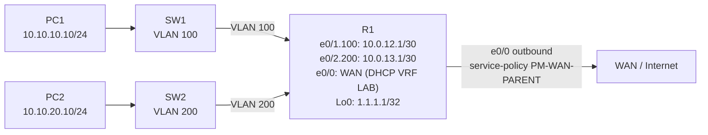

# Workbook Studenti — MOD-26: QoS MQC

**Area:** QoS | **Ore:** 2h | **Codici syllabus:** 1.5.a · 1.5.b

> **Piattaforme supportate:** GNS3 · ContainerLab (vrnetlab/IOU) · EVE-NG

---

## 1. TOPOLOGIA



**Punto di applicazione QoS:** R1 interfaccia e0/0 — `service-policy output PM-WAN-PARENT`

### Piano di indirizzamento

| Device | Interfaccia | IP / Mask | Ruolo |
|--------|-------------|-----------|-------|
| R1 | e0/0 | DHCP (VRF LAB) | WAN — QoS applicata outbound |
| R1 | e0/1.100 | 10.0.12.1/30 | Transit verso SW1 |
| R1 | e0/2.200 | 10.0.13.1/30 | Transit verso SW2 |
| R1 | Lo0 | 1.1.1.1/32 | Target ping |
| PC1 | eth0 | 10.10.10.10/24 | Host VLAN 10 |
| PC2 | eth0 | 10.10.20.10/24 | Host VLAN 20 |

### Design classi QoS (Child Policy)

| Classe | Traffico | ACL | DSCP | Meccanismo | Parametro |
|--------|----------|-----|------|------------|-----------|
| CM-VOICE | SIP (5060) + RTP (16384-32767) | ACL-VOICE | EF (46) | priority | 30% della banda shaped |
| CM-MGMT | SSH (22) + Telnet (23) | ACL-MGMT | CS2 (16) | police | 512 kbps |
| class-default | Tutto il resto (DATA) | — | AF21 (18) | bandwidth | 40% della banda shaped |

---

## 2. OBIETTIVI DELLA SESSIONE

Al termine di questo modulo lo studente sarà in grado di:

- [ ] Descrivere i modelli QoS (IntServ vs DiffServ) e la struttura MQC
- [ ] Classificare il traffico con class-map e ACL estese
- [ ] Configurare una child policy con marking, LLQ (priority), policing e CBWFQ (bandwidth)
- [ ] Configurare una parent policy con shaping e child annidato
- [ ] Verificare la QoS con `show policy-map interface` e interpretare i contatori
- [ ] Distinguere tra `priority`, `bandwidth`, `police` e `shape` e i loro effetti sul traffico

**Codici syllabus coperti:** 1.5.a — QoS modelli e policy; 1.5.b — QoS per traffico specifico

---

## 3. LAB SETUP

### Configurazione Iniziale

> Incollare il blocco direttamente sulla console di R1 (paste manuale).

#### R1

```
hostname R1
!
service timestamps debug datetime msec
service timestamps log datetime msec
no service password-encryption
!
no ip domain lookup
!
vrf definition LAB
 address-family ipv4
 exit-address-family
!
ip routing
!
interface Loopback0
 ip address 1.1.1.1 255.255.255.255
 no shutdown
!
interface Ethernet0/0
 vrf forwarding LAB
 ip address dhcp
 no shutdown
!
interface Ethernet0/1
 no ip address
 no shutdown
!
interface Ethernet0/1.100
 encapsulation dot1Q 100
 ip address 10.0.12.1 255.255.255.252
 ip ospf 1 area 0
!
interface Ethernet0/2
 no ip address
 no shutdown
!
interface Ethernet0/2.200
 encapsulation dot1Q 200
 ip address 10.0.13.1 255.255.255.252
 ip ospf 1 area 0
!
router ospf 1
 router-id 1.1.1.1
 network 1.1.1.1 0.0.0.0 area 0
!
ip route 10.10.10.0 255.255.255.0 10.0.12.2
ip route 10.10.10.0 255.255.255.0 10.0.13.2 10
ip route 10.10.20.0 255.255.255.0 10.0.13.2
ip route 10.10.20.0 255.255.255.0 10.0.12.2 10
!
ip tftp source-interface Ethernet0/0
no ip http server
no ip http secure-server
ip dns view vrf LAB default
ip route vrf LAB 0.0.0.0 0.0.0.0 192.168.122.1
!
line con 0
 logging synchronous
end
```

La configurazione pre-caricata include le interfacce e le rotte statiche di R1. Le policy QoS sono da configurare nel lab.

### Prerequisiti

- R1 ha interfacce e0/1.100 e e0/2.200 UP con IP assegnati
- Ping SW1 → R1 (10.0.12.1) funzionante
- Ping PC1 → 1.1.1.1 funzionante (verifica percorso end-to-end)

### Verifica pre-lab

```
! Verificare stato interfacce R1
R1# show ip interface brief

! Verificare che non ci siano service-policy già applicate su e0/0
R1# show policy-map interface e0/0
! Deve rispondere "No policy" o non mostrare output

! Verifica connettività end-to-end
PC1> ping 1.1.1.1
```

---

## 4. TASK LIST

| # | Task | Codice syllabus | Tempo stimato |
|---|------|-----------------|---------------|
| T1 | ACL di classificazione | 1.5.a | 10' |
| T2 | Class-map — identificazione traffico | 1.5.a | 10' |
| T3 | Child Policy — marking e queuing | 1.5.b | 15' |
| T4 | Parent Policy — shaping e child annidato | 1.5.b | 10' |
| T5 | Applicazione e verifica | 1.5.b | 15' |

---

## 5. DETTAGLIO TASK

### TEORIA GENERALE QoS — Lettura prima dei task

**Perché QoS?**

Senza QoS, tutti i pacchetti vengono gestiti con lo stesso trattamento (Best-Effort). In una rete reale, traffico VoIP e traffico di backup condividono lo stesso link — senza prioritizzazione, VoIP soffre di latenza e jitter, degradando la qualità audio.

**Modelli QoS**

| Modello | Descrizione | Meccanismo | Use case |
|---------|-------------|------------|---------|
| Best-Effort | Nessuna garanzia | FIFO | LAN interna senza differenziazione |
| IntServ | Risorse riservate per ogni flusso | RSVP | Ambienti controllati, non scala |
| DiffServ | Classificazione e trattamento differenziato per classi | DSCP, MQC | Standard enterprise e Internet |

**DiffServ — DSCP (Differentiated Services Code Point)**

DSCP è un campo di 6 bit nell'header IP (byte ToS/DSCP). Permette a ogni dispositivo di rete di trattare i pacchetti in base alla loro classe senza mantenere stato per ogni flusso.

**Tabella DSCP più utilizzati**

| Nome | Valore decimale | Valore binario | Uso tipico |
|------|----------------|----------------|------------|
| EF (Expedited Forwarding) | 46 | 101110 | VoIP, real-time |
| AF11 | 10 | 001010 | Video streaming (bassa priorità) |
| AF21 | 18 | 010010 | Dati business, ERP |
| AF31 | 26 | 011010 | Dati mission-critical |
| AF41 | 34 | 100010 | Video conferencing |
| AF43 | 38 | 100110 | Video conferencing (excess) |
| CS2 | 16 | 010000 | Management plane |
| CS3 | 24 | 011000 | Signaling |
| CS6 | 48 | 110000 | Network control (OSPF, BGP) |
| BE (Best-Effort / default) | 0 | 000000 | Traffico non classificato |

**Struttura MQC (Modular QoS CLI)**

MQC divide la configurazione QoS in tre oggetti separati:

```
1. class-map         → IDENTIFICA il traffico (chi sei?)
2. policy-map        → AGISCE sul traffico (cosa faccio con te?)
3. service-policy    → APPLICA la policy a un'interfaccia (dove?)
```

**Meccanismi di QoS a confronto**

| Meccanismo | Comando | Effetto su eccesso | Buffer? | Use case |
|-----------|---------|-------------------|---------|---------|
| LLQ | `priority` | Drop immediato (policed) | No | VoIP, real-time (latenza minima) |
| CBWFQ | `bandwidth` | Accodato + WFQ | Si | Dati importanti (garantisce minimo) |
| Policing | `police` | Drop o re-mark immediato | No | Limite rigido (management plane) |
| Shaping | `shape` | Bufferizzato (token bucket) | Si | WAN rate-limiting (parent policy) |

**Architettura gerarchica parent/child**

```
PM-WAN-PARENT (applicata a e0/0 outbound)
└── class class-default
    ├── shape average 10000000    ← simula CIR WAN 10 Mbps
    └── service-policy PM-CHILD  ← child annidato opera dentro il bucket
        ├── CM-VOICE → set dscp ef, priority percent 30
        ├── CM-MGMT  → set dscp cs2, police 512kbps
        └── class-default → set dscp af21, bandwidth percent 40
```

> La child policy opera **all'interno della finestra di 10 Mbps** definita dallo shaping. `priority percent 30` = 30% di 10 Mbps = 3 Mbps — NON 30% della banda fisica dell'interfaccia.

---

### T1 — ACL di classificazione

#### TEORIA

Le ACL estese identificano il traffico in base a protocollo, indirizzi sorgente/destinazione e porte. In QoS MQC si usano come riferimento nelle class-map con `match access-group name`.

> **Importante:** devono essere ACL **extended** (non standard). Le ACL standard non supportano il match per porta e protocollo, necessario per classificare VoIP e management.

#### TASK

```
! ACL per traffico VOICE: SIP (segnalazione VoIP) + RTP (media audio/video)
R1(config)# ip access-list extended ACL-VOICE
R1(config-ext-nacl)# permit tcp any any eq 5060
R1(config-ext-nacl)# permit udp any any eq 5060
R1(config-ext-nacl)# permit udp any any range 16384 32767
R1(config-ext-nacl)# exit

! ACL per traffico MGMT: accesso SSH e Telnet ai dispositivi
R1(config)# ip access-list extended ACL-MGMT
R1(config-ext-nacl)# permit tcp any any eq 22
R1(config-ext-nacl)# permit tcp any any eq 23
R1(config-ext-nacl)# exit
```

> **Nota:** il traffico DATA (tutto ciò che non è VOICE né MGMT) non ha una ACL dedicata — verrà catturato da `class-default` nella policy.

#### VERIFICA

```
R1# show ip access-lists ACL-VOICE
R1# show ip access-lists ACL-MGMT
! Verificare che le ACL siano presenti e abbiano le righe corrette
```

---

### T2 — Class-map — identificazione traffico

#### TEORIA

La class-map definisce i criteri di match per classificare il traffico. I comandi `match` più comuni:

| Comando match | Cosa fa |
|--------------|---------|
| `match access-group name ACL-X` | Match se il pacchetto è permesso dall'ACL |
| `match dscp ef` | Match per valore DSCP (pacchetti già marcati a monte) |
| `match protocol http` | Match per protocollo applicativo (richiede NBAR) |
| `match vlan 10` | Match per VLAN (solo su input di porte trunk) |

**match-any vs match-all**

- `match-any`: il pacchetto è classificato se almeno uno dei criteri corrisponde (logica OR)
- `match-all`: il pacchetto deve soddisfare tutti i criteri (logica AND)

#### TASK

```
R1(config)# class-map match-any CM-VOICE
R1(config-cmap)# match access-group name ACL-VOICE
R1(config-cmap)# exit

R1(config)# class-map match-any CM-MGMT
R1(config-cmap)# match access-group name ACL-MGMT
R1(config-cmap)# exit

! DATA non ha class-map: usa class-default (implicita in ogni policy-map)
! IOS valuta le classi in ordine top-down:
! VOICE → MGMT → tutto il resto va in class-default (DATA)
```

#### VERIFICA

```
R1# show class-map CM-VOICE
R1# show class-map CM-MGMT
```

Output atteso:
```
 Class Map match-any CM-VOICE (id 1)
   Match access-group name ACL-VOICE

 Class Map match-any CM-MGMT (id 2)
   Match access-group name ACL-MGMT
```

---

### T3 — Child Policy — Marking e Queuing

#### TEORIA

La child policy esegue due operazioni nella stessa classe:
1. **Marking** (`set dscp`): segna il pacchetto per tutti i dispositivi downstream
2. **Queuing/Policing**: applica il trattamento (LLQ, CBWFQ, police)

L'ordine di classificazione è top-down: IOS esamina CM-VOICE prima di CM-MGMT, poi class-default.

#### TASK

```
R1(config)# policy-map PM-CHILD
R1(config-pmap)# class CM-VOICE
R1(config-pmap-c)# set dscp ef
! Marca DSCP EF (46 = 101110 binario)
! EF = Expedited Forwarding: richiede latenza e jitter minimi

R1(config-pmap-c)# priority percent 30
! LLQ (Low Latency Queuing): coda strict-priority, servita PRIMA di tutte le altre
! 30% = 30% della banda shaped (10 Mbps) = 3 Mbps garantiti
! Se VOICE supera 3 Mbps: il traffico eccedente viene DROPPATO (policed)
! Non c'è buffer — ideale per VoIP che non tollera latenza
R1(config-pmap-c)# exit

R1(config-pmap)# class CM-MGMT
R1(config-pmap-c)# set dscp cs2
! Marca DSCP CS2 (16 = 010000): traffic class 2, management

R1(config-pmap-c)# police rate 512000 bps
R1(config-pmap-c-police)# conform-action transmit
R1(config-pmap-c-police)# exceed-action drop
! Police 512 kbps: limite rigido senza buffer
! conform = trasmetti; exceed = droppa immediatamente
! Il traffico management non deve saturare il link WAN
R1(config-pmap-c)# exit

R1(config-pmap)# class class-default
! Cattura tutto ciò che non ha matchato CM-VOICE né CM-MGMT (= traffico DATA)
R1(config-pmap-c)# set dscp af21
! Marca DSCP AF21 (18): Assured Forwarding, priorità media

R1(config-pmap-c)# bandwidth percent 40
! CBWFQ: garantisce 40% della banda shaped (= 4 Mbps)
! Se il traffico DATA supera 4 Mbps: viene accodato, NON droppato
! Usa la banda libera delle altre classi se disponibile
R1(config-pmap-c)# exit
```

> **Nota:** `class-default` in una policy-map cattura tutto il traffico non classificato nelle classi precedenti. Non dimenticare mai questa classe — senza di essa il traffico DATA non ha trattamento definito.

#### VERIFICA (statica — senza traffico)

```
R1# show policy-map PM-CHILD
```

Output atteso:
```
  Policy Map PM-CHILD
    Class CM-VOICE
      set dscp ef
      Strict Priority
        Output Queue: None
        Bandwidth 30 (%)
    Class CM-MGMT
      set dscp cs2
      police rate 512000 bps
        conform-action: transmit
        exceed-action: drop
    Class class-default
      set dscp af21
      Weighted Fair Queueing
        Bandwidth 40 (%)
```

---

### T4 — Parent Policy — Shaping e Child annidato

#### TEORIA

**Perché una struttura gerarchica?**

Lo shaping (`shape average`) simula il CIR (Committed Information Rate) di un link WAN. Bufferizza il traffico che supera il CIR nel token bucket — introduce delay ma non dropa.

I meccanismi `priority` e `bandwidth` della child policy operano **all'interno** della finestra di banda definita dallo shaping. Questo permette di garantire proporzioni specifiche di banda all'interno del CIR WAN.

**Dove va lo shaping?**

Lo shaping va **sempre nella parent policy** (nella `class class-default` della parent). Mai nella child policy insieme a `priority` — porterebbe delay aggiuntivo al traffico VoIP.

#### TASK

```
R1(config)# policy-map PM-WAN-PARENT
R1(config-pmap)# class class-default
R1(config-pmap-c)# shape average 10000000
! Shaping a 10 Mbps: simula il CIR del link WAN verso il provider
! Pacchetti > 10 Mbps: bufferizzati nel token bucket (no drop)
! Introduce ritardo — accettabile per DATA, non per VOICE
! Per questo VOICE usa priority nella child (servita prima del buffer)

R1(config-pmap-c)# service-policy PM-CHILD
! Annida PM-CHILD: il queuing avviene dentro la finestra da 10 Mbps
! priority/bandwidth/police operano rispetto a 10 Mbps, non alla velocità fisica
R1(config-pmap-c)# exit
```

**Step finale** — Applicare la parent policy all'interfaccia WAN:

```
R1(config)# interface ethernet 0/0
R1(config-if)# service-policy output PM-WAN-PARENT
! 'output': agisce sul traffico in uscita verso WAN
! È il punto dove il traffico da tutta la rete interna converge verso Internet
```

---

### T5 — Applicazione e verifica

#### VERIFICA

**1. Verifica struttura completa della policy**

```
R1# show policy-map interface ethernet 0/0
```

Output atteso (estratto):
```
Ethernet0/0
  Service-policy output: PM-WAN-PARENT

    Class-map: class-default (match-any)
      0 packets, 0 bytes
      5 minute offered rate 0000 bps, drop rate 0000 bps
      Traffic Shaping
          Target/Average   Byte Limit  Sustain Bytes  Excess Bytes  Interval  Increment
          10000000/10000000 62500       250000         250000        25        3125

      Service-policy : PM-CHILD

        Class-map: CM-VOICE (match-any)
          0 packets, 0 bytes
          set dscp ef
          Strict Priority
            Output Queue: Conversation 24
            Bandwidth 30 (%)   3000 (kbps) Burst 75000 (Bytes)

        Class-map: CM-MGMT (match-any)
          0 packets, 0 bytes
          set dscp cs2
          police:
              rate 512000 bps, burst 16000 byte
            conformed 0 packets, 0 bytes; actions: transmit
            exceeded 0 packets, 0 bytes; actions: drop

        Class-map: class-default (match-any)
          0 packets, 0 bytes
          set dscp af21
          Weighted Fair Queueing
            Output Queue: Conversation 264
            Bandwidth 40 (%)   4000 (kbps)
```

**2. Genera traffico di test e osserva i contatori**

```
! Genera ping da PC1 verso R1 Lo0
PC1> ping 1.1.1.1 repeat 100

! Verifica contatori dopo il traffico
R1# show policy-map interface ethernet 0/0
! I pacchetti ICMP appariranno in class-default (DATA)
! perché VPCS non marca DSCP EF e ICMP non matcha ACL-VOICE né ACL-MGMT
```

**3. Spiegazione del risultato**

I pacchetti ICMP di PC1 (VPCS) finiscono in `class-default` perché:
- VPCS non marca il campo DSCP (default = 0x00, BE)
- ICMP non è nella ACL-VOICE (SIP+RTP) né ACL-MGMT (SSH+Telnet)

In produzione, il marking avviene il più vicino possibile alla sorgente (access layer) — per garantire che i dispositivi upstream riconoscano la classe del traffico.

```
! Reset contatori per nuovo test
R1# clear counters ethernet 0/0

! Verifica struttura statica della policy senza traffico
R1# show policy-map PM-WAN-PARENT
R1# show policy-map PM-CHILD
```

---

## 6. TROUBLESHOOTING GUIDE

| Sintomo | Causa probabile | Diagnosi | Fix |
|---------|-----------------|----------|-----|
| Errore `priority percent` non accettato | priority percent richiede il contesto di shaping — applicare child direttamente senza parent | `show policy-map` — manca shape | Creare parent con `shape average` e annidare la child con `service-policy` |
| `service-policy output` rifiutato | Una policy è già applicata sull'interfaccia | `show policy-map interface e0/0` | Rimuovere con `no service-policy output` prima |
| Tutti i pacchetti in class-default | ACL non matcha — classe non identificata | `show access-lists ACL-VOICE` + `debug ip policy` | Verificare porte ACL; testare con traffico SIP/RTP reale |
| Contatori CM-VOICE = 0 anche con traffico VoIP | ACL-VOICE non configurata come `extended` | `show ip access-lists ACL-VOICE` | Ricreare come extended: `ip access-list extended ACL-VOICE` |
| `exceeded` su CM-MGMT = 0 sempre | Rate 512 kbps è sufficiente per il traffico attuale — normale | `show policy-map interface e0/0` — conformed incrementa | Generare traffico SSH intenso per vedere exceeded incrementare |
| Shape non funziona — nessun ritardo visibile | `service-policy` applicata in input anziché output | `show policy-map interface e0/0` — verifica direzione | Rimuovere con `no service-policy input` e applicare `output` |

---

## 7. SOLUZIONI

Vedere il file `soluzione.md` nella stessa cartella per le configurazioni complete commentate.

---

## 8. RIEPILOGO & EXAM TIPS

**Punti chiave:**

- MQC = class-map (identifica) + policy-map (agisce) + service-policy (applica)
- `priority percent 30` = 30% della banda shaped (10 Mbps = 3 Mbps), NON 30% della velocità fisica
- `priority` (LLQ): nessun buffer, eccesso droppato — ideale per VoIP (latenza zero)
- `bandwidth` (CBWFQ): eccesso accodato con WFQ — ideale per dati importanti
- `police`: eccesso droppato immediatamente (no buffer) — per management plane e limiti rigidi
- `shape`: bufferizza il traffico eccedente (introduce delay) — va nella parent policy, mai sulla classe VOICE
- Il marking DSCP deve avvenire il prima possibile (access layer = trust boundary)

**Tabella DSCP di riferimento per l'esame**

| DSCP | Decimale | Binario | Uso |
|------|----------|---------|-----|
| EF | 46 | 101110 | VoIP, real-time |
| AF21 | 18 | 010010 | Dati aziendali |
| AF31 | 26 | 011010 | Dati mission-critical |
| AF41 | 34 | 100010 | Video interattivo |
| CS2 | 16 | 010000 | Management |
| CS6 | 48 | 110000 | Network control |
| BE | 0 | 000000 | Best-effort (default) |

**Domande tipo CCNP:**

1. `priority percent 30` — 30% di cosa? Cambia se si applica la child direttamente senza parent?
2. Qual è la differenza tra `police` e `shape`? Quale introduce buffer delay e perché?
3. Perché lo shaping va nella parent policy e non nella child accanto a `priority`?
4. Cos'è la trust boundary? Perché il marking dovrebbe avvenire il più vicino possibile alla sorgente?
5. Un pacchetto DSCP EF entra su R1 da PC1 (VPCS, DSCP=0). La class-map CM-VOICE matcha? Perché?
