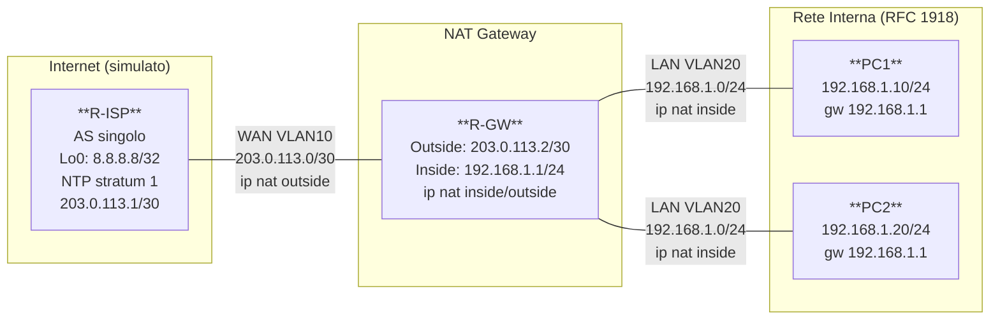

# Workbook Studenti — MOD-27: NAT/PAT & NTP

**Area:** AREA 4 — IP Services | **Ore:** 2h | **Codici syllabus:** 3.4.a · 3.4.b

**Piattaforme supportate:** GNS3 · ContainerLab (vrnetlab/IOU) · EVE-NG

---

## 1. TOPOLOGIA

### Diagramma Logico



### Piano di Indirizzamento

Tutti i dispositivi collegano via `Ethernet0/0` a uno switch GNS3. PC1 e PC2 sono router IOU che simulano host.

#### Link WAN (ip nat outside)

| Collegamento | VLAN | IP R-ISP | IP R-GW |
|---|---|---|---|
| R-ISP — R-GW | 10 | 203.0.113.1/30 | 203.0.113.2/30 |

#### Link LAN (ip nat inside)

| Device | VLAN | IP | Gateway |
|---|---|---|---|
| R-GW | 20 | 192.168.1.1/24 | — |
| PC1 | 20 | 192.168.1.10/24 | 192.168.1.1 |
| PC2 | 20 | 192.168.1.20/24 | 192.168.1.1 |

#### Pool NAT (Tasks T1-T2) e PAT (Task T3)

| Utilizzo | Range | Note |
|---|---|---|
| Static NAT PC1 | 203.0.113.10/32 | One-to-one, Task T1 |
| Dynamic NAT pool | 203.0.113.10 – 203.0.113.12 | First-come first-served, Task T2 |
| PAT overload | 203.0.113.2 (outside if) | Porta sorgente modificata, Task T3 |

#### Loopback

| Device | IP | Ruolo |
|---|---|---|
| R-ISP | 8.8.8.8/32 | Destinazione test (simula DNS Google) |

---

## 2. OBIETTIVI DELLA SESSIONE

Al termine di questo modulo lo studente sarà in grado di:

- [ ] Configurare Static NAT con mapping one-to-one tra IP privato e IP pubblico
- [ ] Configurare Dynamic NAT con pool di indirizzi pubblici
- [ ] Configurare PAT (NAT Overload) su interfaccia outside
- [ ] Verificare le traduzione attive con `show ip nat translations`
- [ ] Configurare NTP server/client con autenticazione MD5
- [ ] Diagnosticare scenari NAT malfunzionanti

**Codici syllabus coperti:** 3.4.a (NAT/PAT) · 3.4.b (NTP)

**Prerequisiti:** MOD-01 (routing base, interfacce sub-interface)

---

## 3. LAB SETUP

**Piattaforme supportate:** GNS3 · ContainerLab (vrnetlab/IOU) · EVE-NG

### Prerequisiti

- Topologia MOD-27 caricata
- Comprensione di routing statico e sub-interface 802.1Q
- Concetto di indirizzo privato (RFC 1918) vs pubblico

### Configurazione Iniziale

Caricare via paste manuale o TFTP:

```
copy tftp://192.168.122.1/ENCOR/MOD-27/rx-cfg running-config
```

#### R-ISP

```
hostname R-ISP
no ip domain-lookup
!
interface Ethernet0/0
 no ip address
 no shutdown
!
interface Ethernet0/0.10
 encapsulation dot1Q 10
 ip address 203.0.113.1 255.255.255.252
 description WAN_to_R-GW
 no shutdown
!
interface Loopback0
 ip address 8.8.8.8 255.255.255.255
 description Simulated_Internet_Target
 no shutdown
!
! Route verso il pool NAT e verso R-GW inside (per Static NAT):
ip route 203.0.113.8 255.255.255.248 203.0.113.2
ip route 192.168.1.0 255.255.255.0 203.0.113.2
!
! NTP: R-ISP e' il server -- DA CONFIGURARE in Task T4
! ntp master 1
!
end
```

#### R-GW

```
hostname R-GW
no ip domain-lookup
!
interface Ethernet0/0
 no ip address
 no shutdown
!
interface Ethernet0/0.10
 encapsulation dot1Q 10
 ip address 203.0.113.2 255.255.255.252
 description WAN_Outside
 ip nat outside
 no shutdown
!
interface Ethernet0/0.20
 encapsulation dot1Q 20
 ip address 192.168.1.1 255.255.255.0
 description LAN_Inside
 ip nat inside
 no shutdown
!
interface Loopback0
 ip address 10.0.0.1 255.255.255.255
 no shutdown
!
! Default route verso R-ISP:
ip route 0.0.0.0 0.0.0.0 203.0.113.1
!
! NAT: DA CONFIGURARE nei Task T1-T3
! NTP: DA CONFIGURARE in Task T4
!
end
```

#### PC1

```
hostname PC1
no ip domain-lookup
!
interface Ethernet0/0
 no ip address
 no shutdown
!
interface Ethernet0/0.20
 encapsulation dot1Q 20
 ip address 192.168.1.10 255.255.255.0
 description LAN_Inside
 no shutdown
!
! Default gateway verso R-GW:
ip route 0.0.0.0 0.0.0.0 192.168.1.1
!
end
```

#### PC2

```
hostname PC2
no ip domain-lookup
!
interface Ethernet0/0
 no ip address
 no shutdown
!
interface Ethernet0/0.20
 encapsulation dot1Q 20
 ip address 192.168.1.20 255.255.255.0
 description LAN_Inside
 no shutdown
!
ip route 0.0.0.0 0.0.0.0 192.168.1.1
!
end
```

### Verifica Pre-Lab

```
! Su R-GW — verifica interfacce NAT
R-GW# show ip interface Ethernet0/0.10 | include NAT
! Atteso: "Outbound access list is not set, Outbound NAT is enabled" (o simile)

! Su R-GW — verifica connettività verso R-ISP
R-GW# ping 203.0.113.1
! Atteso: !!!!!

! Su PC1 — verifica connettività verso R-GW (gateway)
PC1# ping 192.168.1.1
! Atteso: !!!!!

! PC1 NON raggiunge 8.8.8.8 senza NAT:
PC1# ping 8.8.8.8
! Atteso: U.U.U (no route o no NAT)
```

---

## 4. TASK LIST

| # | Task | Codice | Tempo |
|---|---|---|---|
| T1 | Static NAT — mapping one-to-one | 3.4.a | 20 min |
| T2 | Dynamic NAT — pool di IP pubblici | 3.4.a | 20 min |
| T3 | PAT / NAT Overload | 3.4.a | 15 min |
| T4 | NTP — server, client e autenticazione MD5 | 3.4.b | 20 min |
| T5 | Troubleshooting NAT | 3.4.a | 25 min |

**Tempo totale: ~100 min** (buffer: 20 min)

---

## 5. DETTAGLIO TASK

---

### T1 — Static NAT

#### TEORIA

**NAT statico (one-to-one)**

Il NAT statico crea un mapping permanente e bidirezionale tra un indirizzo IP privato e un indirizzo IP pubblico. A differenza del NAT dinamico, il mapping esiste sempre, indipendentemente dalla presenza di traffico attivo. Questo lo rende utile per server interni che devono essere raggiungibili dall'esterno con un IP pubblico fisso.

**Caratteristiche:**
- Mapping 1:1 (un IP privato → un IP pubblico)
- Bidirezionale: l'IP pubblico può iniziare connessioni verso l'IP privato
- Il mapping è permanente (non scade)
- Usa un IP pubblico dedicato per ogni host → non scala

**Sintassi:**
```
ip nat inside source static <IP-privato> <IP-pubblico>
```

**Direzioni NAT:**
- `ip nat inside` sull'interfaccia LAN: il router sa che il traffico interno ha IP privati da tradurre
- `ip nat outside` sull'interfaccia WAN: il router sa che il traffico esterno ha IP pubblici

#### TASK

Su R-GW: configurare Static NAT per PC1 (192.168.1.10 → 203.0.113.10):

```
R-GW# configure terminal

! Mapping statico: ogni pacchetto con src 192.168.1.10 viene tradotto a 203.0.113.10
! e ogni pacchetto dst 203.0.113.10 viene diretto a 192.168.1.10
R-GW(config)# ip nat inside source static 192.168.1.10 203.0.113.10

R-GW(config)# end
```

> **Nota:** le interfacce `ip nat inside` e `ip nat outside` sono già configurate nella cfg iniziale.

#### VERIFICA

```
! Verifica che il mapping statico esista (anche senza traffico):
R-GW# show ip nat translations
! Atteso:
! Pro  Inside global     Inside local     Outside local    Outside global
! ---  203.0.113.10      192.168.1.10     ---              ---

! Test: ping da R-ISP verso l'IP pubblico di PC1:
R-ISP# ping 203.0.113.10
! Atteso: !!!!! (il pacchetto viene tradotto a 192.168.1.10 e risponde PC1)

! Verifica che PC1 raggiunga 8.8.8.8 via NAT:
PC1# ping 8.8.8.8
! Atteso: !!!!!

! Osserva la traduzione attiva:
R-GW# show ip nat translations
! Atteso: entry con Inside global 203.0.113.10 e Outside global 8.8.8.8
```

---

### T2 — Dynamic NAT con Pool

#### TEORIA

**NAT dinamico con pool**

Il NAT dinamico assegna un IP pubblico dal pool al primo host che genera traffico (first-come first-served). Il mapping esiste solo durante la sessione attiva e scade dopo un timeout configurabile (default: 86.400 s per TCP, 300 s per UDP).

**Differenze dal NAT statico:**
- Mapping temporaneo (viene creato al bisogno, eliminato allo scadere)
- Unidirezionale: solo l'host interno può iniziare la connessione
- Non utilizzabile per server interni (l'IP pubblico cambia)
- Il pool si esaurisce se ci sono più host simultanei che IP pubblici

**Componenti:**
1. **ACL** (o prefix-list): identifica gli host interni soggetti a NAT
2. **Pool**: intervallo di IP pubblici disponibili
3. **Comando ip nat**: collega ACL e pool

```
ip access-list standard ACL-NAT
 permit 192.168.1.0 0.0.0.255
ip nat pool POOL-PUB 203.0.113.10 203.0.113.12 netmask 255.255.255.248
ip nat inside source list ACL-NAT pool POOL-PUB
```

#### TASK

Prima di tutto, rimuovere il NAT statico del task precedente:

```
R-GW# configure terminal
R-GW(config)# no ip nat inside source static 192.168.1.10 203.0.113.10
```

Poi configurare il Dynamic NAT:

```
! ACL che seleziona gli host interni da tradurre:
R-GW(config)# ip access-list standard ACL-INSIDE
R-GW(config-std-nacl)# permit 192.168.1.0 0.0.0.255
R-GW(config-std-nacl)# exit

! Pool di 3 IP pubblici (203.0.113.10 - 203.0.113.12):
R-GW(config)# ip nat pool POOL-PUB 203.0.113.10 203.0.113.12 netmask 255.255.255.248

! Collega ACL e pool — quando un host interno colpisce l'ACL, riceve un IP dal pool:
R-GW(config)# ip nat inside source list ACL-INSIDE pool POOL-PUB

R-GW(config)# end
```

#### VERIFICA

```
! Genera traffico da PC1 e PC2 verso 8.8.8.8:
PC1# ping 8.8.8.8 repeat 5
PC2# ping 8.8.8.8 repeat 5

! Osserva le traduzioni: PC1 e PC2 hanno IP pubblici diversi del pool
R-GW# show ip nat translations
! Atteso: due entry distinte con Inside global 203.0.113.10 e 203.0.113.11

! Statistiche NAT (quante traduzioni create/scadute):
R-GW# show ip nat statistics
! Atteso: pool utilizzo, hits, misses
```

---

### T3 — PAT / NAT Overload

#### TEORIA

**PAT (Port Address Translation) — il caso più comune**

PAT è una variante del NAT dinamico che usa le porte TCP/UDP per distinguere le sessioni. Tutti gli host interni condividono **un singolo IP pubblico** (tipicamente quello dell'interfaccia outside). Il router differenzia le sessioni tramite la porta sorgente.

**Esempio:**
- PC1 (192.168.1.10:45000) → 203.0.113.2:**12345**
- PC2 (192.168.1.20:50000) → 203.0.113.2:**12346**

**Vantaggi:**
- Scala a migliaia di host con un solo IP pubblico
- Caso d'uso più comune (SOHO, aziende, provider)

**Differenza con Dynamic NAT pool:**
Il Dynamic NAT usa IP pubblici diversi; il PAT usa lo stesso IP con porte diverse.

**Sintassi con overload su interfaccia:**
```
ip nat inside source list <ACL> interface <outside-if> overload
```

#### TASK

Rimuovere il Dynamic NAT del task precedente e sostituire con PAT:

```
R-GW# configure terminal

! Rimuovere la configurazione Dynamic NAT precedente:
R-GW(config)# no ip nat inside source list ACL-INSIDE pool POOL-PUB
R-GW(config)# no ip nat pool POOL-PUB

! Configura PAT: usa l'IP dell'interfaccia outside (203.0.113.2) + porta
! L'ACL ACL-INSIDE è già configurata, la riutilizziamo:
R-GW(config)# ip nat inside source list ACL-INSIDE interface Ethernet0/0.10 overload

R-GW(config)# end
```

#### VERIFICA

```
! Genera traffico simultaneo da PC1 e PC2:
PC1# ping 8.8.8.8 repeat 10
PC2# ping 8.8.8.8 repeat 10

! Osserva: entrambi usano 203.0.113.2 ma con porta sorgente diversa:
R-GW# show ip nat translations
! Atteso:
! icmp 203.0.113.2:12345  192.168.1.10:12345  8.8.8.8:12345  8.8.8.8:12345
! icmp 203.0.113.2:12346  192.168.1.20:12346  8.8.8.8:12346  8.8.8.8:12346

! Verifica che il campo Inside global sia sempre 203.0.113.2 (non cambia)
! ma la porta cambia per ogni sessione

R-GW# show ip nat statistics
```

> **Nota IOU:** il PING usa ICMP, che non ha porte TCP/UDP. Il router IOS implementa PAT per ICMP usando l'ICMP identifier come pseudo-porta. L'output di `show ip nat translations` mostra comunque le entry.

---

### T4 — NTP: Server, Client e Autenticazione MD5

#### TEORIA

**NTP (Network Time Protocol)**

NTP sincronizza l'orologio dei dispositivi di rete. L'ora precisa è critica per log corretti, validità certificati, timestamp AAA, e correlazione eventi di sicurezza.

**Stratum:** misura la distanza dall'orologio di riferimento atomico.
- Stratum 0: clock atomico (hardware reference)
- Stratum 1: server con accesso diretto al clock atomico
- Stratum 2: server sincronizzato a un stratum 1
- Stratum 15: massimo utilizzabile; stratum 16 = unsynchronized

**Ruoli su IOS:**

| Comando | Ruolo |
|---|---|
| `ntp master <stratum>` | Imposta il router come NTP server (usa il proprio orologio) |
| `ntp server <IP>` | Configura il router come client di un server NTP |
| `ntp peer <IP>` | Sincronizzazione bidirezionale tra pari |

**Autenticazione NTP MD5:**

```
! Su server e client (stessa chiave):
ntp authenticate
ntp authentication-key 1 md5 <password>
ntp trusted-key 1

! Sul client, aggiunge la chiave al server:
ntp server <IP> key 1
```

#### TASK

**Configurazione su R-ISP (NTP server, stratum 1):**

```
R-ISP# configure terminal

! R-ISP funge da NTP server locale con stratum 1:
R-ISP(config)# ntp master 1

! Autenticazione:
R-ISP(config)# ntp authenticate
R-ISP(config)# ntp authentication-key 1 md5 CISCO123
R-ISP(config)# ntp trusted-key 1

R-ISP(config)# end
```

**Configurazione su R-GW (NTP client):**

```
R-GW# configure terminal

! Abilita autenticazione NTP:
R-GW(config)# ntp authenticate
R-GW(config)# ntp authentication-key 1 md5 CISCO123
R-GW(config)# ntp trusted-key 1

! Punta al server NTP (R-ISP) usando la chiave 1:
R-GW(config)# ntp server 203.0.113.1 key 1

R-GW(config)# end
```

#### VERIFICA

```
! Su R-GW — stato sincronizzazione (attendere 1-2 minuti):
R-GW# show ntp status
! Atteso:
! Clock is synchronized, stratum 2, reference is 203.0.113.1
! (stratum 2 perche' R-ISP e' stratum 1 e R-GW e' 1 hop piu' lontano)

! Su R-GW — associazioni NTP:
R-GW# show ntp associations
! Atteso:
!   address         ref clock     st  when  poll  reach  delay  offset  disp
! *~203.0.113.1     127.127.1.1    1    xx    64   377    x.x     x.x   x.x
! * = selezionato e sincronizzato; ~ = autenticato

! Su R-ISP — verifica che sia in modalita' master:
R-ISP# show ntp status
! Atteso: "Clock is synchronized, stratum 1, reference is 127.127.1.1"
```

> **Nota:** `show ntp associations` mostra `*` davanti al server selezionato. La lettera `~` indica che l'autenticazione NTP è attiva e verificata.

---

### T5 — Troubleshooting NAT

#### Scenario 1 — ACL NAT troppo restrittiva

La configurazione attuale funziona correttamente. Il docente introduce il bug: cambiare l'ACL per permettere solo PC1 (192.168.1.10/32) escludendo PC2.

```
! Bug introdotto (non eseguire se il docente non lo richiede):
R-GW(config)# ip access-list standard ACL-INSIDE
R-GW(config-std-nacl)# no permit 192.168.1.0 0.0.0.255
R-GW(config-std-nacl)# permit 192.168.1.10 0.0.0.0
```

**Diagnosi:**
```
! PC2 non raggiunge 8.8.8.8 — nessuna entry in NAT table:
PC2# ping 8.8.8.8

! Verifica ACL: solo .10 è permessa
R-GW# show ip access-lists ACL-INSIDE

! Verifica NAT statistics: misses per PC2
R-GW# show ip nat statistics
```

**Fix:**
```
R-GW(config)# ip access-list standard ACL-INSIDE
R-GW(config-std-nacl)# no permit 192.168.1.10 0.0.0.0
R-GW(config-std-nacl)# permit 192.168.1.0 0.0.0.255
```

#### Scenario 2 — ip nat inside/outside invertiti

```
! Bug introdotto:
R-GW(config)# interface Ethernet0/0.10
R-GW(config-if)# no ip nat outside
R-GW(config-if)# ip nat inside
R-GW(config-if)# interface Ethernet0/0.20
R-GW(config-if)# no ip nat inside
R-GW(config-if)# ip nat outside
```

**Sintomi:** nessuna traduzione funziona; `show ip nat translations` vuoto anche con traffico.

**Diagnosi:**
```
R-GW# show ip nat translations
! Vuoto — nessuna traduzione

R-GW# show ip interface Ethernet0/0.10 | include NAT
! Mostra "inside" invece di "outside"
```

**Fix:**
```
R-GW(config)# interface Ethernet0/0.10
R-GW(config-if)# no ip nat inside
R-GW(config-if)# ip nat outside
R-GW(config-if)# interface Ethernet0/0.20
R-GW(config-if)# no ip nat outside
R-GW(config-if)# ip nat inside
```

#### Scenario 3 — Pool NAT esaurito

Con PAT non si esaurisce il pool (un solo IP), ma con Dynamic NAT a 3 IP e 4+ host simultanei:

```
! Attivare dynamic NAT (non PAT) per questo scenario:
R-GW(config)# no ip nat inside source list ACL-INSIDE interface Ethernet0/0.10 overload
R-GW(config)# ip nat inside source list ACL-INSIDE pool POOL-PUB
```

**Diagnosi:**
```
! Il 4° host non viene tradotto:
R-GW# show ip nat statistics
! "pool utilization: 3 of 3" — pool esaurito

R-GW# show ip nat translations
! Solo 3 entry attive
```

**Fix:** aumentare il pool o passare a PAT (overload).

---

## 6. TROUBLESHOOTING GUIDE

| Sintomo | Causa probabile | Diagnosi | Fix |
|---|---|---|---|
| PC1 non raggiunge 8.8.8.8 | NAT non configurato o ACL errata | `show ip nat translations` vuoto; `show ip access-lists ACL-INSIDE` | Verificare ACL e `ip nat inside source` |
| `show ip nat translations` vuoto con traffico | `ip nat inside` / `ip nat outside` assenti o invertiti | `show ip interface Eth0/0.x | include NAT` | Verificare direzione NAT su entrambe le interfacce |
| R-ISP non raggiunge 203.0.113.10 (Static NAT) | Manca route su R-ISP verso il pool | `show ip route 203.0.113.10` su R-ISP | Aggiungere `ip route 203.0.113.8 255.255.255.248 203.0.113.2` su R-ISP |
| `show ntp status`: "Clock is unsynchronized" | NTP non sincronizzato (attendere o controllare connettività) | `ping 203.0.113.1` da R-GW; `show ntp associations` | Verificare connettività + chiave autenticazione |
| NTP: "Authentication failed" in `show ntp associations` | Chiave MD5 diversa tra server e client | `show ntp associations detail` — cerca "authentication: disabled" | Verificare che `ntp authentication-key 1 md5 CISCO123` sia identico su entrambi |

---

## 7. SOLUZIONI

> Le configurazioni complete commentate riga per riga sono nel file `soluzione.md` di questo modulo.

---

## 8. RIEPILOGO & EXAM TIPS

### Punti Chiave

1. **Static NAT**: mapping permanente 1:1 — usato per server interni raggiungibili dall'esterno
2. **Dynamic NAT**: mapping temporaneo da pool — limitato dal numero di IP pubblici disponibili
3. **PAT/Overload**: un solo IP pubblico, porta sorgente modificata — il caso più comune nelle reti reali
4. `ip nat inside` → interfaccia verso la rete privata; `ip nat outside` → interfaccia verso Internet
5. **NTP stratum**: ogni hop dal clock di riferimento aumenta lo stratum di 1. L'autenticazione MD5 richiede la stessa chiave su server e client

### Exam Tips CCNP ENCOR

> Formato domande tipico 350-401:

1. Quale tipo di NAT consente a un server interno di essere raggiunto dall'esterno con un IP pubblico fisso?
   - **a) Static NAT**
   - b) Dynamic NAT
   - c) PAT
   - d) NAT Overload

2. Con PAT configurato, quale parametro distingue le sessioni di host diversi che usano lo stesso IP pubblico?
   - a) IP sorgente
   - **b) Porta sorgente**
   - c) IP destinazione
   - d) TTL

3. Il comando `ntp master 1` configura un router IOS come:
   - a) NTP client di stratum 1
   - **b) NTP server con stratum 1**
   - c) NTP peer con preferenza massima
   - d) Clock di riferimento atomico

4. `show ip nat translations` non mostra entry anche con traffico attivo. Causa più probabile:
   - a) Il pool NAT è esaurito
   - **b) Le interfacce ip nat inside/outside non sono configurate o sono invertite**
   - c) Il NAT è disabilitato globalmente
   - d) Manca la default route su R-GW

5. Qual è la differenza tra Dynamic NAT e PAT?
   - a) Nessuna: sono lo stesso meccanismo
   - b) Dynamic NAT usa porte; PAT usa IP diversi
   - **c) Dynamic NAT assegna IP diversi dal pool; PAT usa un singolo IP con porte diverse**
   - d) PAT funziona solo per TCP; Dynamic NAT anche per UDP


---

> © 2026 Matteo Mirenda — Tutti i diritti riservati.
> Materiale ad uso esclusivo degli studenti iscritti al corso.
> Vietata la riproduzione, distribuzione o condivisione
> senza autorizzazione scritta dell'autore.
> CCNP ENCOR 350-401 

---
