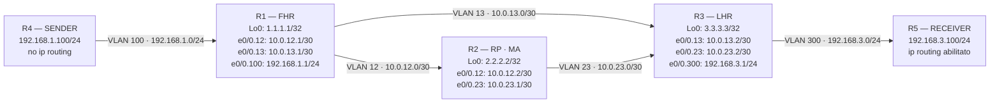

# Workbook Studenti — MOD-28: IP Multicast — PIM & Auto-RP

**Area:** AREA 3 — IP CONNECTIVITY | **Ore:** 3h | **Codici syllabus:** 3.3 · 3.4.d

> **Piattaforme supportate:** GNS3 · ContainerLab (vrnetlab/IOU) · EVE-NG

---

## 1. TOPOLOGIA



**Gruppo multicast:** 239.1.1.1 (administratively scoped — privato)

### Tabella Indirizzamento

| Device | Interfaccia     | IP / Maschera       | VLAN | Ruolo                  |
|--------|-----------------|---------------------|------|------------------------|
| R1     | e0/0.12         | 10.0.12.1/30        | 12   | Link P2P → R2          |
| R1     | e0/0.13         | 10.0.13.1/30        | 13   | Link P2P → R3          |
| R1     | e0/0.100        | 192.168.1.1/24      | 100  | LAN → R4 (SENDER)      |
| R1     | Loopback0       | 1.1.1.1/32          | —    | OSPF RID               |
| R2     | e0/0.12         | 10.0.12.2/30        | 12   | Link P2P → R1          |
| R2     | e0/0.23         | 10.0.23.1/30        | 23   | Link P2P → R3          |
| R2     | Loopback0       | 2.2.2.2/32          | —    | OSPF RID / RP address  |
| R3     | e0/0.13         | 10.0.13.2/30        | 13   | Link P2P → R1          |
| R3     | e0/0.23         | 10.0.23.2/30        | 23   | Link P2P → R2          |
| R3     | e0/0.300        | 192.168.3.1/24      | 300  | LAN → R5 (RECEIVER)    |
| R3     | Loopback0       | 3.3.3.3/32          | —    | OSPF RID               |
| R4     | e0/0.100        | 192.168.1.100/24    | 100  | SENDER · GW 192.168.1.1 |
| R5     | e0/0.300        | 192.168.3.100/24    | 300  | RECEIVER · GW 192.168.3.1 |

**Nota R4:** `no ip routing` — usa `ip default-gateway 192.168.1.1`  
**Nota R5:** `ip routing` abilitato (necessario per `ip igmp join-group` su IOU)

---

## 2. OBIETTIVI DELLA SESSIONE

Al termine di questo modulo lo studente sarà in grado di:

- Spiegare il meccanismo flood-and-prune di PIM Dense Mode e abilitarlo su router IOS
- Configurare PIM Sparse Mode con RP statico e verificare gli alberi (*,G) e (S,G)
- Implementare Auto-RP (Candidate RP + Mapping Agent) e risolvere il problema bootstrap
- Leggere e interpretare la tabella `show ip mroute` identificando IIF, OIL, flag e RPF neighbor
- Distinguere il comportamento di IGMP join-group rispetto al processo di pruning in PIM-DM
- Confrontare Auto-RP e BSR come meccanismi di distribuzione RP (Cisco vs RFC standard)

**Codici syllabus coperti:** 3.3 · 3.4.d

---

## 3. LAB SETUP

### Configurazione Iniziale

> Incollare ogni blocco direttamente sulla console del device corrispondente (paste manuale).

#### R1

```
hostname R1
no ip domain-lookup
!
line con 0
 logging synchronous
 exec-timeout 0 0
line vty 0 4
 logging synchronous
 exec-timeout 0 0
 login
!
interface Loopback0
 ip address 1.1.1.1 255.255.255.255
 no shutdown
!
interface Ethernet0/0
 no ip address
 no shutdown
!
interface Ethernet0/0.12
 encapsulation dot1Q 12
 ip address 10.0.12.1 255.255.255.252
 no shutdown
!
interface Ethernet0/0.13
 encapsulation dot1Q 13
 ip address 10.0.13.1 255.255.255.252
 no shutdown
!
interface Ethernet0/0.100
 encapsulation dot1Q 100
 ip address 192.168.1.1 255.255.255.0
 no shutdown
!
router ospf 1
 router-id 1.1.1.1
 network 1.1.1.1 0.0.0.0 area 0
 network 10.0.12.0 0.0.0.3 area 0
 network 10.0.13.0 0.0.0.3 area 0
 network 192.168.1.0 0.0.0.255 area 0
 passive-interface Ethernet0/0.100
end
```

#### R2

```
hostname R2
no ip domain-lookup
!
line con 0
 logging synchronous
 exec-timeout 0 0
line vty 0 4
 logging synchronous
 exec-timeout 0 0
 login
!
interface Loopback0
 ip address 2.2.2.2 255.255.255.255
 no shutdown
!
interface Ethernet0/0
 no ip address
 no shutdown
!
interface Ethernet0/0.12
 encapsulation dot1Q 12
 ip address 10.0.12.2 255.255.255.252
 no shutdown
!
interface Ethernet0/0.23
 encapsulation dot1Q 23
 ip address 10.0.23.1 255.255.255.252
 no shutdown
!
router ospf 1
 router-id 2.2.2.2
 network 2.2.2.2 0.0.0.0 area 0
 network 10.0.12.0 0.0.0.3 area 0
 network 10.0.23.0 0.0.0.3 area 0
end
```

#### R3

```
hostname R3
no ip domain-lookup
!
line con 0
 logging synchronous
 exec-timeout 0 0
line vty 0 4
 logging synchronous
 exec-timeout 0 0
 login
!
interface Loopback0
 ip address 3.3.3.3 255.255.255.255
 no shutdown
!
interface Ethernet0/0
 no ip address
 no shutdown
!
interface Ethernet0/0.13
 encapsulation dot1Q 13
 ip address 10.0.13.2 255.255.255.252
 no shutdown
!
interface Ethernet0/0.23
 encapsulation dot1Q 23
 ip address 10.0.23.2 255.255.255.252
 no shutdown
!
interface Ethernet0/0.300
 encapsulation dot1Q 300
 ip address 192.168.3.1 255.255.255.0
 no shutdown
!
router ospf 1
 router-id 3.3.3.3
 network 3.3.3.3 0.0.0.0 area 0
 network 10.0.13.0 0.0.0.3 area 0
 network 10.0.23.0 0.0.0.3 area 0
 network 192.168.3.0 0.0.0.255 area 0
 passive-interface Ethernet0/0.300
end
```

#### R4 (SENDER)

```
hostname R4-SENDER
no ip domain-lookup
no ip routing
!
line con 0
 logging synchronous
 exec-timeout 0 0
!
interface Ethernet0/0
 no ip address
 no shutdown
!
interface Ethernet0/0.100
 encapsulation dot1Q 100
 ip address 192.168.1.100 255.255.255.0
 no shutdown
!
ip default-gateway 192.168.1.1
end
```

#### R5 (RECEIVER)

```
hostname R5-RECEIVER
no ip domain-lookup
ip routing
!
line con 0
 logging synchronous
 exec-timeout 0 0
!
interface Ethernet0/0
 no ip address
 no shutdown
!
interface Ethernet0/0.300
 encapsulation dot1Q 300
 ip address 192.168.3.100 255.255.255.0
 no shutdown
!
ip route 0.0.0.0 0.0.0.0 192.168.3.1
end
```

Le configurazioni includono: hostname, interfacce, OSPF area 0 underlay, loopback.
**Il multicast non e' pre-configurato** — viene costruito task per task.

### Prerequisiti

- GNS3 con IOU L3 (R1–R5) attivi e collegati allo switch
- OSPF area 0 operativo al caricamento (verificare prima di iniziare)
- Conoscenza base di OSPF e routing IP

### Verifica pre-lab

```
! Su R1 — verifica OSPF e raggiungibilita'
show ip ospf neighbor
show ip route ospf
ping 2.2.2.2 source 1.1.1.1
ping 3.3.3.3 source 1.1.1.1
ping 192.168.3.1 source 192.168.1.1
```

**Atteso:** tutti i vicini OSPF visibili (R2, R3), tutte le loopback e le LAN raggiungibili.

> **Preparazione SENDER:** Dopo la verifica pre-lab, su R4 eseguire:
> ```
> ping 239.1.1.1 repeat 9999999
> ```
> Lasciare il ping attivo durante i Task 2–8. Aprire una nuova sessione console per i task successivi.

---

## 4. TASK LIST

| #  | Task                                | Codice | Tempo stimato |
|----|-------------------------------------|--------|---------------|
| T1 | Abilitazione PIM Dense Mode         | 3.3    | 20 min        |
| T2 | Invio traffico multicast dal SENDER | 3.3    | 15 min        |
| T3 | IGMP join-group — RECEIVER          | 3.3    | 15 min        |
| T4 | Analisi tabella mroute in PIM-DM    | 3.3    | 20 min        |
| T5 | Switch a PIM Sparse Mode + RP statico | 3.3  | 20 min        |
| T6 | Verifica mroute in PIM-SM con RP statico | 3.3 | 15 min      |
| T7 | Configurazione Auto-RP              | 3.3    | 25 min        |
| T8 | BSR — confronto con Auto-RP (teoria)| 3.3    | 10 min        |

---

## 5. DETTAGLIO TASK

---

### T1 — Abilitazione PIM Dense Mode

#### TEORIA

**`ip multicast-routing`** abilita il routing multicast globale sul router. Senza questo comando la tabella mroute non viene popolata e nessun pacchetto multicast viene inoltrato.

**PIM (Protocol Independent Multicast)** funziona sopra qualsiasi protocollo unicast di routing. Il controllo RPF (Reverse Path Forwarding) usa la tabella unicast per decidere da quale interfaccia accettare il traffico multicast: il router accetta solo pacchetti che arrivano dall'interfaccia che userebbe per raggiungere la sorgente in unicast.

**PIM Dense Mode (DM)** adotta la strategia flood-and-prune:
1. Il traffico viene inoltrato su **tutte** le interfacce PIM (flood)
2. I router senza receiver inviano messaggi **Prune** upstream dopo ~3 minuti
3. Il ramo viene potato (pruned) finche' un nuovo receiver non genera un **Graft**

Il **DR (Designated Router)** viene eletto su segmenti multi-accesso in base alla priorita' PIM (default: IP piu' alto). Il DR e' responsabile dell'invio dei messaggi Join/Prune verso l'upstream.

#### TASK

```
! ── R1 ─────────────────────────────────────────────────────────
ip multicast-routing
!
interface Ethernet0/0.12
 ip pim dense-mode
!
interface Ethernet0/0.13
 ip pim dense-mode
!
interface Ethernet0/0.100
 ip pim dense-mode
!
! ── R2 ─────────────────────────────────────────────────────────
ip multicast-routing
!
interface Ethernet0/0.12
 ip pim dense-mode
!
interface Ethernet0/0.23
 ip pim dense-mode
!
! ── R3 ─────────────────────────────────────────────────────────
ip multicast-routing
!
interface Ethernet0/0.13
 ip pim dense-mode
!
interface Ethernet0/0.23
 ip pim dense-mode
!
interface Ethernet0/0.300
 ip pim dense-mode
```

> **Nota:** le interfacce Loopback0 non richiedono PIM in questa fase.

#### VERIFICA

```
! Su R1
show ip pim interface
show ip pim neighbor
show ip multicast
```

**Output atteso `show ip pim neighbor` su R1:**
```
PIM Neighbor Table
Neighbor          Interface                Uptime/Expires    Ver   DR Prio/Mode
10.0.12.2         Ethernet0/0.12           00:01:xx/00:01:xx v2    1 / DR
10.0.13.2         Ethernet0/0.13           00:01:xx/00:01:xx v2    1 / DR
```
Devono comparire almeno 2 neighbor (R2 su VLAN12, R3 su VLAN13).

**Output atteso `show ip pim interface` — colonna Mode:** deve mostrare **D** (Dense) per ogni interfaccia.

---

### T2 — Invio Traffico Multicast dal SENDER

#### TEORIA

Il ping multicast IOS genera pacchetti ICMP echo verso l'indirizzo di gruppo. In PIM-DM il traffico viene inoltrato immediatamente (flood) su tutti i rami, indipendentemente dalla presenza di receiver.

**239.1.1.1** appartiene al range **administratively scoped** (239.0.0.0/8): e' un indirizzo multicast privato, equivalente agli indirizzi RFC 1918 in unicast. Adatto ai lab e alle reti aziendali.

**RPF Check su R1:** R1 accetta il traffico proveniente da R4 (192.168.1.100) solo se l'interfaccia di arrivo (e0/0.100) coincide con quella che R1 userebbe per raggiungere 192.168.1.100 in unicast. Verificare con `show ip rpf`.

#### TASK

```
! Su R4 (SENDER)
ping 239.1.1.1 repeat 9999999

! Lasciare il ping attivo.
! Aprire una nuova sessione console su R1, R2, R3 per le verifiche.
```

#### VERIFICA

```
! Su R1
show ip mroute
show ip rpf 192.168.1.100

! Su R2 e R3
show ip mroute
```

**Output atteso `show ip mroute` su R1:**
```
(192.168.1.100, 239.1.1.1), 00:00:xx/00:02:59, flags: T
  Incoming interface: Ethernet0/0.100, RPF nbr 192.168.1.100
  Outgoing interface list:
    Ethernet0/0.12, Forward/Dense, 00:00:xx/00:00:00
    Ethernet0/0.13, Forward/Dense, 00:00:xx/00:00:00
```

**Comportamento atteso in DM:** traffico presente su **tutti** i link anche in assenza di receiver — questo e' il flooding iniziale.

---

### T3 — Iscrizione al Gruppo — RECEIVER

#### TEORIA

**IGMP (Internet Group Management Protocol)** e' il protocollo usato dagli host per comunicare ai router la loro appartenenza a gruppi multicast:
- **IGMPv1/v2:** Membership Report (join) + Leave Group
- **IGMPv3:** Source-Specific Multicast (SSM) — specifica anche la sorgente

Il comando `ip igmp join-group` su un'interfaccia IOS fa si' che il router invii IGMP Membership Report e accetti il traffico per quel gruppo. Su IOU, `ip routing` deve essere abilitato su R5 per supportare questo comando.

Dopo il join IGMP di R5, R3 (LHR) riceve il report e **smette di potare** verso e0/0.300: il traffico raggiunge R5.

#### TASK

```
! Su R5 (RECEIVER)
! ip routing e' gia' abilitato nel cfg iniziale
interface Ethernet0/0.300
 ip igmp join-group 239.1.1.1
```

#### VERIFICA

```
! Su R5
show ip igmp groups
show ip igmp interface Ethernet0/0.300

! Su R3
show ip mroute
show ip igmp interface Ethernet0/0.300
```

**Output atteso `show ip igmp groups` su R5:**
```
IGMP Connected Group Membership
Group Address    Interface        Uptime    Expires   Last Reporter   Group Accounted
239.1.1.1        Et0/0.300        00:00:xx  00:04:xx  192.168.3.100
```

**Output atteso `show ip mroute` su R3:** l'entry (192.168.1.100, 239.1.1.1) deve mostrare e0/0.300 nell'OIL con flag **F** (Forwarding):
```
Outgoing interface list:
    Ethernet0/0.300, Forward/Dense, 00:00:xx/00:00:00
```

---

### T4 — Analisi Tabella mroute in PIM-DM

#### TEORIA

La tabella mroute contiene due tipi di entry:
- **(S,G)** — Source-Specific: identifica un flusso specifico (sorgente S verso gruppo G). Presente in PIM-DM e PIM-SM.
- **(\*,G)** — Shared Tree: traffico da qualsiasi sorgente verso il gruppo G. Presente solo in PIM-SM (radicato nell'RP).

**Campi chiave:**
| Campo | Significato |
|-------|-------------|
| Incoming interface (IIF) | Interfaccia da cui il router si aspetta il traffico (risultato RPF) |
| Outgoing Interface List (OIL) | Interfacce verso cui il router inoltra |
| Flag F | Forwarding — interfaccia attiva nell'OIL |
| Flag P | Pruned — interfaccia potata (nessun receiver downstream) |
| Flag T | SPT bit set — router ha switchato al Shortest Path Tree |
| RPF nbr | Next-hop upstream verso la sorgente |
| Uptime / Expires | Da quando esiste l'entry / quando scade senza traffico |

**In PIM-DM non esiste RP, quindi non ci sono entry (\*,G).** Ogni flusso genera una propria entry (S,G). Il pruning avviene dopo ~3 minuti dall'ultimo traffico.

#### TASK

```
! Su R3
show ip mroute
show ip mroute 239.1.1.1
show ip mroute count

! Su R1
show ip rpf 192.168.1.100
```

#### VERIFICA

Analizzare l'output e rispondere alle seguenti domande:

1. Qual e' l'**IIF** su R3 per l'entry (192.168.1.100, 239.1.1.1)? Corrisponde all'interfaccia verso la sorgente?
2. L'**OIL** di R3 contiene e0/0.300 con flag **F**? Il traffico arriva a R5?
3. Chi e' il **RPF neighbor** su R3? (upstream verso 192.168.1.100)
4. Su `show ip mroute count`: quanti pacchetti inoltrati? Coincidono col ritmo del ping di R4?
5. **Domanda teorica:** perche' in PIM-DM non compare nessuna entry (\*,G)?

---

### T5 — Switch a PIM Sparse Mode + RP Statico

#### TEORIA

**PIM Sparse Mode (SM)** rovescia la logica di DM: il traffico viene inoltrato **solo** verso i receiver che hanno esplicitamente richiesto il gruppo. Non c'e' flooding iniziale.

Il meccanismo richiede un **Rendezvous Point (RP)**: punto di incontro centralizzato che coordina sorgenti e receiver.

**Processo PIM-SM:**
1. **FHR (First Hop Router, R1):** riceve il traffico dalla sorgente, lo incapsula in messaggi **PIM Register** (unicast) inviati all'RP
2. **RP (R2):** riceve i Register, costruisce l'entry (\*,G) e inizia a distribuire il traffico sullo shared tree
3. **LHR (Last Hop Router, R3):** invia **PIM Join(\*,G)** verso l'RP — si iscrive allo shared tree
4. **SPT Switchover:** quando l'LHR riceve traffico, puo' passare al Shortest Path Tree (S,G) direttamente verso la sorgente (soglia default: 0 kbps, cioe' subito)

`ip pim rp-address X.X.X.X` configura l'RP **staticamente** su ogni router. Tutti devono conoscere lo stesso RP.

> Le modalita' DM e SM non coesistono sulla stessa interfaccia: rimuovere prima DM, poi abilitare SM.

#### TASK

```
! ── R1 — rimuovere DM, abilitare SM ────────────────────────────
interface Ethernet0/0.12
 no ip pim dense-mode
 ip pim sparse-mode
!
interface Ethernet0/0.13
 no ip pim dense-mode
 ip pim sparse-mode
!
interface Ethernet0/0.100
 no ip pim dense-mode
 ip pim sparse-mode
!
! RP statico su R1
ip pim rp-address 2.2.2.2
!
! ── R2 — rimuovere DM, abilitare SM ────────────────────────────
interface Ethernet0/0.12
 no ip pim dense-mode
 ip pim sparse-mode
!
interface Ethernet0/0.23
 no ip pim dense-mode
 ip pim sparse-mode
!
ip pim rp-address 2.2.2.2
!
! ── R3 — rimuovere DM, abilitare SM ────────────────────────────
interface Ethernet0/0.13
 no ip pim dense-mode
 ip pim sparse-mode
!
interface Ethernet0/0.23
 no ip pim dense-mode
 ip pim sparse-mode
!
interface Ethernet0/0.300
 no ip pim dense-mode
 ip pim sparse-mode
!
ip pim rp-address 2.2.2.2
```

> **Nota:** se R5 ha perso il join IGMP durante la transizione, ripetere `ip igmp join-group 239.1.1.1` su e0/0.300.

#### VERIFICA

```
! Su R1, R2, R3
show ip pim rp mapping
show ip pim interface
show ip pim neighbor
```

**Output atteso `show ip pim rp mapping` su R3:**
```
PIM Group-to-RP Mappings

Group(s) 224.0.0.0/4
  RP 2.2.2.2 (?), v2v1
    Info source: local, elected via Auto-RP
    Uptime: 00:00:xx, expires: never
```
Deve mostrare RP 2.2.2.2, configurato staticamente.

**Output atteso `show ip pim interface`:** colonna Mode deve mostrare **S** (Sparse) per tutte le interfacce.

---

### T6 — Analisi mroute in PIM-SM con RP Statico

#### TEORIA

In PIM-SM la tabella mroute presenta **due tipi di entry simultaneamente**:

| Entry | Significato | Router tipico |
|-------|-------------|---------------|
| (\*,G) | Shared Tree — traffico da RP verso receiver | Tutti i router nel path RP→LHR |
| (S,G) | Shortest Path Tree — percorso diretto sorgente→receiver | FHR, LHR (dopo SPT switchover) |

**Processo sul RP (R2):**
- Entry (\*,239.1.1.1) con IIF=**Null** (R2 e' la radice dello shared tree)
- Riceve i PIM Register dal FHR, decapsula il traffico, lo distribuisce

**Processo sul LHR (R3):**
- Inizialmente solo (\*,G): riceve traffico dallo shared tree via RP
- Dopo SPT switchover: aggiunge (S,G) con IIF verso R1 (percorso diretto)
- Invia **PIM Prune(\*,G)** verso R2 per interrompere il flusso sullo shared tree
- Flag **T** nell'entry (\*,G) indica che l'SPT e' gia' attivo

#### TASK

```
! Su R2 (RP)
show ip mroute
show ip mroute 239.1.1.1

! Su R3 (LHR)
show ip mroute
show ip mroute 239.1.1.1
show ip pim rp 239.1.1.1
```

#### VERIFICA

**Su R2 — entry (\*,239.1.1.1) attesa:**
```
(*,239.1.1.1), 00:xx:xx/00:03:xx, RP 2.2.2.2, flags: S
  Incoming interface: Null, RPF nbr 0.0.0.0
  Outgoing interface list:
    Ethernet0/0.12, Forward/Sparse, 00:xx:xx/00:02:xx
```
IIF=Null conferma che R2 e' l'RP (radice dello shared tree).

**Su R3 — entry (\*,G) e (S,G) attese:**
```
(*,239.1.1.1), 00:xx:xx/00:02:xx, RP 2.2.2.2, flags: S T
  Incoming interface: Ethernet0/0.13, RPF nbr 10.0.13.1

(192.168.1.100,239.1.1.1), 00:xx:xx/00:02:xx, flags: T
  Incoming interface: Ethernet0/0.13, RPF nbr 10.0.13.1
  Outgoing interface list:
    Ethernet0/0.300, Forward/Sparse, 00:xx:xx/00:02:xx
```

**Domanda:** dopo lo SPT switchover, R2 vede ancora traffico in forwarding? Perche'?

---

### T7 — Configurazione Auto-RP

#### TEORIA

**Auto-RP** e' un meccanismo **Cisco proprietario** (non RFC standard) per distribuire automaticamente le informazioni RP via multicast. Elimina la configurazione statica dell'RP su ogni router.

**Componenti:**
| Ruolo | Comando | Gruppo multicast usato |
|-------|---------|----------------------|
| **Candidate RP** | `ip pim send-rp-announce <if> scope <ttl>` | 224.0.1.39 (Cisco-RP-Announce) |
| **Mapping Agent (MA)** | `ip pim send-rp-discovery <if> scope <ttl>` | 224.0.1.40 (Cisco-RP-Discovery) |

**Funzionamento:**
1. Il Candidate RP invia messaggi RP-Announce al gruppo 224.0.1.39
2. Il Mapping Agent riceve gli annunci, sceglie il migliore (IP piu' alto se parita')
3. Il MA ridistribuisce le info RP al gruppo 224.0.1.40
4. Tutti i router apprendono l'RP dinamicamente

**Problema bootstrap (chicken-and-egg):** in PIM-SM puro, il traffico verso 224.0.1.39 e 224.0.1.40 non viene inoltrato senza RP. Soluzione: `ip pim sparse-dense-mode` — i gruppi 224.0.1.x usano Dense Mode, gli altri Sparse Mode.

#### TASK

```
! ── Step 1: rimuovere RP statico su R1, R2, R3 ─────────────────
! Su R1, R2, R3
no ip pim rp-address 2.2.2.2
!
! ── Step 2: cambiare interfacce a sparse-dense-mode ─────────────
! Su R1
interface Ethernet0/0.12
 no ip pim sparse-mode
 ip pim sparse-dense-mode
interface Ethernet0/0.13
 no ip pim sparse-mode
 ip pim sparse-dense-mode
interface Ethernet0/0.100
 no ip pim sparse-mode
 ip pim sparse-dense-mode
!
! Su R2
interface Ethernet0/0.12
 no ip pim sparse-mode
 ip pim sparse-dense-mode
interface Ethernet0/0.23
 no ip pim sparse-mode
 ip pim sparse-dense-mode
!
! Su R3
interface Ethernet0/0.13
 no ip pim sparse-mode
 ip pim sparse-dense-mode
interface Ethernet0/0.23
 no ip pim sparse-mode
 ip pim sparse-dense-mode
interface Ethernet0/0.300
 no ip pim sparse-mode
 ip pim sparse-dense-mode
!
! ── Step 3: su R2 — Candidate RP + Mapping Agent ────────────────
ip pim send-rp-announce Loopback0 scope 10
ip pim send-rp-discovery Loopback0 scope 10
```

#### VERIFICA

```
! Su R2
show ip pim rp mapping

! Su R1 e R3
show ip pim rp
show ip pim rp mapping

! Breve debug su R3 (30 secondi, poi no debug all)
debug ip pim
! osservare messaggi RP-Announce e RP-Discovery
no debug all
```

**Output atteso `show ip pim rp mapping` su R2:**
```
PIM Group-to-RP Mappings

Group(s) 224.0.0.0/4
  RP 2.2.2.2 (?), v2v1, bidir
    Info source: 2.2.2.2, via Auto-RP
    Uptime: 00:00:xx, expires: 00:02:xx
```

**Atteso su R1 e R3:** RP 2.2.2.2, info source mostra l'indirizzo del Mapping Agent (2.2.2.2), metodo **Auto-RP** (non statico).

---

### T8 — BSR (Bootstrap Router) — Confronto con Auto-RP (Teoria)

#### TEORIA

**BSR (Bootstrap Router)** e' il meccanismo RFC standard (RFC 5059) per la distribuzione RP, alternativo ad Auto-RP.

| Caratteristica | Auto-RP (Cisco) | BSR (RFC 5059) |
|----------------|-----------------|----------------|
| Standard | Cisco proprietario | RFC standard (aperto) |
| Gruppi bootstrap | 224.0.1.39 / 224.0.1.40 | Messaggi PIM BSM (hop-by-hop) |
| Problema chicken-and-egg | Richiede `sparse-dense-mode` o `autorp listener` | Non ha il problema: BSM usa flooding PIM |
| Candidate RP | `ip pim send-rp-announce` | `ip pim bsr-candidate` |
| Bootstrap Router | `ip pim send-rp-discovery` | `ip pim bsr-candidate` (stesso router) |
| Supporto multi-RP | Si' (il MA sceglie) | Si' (il BSR distribuisce tutti i CRP) |
| Interoperabilita' | Solo Cisco | Tutti i vendor PIM-SM |

**Su IOU:** entrambi i meccanismi sono supportati. BSR si configurerebbe con:
```
! Esempio BSR (non eseguire — solo riferimento)
ip pim bsr-candidate Loopback0 0          ! Bootstrap Router
ip pim rp-candidate Loopback0 group-list 239.0.0.0/8  ! Candidate RP
```

**Domanda d'esame:** quale meccanismo sceglieresti in un ambiente multi-vendor? Perche'?

> Questo task e' teorico — non richiede configurazione pratica.

---

## 6. TROUBLESHOOTING GUIDE

| # | Sintomo | Causa probabile | Diagnosi | Fix |
|---|---------|-----------------|----------|-----|
| 1 | Nessuna entry mroute su nessun router | `ip multicast-routing` mancante | `show ip multicast` — `show run | inc multicast` | Aggiungere `ip multicast-routing` su R1, R2, R3 |
| 2 | Traffico non raggiunge R5 in DM | PIM-DM non abilitato su e0/0.300 di R3 | `show ip pim interface` — OIL vuoto su R3 | Aggiungere `ip pim dense-mode` su e0/0.300 di R3 |
| 3 | In SM: mroute vuota dopo join di R5 | RP-address non configurato su uno dei router | `show ip pim rp mapping` — RP assente | Aggiungere `ip pim rp-address 2.2.2.2` su tutti |
| 4 | Auto-RP: RP non appreso da R1/R3 | `sparse-dense-mode` non configurato — gruppi 224.0.1.x non inoltrati | `show ip pim interface` — verifica modalita' (S vs SDM) — `debug ip pim` | Cambiare interfacce a `ip pim sparse-dense-mode` |
| 5 | RPF check fallisce — nessun forwarding | Route verso sorgente assente o via interfaccia errata | `show ip rpf 192.168.1.100` — verifica IIF | Verificare OSPF convergenza — `show ip route 192.168.1.0` |
| 6 | PIM neighbor assente tra R1 e R2 | Mismatch modalita' PIM (DM su uno, SM sull'altro) | `show ip pim interface` su entrambi | Allineare la modalita' PIM su entrambe le interfacce |

---

## 7. SOLUZIONI

> **NOTA IMPORTANTE**
> Le soluzioni complete commentate per questo modulo sono in fase di sviluppo.
> Consultare il file `soluzione.md` nella stessa cartella.

> ⚠️ IN SVILUPPO — disponibile nella prossima versione.

---

## 8. RIEPILOGO & EXAM TIPS

**Punti chiave:**

- **PIM-DM** usa flood-and-prune: tutto il traffico viene inoltrato, poi potato dai rami senza receiver. Non richiede RP. Adatto a reti dense con molti receiver.
- **PIM-SM** usa un RP come punto di incontro. Il traffico scorre solo dove ci sono receiver espliciti (Join). Parte dallo shared tree (\*,G), poi ottimizza con il Shortest Path Tree (S,G).
- **RPF Check:** un router accetta traffico multicast solo se arriva dall'interfaccia verso la sorgente secondo la tabella unicast. Fallire RPF = pacchetto scartato.
- **Auto-RP** risolve la distribuzione RP automaticamente ma richiede `sparse-dense-mode` per il bootstrap. E' Cisco proprietario; BSR (RFC 5059) e' il corrispettivo standard.
- **Flag nella mroute:** F=Forwarding, P=Pruned, T=SPT bit set, A=Assert winner. La presenza di (\*,G) indica PIM-SM; in PIM-DM esistono solo entry (S,G).

**Domande tipo CCNP:**

1. In PIM-DM, un router riceve traffico per 239.1.1.1 su e0/0.12 ma il suo `show ip rpf 192.168.1.100` indica e0/0.13 come RPF interface. Cosa succede al pacchetto?
   - *Il pacchetto viene scartato — RPF check fallisce sull'interfaccia sbagliata.*

2. Qual e' la differenza tra entry (\*,G) e (S,G) nella tabella mroute?
   - *(\*,G) = shared tree via RP (qualsiasi sorgente); (S,G) = Shortest Path Tree verso sorgente specifica.*

3. In Auto-RP, cosa succede se il Mapping Agent non e' raggiungibile?
   - *I Candidate RP non vengono distribuiti, i router non apprendono l'RP — il traffico SM si ferma.*

4. Un router mostra `show ip pim rp mapping` vuoto in PIM-SM. Qual e' la prima cosa da verificare?
   - *Verificare `ip pim rp-address` (RP statico) o il funzionamento di Auto-RP/BSR. Senza RP, PIM-SM non funziona.*

5. Dopo lo SPT switchover in PIM-SM, quale entry rimane nell'LHR e quale flag lo indica?
   - *Rimangono (\*,G) con flag T e (S,G) con flag T. Il flag T indica che l'SPT e' attivo.*


---

> © 2026 Matteo Mirenda — Tutti i diritti riservati.
> Materiale ad uso esclusivo degli studenti iscritti al corso.
> Vietata la riproduzione, distribuzione o condivisione
> senza autorizzazione scritta dell'autore.
> CCNP ENCOR 350-401 

---
