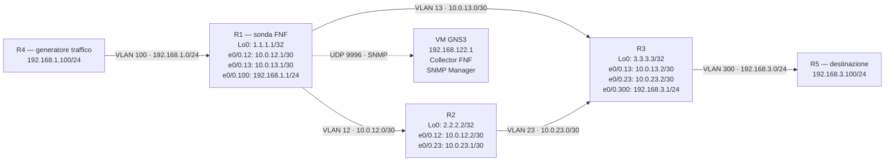

# Workbook Studenti — MOD-29: Network Assurance — NetFlow & SNMP

**Area:** AREA 4 — INFRASTRUCTURE SERVICES | **Ore:** 2h | **Codici syllabus:** 4.1 · 4.2 · 4.3 · 4.4 · 4.5 · 4.6

> **Piattaforme supportate:** GNS3 · ContainerLab (vrnetlab/IOU) · EVE-NG

---

## 1. TOPOLOGIA

La topologia e' identica a MOD-28 (stessa rete, stessi cfg iniziali). In questo modulo i router svolgono il ruolo di dispositivi da monitorare.



### Tabella Indirizzamento

| Device | Interfaccia     | IP / Maschera    | VLAN | Ruolo                      |
|--------|-----------------|------------------|------|----------------------------|
| R1     | e0/0.12         | 10.0.12.1/30     | 12   | Link P2P verso R2          |
| R1     | e0/0.13         | 10.0.13.1/30     | 13   | Link P2P verso R3          |
| R1     | e0/0.100        | 192.168.1.1/24   | 100  | LAN verso R4 · sonda FNF   |
| R1     | Loopback0       | 1.1.1.1/32       | —    | OSPF RID                   |
| R2     | e0/0.12         | 10.0.12.2/30     | 12   | Link P2P verso R1          |
| R2     | e0/0.23         | 10.0.23.1/30     | 23   | Link P2P verso R3          |
| R2     | Loopback0       | 2.2.2.2/32       | —    | OSPF RID                   |
| R3     | e0/0.13         | 10.0.13.2/30     | 13   | Link P2P verso R1          |
| R3     | e0/0.23         | 10.0.23.2/30     | 23   | Link P2P verso R2          |
| R3     | e0/0.300        | 192.168.3.1/24   | 300  | LAN verso R5               |
| R3     | Loopback0       | 3.3.3.3/32       | —    | OSPF RID                   |
| R4     | e0/0.100        | 192.168.1.100/24 | 100  | Generatore traffico        |
| R5     | e0/0.300        | 192.168.3.100/24 | 300  | Destinazione traffico      |
| VM GNS3 | virbr0        | 192.168.122.1    | —    | Collector FNF / SNMP manager |

---

## 2. OBIETTIVI DELLA SESSIONE

Al termine di questo modulo lo studente sara' in grado di:

- Descrivere l'architettura modulare di Flexible NetFlow: Flow Record, Flow Monitor, Flow Exporter
- Configurare un Flow Record con campi `match` e `collect` personalizzati
- Applicare un Flow Monitor su un'interfaccia e analizzare la cache dei flow
- Confrontare NetFlow v5 (legacy) e Flexible NetFlow in termini di flessibilita' e configurazione
- Configurare SNMPv2c e SNMPv3 su un router IOS e verificarne il funzionamento
- Spiegare le differenze tra i livelli di sicurezza SNMP: noAuthNoPriv, authNoPriv, authPriv
- Descrivere le funzionalita' di Catalyst Center per la gestione intent-based della rete

**Codici syllabus coperti:** 4.1 · 4.2 · 4.3 · 4.4 · 4.5 · 4.6

---

## 3. LAB SETUP

### Configurazione Iniziale

> Incollare ogni blocco direttamente sulla console del device corrispondente (paste manuale).

#### R1

```
hostname R1
no ip domain-lookup
!
line con 0
 logging synchronous
 exec-timeout 0 0
line vty 0 4
 logging synchronous
 exec-timeout 0 0
 login
!
interface Loopback0
 ip address 1.1.1.1 255.255.255.255
 no shutdown
!
interface Ethernet0/0
 no ip address
 no shutdown
!
interface Ethernet0/0.12
 encapsulation dot1Q 12
 ip address 10.0.12.1 255.255.255.252
 no shutdown
!
interface Ethernet0/0.13
 encapsulation dot1Q 13
 ip address 10.0.13.1 255.255.255.252
 no shutdown
!
interface Ethernet0/0.100
 encapsulation dot1Q 100
 ip address 192.168.1.1 255.255.255.0
 no shutdown
!
router ospf 1
 router-id 1.1.1.1
 network 1.1.1.1 0.0.0.0 area 0
 network 10.0.12.0 0.0.0.3 area 0
 network 10.0.13.0 0.0.0.3 area 0
 network 192.168.1.0 0.0.0.255 area 0
 passive-interface Ethernet0/0.100
end
```

#### R2

```
hostname R2
no ip domain-lookup
!
line con 0
 logging synchronous
 exec-timeout 0 0
line vty 0 4
 logging synchronous
 exec-timeout 0 0
 login
!
interface Loopback0
 ip address 2.2.2.2 255.255.255.255
 no shutdown
!
interface Ethernet0/0
 no ip address
 no shutdown
!
interface Ethernet0/0.12
 encapsulation dot1Q 12
 ip address 10.0.12.2 255.255.255.252
 no shutdown
!
interface Ethernet0/0.23
 encapsulation dot1Q 23
 ip address 10.0.23.1 255.255.255.252
 no shutdown
!
router ospf 1
 router-id 2.2.2.2
 network 2.2.2.2 0.0.0.0 area 0
 network 10.0.12.0 0.0.0.3 area 0
 network 10.0.23.0 0.0.0.3 area 0
end
```

#### R3

```
hostname R3
no ip domain-lookup
!
line con 0
 logging synchronous
 exec-timeout 0 0
line vty 0 4
 logging synchronous
 exec-timeout 0 0
 login
!
interface Loopback0
 ip address 3.3.3.3 255.255.255.255
 no shutdown
!
interface Ethernet0/0
 no ip address
 no shutdown
!
interface Ethernet0/0.13
 encapsulation dot1Q 13
 ip address 10.0.13.2 255.255.255.252
 no shutdown
!
interface Ethernet0/0.23
 encapsulation dot1Q 23
 ip address 10.0.23.2 255.255.255.252
 no shutdown
!
interface Ethernet0/0.300
 encapsulation dot1Q 300
 ip address 192.168.3.1 255.255.255.0
 no shutdown
!
router ospf 1
 router-id 3.3.3.3
 network 3.3.3.3 0.0.0.0 area 0
 network 10.0.13.0 0.0.0.3 area 0
 network 10.0.23.0 0.0.0.3 area 0
 network 192.168.3.0 0.0.0.255 area 0
 passive-interface Ethernet0/0.300
end
```

#### R4 (generatore traffico)

```
hostname R4
no ip domain-lookup
no ip routing
!
line con 0
 logging synchronous
 exec-timeout 0 0
!
interface Ethernet0/0
 no ip address
 no shutdown
!
interface Ethernet0/0.100
 encapsulation dot1Q 100
 ip address 192.168.1.100 255.255.255.0
 no shutdown
!
ip default-gateway 192.168.1.1
end
```

#### R5 (destinazione traffico)

```
hostname R5
no ip domain-lookup
!
line con 0
 logging synchronous
 exec-timeout 0 0
!
interface Ethernet0/0
 no ip address
 no shutdown
!
interface Ethernet0/0.300
 encapsulation dot1Q 300
 ip address 192.168.3.100 255.255.255.0
 no shutdown
!
ip route 0.0.0.0 0.0.0.0 192.168.3.1
end
```

Le configurazioni includono: hostname, interfacce, OSPF area 0 underlay.
NetFlow e SNMP non sono pre-configurati — vengono costruiti task per task.

### Prerequisiti

- GNS3 con IOU L3 (R1–R5) attivi
- OSPF area 0 operativo al caricamento
- Conoscenza base di OSPF e routing IP
- MOD-28 completato (la topologia e' identica)

### Verifica pre-lab

```
! Su R1 — verifica OSPF
show ip ospf neighbor
show ip route ospf
ping 192.168.3.1 source 192.168.1.1
```

**Atteso:** tutti i vicini OSPF visibili, rete 192.168.3.0/24 raggiungibile da R1.

> **Preparazione traffico:** su R4, avviare un ping esteso verso R5 per generare traffico analizzabile:
> ```
> ping 192.168.3.100 repeat 9999999 size 1000
> ```
> Lasciare attivo durante i task NF.1 e NF.2.

---

## 4. TASK LIST

| #      | Task                                  | Codice       | Tempo stimato |
|--------|---------------------------------------|--------------|---------------|
| NF.1   | Flexible NetFlow v5 su R1             | 4.1 · 4.2    | 25 min        |
| NF.2   | Analisi cache NetFlow                 | 4.1 · 4.2    | 20 min        |
| SNMP.1 | SNMPv2c — configurazione e verifica   | 4.6          | 20 min        |
| SNMP.2 | SNMPv3 — autenticazione e privacy     | 4.6          | 20 min        |
| DNA.1  | Catalyst Center — concetti e workflow | 4.5          | 15 min (teoria) |

---

## 5. DETTAGLIO TASK

---

### NF.1 — Flexible NetFlow su R1

#### TEORIA

**NetFlow** e' una tecnologia Cisco per la raccolta di statistiche sui flussi IP. Un **flow** e' una sequenza di pacchetti con le stesse caratteristiche chiave (sorgente, destinazione, protocollo, porte, interfaccia).

**NetFlow v5 (legacy):**
- Configurazione semplice: `ip flow ingress` sull'interfaccia + `ip flow-export version 5`
- Campi fissi e predefiniti dal vendor: non personalizzabili
- Verifica: `show ip cache flow`
- Ancora molto diffuso nei legacy deployment

**Flexible NetFlow (FNF) — architettura modulare:**

| Componente | Scopo | Comando |
|------------|-------|---------|
| **Flow Record** | Definisce quali campi identificano un flow (match) e quali statistiche raccogliere (collect) | `flow record <nome>` |
| **Flow Exporter** | Definisce dove inviare i dati (collector esterno, protocollo, porta UDP) | `flow exporter <nome>` |
| **Flow Monitor** | Associa Record + Exporter, gestisce la cache | `flow monitor <nome>` |
| **Applicazione** | Associa il Monitor a un'interfaccia in ingresso o uscita | `ip flow monitor <nome> input` |

**Campi `match` (chiavi):** identificano univocamente il flow. Pacchetti con stesse chiavi formano lo stesso flow.
**Campi `collect` (valori):** statistiche accumulate sul flow (contatori, timestamp).

**Flusso dati:** Interfaccia → Flow Monitor (cache) → [opzionale: Flow Exporter → Collector]
Senza un collector configurato, i dati restano nella cache locale — pienamente analizzabili con `show flow monitor <nome> cache`.

Su IOU IOS 15.x, FNF e' pienamente operativo senza collector esterno.

#### TASK

```
! ── Step 1: definire il Flow Record ─────────────────────────────
flow record ENCOR-RECORD
 description Analisi traffico IP - MOD29
 match ipv4 source address
 match ipv4 destination address
 match ipv4 protocol
 match interface input
 collect transport source-port
 collect transport destination-port
 collect counter bytes long
 collect counter packets long
 collect timestamp sys-uptime first
 collect timestamp sys-uptime last
!
! ── Step 2: creare il Flow Exporter (verso collector VM GNS3) ────
flow exporter ENCOR-EXPORT
 description Export verso VM GNS3
 destination 192.168.122.1
 transport udp 9996
 export-protocol netflow-v5
!
! ── Step 3: creare il Flow Monitor ───────────────────────────────
flow monitor ENCOR-MON
 description MOD29 Network Assurance
 record ENCOR-RECORD
 exporter ENCOR-EXPORT
 cache timeout active 60
 cache timeout inactive 30
!
! ── Step 4: applicare il Monitor su R1 e0/0.100 in ingresso ──────
interface Ethernet0/0.100
 ip flow monitor ENCOR-MON input
```

> **Nota timeout:** `cache timeout active 60` significa che un flow attivo viene
> esportato ogni 60 secondi anche se non e' ancora scaduto. `cache timeout inactive 30`
> rimuove dalla cache un flow inattivo da 30 secondi ed esporta l'entry.

#### VERIFICA

```
! Su R1
show flow monitor ENCOR-MON
show flow monitor ENCOR-MON cache
show flow interface Ethernet0/0.100
show flow exporter ENCOR-EXPORT
show running-config | section flow
```

**Output atteso `show flow monitor ENCOR-MON`:**
```
Flow Monitor ENCOR-MON:
  Description: MOD29 Network Assurance
  Flow Record:  ENCOR-RECORD
  Flow Exporter: ENCOR-EXPORT
  Cache:
    Type:                 normal
    Status:               allocated
    Size:                 4096 entries / 311316 bytes
    Inactive Timeout:     30 secs
    Active Timeout:       60 secs
```

**Output atteso `show flow monitor ENCOR-MON cache` (con ping attivo da R4):**
```
Cache type:                               Normal
Cache size:                                 4096
Current entries:                               1

  IPV4 SRC ADDR    IPV4 DST ADDR    PROT  INPUT IF       bytes    pkts
  ===============  ===============  ====  =============  =======  ====
  192.168.1.100    192.168.3.100    0x01  Et0/0.100      xxxxxxx  xxxx
```

**`show flow interface Ethernet0/0.100`** deve confermare il monitor applicato in input.

---

### NF.2 — Analisi Cache NetFlow

#### TEORIA

La **cache FNF** e' una tabella hash in memoria del router. Ogni entry rappresenta un flow attivo, identificato dalle chiavi `match` del Flow Record.

**Campi nell'output della cache:**
| Campo | Descrizione |
|-------|-------------|
| IPV4 SRC ADDR | Indirizzo IP sorgente |
| IPV4 DST ADDR | Indirizzo IP destinazione |
| PROT | Protocollo IP (1=ICMP, 6=TCP, 17=UDP) |
| INPUT IF | Interfaccia di ingresso |
| bytes | Byte totali del flow |
| pkts | Pacchetti totali del flow |
| FIRST | Timestamp primo pacchetto (sys-uptime) |
| LAST | Timestamp ultimo pacchetto (sys-uptime) |

**Differenza FNF vs NetFlow v5:**
- In v5 i campi sono fissi: non puoi scegliere cosa raccogliere
- In FNF hai definito tu il Flow Record: hai esattamente i campi scelti
- Vantaggio FNF: aggiungere `match ipv4 tos` o `collect ipv4 ttl` e' solo una modifica del record, senza aggiornamenti software

#### TASK

```
! Attendere 30-60 secondi con il ping attivo da R4, poi:

! Su R1
show flow monitor ENCOR-MON cache

! Generare traffico aggiuntivo verso una destinazione diversa
! Su R4:
ping 10.0.12.2 repeat 1000

! Verificare nuovi flow in cache
show flow monitor ENCOR-MON cache

! Riferimento comandi NetFlow v5 legacy (solo lettura — non configurare)
! show ip cache flow   <-- comando equivalente per NetFlow v5
```

#### VERIFICA

Analizzare l'output della cache e rispondere:

1. Qual e' il valore del campo **PROT** per il traffico ICMP del ping? (Atteso: 0x01 = 1)
2. I contatori **bytes** e **pkts** aumentano tra una lettura e la successiva con il ping attivo?
3. Se generi un ping verso un IP diverso, compare una seconda entry in cache? Con quali chiavi?
4. **Confronto FNF vs v5:** cosa non potresti personalizzare con NetFlow v5?
5. **BONUS:** aggiungere `collect ipv4 ttl` al Flow Record ENCOR-RECORD e verificare che appaia nella cache.

> **Nota BONUS:** per aggiungere un campo al record, rimuovere prima il monitor dall'interfaccia
> (`no ip flow monitor ENCOR-MON input`), modificare il record, riapplicare il monitor.
> I flow esistenti nella cache vengono persi.

---

### SNMP.1 — SNMPv2c — Configurazione e Verifica

#### TEORIA

**SNMP (Simple Network Management Protocol)** e' il protocollo standard per la gestione dei dispositivi di rete. Opera su UDP porta 161 (agent riceve GET) e porta 162 (manager riceve TRAP).

**Architettura SNMP:**
- **Manager (NMS):** invia richieste GET, riceve TRAP/INFORM
- **Agent:** risponde alle richieste, invia notifiche proattive
- **MIB (Management Information Base):** database gerarchico delle variabili gestibili
- **OID (Object Identifier):** identificatore univoco di ogni variabile nella MIB (es. 1.3.6.1.2.1.1.1.0 = sysDescr)

**Operazioni SNMP:**
| Operazione | Direzione | Descrizione |
|------------|-----------|-------------|
| GET | Manager a Agent | Legge una variabile specifica |
| GETNEXT | Manager a Agent | Legge la variabile successiva nella MIB |
| GETBULK | Manager a Agent | Legge piu' variabili in una richiesta (v2c/v3) |
| SET | Manager a Agent | Modifica una variabile |
| TRAP | Agent a Manager | Notifica asincrona senza conferma — UDP |
| INFORM | Agent a Manager | Notifica con conferma (v2c/v3) |

**SNMPv2c — community string:**
- `ro` (read-only): solo lettura
- `rw` (read-write): lettura e scrittura
- La community string viaggia in chiaro — nessuna crittografia

**Limiti SNMPv2c:** nessuna autenticazione reale, nessuna crittografia. Adeguato per reti interne protette; inadeguato su reti non fidate.

#### TASK

```
! ── R1 — SNMPv2c ─────────────────────────────────────────────────
! Community read-only per il monitor
snmp-server community ENCOR-RO ro
!
! Community read-write (usare con cautela — permette SET)
snmp-server community ENCOR-RW rw
!
! Contatto e location (buona pratica — visibili nel MIB)
snmp-server contact admin@encorlab.local
snmp-server location GNS3-Lab-R1
!
! Invio trap al collector (192.168.122.1)
snmp-server host 192.168.122.1 version 2c ENCOR-RO
!
! Abilitare trap utili
snmp-server enable traps snmp linkdown linkup
snmp-server enable traps ospf state-change
```

#### VERIFICA

```
! Su R1
show snmp
show snmp community
show snmp host
show running-config | section snmp
```

**Output atteso `show snmp` (estratto):**
```
Chassis: ...
Contact: admin@encorlab.local
Location: GNS3-Lab-R1
...
    0 SNMP packets input
    0 Unknown community name
```

**Verifica esterna dalla VM GNS3 (se snmpwalk disponibile):**
```bash
snmpwalk -v2c -c ENCOR-RO 192.168.1.1 system
# Atteso: sysDescr, sysObjectID, sysUpTime, sysContact, sysName, sysLocation
```

> **Nota lab:** se la VM GNS3 non ha snmpwalk, la verifica con `show snmp` e' sufficiente.

---

### SNMP.2 — SNMPv3 — Autenticazione e Privacy

#### TEORIA

**SNMPv3** risolve i problemi di sicurezza di v1/v2c introducendo autenticazione e cifratura.

**Livelli di sicurezza SNMPv3 (USM — User-based Security Model):**

| Livello | Autenticazione | Cifratura | Uso tipico |
|---------|---------------|-----------|-----------|
| noAuthNoPriv | No | No | Test — equivalente a v2c |
| authNoPriv | Si' (SHA o MD5) | No | Ambienti interni protetti |
| authPriv | Si' (SHA o MD5) | Si' (AES o DES) | Produzione — raccomandato |

**Concetti chiave:**
- **Group:** definisce il livello di sicurezza e i permessi (view)
- **User:** associato a un group, con password di autenticazione e privacy separata
- **View:** sottoinsieme della MIB accessibile (opzionale — default: accesso completo)

**Nota:** su IOS, le password SNMPv3 non compaiono in chiaro nel `show running-config` perche' vengono derivate tramite HMAC e memorizzate nel database USM locale. Sono visibili con `show snmp user`.

#### TASK

```
! ── R1 — SNMPv3 ──────────────────────────────────────────────────
! Step 1: creare il gruppo con livello authPriv
snmp-server group ENCOR-GROUP v3 priv
!
! Step 2: creare l'utente con autenticazione SHA e cifratura AES128
snmp-server user ENCOR-USER ENCOR-GROUP v3 auth sha Cisco123! priv aes 128 Cisco123!
!
! Step 3: definire l'host destinatario delle trap v3
snmp-server host 192.168.122.1 version 3 priv ENCOR-USER
```

> **Nota sicurezza:** In lab si usano password semplici per praticita'.
> In produzione: minimo 16 caratteri, mix maiuscole/minuscole/numeri/simboli.
> Le password auth e priv possono (e dovrebbero) essere diverse.

#### VERIFICA

```
! Su R1
show snmp group
show snmp user
show running-config | section snmp-server group
show running-config | section snmp-server user
```

**Output atteso `show snmp group`:**
```
groupname: ENCOR-GROUP                        security model:v3 priv
...
```

**Output atteso `show snmp user`:**
```
User name: ENCOR-USER
Engine ID: ...
storage-type: nonvolatile    active
Authentication Protocol: SHA
Privacy Protocol: AES128
Group-name: ENCOR-GROUP
```

**Verifica esterna dalla VM GNS3 (se snmpwalk v3 disponibile):**
```bash
snmpwalk -v3 -u ENCOR-USER -l authPriv -a SHA -A "Cisco123!" -x AES -X "Cisco123!" \
         192.168.1.1 system
```

> **Nota IOU:** Le credenziali SNMPv3 potrebbero non persistere al reload su IOU
> perche' l'Engine ID cambia. Se dopo un reload `show snmp user` risulta vuoto,
> ricreare l'utente con il comando `snmp-server user ...`.

---

### DNA.1 — Catalyst Center — Concetti e Workflow (Teoria)

#### TEORIA

> **Nota lab:** Catalyst Center (precedentemente Cisco DNA Center) non e' disponibile
> su GNS3. Questo task e' esclusivamente teorico. Una demo interattiva e'
> disponibile su Cisco dCloud: cercare "Cisco Catalyst Center".

**Catalyst Center** e' la piattaforma Cisco per la gestione intent-based della rete (IBN — Intent-Based Networking). Sostituisce il management device-by-device con policy centralizzate.

**Componenti principali:**
| Componente | Funzione |
|------------|----------|
| **Device Discovery** | Rileva automaticamente i dispositivi in rete (CDP, LLDP, IP range scan) |
| **Inventory** | Database centralizzato di tutti i device: versione software, modello, status |
| **Network Hierarchy** | Struttura logica: Global / Area / Building / Floor / Device |
| **Template Deployment** | Distribuisce configurazioni standardizzate (Jinja2/Velocity) a gruppi di device |
| **Assurance** | Monitora KPI di rete in real-time; identifica anomalie con AI/ML |
| **SD-Access** | Fabric overlay basato su LISP/VXLAN per micro-segmentazione e mobility |

**Workflow tipico:**
1. **Discovery:** inserire range IP o seed device — Catalyst Center contatta via SSH/SNMP
2. **Inventory:** tutti i device compaiono con stato (Managed / Unreachable / Unknown)
3. **Hierarchy:** assegnare ogni device all'area geografica corretta
4. **Template:** creare un template con variabili (hostname, VLAN ID, IP) e deployarlo su un'area
5. **Assurance:** verificare salute della rete — latenza, jitter, packet loss per path

**API Northbound:** Catalyst Center espone REST API su HTTPS per integrazioni con sistemi terzi (Python, Ansible, ITSM). Ogni operazione GUI ha la corrispondente chiamata API.

**Differenza Catalyst Center vs NMS tradizionale (SNMP polling):**
| Caratteristica | NMS tradizionale | Catalyst Center |
|----------------|-----------------|-----------------|
| Approccio | Polling periodico | Streaming telemetry + push |
| Gestione configurazioni | Device-by-device | Template centralizzato |
| Troubleshooting | Manuale (logs, SNMP trap) | AI-driven root cause analysis |
| Automazione | Script custom | Workflow integrato + REST API |

---

## 6. TROUBLESHOOTING GUIDE

| # | Sintomo | Causa probabile | Diagnosi | Fix |
|---|---------|-----------------|----------|-----|
| 1 | `show flow monitor cache` vuoto | Monitor non applicato o traffico assente | `show flow interface Et0/0.100` — `show run | section flow` | Verificare `ip flow monitor ENCOR-MON input` su e0/0.100 e avviare il ping da R4 |
| 2 | Flow Monitor in stato "not allocated" | Cache non inizializzata — nessun traffico ancora ricevuto | Normale all'avvio — avviare ping da R4 e ripetere | La cache si alloca al primo pacchetto |
| 3 | Contatori flow non crescono | Monitor applicato in `output` invece di `input` | `show flow interface Et0/0.100` — verifica direzione | Rimuovere e riapplicare: `ip flow monitor ENCOR-MON input` |
| 4 | Errore `%SNMP: ENCOR-USER not found` | Utente SNMPv3 non creato o Engine ID cambiato dopo reload | `show snmp engineID` — confrontare prima e dopo reload | Ricreare l'utente: `snmp-server user ENCOR-USER ...` |
| 5 | SNMP GET senza risposta dalla VM | Community string errata o firewall/ACL bloccante | `show snmp community` — `debug snmp packets` | Verificare community string e assenza di ACL restrittivi |
| 6 | `show snmp user` vuoto dopo reload | Engine ID cambia al reload su IOU — credenziali USM invalidate | `show snmp engineID` prima e dopo reload | Ricreare l'utente dopo ogni reload (comportamento noto IOU) |

---

## 7. SOLUZIONI

> **NOTA IMPORTANTE**
> Le soluzioni complete commentate per questo modulo sono in fase di sviluppo.
> Consultare il file `soluzione.md` nella stessa cartella.

> ⚠️ IN SVILUPPO — disponibile nella prossima versione.

---

## 8. RIEPILOGO & EXAM TIPS

**Punti chiave:**

- **Flexible NetFlow** richiede tre elementi: Flow Record (campi), Flow Monitor (cache + exporter), applicazione su interfaccia. L'Exporter e' opzionale per la verifica locale con `show flow monitor cache`.
- **Campi `match` vs `collect`:** i campi `match` identificano univocamente il flow (chiavi); i campi `collect` accumulano statistiche. Modificarli richiede di rimuovere e riapplicare il monitor.
- **SNMPv2c** usa community string in chiaro. **SNMPv3** aggiunge autenticazione (SHA/MD5) e cifratura (AES/DES). In produzione usare sempre `authPriv`.
- **SNMP vs NetFlow:** SNMP e' pull-based, orientato alle variabili di stato/configurazione. NetFlow e' push-based (o query locale), orientato all'analisi del traffico e dei flow.
- **Catalyst Center** gestisce il ciclo di vita della rete con intent-based policy (discovery, inventory, template, assurance). Non disponibile su GNS3 — demo su dCloud.

**Domande tipo CCNP:**

1. Qual e' la differenza tra un campo `match` e un campo `collect` in un Flexible NetFlow Flow Record?
   - *`match` identifica univocamente il flow (chiave di lookup); `collect` accumula statistiche sul flow (valore aggregato).*

2. Un router ha `ip flow ingress` su un'interfaccia e `ip flow-export version 5`. Quale tecnologia usa?
   - *NetFlow v5 (legacy) — non Flexible NetFlow. Il comando FNF equivalente e' `ip flow monitor <nome> input`.*

3. SNMPv3 con livello `authNoPriv`: cosa garantisce e cosa manca?
   - *Garantisce l'autenticazione (identita' verificata tramite HMAC), ma non la cifratura — il traffico SNMP e' leggibile in chiaro.*

4. Qual e' la porta UDP standard per i messaggi TRAP SNMP?
   - *Porta UDP 162 (l'agent invia al manager). Le richieste GET/SET usano la porta 161.*

5. In Flexible NetFlow, cosa succede ai flow in cache quando scade il `cache timeout inactive`?
   - *Il flow viene rimosso dalla cache locale e, se configurato, inviato al collector tramite l'Exporter.*

6. Perche' le credenziali SNMPv3 non compaiono in chiaro nel `show running-config`?
   - *Vengono memorizzate nel database USM locale derivate tramite HMAC — non sono reversibili. Visibili con `show snmp user`.*

---

> © 2026 Matteo Mirenda — Tutti i diritti riservati.
> Materiale ad uso esclusivo degli studenti iscritti al corso.
> Vietata la riproduzione, distribuzione o condivisione
> senza autorizzazione scritta dell'autore.
> CCNP ENCOR 350-401 

---
