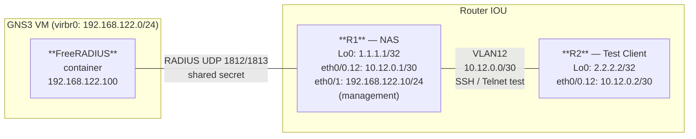

# Workbook Studenti — MOD-30: Device Security & AAA

**Area:** AREA 5 — Security | **Ore:** 2h | **Codici syllabus:** 5.1.a · 5.1.b

**Piattaforme supportate:** GNS3 · ContainerLab (vrnetlab/IOU) · EVE-NG

---

## 1. TOPOLOGIA

### Diagramma Logico



### Piano di Indirizzamento

> **Nota ambiente:** R1 usa `Ethernet0/1` per raggiungere la rete di management (192.168.122.0/24) dove gira FreeRADIUS. In GNS3, collegare Ethernet0/1 di R1 a un nodo Cloud/Host associato all'interfaccia virbr0 del server GNS3.

#### Link lab (test SSH/Telnet)

| Collegamento | VLAN | IP R1 | IP R2 |
|---|---|---|---|
| R1 — R2 | 12 | 10.12.0.1/30 | 10.12.0.2/30 |

#### Management (RADIUS)

| Device | Interfaccia | IP | Ruolo |
|---|---|---|---|
| R1 | Ethernet0/1 | 192.168.122.10/24 | Management (verso FreeRADIUS) |
| FreeRADIUS | container | 192.168.122.100/24 | RADIUS server |

#### Loopback

| Router | IP | Ruolo |
|---|---|---|
| R1 | 1.1.1.1/32 | Router-ID, target test |
| R2 | 2.2.2.2/32 | Router-ID |

---

## 2. OBIETTIVI DELLA SESSIONE

Al termine di questo modulo lo studente sarà in grado di:

- [ ] Applicare hardening base (enable secret, banner, timeout VTY, SSH v2)
- [ ] Configurare AAA con database locale (authentication + authorization)
- [ ] Configurare RADIUS con FreeRADIUS e fallback locale
- [ ] Implementare RBAC con privilege levels personalizzati
- [ ] Verificare l'autenticazione con `show aaa servers` e `debug aaa authentication`

**Codici syllabus coperti:** 5.1.a (device access control) · 5.1.b (AAA)

**Prerequisiti:** MOD-01 (routing base, sub-interface)

---

## 3. LAB SETUP

**Piattaforme supportate:** GNS3 · ContainerLab (vrnetlab/IOU) · EVE-NG

### Prerequisiti

- FreeRADIUS container avviato sulla VM GNS3 e raggiungibile via 192.168.122.100
- Connessione Ethernet0/1 di R1 al Cloud node (virbr0) in GNS3
- Conoscenza base di SSH e telnet

> **Nota RADIUS server:** l'indirizzo IP del FreeRADIUS container è 192.168.122.100 per default.
> Modificare se l'ambiente usa un IP diverso. Verificare: `ping 192.168.122.100` da R1 prima di Task T3.

### Configurazione Iniziale

```
copy tftp://192.168.122.1/ENCOR/MOD-30/rx-cfg running-config
```

#### R1

```
! RADIUS server: 192.168.122.100
! Modifica questo IP se l'ambiente e' diverso
!
hostname R1
no ip domain-lookup
!
interface Ethernet0/0
 no ip address
 no shutdown
!
interface Ethernet0/0.12
 encapsulation dot1Q 12
 ip address 10.12.0.1 255.255.255.252
 description Lab_to_R2
 no shutdown
!
! Interfaccia management verso FreeRADIUS:
interface Ethernet0/1
 ip address 192.168.122.10 255.255.255.0
 description Management_to_RADIUS
 no shutdown
!
interface Loopback0
 ip address 1.1.1.1 255.255.255.255
 no shutdown
!
! Nessuna password configurata — DA FARE in Task T1
! Nessuna configurazione AAA — DA FARE in Task T2
! Nessun RADIUS — DA FARE in Task T3
!
end
```

#### R2

```
hostname R2
no ip domain-lookup
!
interface Ethernet0/0
 no ip address
 no shutdown
!
interface Ethernet0/0.12
 encapsulation dot1Q 12
 ip address 10.12.0.2 255.255.255.252
 description Lab_to_R1
 no shutdown
!
interface Loopback0
 ip address 2.2.2.2 255.255.255.255
 no shutdown
!
end
```

### Verifica Pre-Lab

```
! Su R1 — verifica connettività verso R2:
R1# ping 10.12.0.2
! Atteso: !!!!!

! Su R1 — verifica connettività verso FreeRADIUS:
R1# ping 192.168.122.100
! Atteso: !!!!! (se il container è avviato)

! Verificare che NON ci sia ancora SSH abilitato:
R1# show ip ssh
! Atteso: "SSH Disabled" o "version 1.5"

! Verificare assenza AAA:
R1# show aaa
! Atteso: AAA not enabled
```

---

## 4. TASK LIST

| # | Task | Codice | Tempo |
|---|---|---|---|
| T1 | Hardening accesso locale (password, banner, SSH v2) | 5.1.a | 20 min |
| T2 | AAA locale (aaa new-model, username, authentication, authorization) | 5.1.b | 20 min |
| T3 | RADIUS con FreeRADIUS e fallback locale | 5.1.b | 25 min |
| T4 | RBAC con Privilege Levels | 5.1.a | 20 min |

**Tempo totale: ~85 min** (buffer: 35 min)

---

## 5. DETTAGLIO TASK

---

### T1 — Hardening Accesso Locale

#### TEORIA

**Superficie di attacco di un dispositivo IOS**

Un router non hardened espone tipicamente:
- Console: accesso fisico senza password
- VTY (Telnet): chiaro, intercettabile, nessun timeout
- Enable: accesso privilegiato senza password (o con password in chiaro)

**Best practice di hardening:**

| Elemento | Comando | Motivazione |
|---|---|---|
| Enable secret | `enable secret <pass>` | MD5 hash — più sicuro di `enable password` |
| Console timeout | `exec-timeout 5 0` | Logout dopo 5 min di inattività |
| VTY: solo SSH | `transport input ssh` | Blocca Telnet (chiaro) |
| VTY timeout | `exec-timeout 10 0` | Logout automatico |
| Banner | `banner motd` | Warning legale — richiesto da audit |
| SSH v2 | `ip ssh version 2` | SSHv1 è deprecato e vulnerabile |
| Domain name | `ip domain-name` | Necessario per generare chiavi RSA |

#### TASK

```
R1# configure terminal

! Enable secret (hash MD5 — non usare "enable password"):
R1(config)# enable secret Cisco@123

! Domain name (necessario per le chiavi SSH):
R1(config)# ip domain-name lab.encor

! Genera coppia di chiavi RSA per SSH:
! 2048 bit è il minimo raccomandato; IOU supporta fino a 2048.
R1(config)# crypto key generate rsa modulus 2048
! (rispondere YES alla domanda di conferma se richiesto)

! Abilita SSH versione 2 (v1 è deprecato):
R1(config)# ip ssh version 2

! Timeout SSH: disconnette dopo 60 secondi di inattività senza autenticazione:
R1(config)# ip ssh time-out 60

! Banner di accesso (avviso legale):
R1(config)# banner motd ^
*** ACCESSO AUTORIZZATO SOLO A PERSONALE ABILITATO ***
Ogni attività è registrata. Disconnettersi se non autorizzati.
^

! Hardening console:
R1(config)# line console 0
R1(config-line)# exec-timeout 5 0
R1(config-line)# logging synchronous
R1(config-line)# exit

! Hardening VTY (linee SSH/Telnet virtuali):
R1(config)# line vty 0 4
R1(config-line)# exec-timeout 10 0
! Blocca Telnet — accetta solo SSH:
R1(config-line)# transport input ssh
R1(config-line)# exit

R1(config)# end
```

#### VERIFICA

```
! Verifica SSH abilitato e versione:
R1# show ip ssh
! Atteso: "SSH Enabled - version 2.0"

! Testa SSH da R2 verso R1 (serve un utente — aggiungeremo in T2):
R2# ssh -v 2 -l admin 10.12.0.1
! Prima di T2 non c'è un utente — vedremo un errore di autenticazione,
! ma il canale SSH deve aprirsi (conferma che SSH è funzionante)

! Verifica che Telnet sia bloccato:
R2# telnet 10.12.0.1
! Atteso: Connection refused (transport input ssh blocca Telnet)

! Verifica banner:
! Il banner appare all'accesso alla console o SSH
```

---

### T2 — AAA Locale

#### TEORIA

**AAA: Authentication, Authorization, Accounting**

- **Authentication**: chi sei? (verifica identità)
- **Authorization**: cosa puoi fare? (quali comandi / risorse)
- **Accounting**: cosa hai fatto? (log delle azioni)

**Database locale vs server esterno:**

| Approccio | Pro | Contro |
|---|---|---|
| Locale (username/password sul router) | Semplice, no dipendenze | Non scala, gestione manuale |
| RADIUS/TACACS+ | Centralizzato, scalabile | Richiede server, single point of failure |

**Flusso AAA su IOS:**

```
aaa new-model                          ← abilita AAA globalmente
aaa authentication login LIST-NAME     ← definisce il metodo di autenticazione
aaa authorization exec LIST-NAME       ← definisce il metodo di autorizzazione exec
line vty 0 4
 login authentication LIST-NAME        ← applica la lista alle VTY
```

> **Attenzione:** `aaa new-model` cambia immediatamente il comportamento del router. Assicurarsi di avere una backdoor (console senza AAA) prima di abilitarlo.

#### TASK

```
R1# configure terminal

! Abilita il framework AAA:
R1(config)# aaa new-model

! Crea utente locale con privilege 15 (amministratore completo):
R1(config)# username admin privilege 15 secret Cisco@123

! Crea utente locale di test con privilege 1 (base):
R1(config)# username viewer privilege 1 secret Viewer@456

! Define la lista di autenticazione "LOGIN-LOCAL":
! Prima prova il database locale; se non disponibile, nessun accesso.
R1(config)# aaa authentication login LOGIN-LOCAL local none

! Define la lista di autorizzazione exec:
! Permette l'accesso alla shell EXEC se l'autenticazione ha successo.
R1(config)# aaa authorization exec DEFAULT local

! Applica la lista LOGIN-LOCAL alle linee VTY:
R1(config)# line vty 0 4
R1(config-line)# login authentication LOGIN-LOCAL
R1(config-line)# exit

! La console rimane con metodo di default (local) — non applichiamo AAA alla console
! per avere un backdoor di emergenza.

R1(config)# end
```

#### VERIFICA

```
! Testa SSH da R2 con l'utente admin:
R2# ssh -v 2 -l admin 10.12.0.1
! Password: Cisco@123
! Atteso: accesso con prompt R1# (privilege 15)

! Verifica il livello di privilegio:
R1# show privilege
! Atteso: Current privilege level is 15

! Testa SSH con utente viewer:
R2# ssh -v 2 -l viewer 10.12.0.1
! Password: Viewer@456
! Atteso: accesso con prompt R1> (privilege 1)

! Verifica AAA configurazione:
R1# show aaa method-lists authentication
! Atteso: lista LOGIN-LOCAL con metodo "local"
```

---

### T3 — RADIUS con FreeRADIUS e Fallback Locale

#### TEORIA

**RADIUS (Remote Authentication Dial-In User Service)**

RADIUS è un protocollo AAA client-server (RFC 2865). Il router IOS agisce come **NAS** (Network Access Server): invia richieste di autenticazione al server RADIUS e agisce in base alla risposta (Access-Accept / Access-Reject).

**RADIUS vs TACACS+:**

| Caratteristica | RADIUS | TACACS+ |
|---|---|---|
| Protocollo | UDP (1812 auth, 1813 accounting) | TCP 49 |
| Crittografia | Solo password (MD5) | Intero payload |
| Granularità | Authentication + Authorization insieme | Separati |
| Vendor | Standard RFC | Cisco proprietario |
| Uso tipico | Accesso rete (802.1X, VPN) | Accesso device management |

**Fallback locale:** se il server RADIUS non risponde (timeout), il router può usare il database locale come backup.

**Flusso autenticazione RADIUS:**
```
Router (NAS) ──► Access-Request ──► FreeRADIUS
Router (NAS) ◄── Access-Accept  ◄── FreeRADIUS  (utente trovato)
Router (NAS) ◄── Access-Reject  ◄── FreeRADIUS  (utente non trovato)
[timeout]    → fallback locale
```

#### TASK

> **Prerequisito:** FreeRADIUS container deve avere configurato un utente `radiususer` con password `Radius@789` e attributo `cisco-avpair = "shell:priv-lvl=15"`.
> Verificare prima: `R1# ping 192.168.122.100`

```
R1# configure terminal

! Configura il RADIUS server:
! ! RADIUS server: 192.168.122.100
! ! Modifica questo IP se l'ambiente e' diverso
R1(config)# radius server FREERADIUS
R1(config-radius-server)# address ipv4 192.168.122.100 auth-port 1812 acct-port 1813
! Shared secret: deve corrispondere a quello in /etc/freeradius/3.0/clients.conf
R1(config-radius-server)# key RadiusSecret123
R1(config-radius-server)# exit

! Crea server group:
R1(config)# aaa group server radius RADIUS-SERVERS
R1(config-sg-radius)# server name FREERADIUS
R1(config-sg-radius)# exit

! Modifica la lista di autenticazione: prima RADIUS, poi locale come fallback:
R1(config)# aaa authentication login LOGIN-LOCAL group RADIUS-SERVERS local

! Modifica autorizzazione exec: usa RADIUS se disponibile, poi local:
R1(config)# aaa authorization exec DEFAULT group RADIUS-SERVERS local if-authenticated

R1(config)# end
```

#### VERIFICA

```
! Verifica connettività verso RADIUS server:
R1# ping 192.168.122.100
! Atteso: !!!!!

! Testa SSH con utente RADIUS (radiususer):
R2# ssh -v 2 -l radiususer 10.12.0.1
! Password: Radius@789
! Atteso: accesso — autenticato via RADIUS

! Verifica che il login sia stato processato via RADIUS:
R1# show aaa servers
! Atteso: counters Authen requests/accepts per il server 192.168.122.100

! Testa fallback locale (spegni FreeRADIUS o usa IP errato temporaneamente):
! Con RADIUS irraggiungibile, il login con "admin"/"Cisco@123" deve funzionare.

! Debug AAA (solo in lab):
R1# debug aaa authentication
! Mostra il flusso Authentication: RADIUS → local
R1# no debug aaa authentication
```

---

### T4 — RBAC con Privilege Levels

#### TEORIA

**Privilege Levels su IOS**

IOS supporta 16 livelli di privilegio (0-15):
- **Livello 0**: comandi minimi (`logout`, `enable`, `disable`, `help`, `exit`)
- **Livello 1**: modalità EXEC base (default utente — comandi `show` limitati)
- **Livello 15**: modalità privilegiata completa (default amministratore)
- **Livelli 2-14**: personalizzabili

**Assegnare comandi a un livello:**
```
privilege exec level <N> <comando>
```

**Assegnare un livello a un utente:**
```
username <name> privilege <N> secret <pass>
```

**Parser View (alternativa avanzata):** permette di creare viste con set espliciti di comandi abilitati/disabilitati. Più flessibile dei privilege levels ma più complessa da gestire.

#### TASK

**Crea un livello 5 (read-only) e un livello 10 (operativo):**

```
R1# configure terminal

! Livello 5 — Read-Only: solo comandi show, ping, traceroute
R1(config)# privilege exec level 5 show
R1(config)# privilege exec level 5 ping
R1(config)# privilege exec level 5 traceroute

! Livello 10 — Operativo: aggiunge configurazione base e clear
R1(config)# privilege exec level 10 show
R1(config)# privilege exec level 10 ping
R1(config)# privilege exec level 10 traceroute
R1(config)# privilege exec level 10 clear
R1(config)# privilege exec level 10 configure terminal

! Crea utenti con i livelli assegnati:
R1(config)# username readonly privilege 5 secret ReadOnly@5
R1(config)# username operator privilege 10 secret Operator@10

R1(config)# end
```

#### VERIFICA

```
! SSH con utente read-only (privilege 5):
R2# ssh -v 2 -l readonly 10.12.0.1
! Password: ReadOnly@5

! Verifica livello:
R1# show privilege
! Atteso: Current privilege level is 5

! Comandi disponibili — solo show, ping, traceroute:
R1> show ip route
! Atteso: output routing table

! Comando non disponibile a livello 5:
R1> configure terminal
! Atteso: "% Invalid input detected" (non nel livello 5)

! SSH con utente operativo (privilege 10):
R2# ssh -v 2 -l operator 10.12.0.1
! Password: Operator@10

R1# show privilege
! Atteso: Current privilege level is 10

! Accesso a configure terminal:
R1# configure terminal
! Atteso: accesso consentito
```

---

## 6. TROUBLESHOOTING GUIDE

| Sintomo | Causa probabile | Diagnosi | Fix |
|---|---|---|---|
| SSH connection refused | `transport input ssh` non configurato, o SSH non abilitato | `show ip ssh`; `show line vty 0 4` | Verificare `ip ssh version 2` e `transport input ssh` |
| `crypto key generate rsa` fallisce | Manca `ip domain-name` | `show run | include domain` | Aggiungere `ip domain-name lab.encor` prima di generare le chiavi |
| Login AAA fallisce con "Authentication failed" | Username/password errate, o metodo locale non configurato | `debug aaa authentication`; `show run | section username` | Verificare password utente locale; controllare lista AAA |
| RADIUS timeout (login lento poi funziona con local) | FreeRADIUS irraggiungibile o shared secret errata | `ping 192.168.122.100`; `show aaa servers` — errori UDP | Verificare IP container, porta 1812, shared secret |
| Utente a privilege 5 può eseguire `configure terminal` | Comando assegnato al livello sbagliato | `show privilege`; `show run | include privilege` | Correggere `privilege exec level` |
| `aaa new-model` blocca l'accesso console | Lista di autenticazione di default cambiata da `aaa new-model` | Accesso fisico console con `enable secret` | Creare lista LOCAL e applicarla a `line console 0` prima di `aaa new-model` |

---

## 7. SOLUZIONI

> Le configurazioni complete commentate riga per riga sono nel file `soluzione.md` di questo modulo.

---

## 8. RIEPILOGO & EXAM TIPS

### Punti Chiave

1. `enable secret` usa MD5 — sempre preferire a `enable password` (testo quasi-chiaro)
2. `aaa new-model` cambia immediatamente il comportamento dell'autenticazione — configurare il backdoor locale prima
3. **RADIUS**: UDP 1812 (auth) + 1813 (accounting); shared secret deve corrispondere tra NAS e server
4. **Fallback locale**: `aaa authentication login LIST group RADIUS-SERVERS local` — se RADIUS timeout, usa database locale
5. **Privilege levels**: 0 (minimo) → 15 (admin completo); i livelli 2-14 sono personalizzabili con `privilege exec level`

### Exam Tips CCNP ENCOR

> Formato domande tipico 350-401:

1. Qual è la differenza principale tra `enable password` e `enable secret`?
   - a) `enable password` supporta autenticazione RADIUS
   - **b) `enable secret` usa MD5; `enable password` è in testo quasi-chiaro**
   - c) `enable secret` è per SSH; `enable password` per console
   - d) Nessuna differenza funzionale

2. Quale protocollo trasporta le credenziali AAA su UDP porta 1812?
   - a) TACACS+
   - **b) RADIUS**
   - c) LDAP
   - d) Kerberos

3. Il comando `aaa authentication login DEFAULT local` configura:
   - **a) Autenticazione con database locale come metodo primario per tutte le linee**
   - b) Autenticazione RADIUS con fallback locale
   - c) Autenticazione locale solo per la console
   - d) Disabilita AAA e usa il metodo di default precedente

4. In una configurazione RADIUS con fallback locale, cosa succede se il server RADIUS non risponde entro il timeout?
   - a) L'accesso viene negato automaticamente
   - **b) Il router usa il database locale come metodo di autenticazione secondario**
   - c) Il router riprova RADIUS indefinitamente
   - d) Il router usa TACACS+ come backup

5. Un utente con `privilege 5` cerca di eseguire `configure terminal`. Cosa succede?
   - **a) Il comando non è disponibile se non è stato assegnato al livello 5**
   - b) IOS chiede la password di enable
   - c) L'utente viene promosso automaticamente al livello 15
   - d) Il comando funziona sempre indipendentemente dal privilege level
