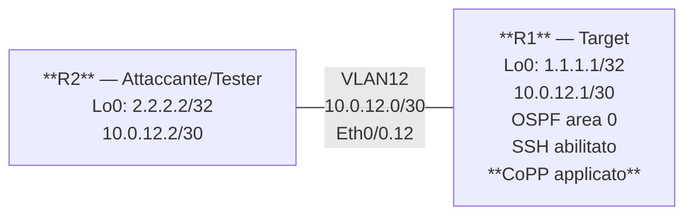

# Workbook Studenti — MOD-31: ACL & CoPP

**Area:** AREA 5 — Security | **Ore:** 2h | **Codici syllabus:** 5.2.a · 5.2.b

**Piattaforme supportate:** GNS3 · ContainerLab (vrnetlab/IOU) · EVE-NG

---

## 1. TOPOLOGIA

### Diagramma Logico



### Piano di Indirizzamento

Tutti i router collegano via `Ethernet0/0` a uno switch GNS3. I link logici usano sub-interface 802.1Q.

| Device | Interfaccia | IP / Mask | Ruolo |
|---|---|---|---|
| R1 | Eth0/0.12 | 10.0.12.1/30 | Link to R2 |
| R1 | Loopback0 | 1.1.1.1/32 | Target test, Router-ID |
| R2 | Eth0/0.12 | 10.0.12.2/30 | Link to R1 |
| R2 | Loopback0 | 2.2.2.2/32 | Source test, Router-ID |

---

## 2. OBIETTIVI DELLA SESSIONE

Al termine di questo modulo lo studente sarà in grado di:

- [ ] Configurare e applicare Standard ACL e Extended ACL
- [ ] Comprendere il posizionamento ottimale delle ACL (vicino sorgente vs destinazione)
- [ ] Configurare Reflexive ACL per protezione stateful
- [ ] Configurare IPv6 ACL su interfaccia dual-stack
- [ ] Configurare Control Plane Policing (CoPP) con class-map e policy-map
- [ ] Diagnosticare problemi comuni di ACL

**Codici syllabus coperti:** 5.2.a (ACL) · 5.2.b (CoPP)

**Prerequisiti:** MOD-01 (OSPF, sub-interface) · MOD-26 (logica class-map/policy-map MQC)

---

## 3. LAB SETUP

**Piattaforme supportate:** GNS3 · ContainerLab (vrnetlab/IOU) · EVE-NG

### Prerequisiti

- Conoscenza di class-map e policy-map MQC (MOD-26)
- SSH configurato su R1 (è nella cfg iniziale)
- Comprensione del principio di implicit deny nelle ACL

### Configurazione Iniziale

```
copy tftp://192.168.122.1/ENCOR/MOD-31/rx-cfg running-config
```

#### R1

```
hostname R1
no ip domain-lookup
ipv6 unicast-routing
!
interface Ethernet0/0
 no ip address
 no shutdown
!
interface Ethernet0/0.12
 encapsulation dot1Q 12
 ip address 10.0.12.1 255.255.255.252
 ipv6 address 2001:db8:12::1/64
 description Link_to_R2
 ip ospf 1 area 0
 no shutdown
!
interface Loopback0
 ip address 1.1.1.1 255.255.255.255
 ipv6 address 2001:db8:1::1/128
 description Target_Router-ID
 no shutdown
!
router ospf 1
 router-id 1.1.1.1
 network 1.1.1.1 0.0.0.0 area 0
 passive-interface Loopback0
!
! SSH v2 pre-configurato:
ip domain-name lab.encor
crypto key generate rsa modulus 2048
ip ssh version 2
username admin privilege 15 secret Cisco@123
!
line vty 0 4
 login local
 transport input ssh telnet
!
! Nessuna ACL configurata — DA FARE in Task T1-T3
! Nessuna CoPP configurata — DA FARE in Task T4
!
end
```

#### R2

```
hostname R2
no ip domain-lookup
ipv6 unicast-routing
!
interface Ethernet0/0
 no ip address
 no shutdown
!
interface Ethernet0/0.12
 encapsulation dot1Q 12
 ip address 10.0.12.2 255.255.255.252
 ipv6 address 2001:db8:12::2/64
 description Link_to_R1
 ip ospf 1 area 0
 no shutdown
!
interface Loopback0
 ip address 2.2.2.2 255.255.255.255
 ipv6 address 2001:db8:2::2/128
 no shutdown
!
router ospf 1
 router-id 2.2.2.2
 network 2.2.2.2 0.0.0.0 area 0
 passive-interface Loopback0
!
end
```

### Verifica Pre-Lab

```
! Su R1 — OSPF attivo:
R1# show ip ospf neighbor
! Atteso: R2 (2.2.2.2) in stato FULL

! Su R2 — raggiungibilità verso R1:
R2# ping 1.1.1.1 source Loopback0
! Atteso: !!!!!

! Su R2 — SSH verso R1 funzionante:
R2# ssh -v 2 -l admin 10.0.12.1
! Password: Cisco@123 → accesso OK

! Da R2 — Telnet verso R1 funzionante (prima delle ACL):
R2# telnet 10.0.12.1
! Atteso: accesso (verrà bloccato in T2)

! Nessuna ACL configurata:
R1# show ip access-lists
! Atteso: nessun output
```

---

## 4. TASK LIST

| # | Task | Codice | Tempo |
|---|---|---|---|
| T1 | Standard ACL — filtraggio per source IP | 5.2.a | 20 min |
| T2 | Extended ACL — filtraggio per protocollo/porta | 5.2.a | 20 min |
| T3 | ACL Avanzate — Reflexive e IPv6 | 5.2.a | 20 min |
| T4 | CoPP — Control Plane Policing | 5.2.b | 25 min |
| T5 | Troubleshooting ACL | 5.2.a | 15 min |

**Tempo totale: ~100 min** (buffer: 20 min)

---

## 5. DETTAGLIO TASK

---

### T1 — Standard ACL

#### TEORIA

**Standard ACL: solo source IP**

Le Standard ACL filtrano il traffico in base al solo indirizzo IP sorgente. Numerate (1-99, 1300-1999) o con nome.

**Posizionamento:** vicino alla **destinazione**. Poiché la Standard ACL non può specificare la destinazione, applicarla vicino alla sorgente potrebbe bloccare traffico verso destinazioni non volute.

```
access-list 10 permit 10.0.12.2 0.0.0.0   ! host specifico
access-list 10 permit 192.168.0.0 0.0.0.255 ! subnet
access-list 10 deny   any                   ! blocca tutto il resto
```

**Implicit deny:** ogni ACL termina implicitamente con un `deny any`. Se non c'è nessun `permit`, tutto il traffico viene bloccato (incluso OSPF!).

**Applicazione all'interfaccia:**
```
interface Eth0/0.12
 ip access-group <ACL> {in | out}
```

#### TASK

Obiettivo: permettere solo il traffico proveniente da R2 (10.0.12.2) verso il loopback di R1. Bloccare tutto il resto.

```
R1# configure terminal

! ACL standard: permette solo R2 come sorgente
R1(config)# ip access-list standard ACL-PERMIT-R2
R1(config-std-nacl)# permit 10.0.12.2 0.0.0.0
R1(config-std-nacl)# deny any log
R1(config-std-nacl)# exit

! Applica INBOUND su Eth0/0.12 (traffico in arrivo da R2 verso R1):
! Posizionamento vicino alla destinazione (R1 loopback).
R1(config)# interface Ethernet0/0.12
R1(config-if)# ip access-group ACL-PERMIT-R2 in
R1(config-if)# exit

R1(config)# end
```

#### VERIFICA

```
! Verifica che la ACL sia applicata:
R1# show ip interface Ethernet0/0.12 | include access
! Atteso: "Inbound access list is ACL-PERMIT-R2"

! Da R2 — ping verso loopback R1 (source R2 = 10.0.12.2 → permesso):
R2# ping 1.1.1.1 source 10.0.12.2
! Atteso: !!!!!

! Da R2 — ping da loopback verso R1 (source 2.2.2.2 → bloccato dalla ACL):
R2# ping 1.1.1.1 source 2.2.2.2
! Atteso: UUUUU (bloccato — 2.2.2.2 non è nella ACL)

! Verifica contatori ACL:
R1# show ip access-lists ACL-PERMIT-R2
! Mostra quanti match per ogni riga (permit e deny con "matches X")
```

> **Importante:** rimuovere la ACL prima del task successivo per non interferire:
> ```
> R1(config)# interface Ethernet0/0.12
> R1(config-if)# no ip access-group ACL-PERMIT-R2 in
> R1(config)# no ip access-list standard ACL-PERMIT-R2
> ```

---

### T2 — Extended ACL

#### TEORIA

**Extended ACL: source + destination + port + protocol**

Le Extended ACL (numerate 100-199, 2000-2699; o con nome) filtrano in base a:
- IP sorgente e destinazione
- Protocollo (TCP, UDP, ICMP, OSPF, ...)
- Porta sorgente e destinazione (per TCP/UDP)
- Flag TCP (established, ...)

**Posizionamento:** vicino alla **sorgente**. Le Extended ACL possono specificare sia sorgente che destinazione, quindi è sicuro applicarle il prima possibile per evitare traffico inutile sulla rete.

```
ip access-list extended NOME
 permit tcp host 10.0.12.2 host 1.1.1.1 eq 22   ! SSH
 permit icmp any host 1.1.1.1                    ! ICMP verso R1
 deny   ip any any log                            ! blocca tutto il resto
```

#### TASK

Obiettivo: su R1, permettere solo SSH (TCP 22) e ICMP verso le interfacce di R1. Bloccare tutto il resto (incluso Telnet).

```
R1# configure terminal

R1(config)# ip access-list extended ACL-PROTECT-R1

! Permette SSH (TCP 22) da qualsiasi host verso qualsiasi interfaccia di R1:
R1(config-ext-nacl)# permit tcp any any eq 22

! Permette ICMP (ping) da qualsiasi host verso R1:
R1(config-ext-nacl)# permit icmp any any

! Permette OSPF (protocollo 89) — CRITICO: senza questo, OSPF cade!
R1(config-ext-nacl)# permit ospf any any

! Blocca tutto il resto (incluso Telnet TCP 23):
R1(config-ext-nacl)# deny ip any any log
R1(config-ext-nacl)# exit

! Applica INBOUND su Eth0/0.12 (vicino alla sorgente del traffico):
R1(config)# interface Ethernet0/0.12
R1(config-if)# ip access-group ACL-PROTECT-R1 in
R1(config-if)# exit

R1(config)# end
```

#### VERIFICA

```
! Da R2 — SSH verso R1 (permesso):
R2# ssh -v 2 -l admin 10.0.12.1
! Atteso: accesso SSH OK

! Da R2 — Telnet verso R1 (bloccato):
R2# telnet 10.0.12.1
! Atteso: Connection refused o timeout

! Da R2 — ping verso R1 (permesso):
R2# ping 1.1.1.1
! Atteso: !!!!!

! Verifica che OSPF sia ancora operativo:
R1# show ip ospf neighbor
! Atteso: R2 ancora in stato FULL

! Verifica contatori ACL:
R1# show ip access-lists ACL-PROTECT-R1
! Atteso: permit ssh ha match; deny ip ha match (traffici bloccati)
```

---

### T3 — ACL Avanzate: Reflexive e IPv6

#### TEORIA

**Reflexive ACL (stateful)**

Una Reflexive ACL crea automaticamente entry temporanee di permesso per il traffico di ritorno. Quando un host interno avvia una sessione TCP outbound, l'ACL crea una entry di risposta per permettere i pacchetti di ritorno. Alla chiusura della sessione, la entry viene rimossa.

Questo simula il comportamento di un firewall stateful, senza bisogno di un firewall dedicato.

```
ip access-list extended OUTBOUND
 permit tcp any any reflect REFLECT-TCP
 deny ip any any

ip access-list extended INBOUND
 evaluate REFLECT-TCP    ! ← qui si "materializzano" le entry dinamiche
 deny ip any any
```

**IPv6 ACL**

Su IOS, le IPv6 ACL sono sempre extended e usano una sintassi separata:

```
ipv6 access-list NOME-V6
 permit tcp any any eq 22
 permit icmp any any
 deny ipv6 any any

interface Eth0/0.12
 ipv6 traffic-filter NOME-V6 in
```

#### TASK

**Parte A — Reflexive ACL**

```
R1# configure terminal

! Prima rimuovere la ACL del task precedente:
R1(config)# interface Ethernet0/0.12
R1(config-if)# no ip access-group ACL-PROTECT-R1 in
R1(config-if)# exit
R1(config)# no ip access-list extended ACL-PROTECT-R1

! ACL outbound: permette TCP uscente e crea entry reflect "SESS-TCP":
R1(config)# ip access-list extended OUT-REFLEXIVE
R1(config-ext-nacl)# permit tcp any any reflect SESS-TCP
R1(config-ext-nacl)# permit icmp any any reflect SESS-ICMP
R1(config-ext-nacl)# permit ospf any any
R1(config-ext-nacl)# exit

! ACL inbound: valuta le entry riflesse + permette OSPF:
R1(config)# ip access-list extended IN-REFLEXIVE
R1(config-ext-nacl)# evaluate SESS-TCP
R1(config-ext-nacl)# evaluate SESS-ICMP
R1(config-ext-nacl)# permit ospf any any
R1(config-ext-nacl)# deny ip any any log
R1(config-ext-nacl)# exit

! Applica: OUT-REFLEXIVE in uscita, IN-REFLEXIVE in ingresso:
R1(config)# interface Ethernet0/0.12
R1(config-if)# ip access-group OUT-REFLEXIVE out
R1(config-if)# ip access-group IN-REFLEXIVE in
R1(config-if)# exit

R1(config)# end
```

**Parte B — IPv6 ACL**

```
R1# configure terminal

! IPv6 ACL: permette SSH e ICMP IPv6, blocca il resto:
R1(config)# ipv6 access-list ACL-V6-INBOUND
R1(config-ipv6-acl)# permit tcp any any eq 22
R1(config-ipv6-acl)# permit icmp any any
R1(config-ipv6-acl)# permit 89 any any
R1(config-ipv6-acl)# deny ipv6 any any log
R1(config-ipv6-acl)# exit

! Applica all'interfaccia (solo traffico IPv6):
R1(config)# interface Ethernet0/0.12
R1(config-if)# ipv6 traffic-filter ACL-V6-INBOUND in
R1(config-if)# exit

R1(config)# end
```

#### VERIFICA

**Reflexive:**
```
! Da R1 — avvia una sessione TCP outbound verso R2 (crea entry reflect):
R1# telnet 2.2.2.2
! (aprire e chiudere la sessione)

! Verifica entry reflect create:
R1# show ip access-lists IN-REFLEXIVE
! Atteso: "Dynamic reflect entry" per SESS-TCP
! Le entry compaiono durante la sessione TCP attiva

! Da R2 — prova a iniziare una sessione TCP inbound verso R1 (bloccato):
R2# ssh -v 2 -l admin 10.0.12.1
! Atteso: bloccato (nessuna entry reflect per questa connessione)
```

**IPv6:**
```
! Da R2 — ping IPv6 verso R1 (permesso):
R2# ping 2001:db8:12::1
! Atteso: !!!!!

! Verifica ACL IPv6 applicata:
R1# show ipv6 interface Ethernet0/0.12 | include traffic
! Atteso: "Inbound access list is ACL-V6-INBOUND"

! Verifica contatori IPv6 ACL:
R1# show ipv6 access-list ACL-V6-INBOUND
```

---

### T4 — CoPP: Control Plane Policing

#### TEORIA

**Perché il Control Plane va protetto**

Il router IOS ha due piani logici:
- **Data Plane**: forwarding del traffico di transito (hardware-accelerated, CEF)
- **Control Plane**: routing protocols, management, keepalive — processato dalla **CPU**

Un attacco di flooding verso il control plane (es. SYN flood verso la porta BGP, ICMP flood verso il router) può saturare la CPU e causare:
- Caduta delle adiacenze OSPF/BGP
- Impossibilità di gestire il router via SSH
- Convergenza ritardata o assente

**CoPP (Control Plane Policing)**

CoPP applica una policy MQC direttamente al control plane:
1. Classifica il traffico diretto alla CPU (OSPF, BGP, SSH, SNMP, ICMP, ...)
2. Applica policing (rate limiting) per classe
3. Protegge la CPU da flooding senza bloccare i protocolli legittimi

**Struttura CoPP:**

```
class-map match-any CM-CRITICAL
 match access-group name ACL-OSPF   ! OSPF traffic

policy-map PM-COPP
 class CM-CRITICAL
  police rate 512000 bps           ! limita a 512 kbps

control-plane
 service-policy input PM-COPP
```

**Differenza da QoS su data plane:**
- QoS su interfaccia: traffico di **transito**
- CoPP su `control-plane`: traffico **destinato alla CPU del router**

#### TASK

```
R1# configure terminal

! --- ACL per identificare il traffico ---

! OSPF: protocollo IP numero 89
R1(config)# ip access-list extended ACL-OSPF
R1(config-ext-nacl)# permit ospf any any
R1(config-ext-nacl)# exit

! SSH (TCP 22):
R1(config)# ip access-list extended ACL-SSH
R1(config-ext-nacl)# permit tcp any any eq 22
R1(config-ext-nacl)# exit

! SNMP (UDP 161):
R1(config)# ip access-list extended ACL-SNMP
R1(config-ext-nacl)# permit udp any any eq 161
R1(config-ext-nacl)# exit

! ICMP (ping, unreachable, ecc.):
R1(config)# ip access-list extended ACL-ICMP
R1(config-ext-nacl)# permit icmp any any
R1(config-ext-nacl)# exit

! --- Class-map ---

! CRITICAL: protocolli di routing essenziali — alto rate limit
R1(config)# class-map match-any CM-CRITICAL
R1(config-cmap)# match access-group name ACL-OSPF
R1(config-cmap)# exit

! MANAGEMENT: traffico di gestione — rate medio
R1(config)# class-map match-any CM-MANAGEMENT
R1(config-cmap)# match access-group name ACL-SSH
R1(config-cmap)# match access-group name ACL-SNMP
R1(config-cmap)# exit

! BEST-EFFORT: ICMP — rate basso (non critico per operatività)
R1(config)# class-map match-any CM-ICMP
R1(config-cmap)# match access-group name ACL-ICMP
R1(config-cmap)# exit

! --- Policy-map CoPP ---

R1(config)# policy-map PM-COPP
R1(config-pmap)# class CM-CRITICAL
! Police: max 512 kbps per OSPF; burst 64000 byte
R1(config-pmap-c)# police rate 512000 bps burst 64000
R1(config-pmap-c)# exit
R1(config-pmap)# class CM-MANAGEMENT
! SSH/SNMP: 256 kbps
R1(config-pmap-c)# police rate 256000 bps burst 32000
R1(config-pmap-c)# exit
R1(config-pmap)# class CM-ICMP
! ICMP: 64 kbps (ping flooding limitato)
R1(config-pmap-c)# police rate 64000 bps burst 8000
R1(config-pmap-c)# exit
R1(config-pmap)# class class-default
! Tutto il resto: drop (traffico non classificato verso la CPU = sospetto)
R1(config-pmap-c)# drop
R1(config-pmap-c)# exit
R1(config-pmap)# exit

! --- Applica al control plane ---

R1(config)# control-plane
R1(config-cp)# service-policy input PM-COPP
R1(config-cp)# exit

R1(config)# end
```

#### VERIFICA

```
! Verifica che la policy sia applicata al control plane:
R1# show policy-map control-plane
! Atteso: PM-COPP con le classi CM-CRITICAL, CM-MANAGEMENT, CM-ICMP, class-default

! Verifica OSPF ancora operativo dopo CoPP:
R1# show ip ospf neighbor
! Atteso: R2 in stato FULL

! Genera traffico ICMP da R2 e osserva i contatori CoPP:
R2# ping 1.1.1.1 repeat 100

! Osserva contatori dopo il traffico:
R1# show policy-map control-plane
! Atteso: CM-ICMP mostra "Packets: X" con contatori police conform/exceed

! SSH ancora funzionante (traffic entro il rate):
R2# ssh -v 2 -l admin 10.0.12.1
! Atteso: accesso OK
```

Output atteso `show policy-map control-plane` (estratto):
```
Control Plane

  Service-policy input: PM-COPP

    Class-map: CM-CRITICAL (match-any)
      ...
      police:
          rate 512000 bps, burst 64000 byte
        conformed X packets, Y bytes ...

    Class-map: CM-MANAGEMENT (match-any)
      ...
      police:
          rate 256000 bps, burst 32000 byte
        conformed X packets, Y bytes ...

    Class-map: CM-ICMP (match-any)
      ...
      police:
          rate 64000 bps, burst 8000 byte
        conformed X packets, Y bytes ...

    Class-map: class-default (match-any)
      X packets, Y bytes
        drop
```

---

### T5 — Troubleshooting ACL

#### Scenario 1 — ACL applicata in direzione sbagliata

Il docente applica la ACL in uscita (out) invece che in ingresso (in):

```
! Bug introdotto:
R1(config)# interface Ethernet0/0.12
R1(config-if)# no ip access-group ACL-PROTECT-R1 in
R1(config-if)# ip access-group ACL-PROTECT-R1 out
```

**Sintomi:** Telnet da R2 verso R1 ancora possibile (non bloccato come atteso).

**Diagnosi:**
```
R1# show ip interface Ethernet0/0.12 | include access
! "Outbound access list is ACL-PROTECT-R1" — direzione sbagliata!
```

**Fix:**
```
R1(config)# interface Ethernet0/0.12
R1(config-if)# no ip access-group ACL-PROTECT-R1 out
R1(config-if)# ip access-group ACL-PROTECT-R1 in
```

#### Scenario 2 — Implicit deny blocca OSPF

ACL senza `permit ospf`:

```
! Bug introdotto:
R1(config)# ip access-list extended ACL-NO-OSPF
R1(config-ext-nacl)# permit tcp any any eq 22
R1(config-ext-nacl)# permit icmp any any
! OSPF non permesso — implicit deny lo bloccherà
R1(config-ext-nacl)# exit
R1(config)# interface Ethernet0/0.12
R1(config-if)# ip access-group ACL-NO-OSPF in
```

**Sintomi:** adiacenza OSPF cade dopo 40 secondi (dead interval).

**Diagnosi:**
```
R1# show ip ospf neighbor
! Atteso: nessun vicino — adiacenza caduta

R1# show ip access-lists ACL-NO-OSPF
! La riga deny any mostra match per i pacchetti OSPF
```

**Fix:**
```
R1(config)# ip access-list extended ACL-NO-OSPF
R1(config-ext-nacl)# permit ospf any any
! (inserire PRIMA delle deny — oppure usare sequencing)
```

#### Scenario 3 — Sequenza ACL errata

```
! Bug introdotto:
R1(config)# ip access-list extended ACL-SEQUENCE
R1(config-ext-nacl)# permit ip any any   ! questo permette tutto!
R1(config-ext-nacl)# deny tcp any any eq 23
! La deny non viene mai valutata perché il permit ip any any la precede
```

**Sintomi:** Telnet non viene bloccato nonostante la `deny`.

**Diagnosi:**
```
R1# show ip access-lists ACL-SEQUENCE
! La riga "permit ip any any" mostra molti match
! La riga "deny tcp ... eq 23" mostra 0 match
```

**Fix:** rimuovere la ACL e ricrearla con la sequenza corretta, o usare la numerazione di sequenza per inserire la `deny` prima del `permit`:
```
R1(config)# ip access-list extended ACL-SEQUENCE
R1(config-ext-nacl)# 5 deny tcp any any eq 23   ! inserita prima del permit (seq 5 < 10)
```

---

## 6. TROUBLESHOOTING GUIDE

| Sintomo | Causa probabile | Diagnosi | Fix |
|---|---|---|---|
| ACL applicata ma non funziona | Direzione in/out sbagliata | `show ip interface Eth0/0.12 | include access` | Verificare la direzione di applicazione (`in` vs `out`) |
| OSPF cade dopo applicazione ACL | OSPF non permesso nella ACL — implicit deny | `show ip ospf neighbor`; `show ip access-lists` — deny matches | Aggiungere `permit ospf any any` nella ACL |
| Traffico bloccato che non dovrebbe | Sequenza ACL errata — permit generico prima di deny specifici | `show ip access-lists` — verifica match count per riga | Riordinare la ACL con sequencing esplicito |
| CoPP: OSPF cade dopo applicazione policy | class-default con `drop` elimina OSPF non classificato | `show policy-map control-plane` — class-default ha match OSPF | Aggiungere `match access-group name ACL-OSPF` in CM-CRITICAL |
| `show ipv6 access-list` non mostra match | IPv6 ACL non applicata all'interfaccia | `show ipv6 interface Eth0/0.12 | include traffic` | Aggiungere `ipv6 traffic-filter NOME in` sull'interfaccia |
| Reflexive ACL: sessioni inbound non bloccate | `evaluate` mancante nella ACL inbound | `show ip access-lists IN-REFLEXIVE` — riga evaluate assente | Aggiungere `evaluate SESS-TCP` nell'ACL inbound |

---

## 7. SOLUZIONI

> Le configurazioni complete commentate riga per riga sono nel file `soluzione.md` di questo modulo.

---

## 8. RIEPILOGO & EXAM TIPS

### Punti Chiave

1. **Standard ACL**: solo source IP, posizionare vicino alla **destinazione**
2. **Extended ACL**: src+dst+proto+port, posizionare vicino alla **sorgente**
3. **Implicit deny**: ogni ACL termina con `deny any` implicita — ricordare di permettere OSPF/BGP prima
4. **CoPP**: si applica con `service-policy input` sotto `control-plane`, non su un'interfaccia
5. **Reflexive ACL**: usa `reflect` e `evaluate` per creare sessioni stateful; le entry temporanee si creano solo quando il traffico è originato dall'interno

### Exam Tips CCNP ENCOR

> Formato domande tipico 350-401:

1. Una Standard ACL deve essere posizionata:
   - a) Vicino alla sorgente del traffico
   - **b) Vicino alla destinazione del traffico**
   - c) Sul router intermedio con più interfacce
   - d) Sul router di destinazione in direzione outbound

2. Un ingegnere applica una Extended ACL su Ethernet0/0 in direzione `in` per bloccare Telnet verso i server interni. Dopo l'applicazione, le adiacenze OSPF cadono. Causa più probabile:
   - a) La ACL non supporta OSPF
   - **b) OSPF non è permesso nella ACL — viene bloccato dall'implicit deny**
   - c) La direzione `in` non funziona per OSPF
   - d) Bisogna riavviare il processo OSPF

3. Quale comando applica CoPP al control plane?
   - a) `interface control-plane → service-policy input PM-COPP`
   - **b) `control-plane → service-policy input PM-COPP`**
   - c) `router ospf 1 → service-policy input PM-COPP`
   - d) `interface all → service-policy input PM-COPP`

4. La differenza principale tra CoPP e QoS su interfaccia è:
   - a) CoPP usa DSCP; QoS usa policing
   - **b) CoPP protegge il traffico diretto alla CPU; QoS agisce sul traffico di transito**
   - c) CoPP funziona solo su IPv6; QoS su IPv4
   - d) Nessuna differenza

5. In una Reflexive ACL, la riga `evaluate SESS-TCP` viene inserita:
   - a) Nell'ACL outbound, per creare entry dinamiche
   - **b) Nell'ACL inbound, per permettere il traffico di risposta**
   - c) Nella configurazione globale con `ip reflexive-list`
   - d) Sul router opposto che riceve la connessione


---

> © 2026 Matteo Mirenda — Tutti i diritti riservati.
> Materiale ad uso esclusivo degli studenti iscritti al corso.
> Vietata la riproduzione, distribuzione o condivisione
> senza autorizzazione scritta dell'autore.
> CCNP ENCOR 350-401 

---
